# PHP 中的排序

> 原文：<https://www.educba.com/sorting-in-php/>

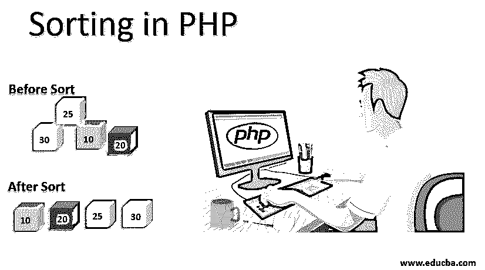


## PHP 中排序的介绍

排序是按照特定的顺序排列数组的元素。PHP 对普通数组(如数值数组)和关联数组进行排序。像数字数组这样的普通数组可以使用简单的 sort()函数进行排序，为了对关联数组执行[排序，我们有不同的函数。](https://www.educba.com/associative-array-in-java/)

可以按照升序或降序、字母或数字顺序、自然方式、随机以及用户定义的顺序进行排序。对于像数字数组或索引数组这样的数组，以及关联数组，排序是基于键或基于像升序或降序这样的两种顺序中的任何一种顺序的值按升序或降序进行的。如果数据元素以排序的形式存在，那么按数组排序会使您的搜索更容易。

<small>网页开发、编程语言、软件测试&其他</small>

### PHP 中排序是如何进行的？

排序是在 PHP 中使用排序函数执行的。有多种排序函数。

Suppose you want to know the age of members of a family based on seniority. There may be 15 members in a family. To sort the age of 15 members, we use the sort function and get the result quickly. Thus, in such a case, sort comes into the picture and is preferable.

同样，也不需要使用任何库。

****语法:****

```
sort(array);
```

其中，数组是输入数组的名称。

以下示例对$people 和$ages 数组的元素进行排序。

****按字母顺序排序:****

```
$people = array ('Rama', 'James', 'Mary', 'Alice',’ Radha’);
```

****按数字顺序排序:****

```
$ages = array (25,10,30,15,20);
```

组合上述两个数组并创建一个关联数组。

```
$people_ages = array ('James' => 25, 'Rama' => 10, 'Mary' => 30, 'Alice' => 15, ‘Radha’ => 20);
```

**按数字顺序排序示例:**

```
<?php
//example to perform ages array
$ages = array(25,10,30,15,20);
// calculate length of array
$array_length = count($ages);
echo "Before Sort"."<br>";
//array before sorting
for($i=0;$i<$array_length;$i++)
{
echo $ages[$i] ."<br>";
}
echo '<hr>';
//performing sort
sort($ages);
echo "After Sort"."<br>";
//array after sorting
for($i=0;$i<$array_length;$i++)
{
echo $ages[$i]."<br>";
} ?>
```

**输出:**

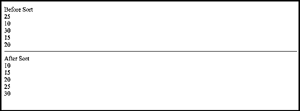


****按字母顺序排序举例:****

```
<?php
//example to perform people array
$people= array('Rama', 'James', 'Mary', 'Alice', 'Radha');
// calculate length of array
$array_length = count($people);
echo "Before Sort"."<br>";
//array before sorting
for($i=0;$i<$array_length;$i++)
{
echo $people[$i] ."<br>";
}
echo '<hr>';
//performing sort
sort($people);
echo "After Sort"."<br>";
//array after sorting
for($i=0;$i<$array_length;$i++)
{
echo $people[$i]."<br>";
}
?>
```

**输出**:

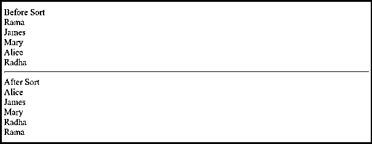


### 对关联数组排序

对具有键-值对关联的关联数组执行排序[会导致键的丢失。此外，虽然执行了排序，但数组的每个元素现在都被赋予了一个新的数字索引。](https://www.educba.com/associative-array-in-php/)

```
// example to perform sort on people and ages array together
// you will find that the keys are not preserved and changed
$people_ages = array('James' => 25, 'Rama' => 10, 'Mary' => 30, 'Alice' => 15, 'Radha' => 20);
// calculate length of array
$array_length = count($people_ages);
echo "Before Sort"."<br>";
//array before sorting we will use foreach loop
foreach($people_ages as $key=>$value)
{
echo $key."=>".$value."<br>";
}
echo '<hr>';
//performing sort
sort($people_ages);
echo "After Sort"."<br>";
//array after sorting
foreach ($people_ages as $key=>$value)
{
echo $key."=>".$value."<br>";
}
```

**输出**:

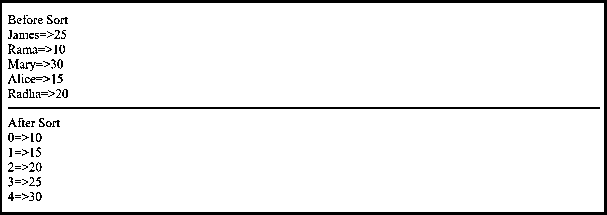


因此，我们使用 asort()，而不是简单的 sort()。asort()是一个函数，它对一个关联数组的元素进行升序排序。arsort()是一个按降序排列数组元素的函数。两者都是按值排序的。现在让我们详细了解这些数组以及其他数组函数

### PHP 中的排序类型

下面提到了不同类型的数组函数，以及排序的顺序，是升序还是降序，还提到了按键排序或按值排序的函数。

*   ****sort():**** 该函数对输入数组进行升序排序，并按值排序
*   ****rsort():**** 该函数对输入数组进行降序排序，并按值排序
*   ****asort():**** 该函数对输入数组进行升序排序，并按值排序
*   ****arsort():**** 该函数对输入数组进行降序排序，并按值排序
*   ****ksort():**** 该函数对输入数组进行升序排序，并按键排序
*   ****【krsort():****该函数对输入数组进行降序排序，并按键排序
*   ****usort():**** 该函数根据自定义函数对输入数组进行排序，并按值排序
*   ****uasort():**** 该函数根据自定义函数对输入数组进行排序，并按值排序
*   ****uksort():**** 该函数根据用户自定义函数对输入数组进行排序，并按键排序
*   ****natsort():**** 该函数对输入的基于数组的自然排序进行排序。
*   ****natcasesort():**** 该函数对输入的基于数组的自然排序进行排序，不区分大小写。
*   ****shuffle():**** 这个函数根据值对输入数组进行排序，输出是值的随机顺序。

让我们详细了解一下每个功能

#### 1.排序()

这个函数我们已经看到了。这个函数对给定的数组进行排序，并按升序排列数组中的元素。

****代号:****

```
//example to perform ages array
$ages = array(25,10,30,15,20);
// calculate length of array
$array_length = count($ages);
echo "Before Sort"."<br>";
//array before sorting
for($i=0;$i<$array_length;$i++)
{
echo $ages[$i] ."<br>";
}
echo '<hr>';
//performing sort
sort($ages);
echo "After Sort"."<br>";
//array after sorting
for($i=0;$i<$array_length;$i++)
{
echo $ages[$i]."<br>";
}
```

****输出:****

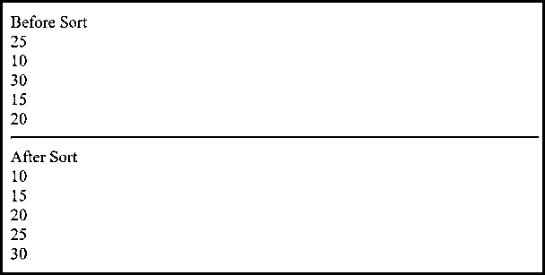


#### **2。rsort()**

 **这个函数对给定的数组进行排序，并按照降序排列数组中的元素，这与 sort()函数的作用相反。另外，使用值执行[排序。](https://www.educba.com/sorting-in-c-sharp/)

****a .代码:****

```
//example to perform ages array
$ages = array(25,10,30,15,20);
// calculate length of array
$array_length = count($ages);
echo "Before Sort"."<br>";
//array before sorting
for($i=0;$i<$array_length;$i++)
{
echo $ages[$i] ."<br>";
}
echo '<hr>';
//performing sort
rsort($ages);
echo "After Sort"."<br>";
//array after sorting
for($i=0;$i<$array_length;$i++)
{
echo $ages[$i]."<br>";
}
```

 ******输出:****

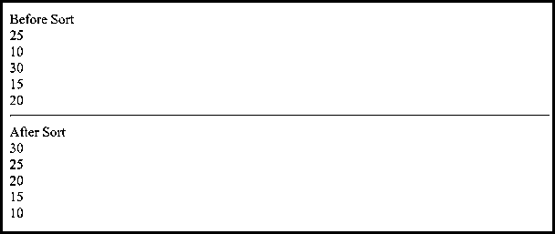


****b .代号**** :

```
//example to perform people array
$people= array('Rama', 'James', 'Mary', 'Alice', 'Radha');
// calculate length of array
$array_length = count($people);
echo "Before Sort"."<br>";
//array before sorting
for($i=0;$i<$array_length;$i++)
{
echo $people[$i] ."<br>";
}
echo '<hr>';
//performing sort
rsort($people);
echo "After Sort"."<br>";
//array after sorting
for($i=0;$i<$array_length;$i++)
{
echo $people[$i]."<br>";
}
```

****输出:****

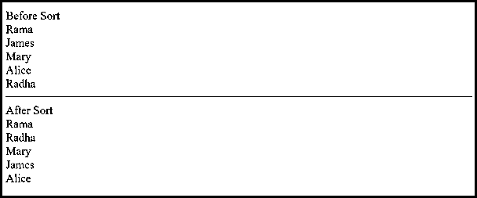


#### 3.asort()

这个函数对给定的数组进行排序，并按升序排列数组的值，这与 sort()函数的作用相反。此外，排序是通过值而不是键来执行的。

****代号:****

```
//example to perform people_ages array
$people_ages = array('James' => 25, 'Rama' => 10, 'Mary' => 30, 'Alice' => 15, 'Radha' => 20);
// calculate length of array
$array_length = count($people_ages);
echo "Before Sort"."<br>";
//array before sorting
foreach($people_ages as $key=>$value)
{
echo $key."=>".$value."<br>";
}
echo '<hr>';
//performing sort
asort($people_ages);
echo "After Sort"."<br>";
//array after sorting
foreach($people_ages as $key=>$value)
{
echo $key."=>".$value."<br>";
}
```

****输出:****

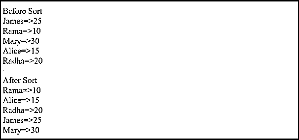


#### 4.排序()

这个函数对给定的数组进行排序，并将数组的值按降序排列。此示例使用 foreach 循环打印数组，并输出排序前和排序后的结果。

****代号:****

```
//example to perform people_ages array
$people_ages = array('James' => 25, 'Rama' => 10, 'Mary' => 30, 'Alice' => 15, 'Radha' => 20);
// calculate length of array
$array_length = count($people_ages);
echo "Before Sort"."<br>";
//array before sorting
foreach($people_ages as $key=>$value)
{
echo $key."=>".$value."<br>";
}
echo '<hr>';
//performing sort
arsort($people_ages);
echo "After Sort"."<br>";
//array after sorting
foreach($people_ages as $key=>$value)
{
echo $key."=>".$value."<br>";
}
```

****输出:****

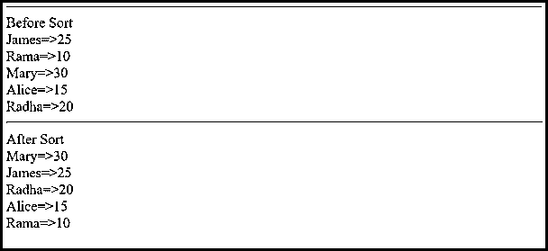


#### 5.ksort()

这个函数对给定的数组进行排序，并按升序排列数组中的键。此示例使用 foreach 循环打印数组，并输出排序前和排序后的结果。

****代号:****

```
//example to perform people_ages array
$people_ages = array('James' => 25, 'Rama' => 10, 'Mary' => 30, 'Alice' => 15, 'Radha' => 20);
// calculate length of array
$array_length = count($people_ages);
echo "Before Sort"."<br>";
//array before sorting
foreach($people_ages as $key=>$value)
{
echo $key."=>".$value."<br>";
}
echo '<hr>';
//performing sort
ksort($people_ages);
echo "After Sort"."<br>";
//array after sorting
foreach($people_ages as $key=>$value)
{
echo $key."=>".$value."<br>";
}
```

**输出**:

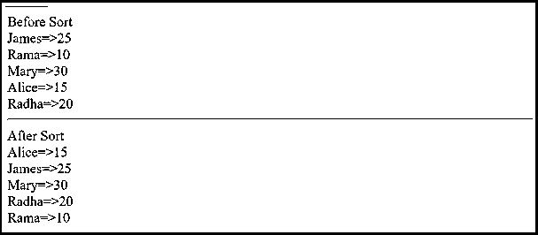


#### 6.krsort()

该函数对给定的数组进行排序，将数组中的键按降序排列。此示例使用 foreach 循环打印数组，并输出排序前和排序后的结果。

****代号:****

```
//example to perform people_ages array
$people_ages = array('James' => 25, 'Rama' => 10, 'Mary' => 30, 'Alice' => 15, 'Radha' => 20);
// calculate length of array
$array_length = count($people_ages);
echo "Before Sort"."<br>";
//array before sorting
foreach($people_ages as $key=>$value)
{
echo $key."=>".$value."<br>";
}
echo '<hr>';
//performing sort
krsort($people_ages);
echo "After Sort"."<br>";
//array after sorting
foreach($people_ages as $key=>$value)
{
echo $key."=>".$value."<br>";
}
```

****输出:****

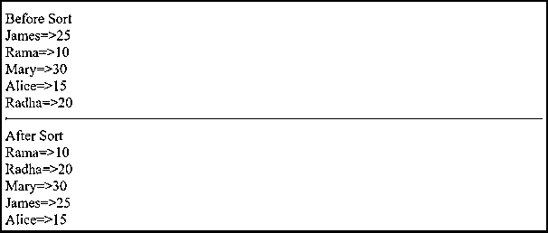


#### 7\. natsort()

这个函数对给定的数组进行排序，并按降序排列数组中的键。此示例使用 foreach 循环打印数组，并输出使用 sort()函数排序前和使用 natsort()函数排序后的结果。

该函数刷新输出，因为该函数随机化给定数组中值的顺序。新的数字键代替数组中提到的键被分配。例如，在人类看来，10 大于 7，但是根据[排序算法](https://www.educba.com/sorting-algorithms-in-python/) 10 在 7 之前。

我们将使用自然的顺序流程。

****代号:****

```
<?php
$input = array("13 orange","14 Apple","15 3Banana","11 papaya","10 Grapes");;
$arr1 = $arr2 = $input;
echo "Before Sort"."<br>";
//array before sorting
foreach($input as $key=>$value)
{
echo $key."=>".$value."<br>";
}
echo '<hr>';
//performing sort
sort($arr1);
echo "Using asort function "."<br>";
//array before sorting
foreach($arr1 as $key=>$value)
{
echo $key."=>".$value."<br>";
}
echo '<hr>';
//performing sort
natsort($arr2);
echo "Using natsort function "."<br>";
foreach($arr2 as $key=>$value)
{
echo $key."=>".$value."<br>";
}
?>
```

**输出:**


#### 8.natcasesort()

这个函数的工作方式与 natsort()相同，但是不区分大小写。

****代号:****

```
$input = array("13 orange","14 Apple","15 Banana","11 papaya","10 Grapes");;
$arr1 = $arr2 = $input;
echo "Before Sort"."<br>";
//array before sorting
foreach($input as $key=>$value)
{
echo $key."=>".$value."<br>";
}
echo '<hr>';
//performing sort
sort($arr1);
echo "Using asort function "."<br>";
//array before sorting
foreach($arr1 as $key=>$value)
{
echo $key."=>".$value."<br>";
}
echo '<hr>';
//performing sort
natcasesort($arr2);
echo "Using natcasesort function "."<br>";
foreach($arr2 as $key=>$value)
{
echo $key."=>".$value."<br>";
}
```

****输出:****

****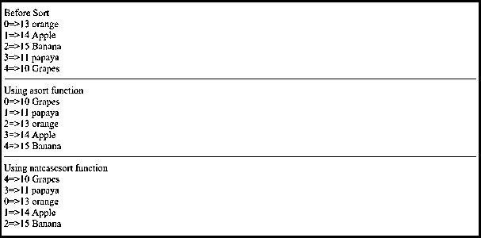

**** 

#### 9. usort()

这个函数对给定的数组进行排序，并按升序排列数组的值。此示例使用 for 循环打印数组并输出结果。

在这个程序中，usort 函数有两个参数:一个是输入数组，另一个是被调用函数的名称(这里是 compare)。

这个比较函数是用户定义的；此外，该函数是可选的。只有满足 if 块中的条件时，此函数才返回 0，否则，如果比较的值小于另一个值，它将发送-1，如果比较的值大于另一个值，它将发送 1。

****代号:****

```
function compare($x, $y) {
if($x == $y ){
return 0;
}
if($x < $y ){
return -1;
}
if($x > $y ){
return 1;
}
}
$numbers = array(10,4,5,3,20);
echo "Before Sort"."<br>";
//array after sorting
$array_length = count($numbers);
for($i=0;$i<$array_length;$i++)
{
echo $numbers[$i]."<br>";
}
echo '<hr>';
//performing sort
usort($numbers, "compare");
echo "After Sort"."<br>";
//array after sorting
$array_length = count($numbers);
for($i=0;$i<$array_length;$i++)
{
echo $numbers[$i]."<br>";
}
```

****输出:****

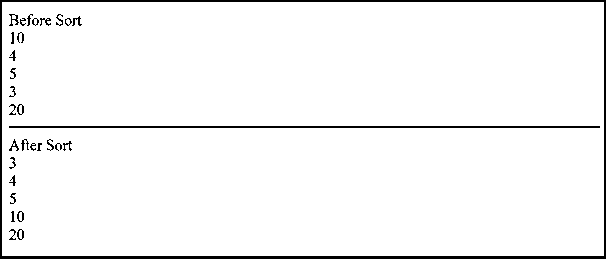


#### 10.uasort()

该函数对给定的数组执行排序，并使用 compare 函数按升序排列数组的值。

****代号:****

```
<?php
function compare($x, $y) {
if($x == $y ){
return 0;
}
if($x < $y ){
return -1;
}
if($x > $y ){
return 1;
}
}
echo '<hr>';
//performing sort
$input = array("num1"=>10,"num2"=>4,"num3"=>3,"num4"=>5, "num5"=>20);
uasort($input, "compare");
echo "After Sort"."<br>";
//array after sorting
$array_length = count($input);
foreach($input as $key=>$value)
{
echo $key."=>".$value."<br>";
}
```

****输出:****

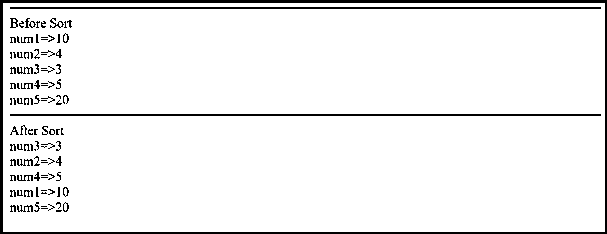


#### 11\. uksort()

这个函数[对给定的数组执行排序](https://www.educba.com/sorting-in-python/),并使用比较函数按升序排列数组的键。

**代码:**

```
<?php
function compare($x, $y) {
if($x == $y ){
return 0;
}
if($x < $y ){
return -1;
}
if($x > $y ){
return 1;
}
}
echo '<hr>';
//performing sort
$input = array("num1"=>10,"num2"=>4,"num3"=>3,"num4"=>5, "num5"=>20);
uksort($input, "compare");
echo "After Sort"."<br>";
//array after sorting
$array_length = count($input);
foreach($input as $key=>$value)
{
echo $key."=>".$value."<br>";
}
```

****输出:****

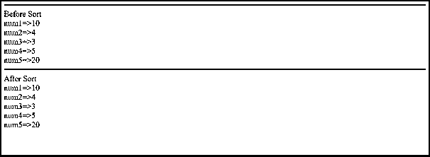


#### 12.无序播放()

该函数刷新输出，因为该函数随机化给定数组中值的顺序。新的数字键代替数组中提到的键被分配。

****代号:****

```
$input = array('a'=>"Guava",'e'=>"Apple",'b'=>"Orange",'c'=>"Papaya", 'd' => "Banana");
echo "Before Sort"."<br>";
//array before sorting
foreach($input as $key=>$value)
{
echo $key."=>".$value."<br>";
}
echo '<hr>';
shuffle($input);
echo 'You need to refresh to see the new shuffle everytime'.'<br>';
$array_length = count($input);
echo '<hr>';
//array after sorting
$array_length = count($input);
foreach($input as $key=>$value)
{
echo $key."=>".$value."<br>";
}
```

****输出:****

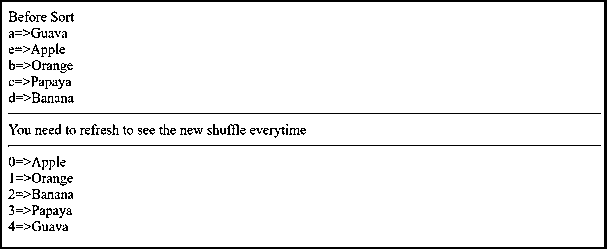


### 结论:

在本文中，涵盖了大多数排序类型。通过示例解释了这些数组。我希望你会觉得它有用、有用、有趣。

### 推荐文章

这是一个 PHP 排序指南。在这里，我们讨论了排序是如何执行的，以及 PHP 中不同类型的排序及其示例。你也可以看看下面的文章来了解更多-

1.  [在 R 中排序](https://www.educba.com/sorting-in-r/)
2.  [在 C 中排序](https://www.educba.com/sorting-in-c/)
3.  [PHP 编译器](https://www.educba.com/php-compiler/)
4.  [PHP 魔法常数](https://www.educba.com/php-magic-constants/)


****