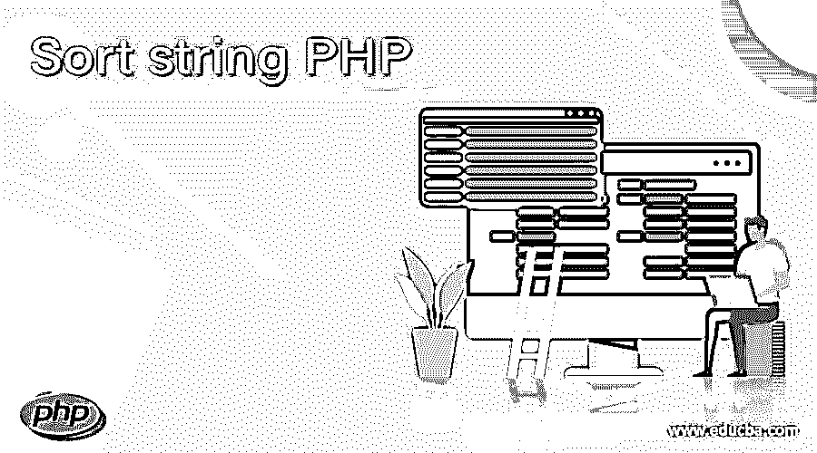
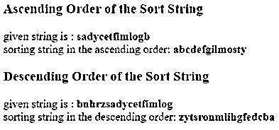
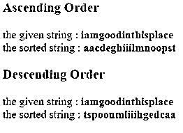
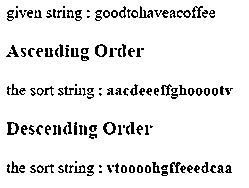

# 排序字符串 PHP

> 原文：<https://www.educba.com/sort-string-php/>

## 字符串排序 PHP 简介

排序字符串对于 PHP 语言中具有所需方式的有组织的字符串非常有用。sort string 是一个字符串方法，使用 PHP 语言将给定的字符串排序成所需的格式。排序字符串是按照 PHP 技术中的排序函数排列给定的排序字符串。排序字符串是根据 web 应用程序的需求对可用字符串进行分类和组合。排序字符串按照 PHP 编码语言中要求的升序或降序排列字符串。

### 如何使用各种方式在 PHP 中对字符串进行排序？

有许多方法可以对字符串进行排序。对字符串进行排序的方法如下。

<small>网页开发、编程语言、软件测试&其他</small>

#### 1.排序字符串的第一个方法

字符串转换成数组并使用 sort()方法。

*   用编码页上所需的值初始化字符串。

`$sortstring = 'sadycetfimlog';`

*   使用 string split 方法将字符串转换为数组。

`$stringndarray = str_split($sortstring);`

*   根据用户要求使用排序字符串方法。
*   使用 sort()方法按照升序对字符串进行排序。

`sort($stringndarray);`

*   使用 rsort()方法按照降序对字符串进行排序。

`rsort($stringndarray);`

*   使用内爆方法将数组转换为字符串。

`$stringndarray = implode($stringndarray);`

*   用 PHP 语言返回排序字符串。

`echo $stringndarray;`

**示例:**以升序或降序排序的字符串示例并输出。

`<!DOCTYPE html>
<html>
<body>
<h3> Ascending Order of the Sort String </h3>
<?php
$sortstring = "sadycetfimlogb";
echo "given string is : <b>$sortstring </b>  ";
$stringndarray = str_split($sortstring);
sort($stringndarray);
$stringndarray = implode($stringndarray);
echo " sorting string in the ascending order: <b>$stringndarray</b> ";
?>
<h3> Descending Order of the Sort String </h3>
<?php
$sortstring = "bnhrzsadycetfimlog";
echo "given string is : <b>$sortstring </b>  ";
$stringndarray = str_split($sortstring);
rsort($stringndarray);
$stringndarray = implode($stringndarray);
echo " sorting string in the descending order: <b>$stringndarray</b>";
?>
</body>
</html>`

**输出:**

#### 2.排序字符串的第二个方法

字符串交换位置，并使用参数对字符串进行排序。

*   排序字符串创建一个函数。

`function sortStringphp (place arguments here…) {write code here…}`

*   创建一个字符串变量来对字符串进行排序。

`$sortstring = 'jhjabcdewyxdef';`

*   创建第二个字符串变量来知道给定字符串的长度。

`$stringlength;`

*   创建第三个字符串变量来知道字符串元素的位置，并用零初始化。

`$currentposition;`

*   将这些字符串变量作为参数放入函数中。

`function sortStringphp(&$sortstring, $stringlength, $currentposition=0) {
write code here…
}`

*   如果字符串当前位置和字符串长度相等，则返回字符串。

`if($currentposition == $stringlength){ return; }`

*   创建一个变量来增加字符串的字符并初始化它。

`$nextposition = $currentposition + 1;`

*   使用交换字符串位置的算法。

`while($nextposition< $stringlength){
if($sortstring[$nextposition] < $sortstring[$currentposition]){
$tempstring = $sortstring[$nextposition];
$sortstring[$nextposition] = $sortstring[$currentposition];
$sortstring[$currentposition] = $tempstring;
}
$nextposition++;
}`

*   使用递归函数来避免主函数内部的递归。

`sortStringphp($sortstring, $stringlength, $currentposition+1);`

*   返回 PHP 中的排序字符串。

`sortStringphp($sortstring,strlen($sortstring));
echo $sortstring;`

**举例:**

`<!DOCTYPE html>
<html>
<body>
<h3> Ascending Order </h3>
<?php
$sortstring = 'iamgoodinthisplace';
echo "the given string : <b> $sortstring </b>  ";
$stringlength;
$currentposition;
function sortStringphp(&$sortstring, $stringlength, $currentposition=0) {
$nextposition = $currentposition + 1;
while($nextposition < $stringlength){
if($sortstring[$nextposition] < $sortstring[$currentposition]){
$tempstring = $sortstring[$nextposition];
$sortstring[$nextposition] = $sortstring[$currentposition];
$sortstring[$currentposition] = $tempstring;
}
$nextposition++;
}
if($currentposition == $stringlength){
return;
}
sortStringphp($sortstring, $stringlength, $currentposition+1);
}
sortStringphp($sortstring,strlen($sortstring));
echo " the sorted string : <b> $sortstring </b>";
?>
<h3> Descending Order </h3>
<?php
$sortstring1 = 'iamgoodinthisplace';
echo "the given string : <b> $sortstring1 </b>  ";
$stringlength1;
$currentposition1;
function sortStringphp1(&$sortstring1, $stringlength1, $currentposition1=0) {
if($currentposition1 == $stringlength1)
return
$nextposition1 = $currentposition1 + 1;
while($nextposition1 < $stringlength1){
if($sortstring1[$nextposition1] < $sortstring1[$currentposition1]){
$tempstring1 = $sortstring1[$nextposition1];
$sortstring1[$nextposition1] = $sortstring1[$currentposition1];
$sortstring1[$currentposition1] = $tempstring1;
}
$nextposition1++;
}
sortStringphp1($sortstring1, $stringlength1, $currentposition1+1);
}
sortStringphp1($sortstring1,strlen($sortstring1));
echo " the sorted string : <b> $sortstring1 </b>";
?>
</body>
</html>`

**输出:**

#### 3.排序字符串的第三种方法

快速排序算法用于对字符串进行排序。

*   这两个变量的创建有助于对字符串进行划分。

`$stringleft = $stringright = '';`

*   变量创建来测量字符串的长度。

`$stringlength = strlen($sortstring)-1 ;`

*   如果字符串的长度等于零，则返回字符串并停止排序。

`if ($stringlength <= 0) {
return $sortstring;
}`

*   制作一个变量来创建字符串的中间(枢轴)。

`$pivot = floor($stringlength/2);`

*   对排序算法使用 do-while 循环。

`do{
write sort string code here..
}while(sort string condition…)`

*   如果字符串和中间字符串变量的长度相等，则停止中断并继续下一个循环。

`if ($stringlength == $middlestring){
continue;
}`

*   根据需要使用升序或降序排序逻辑。

`if ($sortstring[$stringlength] >= $sortstring[$middlestring]) {
$stringleft = $stringleft.$sortstring[$stringlength];
} else {
$stringright = $stringright.$sortstring[$stringlength];
}`

*   根据算法返回排序字符串。

`return sortStringphp($stringleft).$sortstring[$middlestring].sortStringphp($stringright);`

*   在 php 中打印排序字符串。

`$givenstring = sortStringphp ("goodtohaveacoffee");
echo " the sort string : <b>$givenstring</b>"`

**举例:**

`<html>
<body>
<?php
$stringsort = 'goodtohaveacoffee';
echo "given string : $stringsort";
?>
<h3> Ascending Order </h3>
<?php
function sortStringphp($sortstring) {
$stringleft = $stringright = '';
$stringlength = strlen($sortstring)-1 ;
if ($stringlength <= 0) {
return $sortstring;
}
$middlestring = floor($stringlength/2);
do {
if ($stringlength == $middlestring){
continue;
}
if ($sortstring[$stringlength] <= $sortstring[$middlestring]) {
$stringleft = $stringleft.$sortstring[$stringlength];
} else {
$stringright = $stringright.$sortstring[$stringlength];
}
} while ($stringlength--);
return sortStringphp($stringleft).$sortstring[$middlestring].sortStringphp($stringright);
}
$givenstring =
sortStringphp ("goodtohaveacoffee");
echo " the sort string : <b>$givenstring</b>";
?>
<h3> Descending Order </h3>
<?php
function sortStringphp1($sortstring) {
$stringleft = $stringright = '';
$stringlength = strlen($sortstring)-1 ;
if ($stringlength <= 0){
return $sortstring;
}
$middlestring = floor($stringlength/2);
do {
if ($stringlength == $middlestring){
continue;
}
if ($sortstring[$stringlength] >= $sortstring[$middlestring]) {
$stringleft = $stringleft.$sortstring[$stringlength];
} else {
$stringright = $stringright.$sortstring[$stringlength];
}
} while ($stringlength--);
return sortStringphp1($stringleft).$sortstring[$middlestring].sortStringphp1($stringright);
}
$givenstring =
sortStringphp1("goodtohaveacoffee");
echo " the sort string : <b>$givenstring</b>";
?>
</body>
</html>`

**输出:**

### 结论

*   排序字符串有助于根据用户需求对字符串数据进行分类，并将其显示在 web 应用程序上。
*   排序字符串按照 web 应用程序和网站的顺序排序并显示字符串字符。

### 推荐文章

这是一个 PHP 字符串排序指南。在这里，我们讨论了如何使用各种方法在 PHP 中对字符串进行排序，并给出了示例和输出。您也可以看看以下文章，了解更多信息–

1.  [PHP 压缩文件](https://www.educba.com/php-zip-files/)
2.  [PHP 堆栈跟踪](https://www.educba.com/php-stack-trace/)
3.  [PHP 全局变量](https://www.educba.com/php-global-variable/)
4.  [PHP 自定义异常](https://www.educba.com/php-custom-exception/)

