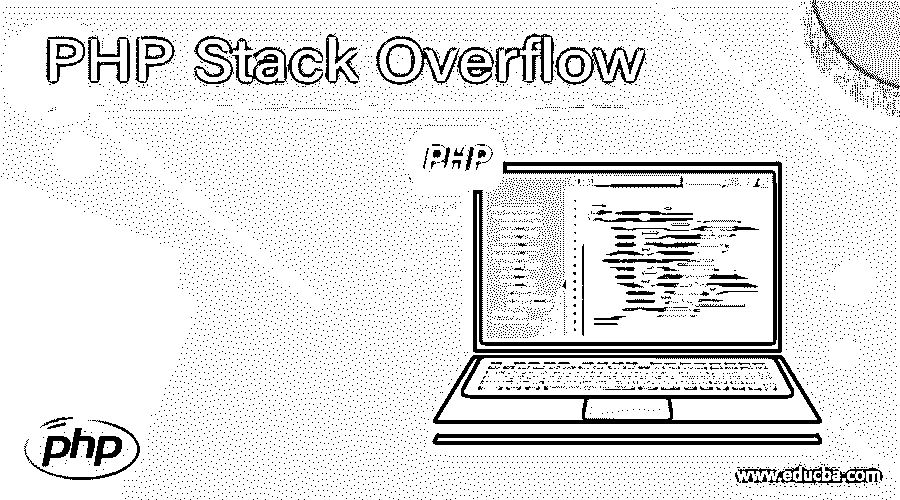
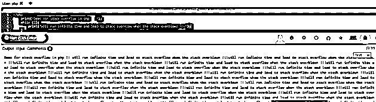

# PHP 堆栈溢出

> 原文：<https://www.educba.com/php-stack-overflow/>

## PHP 堆栈溢出的定义

程序设计中的堆栈溢出是一种错误，它会给我们的程序带来严重的问题，甚至使程序停止响应。堆栈溢出在每种编程语言中都是一样的，如果我们谈论 PHP，它们的行为也和预期的一样。在这个问题中，一些计算机程序开始占用比实际可用内存更多的内存。在编程语言中，我们有一个调用栈，负责处理请求并保存它们，它只是一个缓冲区。在下一节中，我们将更详细地讨论堆栈溢出错误。

**语法:**

<small>网页开发、编程语言、软件测试&其他</small>

我们知道这是一个错误，所以我们没有任何语法来使它发生，它通常发生在程序的一部分试图占用比可用空间更多的空间时。让我们看看输出缓冲在编程语言中得到一些致命的错误。

例如:

**1)最大执行时间()**

**2) set_time_limit()**

**3)等**

正如你在上面几行代码中看到的，我们可以使用一些函数和赋值来获得 PHP 或任何编程语言中的致命错误。如果我们试图使用比可用内存更多的内存，也可以解决内存问题。但是这个错误没有语法，因为这不是一个方法或实用程序，当我们试图使用比可用资源更多的资源时，它会随时发生。在接下来的部分，我们将看到更多关于它的工作细节。

### PHP 中堆栈溢出是如何工作的？

正如我们现在所知道的，堆栈溢出是一个错误，它会导致我们的程序终止并表现出不期望的行为。这不是一个例外，而是 PHP 中的一个错误。在编程语言中，我们有一个调用栈，它只是一个缓冲区，负责处理请求。简而言之，它决定了分配给程序的内存，调用栈的大小取决于 PHP 中的几个因素。在编程语言中，我们在程序执行开始时决定调用栈的大小，让我们看看决定调用栈大小的一些因素，见下文；

1)程序的语言

2)程序的架构

3)最后是可用的内存总量。

堆栈溢出错误需要非常大的可用数量，这将导致错误并可能使系统崩溃。有时它可能需要系统中所有可用的内存。这是程序中可能导致这种情况的部分。简而言之，当我们试图使用越来越多的内存，而不是为或程序分配的内存时，就会出现错误。我们可能有一个特定的程序，我们试图从方法中调用方法，假设我们有 4-5 个方法，它们不断地相互调用，就像函数 A()调用函数 b()它依次调用函数 c()，然后是函数 D()等等，但最后当我们得到输入时，它可能会导致函数或这些方法的循环无限次运行，在这之后它将继续运行，我们可能会意识到它已经占用了堆栈内存，而不是分配给它的内存。当我们在 PHP 或任何编程语言中使用递归时，如果没有正确使用或处理函数，我们可能会导致堆栈溢出或任何致命错误，因此总是建议使用全局变量或静态变量来防止递归中的无限循环。这个错误是我们无法控制的，因为内存、堆栈、调用堆栈或其他因素是由我们无法控制或管理的系统控制的，所以我们应该始终做一件事来分析我们的代码，以及如何避免在循环中调用函数，或者如果我们使用递归，那么我们应该非常小心地处理这个问题。为了防止这种情况，我们可以执行系统测试，并编写一些测试用例来查看它。

我们可以通过一些预防措施来防止这种致命错误在编程语言中发生，参见下文；

1)执行系统测试

2)避免使用递归或严格检查

3)应该避免从另一个函数或在循环中调用函数，我们还应该检查局部变量并尽可能地优化代码，因为局部变量也占用系统的空间。这是一种运行时错误，当程序由于编程中的一些异常事件而耗尽内存时就会出现这种错误。

在 PHP 中处理错误时需要记住的要点；

*   由于内存消耗超过了分配的内存，所以会发生堆栈溢出错误。
*   这可以通过优化代码来防止，也可以尝试分析局部变量
*   递归应该被严格分析，如果我们使用递归，那么尝试使用静态或全局变量来防止它陷入无限循环。
*   这不是一个函数或方法，这是一个错误，如果处理不当，可能会导致系统崩溃。

### 例子

1)在本例中，我们尝试无限次运行一个循环。这将运行无限次，并可能导致堆栈溢出错误。一旦堆栈或调用堆栈内存被占用，就会导致堆栈溢出错误。下面是简单的程序，让初学者更好地理解它，见下文；

**代码:**

`<?php
print("Demo for stack overflow in php !! ");
while (1){
print("will run infinite time and lead to stack overflow when the stack overblown !!!");
}
?>`

**输出:**

### 结论

堆栈溢出是可能导致系统崩溃的错误。为了防止这种错误，我们可以在编码时采取一些谨慎措施，也可以优化我们的代码等。还应该进行测试以防止这种情况发生。这是仅在运行时发生的运行时错误。

### 推荐文章

这是一个 PHP 堆栈溢出的指南。这里我们还讨论了 PHP 中的介绍、语法、参数以及堆栈溢出是如何工作的？用不同的例子。您也可以看看以下文章，了解更多信息–

1.  [PHP 自定义异常](https://www.educba.com/php-custom-exception/)
2.  [PHP XMLWriter](https://www.educba.com/php-xmlwriter/)
3.  [PHP XML 解析器](https://www.educba.com/php-xml-parser/)
4.  [PHP json_decode](https://www.educba.com/php-json_decode/)

