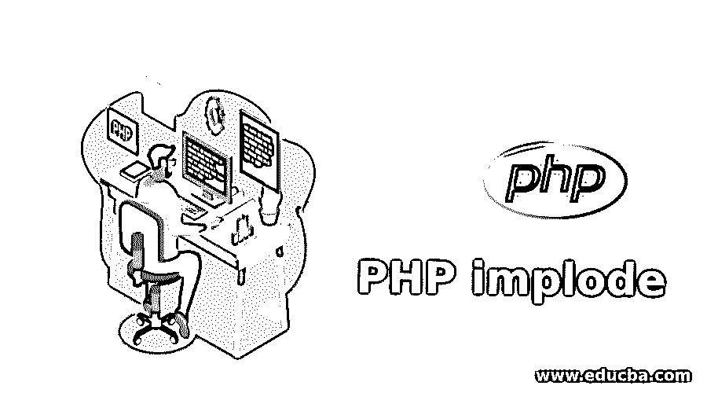
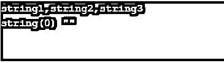

# PHP 内爆

> 原文：<https://www.educba.com/php-implode/>

## PHP 内爆简介

PHP 内爆函数是用来连接数组元素的内置函数之一。该函数的工作方式与 join()类似，并且是 join()的别名。

我们在一个元素数组中使用内爆函数将所有元素连接成一个字符串。数组元素通常在字符串的帮助下连接，并使用我们指定的分隔符。因此，内爆函数为我们提供了由数组元素构成的字符串，类似于 join()函数。

<small>网页开发、编程语言、软件测试&其他</small>

**语法**

`string implode(separator,array);`

**参数**:该功能需要两个参数作为输入，其中一个是可选的，另一个是强制的。

*   **分隔符**:字符串类型的非强制输入组件。这里的数组值将被连接成一个字符串，并在这里给出的分隔符参数的帮助下进行区分。如果未给出默认值，则采用空字符串(" ")。
*   **array** :这是一个强制字段，指定创建字符串时必须连接的数组。

**注意**:为了向后兼容，即使分隔符不是强制的，也总是建议使用这两个参数。

**返回类型**:这个内爆()函数返回 string 作为输出。从数组元素中，它将返回新加入的字符串。

### PHP 内爆的例子

以下是一些基于内爆功能的示例，涵盖了一些可能实现或可以实现这些功能的场景:

#### 示例#1

**代码:**

`<?php
// Below is PHP Code representing implementation of implode function
$Input = array('first','string','combination');
// Using function without separator parameter
print_r(implode($Input));
print_r("\n");
// Using function with separator
print_r(implode("-",$Input));
?>`

**输出:**

在这个基本示例中，我们展示了如何在使用和不使用非强制分隔符参数的情况下使用内爆函数。所以在输出的第一行，它通过连接输入中提到的所有 3 个字符串来打印数组。在输出的第二行中，我们将数组输出作为输入字符串的组合，但是除此之外，分隔符参数也打印在两个单词之间。

#### 实施例 2

**代码:**

`<?php
$arr = array('string1', 'string2', 'string3');
//Using implode function to make the strings as comma seperated
$sep= implode(",", $arr);
echo $sep;
print_r("\n");
// When an empty array is used returns an empty string
var_dump(implode('check', array())); // string(0) ""
?>`

**输出:**

在这个例子中，我们首先声明 3 个字符串作为数组“arr”的一部分。接下来，我们使用内爆函数并提到逗号分隔符来分隔这三个字符串。我们还展示了使用空数组时会发生什么。在这种情况下，它返回一个空字符串，如下所示。

#### 实施例 3

**代码:**

`<?php
//Declaring 3 different array lists
$arr1 = array("1","2","3");
$arr2 = array("one");
$arr3 = array();
echo "array1 is: '".implode("'/'",$arr1);
print_r("\n");
echo "array2 is: '".implode("'-'",$arr2);
print_r("\n");
echo "array3 is: '".implode("','",$arr3);
?>`

**输出:**

在本例中，我们将展示三种不同的阵列情况。当数组的数组元素中有两个或更多的字符串，并且我们使用内爆函数和/作为分隔符来连接这些字符串时，将显示输出的第一行。当数组只有一个元素并且我们使用“-”分隔符时，输出的第二行显示出来。第三行输出显示了当数组为空时会发生什么。输出将按原样打印，没有任何错误。

#### 实施例 4

**代码:**

`<?php
$arr1 = array('One', 'Two', 'Three');
echo "<ol><li>" . implode("</li><li>", $arr1) . "</li></ol>";
?>`

**输出:**

在这个例子中，我们展示了如何通过使用标签作为分隔符，在 HTML 标签的情况下使用内爆功能。这里我们使用数组以有序列表的形式显示它的元素。

#### 实施例 5

**代码:**

`<?php
declare(strict_types=1);
$arr1 = array( 'str1','str2','str3' );
$arr2 = array( '1st' => 'one', 'two', '2nd' => 'three' );
echo implode( '-', $arr1 ),'.', implode( '-', $arr2 );
?>`

**输出:**

在这个例子中，我们可以看到内爆函数只作用于数组元素的值，而完全忽略了它的键。这里的‘str 1’、‘str 2’、‘str 3’是 arr1 中直接声明的值，而在 arr2 中，键是“1st”、“2nd”，它们各自的值对是“1”、“2”和“3”。

#### 实施例 6

**代码:**

`<?php
class Test
{
protected $name;
public function __construct($name)
{
$this->name = $name;
}
public function __toString()
{
return $this->name;
}
}
$arr = [
new Test('one'),
new Test('two'),
new Test('three')
];
echo implode('; ', $arr);
?>`

**输出:**

在上面的例子中，我们可以看到，即使对象也可以与内爆函数一起使用，但唯一的条件是对象应该应用 toString()函数，如下所示。

#### 实施例 7

**代码:**

`<?php
var_dump(implode('',array(true, false, false, true, true)));
?>`

**输出:**

在这个例子中，我们展示了当一组布尔值被用作数组元素时会发生什么。它会产生一种不同的输出，当出现“真”时，我们会得到“1”形式的输出，当出现“假”时，它会输出 null，即空值。

### 结论

上面例子中的 PHP 内爆()函数可以用在各种需要连接一个输入数组的不同元素的情况下。这是一个简单的函数，只有两个参数，其中我们指定了用于分隔数组元素的分隔符。

### 推荐文章

这是一个 PHP 内爆指南。这里我们讨论内爆函数的介绍以及语法、参数和相应的例子。您也可以浏览我们推荐的其他文章，了解更多信息——

1.  [PHP 中的 print _ r()](https://www.educba.com/print_r-in-php/)
2.  [PHP 匿名函数](https://www.educba.com/php-anonymous-function/)
3.  [PHP 最终类](https://www.educba.com/php-final-class/)
4.  [PHP 序列化](https://www.educba.com/serialize-in-php/)

