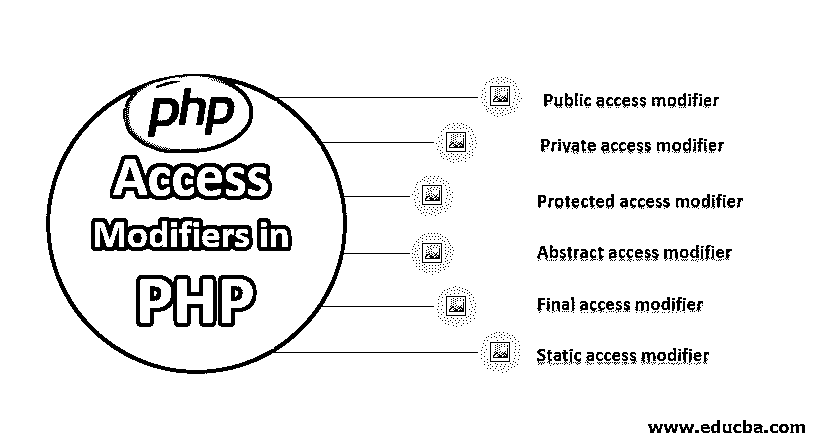

# PHP 中的访问修饰符

> 原文：<https://www.educba.com/access-modifiers-in-php/>




## PHP 中的访问修饰符介绍

访问修饰符是一种为任何其他 PHP 标识符的变量设置可访问性范围和权限的方法。 [PHP 支持各种](https://www.educba.com/what-is-php/)关键字使任何变量访问任何变量和标识符。我们可以将这些关键字分配给类、函数或标识符。这些关键字——公共、私有、受保护、抽象、最终等。

### PHP 中什么时候使用访问修饰符？

PHP 在访问修饰符上有一些限制，不像 Java。我们不能在类级、函数级和标识符级使用所有的 PHP 访问修饰符。我们可以根据业务需要使用这些访问修饰符，在整个程序或应用程序中授予或撤销权限。

<small>网页开发、编程语言、软件测试&其他</small>

以下是列表修饰符及其是否适用:

| 访问修饰符 | 班级水平 | 功能级别 | 可变电平 |
| 公众的 | 钠 | 是 | 是 |
| 私人的 | 钠 | 是 | 是 |
| 保护 | 钠 | 是 | 是 |
| 摘要 | 是 | 是 | 钠 |
| 最后的 | 是 | 是 | 钠 |
| 静态 | 钠 | 是 | 是 |

在上面的故事中，NA 表示不适用。这意味着我们不能在类级别上使用 public、private 和 protected。我们只能在类层次上使用抽象和最终。

### PHP 中的各种访问修饰符

下面是 PHP 中的访问修饰符

#### 1.公共访问修饰符

public 是默认的修饰符，就像 PHP 中的 JAVA 一样。这意味着如果我们在默认情况下不使用任何带有标识符功能的修饰符，它就被认为是一个公共访问修饰符。这是应用最广泛的一种。当我们谈到函数代码的可重用性时，我们通常使用公共访问修饰符。因为 public 可以在任何地方使用，当然是在类内，在类外，在扩展类中，如果 public 可重用性没有绑定到任何类，我们可以在包含文件的任何地方使用它。如上表所述，我们不能将这个 public 修饰符与 private 和 protected 一起使用。

现在，是时候看看公共访问修饰符的例子了:

```
<?php
class MyAccess {
var $var = "This is first var";
// print var variable value
function returnVar() {
echo $this->var;
}
}
$obj1 = new MyAccess();$obj1->returnVar();
?>
```

在上面的代码**中，** returnVar()函数被定义为没有访问修饰符，所以这将作为公共的，因为这是 PHP 语言中的默认修饰符。


public、private 和 protected 将不适用于类级别；我们来看一个例子。

```
<?php
class public MyAccess {
var $var = "This is first var";
function returnVar() {
echo $this->var;
}
}
$obj1 = new MyAccess();
$obj1->returnVar();
?>
```

**上面的代码会给出如下错误:**

( !)分析错误:语法错误，意外的“PUBLIC”(T _ PUBLIC)，第 2 行的 E:\wamp\www\twit\index.php 中应为标识符(T_STRING)

这同样适用于私有和受保护的。

```
<?php
class private  MyAccess {
var $var = "This is first var";
}
?>
<?php
class protected  MyAccess {
var $var = "This is first var";
}
?>
```

#### 2.私有访问修饰符

这个修饰符使用私有关键字来处理它。我们不能在类中使用私有修饰符。我们只能对类变量和类方法使用它(正如我们在上表中提到的)。当我们声明和使用私有时，不能使用类的对象访问它。它只能在类内使用。

**例如**

```
<?php
class MyAccess {
var $var = "This is first var";
private $fist_name;
// simple class method
function returnVar() {
echo $this->fist_name;
}
function set_fist_name($set_this){
$this->fist_name = $set_this;
}
}
$obj1 = new MyAccess();
echo $obj1->fist_name; // will give the error
$obj1->set_fist_name("Jai Shre");
$obj1->returnVar();
?>
echo $obj1->fist_name; // will give the error
```

我们可以使用的这一行代码会产生错误。这是我们不能用那个类的对象来访问私有变量的东西。但是我们可以通过使用它的设置和 getter 方法来使用它，就像我们在上面的代码中使用的一样。$ obj 1-> set _ fist _ name(" Jai Shre ")；第行代码将设置变量中的值并使用$ obj 1-> return var()；我们可以得到设置变量的值[。](https://www.educba.com/set-variable-in-powershell/)

#### 3.受保护的访问修饰符

就像 public 和 private 一样，protected 本身不支持类级别。像私有修饰符一样，protected 也限制从类外部对类变量或函数的访问。它可以在同一个类中使用，也可以在子类中使用。

**例如**

```
<?php
class MyAccess {
var $var = "This is first var";
protected $fist_name;
// simple class method
function returnVar() {
echo $this->fist_name;
}
function set_fist_name($set_this){
$this->fist_name = $set_this;
}
}
class child extends MyAccess {
function setVal($set_this){
$this->fist_name = $set_this;
}
function getVal(){
echo $this->fist_name;
}
}
$obj1 = new child();
//echo $obj1->fist_name; // will give the error
$obj1->setVal("Jai Shre");
$obj1->getVal();
?>
```

echo $ obj 1-> fist _ name；该行代码将给出以下错误

**输出:**

致命错误:无法访问 E:\wamp\www\twit\index.php 第 *20* 行的受保护属性 MyAccess::$fist_name

#### 4.抽象访问修饰符

它可以用在类和函数上，不能用在类变量上。如果任何类至少有一个抽象函数，那么它必须被声明为抽象函数。我们不能实例化抽象类。抽象类主要被认为是不完整的类。

#### 5.最终访问修饰符

如果有任何类被声明为 final，我们就不能扩展那个类。PHP 限制 final 类被继承。

#### 6.静态访问修饰符

[static 关键字可以用来](https://www.educba.com/static-keyword-in-java/)使任何函数成为静态的。它启用了该函数的能力，这样就可以在创建声明了该函数的类的对象时使用它。静态方法示例–

```
public static function static Function()
{
// declaration goes here..
}
```

### 结论

我们应该始终根据业务需求使用访问修饰符。使用 private 和 protected，我们可以限制在声明的类之外直接使用私有变量和私有方法。

### 推荐文章

这是 PHP 中访问修饰符的指南。这里我们讨论 PHP 中的各种访问修饰符，并给出例子和输出。您也可以阅读以下文章，了解更多信息——

1.  [PHP 中的抽象类](https://www.educba.com/abstract-class-in-php/)
2.  [PHP 中的模式](https://www.educba.com/patterns-in-php/)
3.  [PHP 开关语句](https://www.educba.com/php-switch-statement/)
4.  [PHP 中的变量](https://www.educba.com/variables-in-php/)


