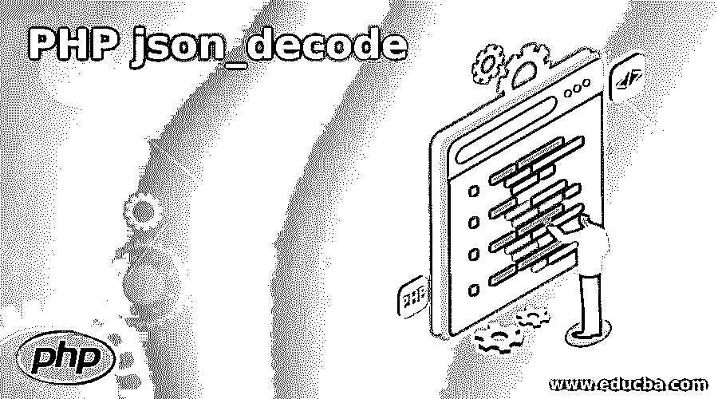
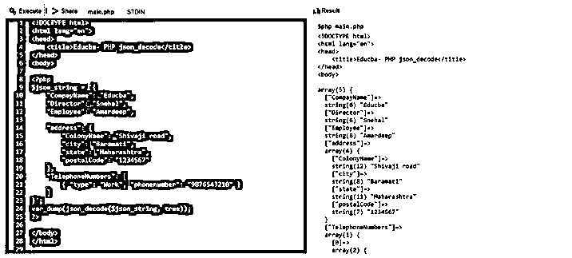
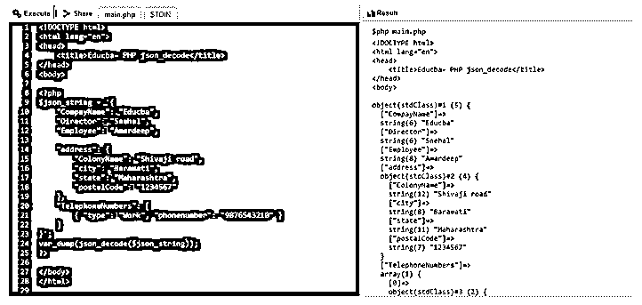
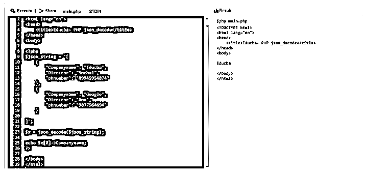
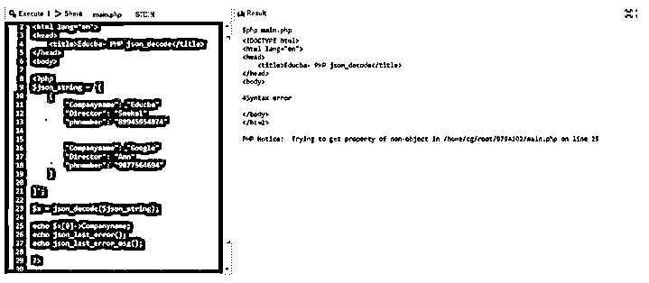
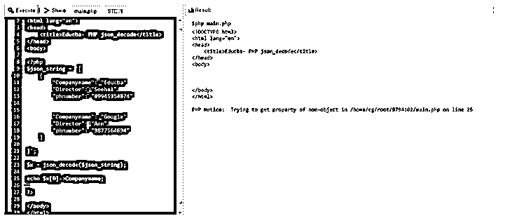

# PHP json_decode

> 原文：<https://www.educba.com/php-json_decode/>

## PHP json_decode 简介

在 PHP 中，内置函数 json_decode()函数被定义为一个函数，顾名思义，它是一个用于转换任何 json 标准文本格式对象或将 JSON 对象解码为 PHP 对象的函数，将 JSON 字符串作为参数，该函数将其转换或解码，并将 JSON 中的编码值返回到适当的 PHP 对象中。一般来说，PHP 提供了一个函数，它接受一个 JSON 字符串，该字符串通常表示一个 javascript 数组或对象文字，用于将 JSON 格式的编码字符串转换为特定的 PHP 对象数据类型。

### PHP 中 Json_decode()的使用

在本文中，json_decode()是 PHP 提供的一个内置函数，用于将 json 字符串转换或解码为 PHP 对象，该函数将表示为 javascript 数组的 JSON 数据或字符串作为参数，使用 json_decode()函数将编码字符串解码为 PHP 对象或数据类型，在 PHP 中使用 json_encode()函数则相反。

<small>网页开发、编程语言、软件测试&其他</small>

在下一节中，我们将看到使用 json_decode()函数的语法和示例:

**语法:**

`json_decode(json_string, asso_arr, recur_depth, opt*)*`

**参数:**

Json_string:这个参数是强制的，用于指定 Json 编码的字符串，以便将其转换成 PHP 对象

*   **Asso_arr:** 该参数用于指定布尔值，如果该值设置为 true，则可以返回一个关联数组，否则如果设置为 false，则返回一个对象。此参数是可选的，默认值为 false。
*   **recurve _ depth:**该参数用于指定递归的深度，也是可选参数，默认值为 512。
*   **Opt:** 该参数用于指定 JSON_OBJECT_AS_ARRAY，JSON_BIGINT_AS_STRING，JSON_INVALID_UTF8_SUBSTITUTE，JSON_THROW_ON_ERROR 的位掩码，也是可选参数。

PHP 的 json_decode()函数将 json 编码的字符串作为输入，并返回解码为 PHP 数据类型的 PHP 对象的值，如果无法解码，则该函数返回 null 而不是 PHP 对象。现在让我们看一个在 HTML 结构中使用 PHP 的 json_decode()的简单例子。

### PHP json_decode 的例子

下面是一些例子:

#### 示例#1

**代码:**

`<!DOCTYPE html>
<html lang="en">
<head>
<title>Educba- PHP json_decode</title>
</head>
<body>
<?php
$json_string = '{
"CompayName": "Educba",
"Director": "Snehal",
"Employee": "Amardeep",
"address": {
"ColonyName": "Shivaji road",
"city": "Baramati",
"state": "Maharashtra",
"postalCode": "1234567"
},
"TelephoneNumbers": [
{ "type": "Work", "phonenumber": "9876543210" }
] }';
var_dump(json_decode($json_string, true));
?>
</body>
</html>`

**输出:**

在上面的程序中，我们可以看到当我们在 HTML 结构中编写 PHP 代码时，我们从“< ?php” then we write the code and at the end the closing tag for PHP code is “? >”开始。在上面的代码中，我们可以将一个 json 变量声明为 json_string，在其中存储要转换的 JSON 格式数据，然后将该变量作为参数传递给 asso_arr 设置为“true”的 json_decode()函数，该函数以数组格式给出该变量，如上面的屏幕截图所示。它有 array(5 ),这意味着它在一个数组中有 5 个元素。假设我们没有设置任何东西或者没有传递 asso_arr 参数，比如“var _ dump(JSON _ decode($ JSON _ string))；”然后这个值会让我们访问数组中对象的属性，如下图所示。

现在，我们将在下面看到一个例子，它有一个无效的 JSON 格式，并将这个字符串传递给 json_decode()函数，它将给出什么样的错误和输出，我们还将在下面的部分中看到如何打印那些可以使用“echo”函数访问的数组。

#### 实施例 2

在下面的程序中，我们将看到如何使用 echo 函数来访问一个数组的元素。

**代码:**

`<!DOCTYPE html>
<html lang="en">
<head>
<title>Educba- PHP json_decode</title>
</head>
<body>
<?php
$json_string = '[
{
"Companyname": "Educba",
"Director": "Snehal",
"phnumber": "89945954874"
},
{
"Companyname": "Google",
"Director": "Ann",
"phnumber": "9877564694"
}
]';
$x = json_decode($json_string);
echo $x[0]->Companyname;
?>
</body>
</html>`

**输出:**

在上面的程序中，我们可以看到，当我们声明了 json_string 并访问数组中的任何元素时，我们在任何编程语言中都使用 array[index]类似地，我们用 echo 函数编写它，在上面的代码中，我们必须注意到我们没有在 json_decode()函数中传递 asso_arr 参数，因此要访问元素，我们必须编写“echo $ x[0]-> company name；”如果我们将第二个参数设置为“true”，那么我们必须写“echo $ x[0][' company name ']；”.

#### 实施例 3

在下面，我们将看到向函数传递一个无效的 JSON 字符串，并尝试打印错误。

**代码:**

`<!DOCTYPE html>
<html lang="en">
<head>
<title>Educba- PHP json_decode</title>
</head>
<body>
<?php
$json_string = '[
{
"Companyname": "Educba"
"Director": "Snehal"
"phnumber": "89945954874"
"Companyname": "Google"
"Director": "Ann"
"phnumber": "9877564694"
}
]';
$x = json_decode($json_string);
echo $x[0]->Companyname;
echo json_last_error();
echo json_last_error_msg();
?>
</body>
</html>`

**输出:**

在上面的程序中，我们可以看到，在变量“json_string”中，我们传递了一个无效的 json 数据，当使用 json_decode()函数转换该数据时，我们试图将上面的 JSON 字符串中的对象访问到 PHP 对象。然后，我们甚至打印 json_last_error()和 json_last_error_msg()函数，这些函数将打印错误信息，如“4 syntax error ”,该错误信息与上面示例中编写的 PHP 代码有关，上面显示了屏幕截图，如果我们不想使用错误函数打印任何错误消息，则输出将为“null ”,这意味着它不会打印 PHP 转换对象中的任何内容，因为 json 字符串或数据本身无效，这可以在下面的屏幕截图中看到。

### 结论

在本文中，我们得出结论，PHP 提供了一个 json_decode()函数，该函数被定义为将任何 json 格式的字符串或数据转换或解码为 PHP 数据类型对象作为输出的函数。在本文中，我们看到了如何定义或声明 json_decode()函数，并解释了它的语法和参数。然后在下一节中，我们看到了一个例子，如果 asso_arr 设置为 true 和 false(默认情况下)，它将如何打印数组。然后，我们还看到了如何访问数组元素，最后，我们还看到了如果我们传递了一个无效的 JSON 字符串或数据，将会出现什么样的错误或者输出中会显示什么。

### 推荐文章

这是一个 PHP json_decode 的指南。这里我们还讨论了 PHP 中 json_decode()的介绍和工作原理，以及不同的例子和代码实现。您也可以看看以下文章，了解更多信息–

1.  [PHP 全局变量](https://www.educba.com/php-global-variable/)
2.  [PHP 删除文件](https://www.educba.com/php-delete-file/)
3.  [PHP 计数](https://www.educba.com/php-count/)
4.  [PHP usort()](https://www.educba.com/php-usort/)

