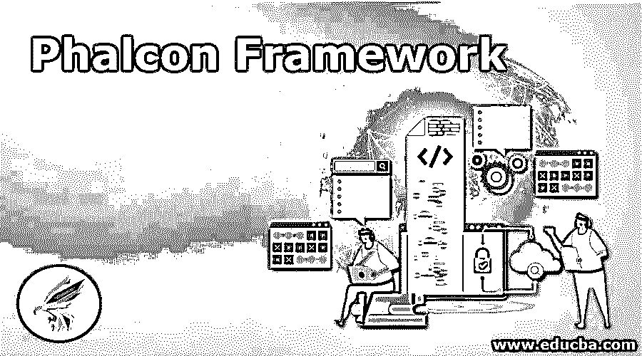
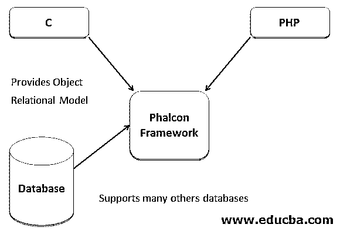
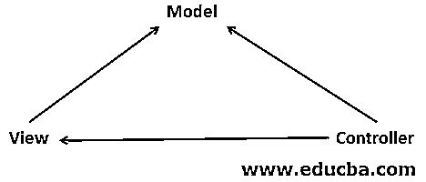
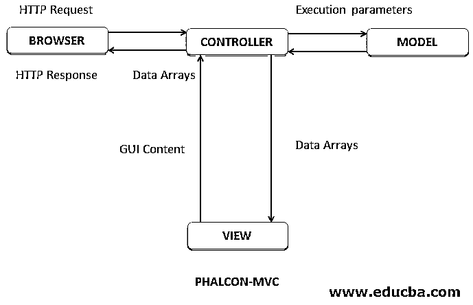

# 费尔康框架

> 原文：<https://www.educba.com/phalcon-framework/>

## Phalcon 框架介绍

我们已经看到了软件工程中的许多框架，其中我们将要讨论的是一个 PHP 框架，它是基于 web 的，依赖于模型视图控制器模式(MVC ),称为 Phalcon 框架。Phalcon 是由安德烈斯古铁雷斯和合作者开发的。Phalcon 框架是一个开源框架，已经获得 BSD 许可。Phalcon 已经被实现为用 C 和 PHP 编写的 web 服务器扩展。有助于提高执行速度，与其他框架相比，每秒可以处理更多的 HTTP 请求。Phalcon 框架已被引入到开发人员开发低功耗和高性能的应用程序中。这篇文章对 PHP 开发人员、web 开发人员和 web 设计人员很有帮助。

*   Phalcon 是一个松散耦合的框架，因此允许根据应用程序的需要将其对象视为胶合组件。
*   几个组件需要的代码量较少。
*   Phalcon 创建了一个独立的框架。
*   对于使用 Phalcon，有模型视图控制器或对象关系建模知识的开发人员将是一个加号。
*   由于 Phalcon 是 PHP 和 C 的组合，每一个都可以作为独立的模块使用，因此 Phalcon 的性能不同于其他框架。
*   Phalcon 对关系数据库和非关系数据库给予了同等的支持。
*   具有 CRUD 特性的开发工具用于开发 web 应用程序。创建 R 读取 U 更新 D 删除。
*   它需要更少的任务实现代码。
*   由于 Zephir 这种高级编程语言的存在，Phalcon 是可定制的。

<small>网页开发、编程语言、软件测试&其他</small>

### 费尔康框架

让我们用图表来看看 Phalcon 框架的功能:

Phalcon 功能是基于模型视图控制器的，所以让我们看看 MVC 是如何工作的。MVC 平台通过模型、视图和控制器三层来定义 web 应用

*   模型代表知识，包括连接数据库和执行凝乳操作的逻辑方式。
*   视图是模型的可视化表示，与模型交互，并获取必要的数据。它包括最终用户看到的数据，这是通过发送请求和接收响应来实现的。
*   控制器是模型和视图的中介。在接受来自用户的请求时，通过一个视图发送给模型。模型转换并向控制器发送响应，该响应在视图层显示给最终用户。

*   来自最终用户的 HTTP 请求被发送到控制器。
*   最终用户借助方法或事件与视图层(即用户界面)进行交互。
*   方法和事件由控制器处理。
*   然后，控制器通过更新最终用户动作来访问模型层。
*   视图层使用模型层来生成输出。
*   由于模型层与视图层没有直接的交互，视图从它的模型中获取数据。
*   该响应然后被发送到终端用户，显示在用户界面上。
*   然后，UI 等待最终用户的进一步操作，启动新的请求和响应周期。

### 费尔康目录结构

由于 Phalcon 是松散耦合的，用户可以创建任何目录结构。主目录是根文件夹。作为主文件夹的应用程序包含所有脚本文件夹和文件，其中一些是:

**1。Config:** 所有项目配置都将进入这个子文件夹、数据库连接或第三方库。

**2。控制器:**处理请求并给出响应，所有用户想要定义的控制器都将是这个子文件夹的一部分。

*   它有 Config.php:基于嵌套对象属性的用户界面。
*   Loader.php:允许自动加载项目类。
*   Router.php:允许定义映射到控制器或处理器的路由。
*   Services.php:实现依赖注入和定位服务。

**3。库:**所有外部的第三方库都将包含在这个文件夹中

**4。迁移:**如果有任何数据迁移需要完成，那么用户可以在这个文件夹中添加或编辑文件。

**5。Models:** 它包括所有与数据库相关的交互来检索和显示数据。该文件夹完全由数据组成

**6。视图:**在 Phalcon 架构或者 MVC 架构中，视图是用来向用户显示数据的。与视图层相关的信息将出现在该文件夹中。

7 .**。缓存；**它在维护其角色中起着重要的作用，与缓存相关的信息都放在这个文件夹中

**8。** **公共:**该文件夹由 CSS、JavaScript、元数据(即关于数据的数据)、应用程序中使用的图像、基于功能上传的文件以及与软件相关的临时数据组成。

### Phalcon 框架的优缺点

下面是 Phalcon 框架的优缺点:

*   用 C 写的，所以实现起来很快。
*   它完全基于传统的 MVC 框架。
*   它具有 Laravel 4 框架的特性，这是这里最酷的因素。
*   由于井结构文件是可读的，维护是主要的优势。
*   安装有点复杂，共享主机上的扩展是不可能的。
*   如果出现问题，调试 C 代码会很困难。

### 结论

至此，我们结束了这篇文章，知道了什么是 Phalcon 框架，它的用途，它的框架结构，基于 MVC 的架构模型，已经详细解释了。Phalcon 是新的 PHP 开发框架，不像 Laravel 或其他框架那样流行，但相比之下有更好的特性。Phalcon 还提供模板引擎、查询语言、干净且组织良好的文档。设置需要时间，但是对于创建和开发网站，Phalcon 是用户应该尝试的框架之一。

### 推荐文章

这是一本关于 Phalcon 框架的指南。在这里，我们讨论 Phalcon 框架的介绍及其结构和优缺点。您也可以浏览我们推荐的其他文章，了解更多信息——

1.  [PHP 中的套接字编程](https://www.educba.com/socket-programming-in-php/)
2.  [PHP 中的阶乘](https://www.educba.com/factorial-in-php/)
3.  [PHP unset()](https://www.educba.com/php-unset/)
4.  [PHP MD5()](https://www.educba.com/php-md5/)

