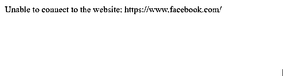

# PHP 出口

> 原文：<https://www.educba.com/php-exit/>

## PHP 出口简介

每当需要终止当前脚本以及 PHP 中的消息时，我们利用 PHP 中称为 exit 函数的内置函数，虽然 exit 函数用于终止当前脚本，但它不会中断对象析构函数并关闭正在执行的函数，exit 函数接受一个参数，即 message，其中 message 表示在 exit 函数终止当前脚本期间要显示的消息，或者该消息也可以是 exit 函数终止脚本期间的状态号。

**语法:**

<small>网页开发、编程语言、软件测试&其他</small>

`exit(message)`

在哪里，

该消息表示在通过退出功能终止当前脚本期间要显示的消息，或者该消息也可以是通过退出功能终止脚本期间的状态号。

### PHP 中出口函数的使用

*   每当需要在 PHP 中终止当前脚本和消息时，我们就利用 PHP 中一个名为 exit function 的内置函数。
*   尽管 exit 函数用于终止当前脚本，但它并不中断对象析构函数并关闭正在执行的函数。
*   出口函数有一个参数，即消息。
*   参数 message 表示在通过 exit 函数终止当前脚本期间要显示的消息，或者该消息也可以是通过 exit 函数终止脚本期间的状态号。

### PHP 出口示例

让我们讨论几个例子。

#### 示例#1

PHP 程序演示了 exit 函数的工作原理，我们尝试通过 PHP 程序连接到一个网站，如果无法连接，使用 exit 函数退出脚本并显示一条错误消息:

**代码:**

`<html>
<body>
<?php
#a variable called website is used to store the URL of the website that is to be connected.
$website = "https://www.google.com/";
#fopen function is used in read mode to read the contents of the website
fopen($website,"r")
#in case if the program is unable to connect to the website and read the contents of the website, the current script is terminated along with an error message using exit function
or exit("Unable to connect to the website: $website ");
?>
</body>
</html>`

**输出:**

在上面的程序中，使用了一个名为 website 的变量来存储要连接的网站的 URL。然后使用 fopen 函数在 read 模式下打开网站，读取网站内容。如果程序无法连接到网站或失败

要读取网站的内容，则在使用屏幕上显示为输出的退出功能终止脚本时，会显示一条错误消息。输出显示在上面的快照中。

#### 实施例 2

PHP 程序演示了 exit 函数的工作原理，我们尝试通过 PHP 程序连接到一个网站，如果无法连接，使用 exit 函数退出脚本并显示一条错误消息:

**代码:**

`<html>
<body>
<?php
#a variable called website is used to store the URL of the website that is to be connected.
$website = "https://www.facebook.com/";
#fopen function is used in read mode to read the contents of the website
fopen($website,"r")
#in case if the program is unable to connect to the website and read the contents of the website, the current script is terminated along with an error message using exit function
or exit("Unable to connect to the website: $website ");
?>
</body>
</html>`

**输出:**

在上面的程序中，使用了一个名为 website 的变量来存储要连接的网站的 URL。然后使用 fopen 函数在 read 模式下打开网站，读取网站内容。如果程序无法连接到网站或无法读取网站的内容，则在使用屏幕上显示为输出的退出功能终止脚本时，会显示一条错误消息。

输出显示在上面的快照中。

#### 实施例 3

PHP 程序演示了 exit 函数的工作原理，我们通过 PHP 程序指定文件位置的路径来尝试打开文件，如果无法打开文件，则使用 exit 函数退出脚本并显示错误消息:

**代码:**

`<html>
<body>
<?php
#a variable called filepath is used to store the path to the location of the file that is to be opened.
$filepath = "C:/Users/admin/Desktop/check";
#fopen function is used in read mode to read the contents of the file present at the location specified
fopen($filepath, "r")
#in case if the program is unable to open the file present at the location specified and read the contents of the file, the current script is terminated along with an error message using exit function
or exit("Unable to open the file present at the location $filepath");
?>
</body>
</html>`

**输出:**

在上面的程序中，使用了一个名为 filepath 的变量来存储要打开的文件的位置路径。然后使用 fopen 函数以读取模式打开文件，从指定文件位置的路径中读取文件内容。如果程序无法打开位于文件路径指定位置的文件，程序将通过使用 exit 函数终止显示错误消息，该函数在屏幕上显示为输出。输出显示在上面的快照中。

### 结论

在这篇文章中，我们通过定义，语法，通过编程实例学习了 PHP 中出口函数的概念，出口函数的工作，以及它们的输出。

### 推荐文章

这是一个 PHP 退出指南。这里我们讨论 PHP 出口的介绍，PHP 中出口函数的工作原理，并分别用代码举例说明。您也可以看看以下文章，了解更多信息–

1.  [PHP 梁()](https://www.educba.com/php-strlen/)
2.  [PHP 异步](https://www.educba.com/php-async/)
3.  [PHP usort()](https://www.educba.com/php-usort/)
4.  [PHP array_pop()](https://www.educba.com/php-array_pop/)

