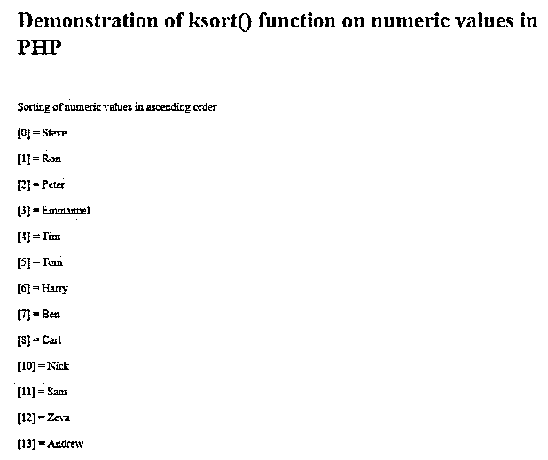
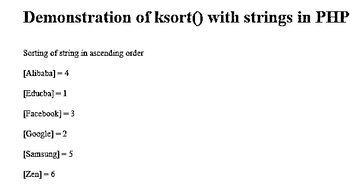

# PHP ksort

> 原文：<https://www.educba.com/php-ksort/>

## PHP ksort 简介

在 PHP 中，一个内置的函数 ksort()被定义为一个可以对数组进行升序排序的函数，特别是一个关联的数组，函数中的 k 表示键，所以 ksort()是一个用于对数组进行升序排序的函数，而对于降序排序，它将是 PHP 中的 krsort()函数，因此 ksort()函数返回布尔值，如果排序是根据键按升序进行的，或者如果该函数失败，它将返回 false。一般来说，排序被定义为数组形式的数据或元素的排列，在 PHP 中是根据 ksort()函数中的键对数组进行升序排序。

### 用实例说明 ksort()在 PHP 中的使用

在本文中，我们将讨论 PHP 中的 ksort()函数。在这种 PHP 编程语言中，排序是使用 sort()完成的，但是有两种排序方式，例如根据值 asort()进行升序排序，arsort()进行降序排序，或者根据键，我们使用 ksort()进行升序排序，krsort()进行降序排序。一般来说，ksort()是 PHP 中的一个内置函数，用于根据键对关联数组进行升序排序，但不能根据值进行排序，如果数组根据键进行了正确的升序排序，则返回 true，如果失败，则返回 false。

<small>网页开发、编程语言、软件测试&其他</small>

在下面我们将看到 PHP 中 ksort()函数的语法和例子:

**语法:**

`ksort(arr_to_sort, type_of_sort);`

**参数:**

*   arr_to_sort:这个参数是强制的，因为我们必须传递一个需要使用这个函数排序的数组。
*   type_of_sort:该参数可选，用于指定数组项或元素的比较，排序类型为 SORT_NUmERIC、SORT_STRING、SORT_REGULAR、SORT_LOCALE_STRING、SORT_FLAG_CASE、SORT_NATURAL。

PHP 的这个 ksort()函数返回一个布尔值，比如如果成功就返回 true，如果失败就返回 false。

### 例子

现在让我们看一个如何在 PHP 中声明 ksort()函数的例子:

#### 示例#1

**代码:**

`<!DOCTYPE html>
<html>
<head>
<title> Educba- ksort() in PHP </title>
</head>
<body>
<?php
echo"<h1>Demonstration of ksort() function on numeric values in PHP</h1>";
echo" ";
echo" ";
$arr = array("13" =>"Andrew",
"12" =>"Zeva",
"11" =>"Sam",
"4" =>"Suchi",
"5" =>"Tom",
"6" =>"Harry",
"4" =>"Tim",
"8" =>"Carl",
"7" =>"Ben",
"10" =>"Nick",
"1" =>"Ron",
"2" =>"Peter",
"3" =>"Emmanuel",
"0" =>"Steve",
);
ksort($arr);
echo"Sorting of numeric values in ascending order";
echo" ";
foreach ($arr as $key => $val) {
echo" ";
echo "[$key] = $val";
echo " ";
}
?>
</body>
</html>`

**输出:**

在上面的程序中，我们可以看到，首先，我们在 php ?>中声明了 PHP 代码。在上面的代码中，我们首先使用 array()函数声明和定义了数组，并将其存储在一个名为“$arr”的变量中。在这个数组中，我们定义了几个名称，并分配了一个数字，在这里我们将它们作为一个键，在这个代码中，我们采用“key => value”格式。因此，在定义数组之后，我们将 ksort()函数应用于数组“$arr ”,只需将该数组作为参数传递给 ksort()函数。然后，为了显示数组中的每个元素，我们必须使用“for”循环。在应用了 ksort()函数之后，我们调用“for”循环，其中元素已经按数字排序，因为这里的键是数字形式的，然后我们按升序打印每个键的值。这个输出可以在上面的截图中看到。

现在让我们看一个例子，如果键是字符串，使用 PHP 中的 ksort()函数。

#### 实施例 2

**代码:**

`<html>
<head>
<title> Educba- ksort() in PHP </title>
</head>
<body>
<?php
echo "<h1>Demonstration of ksort() with strings in PHP</h1> \n";
echo " ";
$arr1 = array("Educba" => "1", "Google" => "2", "Facebook" => "3", "Alibaba" => "4", "Samsung" => "5", "Zen" => "6", );
ksort($arr1);
echo "Sorting of string in ascending order";
echo " ";
foreach ($arr1 as $key => $val) {
echo " ";
echo "[$key] = $val";
echo " ";
}
?>
</body>
</html>`

**输出:**

在上面的程序中，我们可以看到我们已经在 Php ?>中编写了 PHP 代码。首先定义并声明数组名为$arr1，数组是使用 array()函数定义的。在这个数组中，我们使用了一些公司名称作为键，分配给它们的数字作为值。然后，我们将 ksort()函数应用于数组$arr1，这是通过将$arr1 作为参数传递给 PHP 中的 ksort()方法来完成的。因此，该函数将按字母顺序对数组进行排序，因为这里定义的键是字符串格式的，因此数组是按字母而不是数字的升序排序的，为了显示数组中的每个元素，我们需要使用“for”循环，其中我们显示每个键及其值的字母顺序与字符串格式的键相同。输出可以在上面的截图中看到。

在本文中，我们只看到了使用 ksort()函数对给定数组进行升序排列或排序。但是在 PHP 中，我们可以使用其他函数来对数组元素进行升序和降序排序，比如 asort() & arsort()，还有一个函数可以对数组进行降序排序，比如 krsort()。在 PHP 中，可以像在其他编程语言中一样使用 sort()函数进行排序，但在 PHP 中，它为每个顺序以及每个基于键和值的排列提供了单独的函数。

### 结论

在本文中，我们得出结论，PHP 中的 ksort()函数被定义为根据为每个元素定义的键，以升序排列或排序作为参数传递给该函数的数组元素。在本文中，我们看到了用于降序以及基于值排序的其他函数，例如 krsort()、asort()、arsort()。在本文中，我们看到了几个 ksort()函数如何处理数字键和字符串格式的键的例子，其中数字键根据键以升序对数组进行排序，在字符串作为键的情况下，它按照字母升序对元素进行排序。

### 推荐文章

这是 PHP ksort 的指南。这里我们分别讨论 ksort()在 PHP 中的工作原理和示例以及代码实现。您还可以浏览我们推荐的其他文章——

1.  [PHP 梁()](https://www.educba.com/php-strlen/)
2.  [PHP 异步](https://www.educba.com/php-async/)
3.  [PHP array_pop()](https://www.educba.com/php-array_pop/)
4.  [PHP 内爆](https://www.educba.com/php-implode/)

