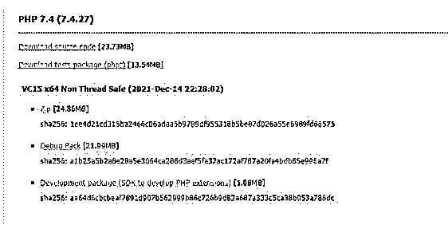
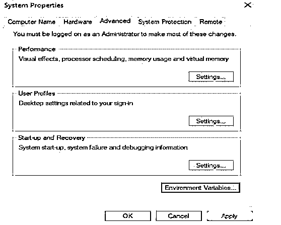
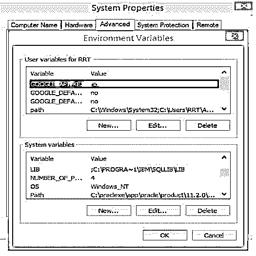
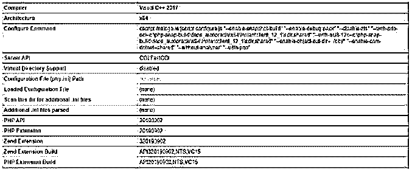
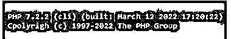
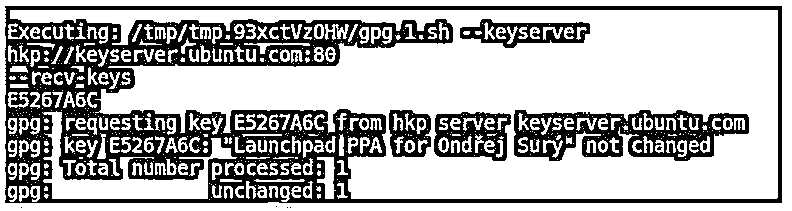

# PHP 7 安装

> 原文：<https://www.educba.com/php-7-install/>

## PHP 7 安装简介

PHP 是一种用于动态编程的苛刻的脚本语言。PHP 7 比另一个版本的 PHP 更快，因为我们认为 PHP 7 对于 Aerospike PHP 客户端来说比我们在 C 层使用许多散列表更快。Zend 引擎的新哈希表执行比过去的执行效率更高。PHP 7 很简单，我们可以安装在不同的操作系统上。这意味着它支持不同类型的架构，并取决于用户需求。

### 如何安装 PHP 7？

现在让我们看看如何在不同的操作系统上安装 PHP 7，如下所示:

<small>网页开发、编程语言、软件测试&其他</small>

首先，让我们来看看如下的窗口:

**第一步:**首先我们需要从官网下载 PHP 7；在这里，我们可以看到 zip 格式的 PHP 7 安装程序，如下图所示。

现在点击任何 zip 文件，我们将得到 PHP 7 安装程序。

**第二步:**我们需要将 C++从其官网可视化。

第三步:我们需要在我们的机器上安装 PHP 7。

第一步是在你的框架上引入 Visual Studio 2015 或 2016 和 2019 的 C++可再发行版。为此，请从前面给出的微软权威网站的链接中下载并介绍这些文档。接下来，下载 PHP 7.4 安装程序压缩文档，该文档位于您的框架上，来自之前 PHP 提供的权威站点的连接。

使用您心爱的压力/解压设备，删除您的框架上下载的压缩文件。为此，我们正在使用最著名的开源 7-Zip 编程。然后，您需要将压缩文档中的解压信封重命名为“PHP 7”。

接下来的阶段是将重命名的“PHP 7”信封移动到 PC 框架的驱动器 C:\的根目录中。

这里我们还需要设置环境变量，如截图所示。

在这里添加新变量，路径如屏幕截图所示。

现在我们需要在本地机器上配置 PHP 7。无论如何，你需要安排 PHP 7，目标是它能在你的 PC 框架上准确地工作。“C:\PHP 7”目录下有两条记录，PHP。改进和 PHP。在创作中。为了在你的电脑上建立一个 PHP 发展的氛围，把文档重命名为 PHP。然后，在这一点上，在您喜爱的内容管理器中打开文档。为此，我们引入了一个免费开源的 Notepad++ supervisor。
安装成功后，我们需要通过命令行进行检查，如下图截图所示。

另一种验证安装的方法是，我们可以在 localhost 中运行，如下图所示。

### 怎样才能在 macOS 上安装 PHP 7？

在安装之前，我们需要考虑以下一些先决条件:

在开始利用本教学练习建立 Node.js 和 NPM 之前，您应该有相应的基础知识
终端:您应该有 Mac 终端访问权限，并且了解一些关于使用终端应用程序的信息。所以登录你的 Mac 框架，打开终端。

自制酒:家酿是一个著名的 Mac 工作框架的捆绑包管理员。它有助于介绍像 Node 这样的大多数开源编程。之后，我们需要下载 PHP 7 并安装在 macOS 上。最新的 macOS Sierra 安装了 PHP 5.6，OS X 10.11 El Capitan 安装了 PHP 5.5，OSX 10.8 Mountain Lion 安装了 PHP 5.3。PHP 7.2 的最新版本是可以介绍的。以下步骤将帮助你在 macOS 上介绍 PHP 7.2 或 7.1 或 5.6。

首先，我们需要打开一个终端并运行以下命令，如下所示:

**代码:**

`$curl -s http://php-osx.liip.ch/install.sh | bash -s 7.3`

在上面的命令中，bash 是 PHP 的一个版本，我们可以根据自己的需要进行修改。安装成功后，我们需要验证 PHP 7 的安装。PHP-osx 保持了对 macOS 的 PHP 适应，并且不会覆盖当前在您的框架上引入的 PHP doubles。这就介绍了/usr/neighborhood/php7 中的一切。新的 PHP 随后被配对。

在/usr/neighborhood/PHP 7/receptacle/PHP 中。

**代码:**

`$php –v`

执行上述命令后，我们可以看到下面截图中显示的细节。

我们还可以在 localhost 中验证安装，如下图所示。

### 怎样才能在 Linux 上安装 PHP 7？

PHP(PHP:Hypertext Preprocessor 的递归缩写)是一种开源的、众所周知的、普遍有用的预编排语言，通常用于创建网站和电子应用程序，并且是其理想选择。它是一种服务器端预先安排好的语言，可以插入 HTML。目前，有三种受支持的 PHP 版本，即 PHP 5.6、7.0 和 8.0。PHP 5.3、5.4、5.5 已经到了生命的终点；安全更新通常不支持它们。

首先，我们需要使用下面的命令为不同的 PHP 版本添加 Ondrej PPA。

**代码:**

`$ sudo apt install python-software-properties
$ sudo add-apt-repository ppa:ondrej/php`

添加后，我们会得到如下屏幕，如截图所示。

现在我们可以使用下面的命令安装 PHP 7，这里我们也可以选择如下的服务器。

Apache Web 服务器的命令:

**代码:**

`$ sudo apt install php7.0 [PHP 7.0]`

Nginx Web 服务器的命令:

**代码:**

`$ sudo apt install php7.0-fpm [PHP 7.0]`

安装后，我们可以使用以下命令来验证安装。

**代码:**

`$ php -v`

执行上述命令后，我们可以看到安装的 PHP 的版本，如下图所示。

在 Linux 中，我们可以根据自己的需求设置默认的 PHP 版本。

### 结论

从上面的文章中，我们已经了解了 PHP 7 安装的基本思想，并看到了在不同操作系统上的安装。从这篇文章中，我们看到了如何安装 PHP 7 的细节。

### 推荐文章

这是一个 PHP 7 安装指南。这里我们讨论一下入门以及如何安装 PHP 7？为了更好的理解。您也可以看看以下文章，了解更多信息–

1.  [PHP usleep](https://www.educba.com/php-usleep/)
2.  [PHP 中迄今为止的时间戳](https://www.educba.com/timestamp-to-date-in-php/)
3.  [PHP ksort](https://www.educba.com/php-ksort/)
4.  [PHP XML 头](https://www.educba.com/php-xml-header/)

