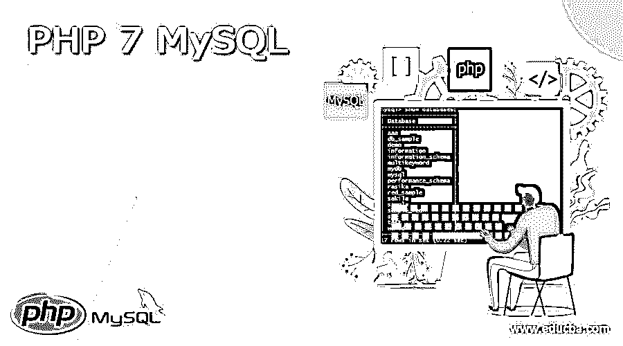
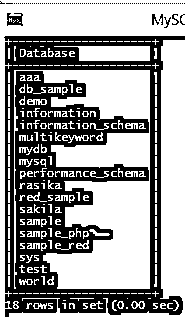

# PHP 7 MySQL

> 原文：<https://www.educba.com/php-7-mysql/>

## PHP 7 MySQL 简介

PHP 是一种服务器端预编排语言，用于组装动态编程或强大的 web 应用。PHP 有几个变体，例如 PHP 5 和 PHP 7，每个都有不同的用途和管理。当我们想在那时左右进行动态编程时，我们应该与 MySQL 这样的信息库相关联。PHP 7 和 MySQL 的关联我们可以通过编码来完成。MySQL 是一个开放协会；然而，它从 PHP 5.5 开始被审查，并从 PHP 7 中被淘汰。

### PHP 7 MySQL 是什么？

要访问 MySQL 信息库并向其中添加内容，首先应该在数据集和 PHP 脚本之间建立关联。mysql_connect()扩展了与 mysql 服务器的关系。默认情况下，确认缺少可选限制:server = 'localhost: 8080 '，username =保证服务器周期的客户端名称，以及神秘密钥= void 神秘字。类似地，服务器限制可以合并端口号。mysql_connect()工作打开了一个非坚决的 mysql 从属关系。这个限制返回进展的关系，或假，以及挫折的失误。您可以通过在限制名称前添加一个“@”来隐藏好的收益。

<small>网页开发、编程语言、软件测试&其他</small>

如果您的结构中有 XAMPP(不是 web 服务器)，您需要将其命名为 localhost。MySQL 客户端名称和神秘密钥分别是“root”和 clear(" ")。请允许我们做一个必要的努力，将我们的 PHP 代码与 MySQL 联系起来。如果您使用的是 Windows，那么在“C: /xampp/htdocs/”中有一个“htdocs”信封(在默认区域中的任何位置)。如果你在 Linux(可能是 Ubuntu)上，它被安排在“/pick/lampp/htdocs”上(在它里面做一个协调器之前你应该改成 attach client。).

### 如何创建 PHP 7 MySQL？

现在让我们看看如何在 PHP 7 中创建 MySQL。

首先，我们想引入我们需要的任何服务器，这取决于工程师我们是否能根据需要引入 Tomcat、XAMPP 或其他服务器。从那时起，我们希望根据应用程序的需要在服务器上推出改进。以另一种方式，我们可以引入 MySQL 服务器和任何编程设备来进行编码。为了更好地达成一致，考虑语言结构之下的。

资源 MySQL _ connect([字符串服务器[，字符串确定的用户名[，字符串用户密码[，布尔新链接[，int 横幅值]]])

如果进展顺利，返回 MySQL 接口标识符；如果遇到挫折，返回 FALSE。

mysql_connect()扩展了与 mysql 服务器的关系。对于缺少可选限制的情况，使用默认值是正常的:server = 'localhost: 8080 '，username =断言服务器周期的客户端的名称，以及 mystery express = void 神秘状态。

此外，服务器限制可以融合端口号。例如，“主机名:端口”

之后，我需要使用下面的命令创建数据库。

`create database specified database name;`

上面的命令指定的数据库名称意味着我们想要创建的实际数据库名称。

#### 例子

首先，让我们使用下面的命令来查看可用的数据库。

`show databases:`

执行上述命令后，我们可以看到所有数据库的列表，如下图所示。

我们需要使用下面的命令创建一个 sample_php 数据库。

`create database sample_php;`

执行上述命令后，我们会得到如下结果，如截图所示。

现在，使用如下命令签入数据库。

`show databases:`

执行上述命令后，我们可以看到如下结果。

现在创建一个. php 文件并编写以下代码。

`<?php
$server = "localhost";
$db_user = "root";
$db_password = "specified password of database";
$db_name = "Specified database name";`

### PHP 7 MySQL 驱动程序

现在让我们看看 PHP 7 中有哪些可用的驱动程序如下。

驱动程序是一段用于与特定类型的信息库服务器通信的程序。

**PHP MySQL 扩展**

MySQL 扩展是轻量级的，也是最常用的扩展；在 PHP 中，有三种类型。

1.  exy/mysql
2.  exy/mysqli
3.  PDO_MySQL

**Mysqlnd:**

mysqlnd 库非常精简，并与 PHP 紧密结合。不幸的是，MySQL 客户端库不能提供类似的改进，因为它是一个非常有用的客户端库。

mysqlnd 库在基础中包含 PHP，以便一致地加入 PHP。更重要的是，它利用 PHP 内存、执行程序、PHP 流(I/O 审议)和 PHP 字符串来处理时间表。例如，mysqlnd 的管理人员使用 PHP 内存允许通过利用重新调整因子(在合成时复制)进行内存投资，并使 mysqlnd 适用于 PHP 内存限制。

### 如何连接 PHP 7 MySQL？

**语法**

`mysql_connect(
string $server_host = ini_get("get the host "),
string $specified username = ini_get("get username"),
string $user password = ini_get("user password"),
bool $new_link = false,
int $client_flags = 0
): resource|false`

**解释**

我们试图利用上述语言结构将 MySQL 和 PHP 7 与各种边界联系起来。

*   **服务器 _ 主机:** MySQL 服务器。它可以以类似的方式加入端口号。例如，“hostname: port”如果，尽管 PHP 请求 mysql.default_host 的所有内容都是不清楚的(默认)，默认考虑的是“localhost: 3306”。
*   **指定用户名:**用户名，默认由 mysql.default_user 描述。在 SQL 试用模式中，此限制被取消，并且使用带有服务器周期的客户机名称。
*   客户端机密短语:
*   **new_link:** 预期对 mysql_connect()的结果调用带有比较性争议，不会展开新的关联，但考虑到所有因素，将返回 by 的关联标识符和大型打开的关联

现在让我们看看如何用下面的例子连接 MySQL。

#### 示例#1

现在让我们看看 PHP7 MySQL connect 的不同例子，以便更好地理解。

`<?php
$servername = "localhost";
$username = "specified username";
$password = "user password";
// Creating connection with MySQL server
$conn = new mysql($servername, $specified username, $user password);
// Connection checking
if ($conn->connect_error) {
die("Connection failed: " . $conn->connect_error);
}
echo "Connection done successfully";
?>`

**解释**

这是一个非常简单的 PHP 7mysql 连接的例子。执行程序后，我们会得到一个成功的消息，如下图所示。

#### 实施例 2

现在我们来看另一个例子如下。

`<?php
mysqli_connect("specified localhost", "specified root", "", "   ");
if(mysql_connect_error())
echo "Connection Problem.";
else
echo "Database Connection Done.";
?>`

上面示例的最终输出显示在下面的屏幕截图中。

### 结论

借助上述文章，我们试着了解一下 PHP 7 MySQL。从这篇文章中，我们了解了 PHP 7 MySQL 的基本知识，同时我们也看到了 PHP 7 MySQL 的语法和例子。

### 推荐文章

这是一个 PHP 7 MySQL 的指南。这里我们讨论定义，如何创建和连接 PHP 7 MySQL，以及例子和输出。您也可以看看以下文章，了解更多信息–

1.  [PHP ksort](https://www.educba.com/php-ksort/)
2.  [PHP 退出](https://www.educba.com/php-exit/)
3.  [PHP 存储库](https://www.educba.com/php-repository/)
4.  [PHP 异或](https://www.educba.com/php-xor/)

