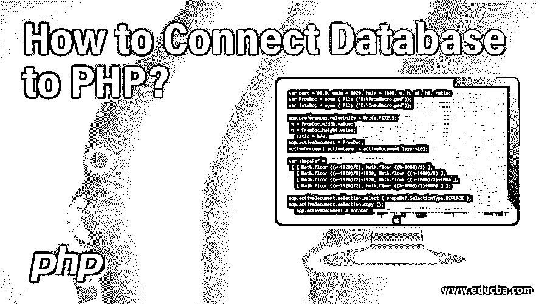
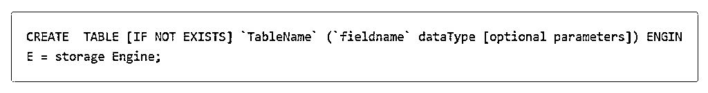
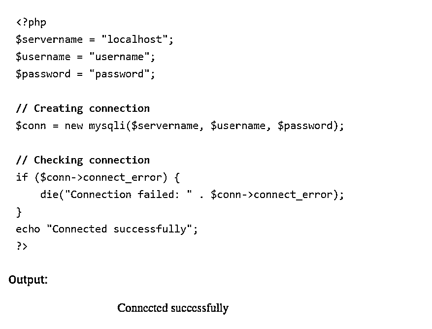
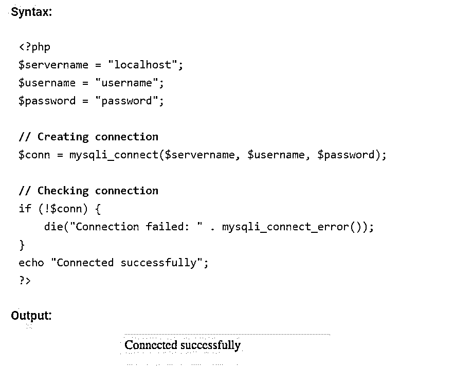
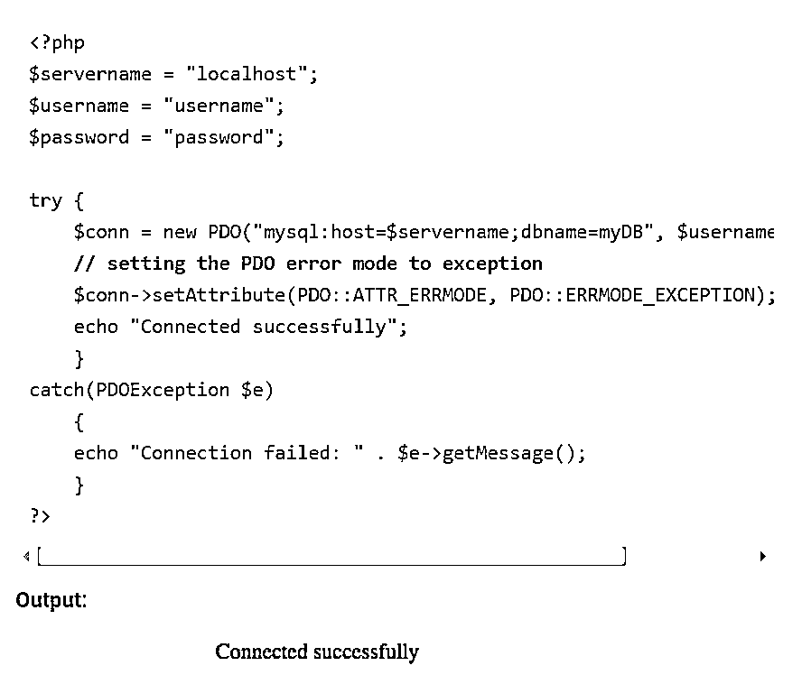
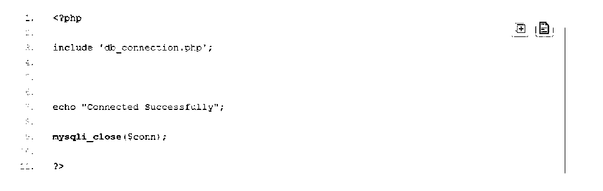

# 如何将数据库连接到 PHP？

> 原文：<https://www.educba.com/how-to-connect-database-to-php/>

## 如何将数据库连接到 PHP 的介绍

为了优化任何数据库的使用，应该能够根据需要操作它。操作和管理您创建的数据库的最好方法是用 PHP 连接您的数据库。首先让我们了解一下什么是 PHP。PHP 就像一个控制面板，可以用来管理你的数据库。连接到 PHP 使您可以根据特定查询的需要从数据库中检索数据。 [MySQL 是最流行的](https://www.educba.com/what-is-mysql/)开源 RDBMS，可以轻松连接 PHP。MySQL 中的数据以表格和行列结构排列。因此，它可以很容易地用于小型和大型应用程序，并在服务器上工作。

### 如何创建数据库？

在 MySQL 中创建数据库就像在 SQL 中执行一个命令一样简单。例如，对于初学者来说，可以使用“[创建数据库]”的简单查询来创建数据库。创建数据库的另一个选项是使用另一个查询作为“[CREATE SCHEMA]”

<small>网页开发、编程语言、软件测试&其他</small>

例如，假设您想要创建一个名为“电影”的数据库这可以通过执行命令创建数据库电影来完成；

添加更多参数并避免单个 MySQL 服务器上现有数据库之间的混淆，可以使用命令“[如果不存在]”。该查询的作用是检查是否有任何现有的数据库具有相同的名称。如果是，该命令将不会执行数据库的创建。另一方面，如果没有这种数据库名称冲突，下面的命令将执行并创建一个数据库。虽然“[如果不存在]”是非强制性的，但这是一个很好的做法。

这个新创建的数据库将是空的，等待包含数据的表。[用于表](https://www.educba.com/sql-commands/)的 SQL 命令是一个简单的查询“[CREATE TABLE]”，语法如下。

这个新创建的数据库将是空的，等待包含数据的表。用于表的 SQL 命令是一个简单的查询“[CREATE TABLE]”，语法如下。

### 将数据库连接到 PHP

[5 以下 PHP 版本](https://www.educba.com/php-versions/)使用 MySQL 扩展。但这一延期在 2012 年被减损。

PHP 的第 5 个版本和更新的版本可以与下面的:

1.MySQLi 扩展

2. [PDO (PHP 数据对象)](https://www.educba.com/php-data-object/)

以上任何一种都可以根据自己的至高无上和自己的需要来使用。

MySQL 扩展只能用于 MySQL 数据库，而 PDO 可以用于连接 12 种不同的数据库系统。因此，如果一个人正在切换数据库，PDO 可能会派上用场，因为它只需要改变一些连接。但是在 MySQLi 的情况下，我们需要编写完整的代码和查询来切换数据库。使用 MySQLi 需要在 PHP 上启用 MySQLi。MySQLi 还提供了一个过程化编程接口和一个面向对象的接口。在 PDO 和 MySQLi 中，预准备语句都是 web 安全中的原则。

### 使用 PHP 和 MySQL

PHP 和 MySQL 是 web 开发中最常见的[栈。](https://www.educba.com/career-in-web-development/)

*   面向对象的 MySQLi
*   过程 MySQLi
*   PDO

首先，需要知道一些重要的细节，比如数据库系统的服务器地址、用户名、数据库名和密码。主要地，我们将在所有三个过程中使用 mysqli_connect。这个命令用于建立数据库和 PHP 之间的连接。首先，我们必须创建一个单独的连接文件。每当您想从数据库中插入数据和信息并将这些数据插入多个文件时，这样可以节省编写代码的时间。

我们可以只使用 PHP 文件连接名和 include 函数并插入数据，而不是每次都重写代码。当您需要将整个项目从一个系统转移到另一个系统时，这也很有用。当您更改一个文件中的值时，它会自动更改每个文件中的所有值，这样您就不用在每个文件中进行更改了。一旦实现了这一点，我们就可以使用不同的过程来建立与数据库的连接。

让我们一个接一个地看看它们:

#### 1.使用面向对象的 MySQLi

这可用于使用 PHP 脚本通过以下语法建立与数据库的关联。

**说明:**

*   Localhost 基本上是服务器的位置。主机可以是其他东西，但是在大多数情况下，服务器运行在本地主机上。
*   用户名是 root 和密码；这和你在 php 管理中使用的是一样的。
*   要建立此链接，请提供必要的详细信息，如本地主机、用户名和密码。这将创建一个 MySQLi 实例，从而成功连接。

#### 2.使用 MySQLi 程序

使用 MySQLi procedural 在数据库和 PHP 之间建立连接的过程描述如下。

**说明:**

*   过程化过程的主要区别在于它使用函数 mysqli_connect，该函数获取主机、用户名和密码等必要的详细信息。成功连接后，它将提供一个链接标识符。

#### 3.使用 PDO

PDO 代表 PHP 数据对象。因此，在创建连接的过程中，PHP 数据对象的用法如下:

**说明:**

*   PDO 中的异常函数有助于抛出任何要考虑的异常，并管理在建立连接时可能出现的任何问题。

以上所有方法都有助于访问和管理您需要的数据库。

#### 检查连接:

以下语法可用于检查您的连接是否成功连接。

Db_connection 是 php 文件名。

#### 结束连接:

一旦您使用 PHP 脚本建立了数据库连接，您还应该在工作完成后关闭连接。假设引用存储在 conn 变量中的连接，下面是上面给出的过程中使用的结束语法。

*   使用 MySQLi 面向对象的程序

*   使用 MySQLi 程序过程

*   使用 PDO 程序

### 结论——如何将数据库连接到 PHP？

当使用 PHP 连接时，访问和管理数据库非常容易。它还提供了多种方式来建立这种连接，以满足不同层次的需求。建立连接后，可以执行查询从表中提取数据。这个信息可以很容易地打印出来。工作完成后关闭连接也很重要，这是将数据库连接到 PHP 的一部分。

### 推荐文章

这是如何将数据库连接到 PHP 的指南？这里我们讨论如何创建和连接数据库到 PHP？您也可以浏览我们推荐的其他文章，了解更多信息——

1.  [如何用 Java 连接数据库？](https://www.educba.com/how-to-connect-database-in-java/)
2.  [什么是 PHP 数组？](https://www.educba.com/what-is-php-array/)
3.  [如何将数据库连接到 MySQL？](https://www.educba.com/connect-database-to-mysql/)
4.  [和 SQL 中的](https://www.educba.com/and-in-sql/)

