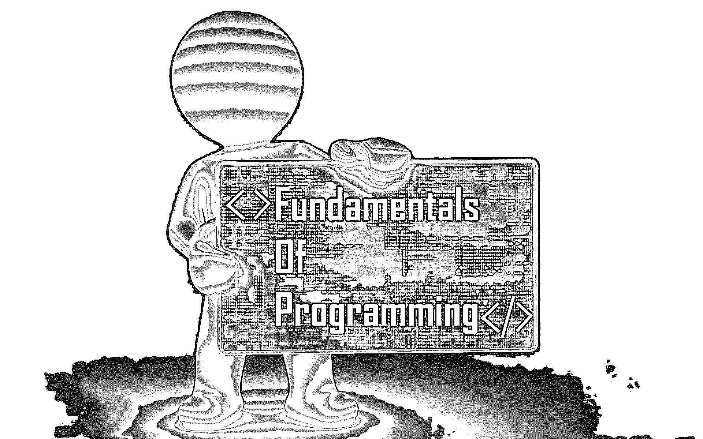
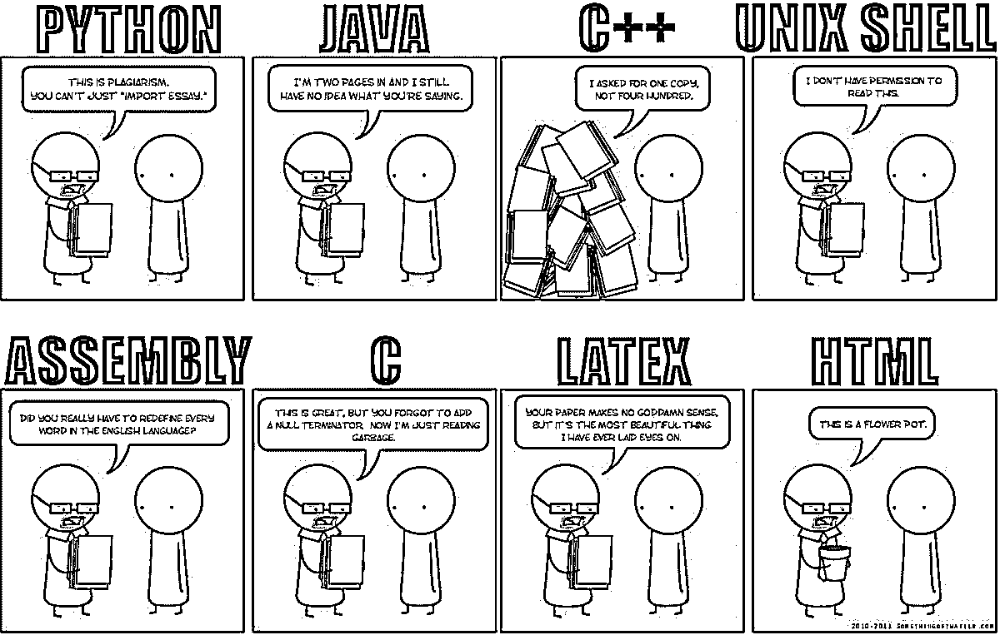

# 编程基础

> 原文：<https://www.educba.com/fundamentals-of-programming/>

 

## 编程入门

当我开始学习编程时，我一点都不知道基础知识。刚知道 A+和网络+的基础。但是 C、Java 和 Python 对我来说是不同的世界。此外，几乎没有人帮助我，因为我是我的朋友中唯一一个来自 IT 背景的人。所以，我最终决定从最常见的语言开始学习。然后我开始了解 C 和 C++。我开始学习 C，但是自从导入模块后，我就神魂颠倒了，所有这些东西对我来说都是多余的。我学了一个月的 C；然后，我觉得 C 有点难，于是开始学习 Bash。尽管 Bash 是一种脚本语言，而不是编程语言，但理解起来有点困难。我被困在克朗工作和东西。终于，走投无路的我开始学习 Python。但是见鬼，不…这是最糟糕的。以前用 C 写代码的时候，每一段代码都要写。但是在 Python 中，有很多神奇的东西围绕着理解正在发生的事情。是的，这种魔力与你所想的不同,‘魔力’是 Python 中的官方词汇。Python 中的魔法是指你想做一件事，那件事发生了，但你不知道它是怎么发生的。是的，这也是 Python 变得复杂的地方。

### 编程基础

当我开始学习所有这些编程语言时，我不能理解的最重要的事情是为什么我应该导入任何特定的模块。例如，用 C 语言编写 hello world 程序时，我们通常会编写' include stdio'。' h '或'包括 conio。h。所以，我的问题是，为什么只有这个？我看到有些人甚至没有输入 conio 部分。
同样的，在 Python 中，要做复杂的数学，我们导入 cmath，但是开发者为什么不早就把 math 和 cmath 结合起来，缩短两次导入的整个过程呢？但后来我想，还是做一件事吧。让我们从编程的基础开始。我决定跌到谷底，从那里重新开始。而且截至目前，我几乎可以用任何语言编写任何程序，比如 Java、C、C++、Haskell、Scala、Python、Ruby 等等。这些年来，我在编程方面打下了坚实的基础。最主要的原因是因为我清除了所有编程的基础知识。你可能很少听到有人谈论基础知识，但它们是让你在编程中正确理解概念的最重要的东西，这也是我想写这篇博客的主要原因。所以让我们从编程的基础和术语开始。

<small>网页开发、编程语言、软件测试&其他</small>

### 伪代码、数学和注释

如果你懂数学，那么大多数事情都会变得很容易。写程序和解数学题没多大区别。此外，在学习 Haskell 这样的函数式语言时，数学是唯一可以成为学习该语言的先决条件的东西。大多数问题都可以通过简单的数学和伪代码来解决。数学和伪代码是相辅相成的。例如，每当你想解决一个特定的问题时，用简单的代数和几何格式，以定理和证明格式的形式写下来。现在用伪代码格式写下这些代码。当我说伪代码时，我的意思是以这样一种方式编写程序，当你编写一个实际的程序时，你只需要改变一些值和词汇，程序就会工作。例如，要计算从 1 到 20 的所有数字的和，可以用以下方式编写伪代码

| let x = 1x = x + 1

如果 x = 20，则停止并打印 x

否则继续并再次重复一切

 |

这段代码有点问题，但我们不是为此而来的。正如你所看到的，我首先把 x 的值赋值为 1，然后加上 1，2，3，直到它达到 20。如果 x 达到 20，程序将停止并打印输出；它会继续，不断重复同样的事情。所以，当你写的时候，把这个伪代码转换成一个实际的程序变得非常容易。另外，确保你在所有你认为令人困惑的行旁边写下评论。写注释的主要原因是因为它不会先被执行；第二，你可以随时指出你做了什么，在哪里做的，为什么做某事。注释在 5-10 行代码中没有多大用处，但是当您有多个文件，每个文件有大约 40-50 行代码时，通过查看注释就可以很容易地找到错误所在或者为什么一些文件被导入。

### 变量、常数和数据类型

变量可以用来存储数据、字符串、数字或几乎任何东西。这种数据的集合称为数组。如果我参考前面的例子，你可以看到我在开始时给 X 赋值 1。因此它使 X 成为一个变量。这里 1 是一个整数，X 是赋值变量。类似地，我也可以将字符串输入到变量中。一个简单的例子是:-

| X = 'Hello world'echo $X |

上面是一个可以在 bash 中执行的实际程序，这是一个很棒的 Linux 终端。X 被赋予字符串' hello world '的值，echo 打印 X 内部的任何内容。美元符号表示我们在这里调用 X 的值。

同样，常数也是变量，，但与变量不同，常数是不能变的。在第一个例子中，我将值 1 赋给 X；然后，我一直按升序递增。但是对于一个常数来说，X 永远是 1，并且这个值不能改变，直到程序退出。数据类型只是不同类型数据的分叉。例如，实数、整数、浮点数、甚至布尔和字符串。布尔指的是真和假，通常用 1 和 0 来表示。

### 功能和程序

在编程中，函数只是给一大段代码赋值。它们通常是这样做的，这样人们就不必重复地写下整个代码，只需一个简单的语法就可以调用整个代码。函数只是一个封装的任务，包含多行要执行的指令。编写大型代码时，函数通常是预先开发好的，并存储在文件夹内的单独文件中。以后，无论何时需要这段代码，都可以调用文件名或定义的函数名，文件中的整段代码将被执行。

函数有它们的工作空间，这意味着函数内部的所有变量只有在代码执行完成后才可用。一旦完成，变量就会变得不确定(除了垃圾收集的情况，我在这里没有提到，因为这是一个很大的讨论话题)。函数也可以嵌套在一个函数中。这意味着一个函数可以调用任何其他函数，包括它自己。但是不建议使用后者，因为这会导致引导循环，除非被紧急执行。

另一方面，过程与函数几乎相似，除了函数总是返回值，而过程只是命令的执行。当开始学习编程时，您可能会看到许多人交替使用函数和过程这两个术语。但如果你开始学习 Haskell 或 Scala 这样的函数式语言，情况就不一样了。所以在编写函数时，要记住的一点是确保它们没有副作用。

### 条件和循环

条件是我在前面的例子中解释过的。他们以类似这样的方式行事:“如果下雨，我会被淋湿。”。否则我不会。是的，这听起来像一个愚蠢的例子，但这是更容易的。条件语句相互依赖。通常，它们是相互联系的，并以“if，then，else 和 elif”的形式出现甚至条件语句也可以嵌套。如今，条件中的条件非常常见，但是如果缩进和注释做得不恰当，程序将会变得极其错误和难以理解。

另一方面，循环用于重复执行代码、函数和程序，直到返回期望的结果。如果你检查我的第一个例子，你会看到我陈述了一些重复的东西。因此，循环是非常强大的，它们使程序非常紧凑。但是过多使用循环会使程序变慢。它们应该只在必要的时候使用。循环以“for，While，Do-While 循环和 for-each 循环”的形式出现最常用的循环是 while、do-while、和 for 循环。while、do-while 和 for 循环的伪代码将按以下方式运行:-

| While 循环:- |
| **While** condition is false,{执行代码并检查条件是否为真

}

当条件为真时停止。

 |

| do–While 循环:- |
| **Do****{**执行代码**} while (** 检查一个语句是否为真，否则重复 **Do)** |

| For 循环:- |
| **for** ( a, b, c){执行代码

}

 |
| 在上面的代码中，a 是首先执行一次的条件，b 是循环的条件，c 是循环停止后执行的代码。 |

### 程序设计基础中的控制结构

编程基础中的控制结构只是条件、循环和其他代码集的组合。控制结构是一个代码块，它分析程序的整体结构，然后决定下一步是停止、重复、调用函数还是执行另一个代码块。简而言之，更具体地说，编程中的控制结构只是一个决定程序流程的决策过程。一段完整的代码以下列块类型的方式执行:-

| **Pre Condition****Control Structure****控制结构结束****发布条件** |

### 面向对象程序设计和函数式程序设计

现在，这是开发人员在编程基础中争论最多的话题之一。面向对象编程只处理“对象”不要把这句话看得太重。面向对象编程(OOP)处理包含字段、属性、过程和方法的数据。c 是一种面向对象的语言。Python 不是纯粹基于对象的。但是有些书上说 Python 可以以面向对象的方式工作。与面向对象编程类似，还有一种叫做函数式编程语言的东西。函数式语言更多的是基于数学。我记得的一种纯函数式语言是 Haskell。另一个是 Scala，它的功能并不全，但可以让它那样工作。另一方面，Haskell 不像其他语言那样工作，而是基于纯逻辑。与 Java、C、Python 或大多数其他语言不同，Haskell 中的 bug 很少，因为 Haskell 中函数的副作用很少或至少没有。

 

### 结论–编程基础

总而言之，编程的基础非常容易学。人们需要将适当的逻辑输入到问题中，并找到解决问题的多种方法，而不仅仅是一种方法来解决问题。一旦你有了正确的基础，开发软件或基于它们的学习框架将是小菜一碟。

### 推荐文章

这是一本编程基础指南。这里我们讨论介绍、函数和过程以及 while 条件和循环。您也可以看看以下文章，了解更多信息–

1.  [嵌入式系统编程](https://www.educba.com/embedded-system-programming/)
2.  [Unity 着色器编程](https://www.educba.com/popular/unity-shader-programming/)
3.  [Python Programmer](https://www.educba.com/popular/python-programmer/)

