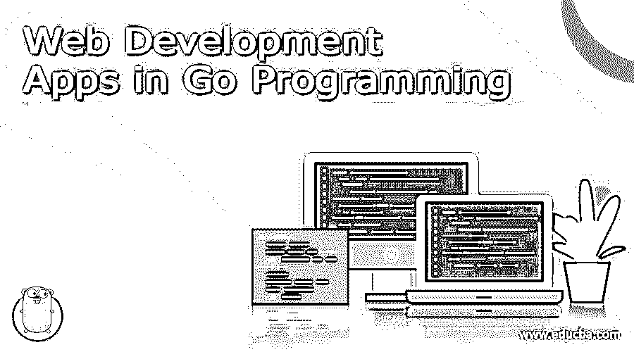
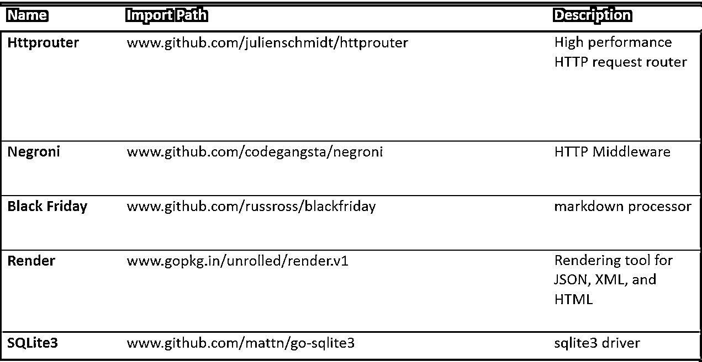

# Go 编程中的 Web 开发应用

> 原文：<https://www.educba.com/web-development-with-go-programming/>

## Go 编程中的 Web 开发应用介绍

欢迎来到我的下一个博客，围棋程序员伙伴们。在这篇博客中，我们将谈论谷歌令人敬畏的 Golang 语言。在我之前的博客中，你可能已经看到了 Golang 这些年来是如何发展的，并且给 Java 和 C++带来了激烈的竞争。但在这篇博客中，我们将讨论它的现实应用。Golang 是谷歌的官方编程语言。

谷歌一直保持其许可证开源。这意味着任何人都可以根据自己的需要修改、复制、粘贴或更改它。Golang 是一种高级编程语言。但是，Go 有很多类似 C 或 Java 的特性；它几乎一点也不像 C 或 Java。

<small>网页开发、编程语言、软件测试&其他</small>

 

Official Go Lang Logo

事实上，Go 编程的本意是一种语言，可以是 [Python](https://www.educba.com/software-development/courses/python-certification-course/ "Python Training Course Bundle") 、C 和 Java 的组合。尽管它永远无法取代这些语言，但其他语言仍然无法做到 Go 所能做到的，说实话，它实际上比 C 或 Python 快得多。现在关于 GO 编程如何工作已经说得够多了；让我们看看它在现实世界中的应用，除了对谷歌有很大的帮助，以及它实际上是如何主宰 web 开发世界的。

在这篇博客中，我将假设你对 C、Java 或者至少是 Django 有一些基本的编程知识。如果没有，你可以阅读我的其他博客来理解它，然后回到这里继续这篇文章。

### Go 编程语言示例

下面是一个例子:

#### 围棋起源

记得我告诉过你，Go 从像 C 和 python 这样的 web 开发语言中获得了它的特性，但事实是，它实际上借鉴了很多东西，不仅仅是特性。它既有 python 编译速度的敏捷，又不失 c 语言的安全极性，GO 的微缩构建非常到位；例如，您可以在几秒钟内编译大型程序。这些字节码的速度几乎与 C 语言的速度相似。

开发 GO 编程的主要原因是因为谷歌有非常大的数据关键服务器和程序员投资，或者更好的说法是浪费了长时间等待程序编译。即使代码被编译和并行化，构建一个程序仍然需要很长时间。

即使是增量构建也很慢(增量构建意味着只是用新的特性更新旧的构建或者清理它的错误)。就在那时，他们意识到他们需要一些不同的东西，一些具有 C 语言能力和 python 语言速度的东西。他们还认为这些基本系统语言中使用的工具很慢。

所以他们想从零开始，写一些他们需要在谷歌写的程序，以一种既聪明又简洁又不失效率的方式。

### Web 开发、并发性和 GO

现在的问题是， [web 开发](https://www.educba.com/career-in-web-development/)如何与 GO 一起工作？它如何从并发性中获益？从理论上讲，通过并行处理，服务器的资源可以得到更好的利用。例如，如果您并行运行两个独立的 sql 查询，它会给出快速响应。这不是很神奇吗？

现在，让我们从另一个角度来看这个问题。

通常，当您听到并发这个词时，您会认为您可以同时处理多个线程。但是我们并不是要求我们的代码完美的极端专业人士。所以，更准确的说法是，你可能会把周围的事情弄得一团糟，而不是做多项任务。

因此，不幸的是，这在我们的道路上产生了许多问题，这实际上是不好的，因为并发可以导致更好的视觉安排和更清晰的代码。简而言之，它可以依赖于一个原因，这是你不希望的:低性能。但是，尽管如此，我们实际上忽略了主要部分。如果我们真的有一套好的硬件或者更快的计算技术[更准确地说是](https://www.educba.com/matlab-technical-computing/ "MATLAB - Technical Computing")，GO 在多核处理器环境中实际上会运行得更快。

现在我们来看看 GO 和其他语言有什么不同。我们需要做第一步:选择您希望更改的任何全局可变状态，然后第二步:实现锁定。现在，这是两个正确的步骤和两个错误的事情的结合。有丰富经验的开发人员会同意我的观点，全局可变状态是一件坏事。

事实上，许多编码人员试图以最好的方式来消除这一点。因此，最重要的事实是，你已经完成了第一步，看起来有些重构是有序的。另一方面，第二步，即锁定，能够实现它的目标，但同时，它引入了大量的样板文件，很难以适当的方式写下来，然后正确地调试它。

因此，这类语言可能会让一个 http 请求读取一个特定的变量，而让另一个请求写入它。什么时候发生的？足够重要吗？它需要读和写的顺序吗？你的代码有这种逻辑吗？如果有，为什么？

### 要走的路

在编写这些内核时，GO 的线程可能与您所习惯的不同。这些实际上有点类似于 Erlang 的流程。它们非常轻量级&两者都有相似的目标。这并不是说 GO 和 Erlang 是相同的，因为它们有许多不同之处。

并发性和渠道；两者在围棋编程中携手并进。然而，可以说这些通道有真正的马力使我们的自动化工作。正因为这个性质，它们防止了围棋中的套路被复制。Nuf 说，现在你可以在没有锁和互斥的帮助下运行你的代码。如果您有时间值得去 Google 一下，您会发现许多人正在以 UNIX 管道的形式尝试相同的方法。

### 构建原生 GO 应用

现在我们知道了 GO 是如何工作的，让我们看看在 GO 中构建一些基本的应用程序。让我们先看看先决条件:

1.  从 go 官方网站下载 go 安装程序(搜索下载 golang 即可获得)

2.  设置 GOPATH(如果您从未设置过环境变量，这是最棘手的部分)

#### 形容词（adjective 的缩写）对于 Windows 用户

*设置* *戈鲁特* *=* *C:\go*

*设置**GOPATH**=**C:\ Users \**testdir*

*设置**GOBIN**=**% GOPATH % \ bin*

*设置* *路径**=**%路径%；c:\ go \ bin；%GOBIN%*

*CD*T2】% GOPATH % \ src*T5】*

在上面的 *testdir* 选项中，将您想要使用的目录设置为工作目录。这将设置所有的目录，当您键入最后一个 cd (change firectory)命令时，它会将您带到默认的工作目录，即在我们的例子中，它是 testdir。如果是的话，就说明它起作用了。

#### b.对于 Linux 用户

*导出 GOROOT=/usr/local/go*

*导出 GOPATH=$HOME/go*

*导出路径= $ PATH:$ go root/bin:$ GOPATH/bin*

以下是您需要下载的必需软件包(这些是可选的，取决于您需要构建的内容):

 

您可以通过在控制台中运行以下命令来安装(或更新)这些软件包:

*go get-u<import _ path>T1】*

例如，如果你想安装尼格罗尼，那么你可以使用下面的命令:

*去 github.com/codehub/negroni 吧*

对我来说，[构建 web 应用程序](https://www.educba.com/how-to-build-web-applications-using-mongodb/ "How to Build Web Applications using MongoDB")意味着构建 Http 服务器。Http 或超文本传输协议是一种协议，最初建立该协议是为了仅将特定于用户的 HTML 文档从特定服务器传输到客户端 web 浏览器。时至今日，Http 不仅仅用于传输纯文本。

我不会陷得太深；实际上，你可以参考 github，在那里你可以找到关于这个项目的更多细节。

现在让我们从在 GOPATH 中创建一个新项目开始

*光盘 GOPATH/src*

*是测试服务器*

*cd 测试服务器*

现在，我们可以通过键入以下命令来创建 main.go:

`*package main*
*            import “net/http”*
*func main() {*
*}*`

现在既然一切都设置好了，我们需要做的就是导入 http 包，然后它就可以工作了。现在，是时候编写我们的测试服务器代码了:

*http。ListenAndServe(":2964 "，http。文件服务器(http。Dir(" . ")))*

http。ListenAndServer 是一个用于运行服务器的函数。它将在给定的地址上运行，在这种情况下是端口 2964，当它收到响应时，它将把它传输到我们作为第二个参数提供的 http.handler，在这种情况下，它也是内置的 http-FileServer。

我们创建了 http。处理程序。文件服务器将充当整个文件目录的服务器，并自动响应请求路径上需要服务的文件。至于我们上面运行的这段代码，我们告诉服务器用当前的工作目录来响应，即 http。Dir(" . ")

整个程序将如下所示:

`*package main*
*            import “net/http”*
*func main() {*
*            http.ListenAndServe(“:2964”, http.FileServer(http.Dir(“.”)))*
*}*`

现在，要执行并激活我们的文件服务器，我们可以通过键入以下命令随时运行它:

*去建造*

*。/testserver*

现在，如果我们在浏览器中打开它- *localhost:2964/main.go* 或*http:**/*/*127 . 0 . 0 . 1:2964/main.go*，我们应该能够在 web 浏览器中看到 main . go 文件中的包。最棒的是，我们可以从我们的计算机内的任何地方运行这个程序，并将该目录作为本地主机的基本主页。所有这些都可以在一行围棋程序中实现。

说到这里，你应该实际检查一下在 github 中开发的 web 应用程序，你会惊讶地发现人们用 GO 编程开发的所有应用程序。GO 语言不仅仅是你的常规编程。一旦你掌握了这种语言的窍门，你就不太可能再回到普通的 C、C++或 Java。那么，现在就这样吧。敬请关注 GO 编程的更多内容。

### 相关文章

1.  [Web 服务面试问题](https://www.educba.com/web-services-interview-questions/)
2.  [Java Web 服务面试问题](https://www.educba.com/java-web-services-interview-questions-and-answers/)
3.  [网络开发工具](https://www.educba.com/top-10-web-development-tools/)
4.  [Scratch 编程示例](https://www.educba.com/scratch-programming-examples/)

