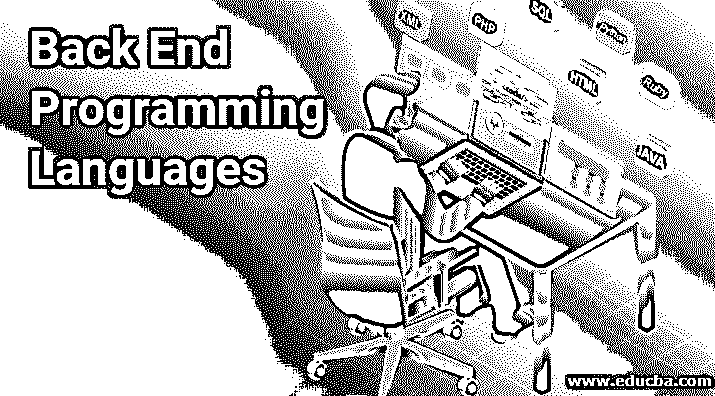
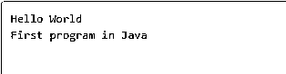
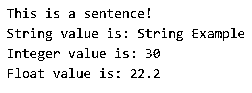
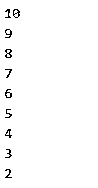

# 后端编程语言

> 原文：<https://www.educba.com/back-end-programming-languages/>




## 后端编程语言介绍

web 开发有两种主要形式:前端和后端开发。前端主要处理 web 服务器与用户交互的 UI 编码部分，后端开发是发生在服务器端的编码。前端对观众来说是可见的，而后端是不可见的。因此，它也对其内部工作方式负责。我们在日常生活中使用的网站通常是 HTML、CSS、 [JavaScript 等](https://www.educba.com/what-is-javascript/)[语言的组合，这些都由我们使用的浏览器](https://www.educba.com/html-vs-css/)保护，它破译代码，以便可以轻松地进行交互。在这个主题中，我们将学习后端编程语言。

后端代码是与前端通信的代码，发送和接收消息，这些消息必须被解释并显示在网页上。除此之外，还有两种网站——静态的和动态的。静态网页的内容变化不大，而动态 web 应用程序的内容会根据数据库中的数据发生变化，并且可以进行定制。因此，每个网站都需要一个管理和存储所有信息的数据库。市场上的许多数据库是 Oracle SQL、MySQL、PostgresSQL 和 SQLServer。

<small>网页开发、编程语言、软件测试&其他</small>

一些用来创建动态网站的后端编程语言有 [C，C++](https://www.educba.com/c-vs-c-plus-plus/) ，Java，Ruby，PHP，.Net 和 Python。动态网站的一些例子有谷歌、WordPress、脸书和 Twitter。

### 后端编程语言列表

在这里，让我们浏览一些后端编程语言，并对如何使用它们有一个基本的概念:

#### 1.Java 语言(一种计算机语言，尤用于创建网站)

Java 是一种通用的、面向对象的并发编程语言，由 Sun Microsystems 于 1995 年开发。它使用 JVM (Java 虚拟机)引擎，该引擎提供了运行 Java 代码及其应用程序的运行时环境。它将 Java 字节码翻译成机器可以理解的语言。JVM 是 JRE (Java 运行时环境)的一部分。

Java 有如下一些关键特性:

*   **面向对象**–这意味着代码被结构化和建模为一组可以被操作、控制和容易扩展的对象。
*   一旦[理解了 OOP](https://www.educba.com/object-oriented-programming-in-java/) (面向对象编程)的概念，Java 语言是非常基础和容易掌握的
*   **平台无关**–Java 不依赖于任何特定的平台，因为在编译期间，它被编译成独立的字节码格式，可以在任何平台上由 JVM 分发和翻译。
*   **健壮的**–Java 拥有良好的内存管理和异常处理，这使得它最大限度地减少了容易出错的代码。
*   **多线程，**–Java 可以同时运行多个任务，这有助于节省大量内存。

**例子**

让我们开始了解如何用 Java 编写一个 basic 程序:

```
public class JavaFirstProgram {
public static void main(String []args) {
System.out.println("Hello World"); // outputs Hello World to console output
System.out.println("First program in Java");
}
}
```

**输出:**




**Java 中的命名约定**

Java 中要遵循的一些基本命名约定是:

*   **包**:包名总是以小写 ASCII 字母格式书写。一些例子如 net、org、com 等。
*   **类和接口:**命名类必须使用名词，首字母要以大写开头。
*   **Method:** 命名方法必须使用动词，第一个字母要小写，其他内部单词必须大写。
*   **变量:**应该简短易懂。变量名不得以任何特殊字符开头，并且应包含多个字母。

##### Java 的优势

*   由于它的堆栈分配系统叫做 LIFO(后进先出)，我们可以更有效地进行数据管理。
*   已经提供了各种 API，可用于数据库连接、联网、解析 XML 文件等。
*   Java 语言将安全性作为其设计的固有部分，是为安全使用而开发的。JVM 在运行字节码之前，通过它的唯一标识符对它进行验证。

##### Java 的缺点

*   链接是动态发生的，这使得程序很慢，因为链接是在运行时调用的。
*   此外，字节码到机器语言的翻译发生在运行时，这也降低了速度。

#### 2.红宝石

Ruby 是由 Yukihiro Matsumoto 在 20 世纪 90 年代中期编写的一种编程语言。它是一种开源的、面向对象的、动态的和反射式的语言。像 Java 一样，它是独立于平台的，因此可以在 Windows、Mac 和所有 Unix 版本上运行。Ruby 遵循一个叫做 POLA(最小惊讶原则)的原则，这意味着该语言减少了有经验用户的困惑。

Ruby 的一些特性是:

*   **面向对象**——这意味着 Ruby 中的一切都以对象的形式表达。每个对象都有一个类，每个类都有一个超类。为对象编写的所有规则都适用于整个 Ruby。
*   灵活性——在 Ruby 中，我们可以轻松地添加、删除和定制部件。现有的部分可以修改，没有这样的限制。
*   动态类型化(Dynamic typing)–Ruby 中的程序并不是这样编译的。变量可以保存所有类型的对象。无论对象类型如何，Ruby 在调用方法时都会查找方法名。
*   Mixin–Ruby 的一个独特之处是它只有一个[单一继承](https://www.educba.com/single-inheritance-in-c-plus-plus/)。它主要在没有很多实例的模块上操作。或者，模块可以与类合并。
*   **哈希**–它是由逗号分隔的键-值对的集合类型之一。
*   **Open**–这意味着 Ruby 类和方法可以以一个问号和感叹号结束。
*   **持久性**–在缺少方法的情况下，Ruby 用它的名字调用相同的方法，用它不能定位它的参数。

**例子**

对于下列程序，打开任意编辑器并将文件保存在。rb 格式。

1.我们可以输出任何带有“puts”关键字的句子，如下所示:

```
puts "Hello example in Ruby"
```

**输出:**


2.简单的数学可以在 Ruby 中执行，如下所示:

```
# Arithmetic operator examples for: +, -, /, *
puts 4 * 5
# Example for finding the exponent of 4 to the power of 2
puts 4**2
# To find modulus and retrieves the remainder of 4
puts 13 % 4
# Example for the order of the given operations
puts 3 + 5 * 8
# Performing operation on integer and floating-point numbers
puts 10 / 3.0
```

**输出:**


3.这里不需要提到变量类型，因为 Ruby 会自动识别它们:

```
distance = 0.4
#We shall use integer and float type both
time = 8.65 / 3600
speed = distance / time
puts "The average speed of the car is #{speed} km/h"
```

**输出:**


##### Ruby 的优势

*   因为语法简单，所以容易理解
*   Ruby 有一个名为 Gems 的库，它为我们开发的 web 应用程序提供了广泛的功能。

##### **红宝石的缺点**

*   选择 Ruby 而不是其他编程语言的人非常少。
*   Ruby 的运行速度很慢。

#### 3.大蟒

Python 是一种开源的、面向对象的交互式编程语言，以 1991 年吉多·范·罗苏姆的电视节目“巨蟒剧团的飞行马戏团”命名。Python 是一种解释型语言，这意味着运行它不需要编译。对于初学者来说，学习这种语言是一种高级和简单的方法，因为它的语法很简单。它也是独立于平台的。

它的一些主要特点是:

*   **动态类型**–变量数据类型不需要显式声明，因为它们是在运行时分配的。
*   **广泛和可集成**–其他语言如 C 和 C++可以与 Python 统一。因此它被称为是可扩展的。
*   **高级**–这使其用户能够专注于问题解决方案，而不是担心系统架构或内存管理。
*   **解释后的**–Python 代码执行是逐行进行的，由于不需要编译，所以很容易调试。
*   **丰富的标准库**–其库中有许多内置模块和函数，减少了编码工作。此外，还有很多库，比如正则表达式、web 浏览器、测试等等。
*   **富有表现力**——Python 更容易理解和阅读；因此，关注解决方案比关注语法更有帮助。
*   **GUI 支持**–可以使用 Python 开发图形用户界面。

**例题**

让我们看看 Python 中的一些基本编码示例。

1.打印命令用于打印输出，如下所示:

```
print("Hello World Example for Python")
```

**输出:**


2.可以按如下方式分配变量:

```
number = 25 # Assigning an integer
decimal = 33.3 # Assigning a floating number
string = "Any Name" # A string
common1 = common2 = 10 # Common Assigning of values
print number, "\n"
print decimal, "\n"
print string, "\n"
print common1, "\n"
print common2, "\n"
```

**输出:**


3.一个简单的 for 循环如下:

```
animals = ["cats", "dogs", "cows", "monkeys"]
for i in animals:
print(i)
if i == "cows":
break
```

**输出:**


##### Python 的优势

*   Python 包含了大量的第三方模块，因此可以与其他平台交互。
*   Python 支持与 C 和其他语言的集成。
*   它有巨大的支持库，包括互联网协议、web 服务工具、字符串操作和操作系统接口，这减少了要编写的冗长代码，因为其中一些很容易获得。
*   由于其集成特性、单元测试能力和增强的控制能力，它提高了生产力，并可用于多协议网络应用。

##### Python 的缺点

*   因为 Python 是解释型的，所以使得执行相对较慢，不能用在需要高速的地方。
*   Python 不是移动开发的首选，因为它缺乏安全性，被认为是不安全的。基于 Python 构建的应用程序之一是 Carbonnelle。
*   与流行的 JDBC 和 ODBC 相比，Python 拥有原始的数据库访问；因此，它不能用于需要处理复杂遗留数据的地方。
*   因为它的动态类型特性，它强加了设计限制，这抛出了许多运行时错误，因此需要更多的测试时间。

#### 4.服务器端编程语言（Professional Hypertext Preprocessor 的缩写）

“ [PHP:超文本预处理器](https://www.educba.com/what-is-php/)”以前代表“个人主页”，是另一种用于服务器端的开源脚本语言。它在像 WordPress 和脸书这样的大公司中非常流行。PHP 语言只能由安装了 PHP 的服务器来解释。其文件以扩展名”结尾。php”。与其他语言相比，PHP 被认为是一种稳定的语言。

PHP 有如下一些独特的特性:

*   它可以与 Oracle、MySQL、Sybase、PostgreSQL、Microsoft SQL Server 和 Informix 等其他数据库集成。
*   它有大量用于使用各种模块和数据表示的库。
*   它也是一种解释语言，并且是独立于平台的
*   在 PHP 中，所有的关键字、方法、类和用户定义的函数都不区分大小写，只有在声明变量时才区分大小写。
*   PHP 生成动态内容。
*   它有一个内置的错误报告系统，因此有助于生成警告/错误通知。
*   它通过提供实时访问日志，为用户创建最新访问的摘要。
*   不需要在 PHP 中声明数据类型，因为它将在执行过程中基于变量值被获取。因此被称为松散类型语言。

**语法**:一个 PHP 脚本的开始标签是“<？php "和结尾标签为"？>“标记。

```
<?php
echo 'Hello World example of PHP';
// PHP code goes here
?>
```

**输出:**


**例题**

1.下面是用 PHP 声明和显示变量的例子

```
<?php
$x = "This is a sentence!"; //Assigning a sentence
echo $x;
echo "<br/>";
$str="String Example";
$x=30;
$y=22.2;
echo "String value is: $str <br/>";
echo "Integer value is: $x <br/>";
echo "Float value is: $y <br/>";
?>
```

**输出:**




2.一个基本的 for 循环示例可以编写如下:

```
<?php
for($i=10;$i>=2;$i--){
echo "$i <br/>";
}
?>
```

**输出:**




##### PHP 的优势

*   它维护成本低，开发少，性能好。
*   因为它是开源的，所以很容易快速安装和使用它。开发人员可以从众多可用的框架中选择一个，从而减少开发时间。
*   代码库非常有组织，干净，易于编码。语法也很容易学习和使用。
*   相对快速地连接到各种数据库，因此主要用于 web 应用程序开发。
*   测试基于 PHP 的应用程序很容易，因为单元测试很容易执行。它还为其他任务提供了自动化。
*   PHP 内置了一些工具，可以保护 web 应用程序免受外部安全威胁，如数据篡改、伪造、黑客攻击等。

##### PHP 的缺点

*   对于大型复杂的 web 应用程序来说，这并不是首选。
*   由于它的弱类型，可能会给开发人员带来不正确的信息。
*   PHP 不支持修改应用程序的核心行为
*   PHP 需要为所有事情编写额外的代码，而 PHP 框架不需要。

### 结论

在这篇博客中，我们希望你对一些最流行和最广泛使用的后端编程语言有了更好的了解。根据上面给出的解释，您可以根据自己的业务需求决定选择哪种语言。

这并不意味着这是仅有的 4 种语言。每天都有许多新的脚本语言出现，它们也可以包含在您的项目中。前端必须始终得到强大的服务器端脚本的支持。因此，后端开发人员应该在选择编程语言之前首先确定目标和集成需求。

### 推荐文章

这是后端编程语言的指南。这里我们讨论一些后端编程语言以及如何使用它们的基本思想。您也可以看看以下文章，了解更多信息–

1.  [R 编程语言](https://www.educba.com/r-programming-language/)
2.  [最佳编程语言](https://www.educba.com/best-programming-languages/)
3.  [什么是编程语言？](https://www.educba.com/what-is-a-programming-language/)
4.  [手机 App 编程语言](https://www.educba.com/mobile-app-programming-language/)


