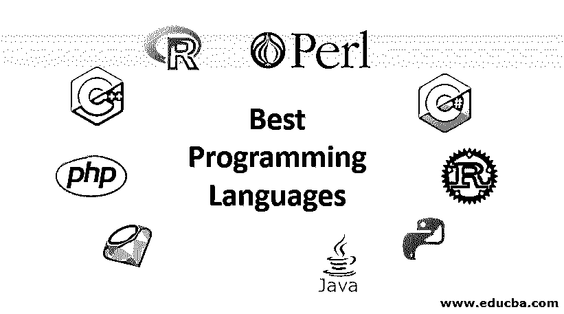
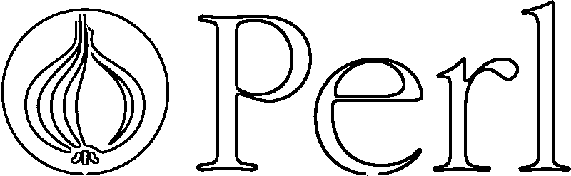
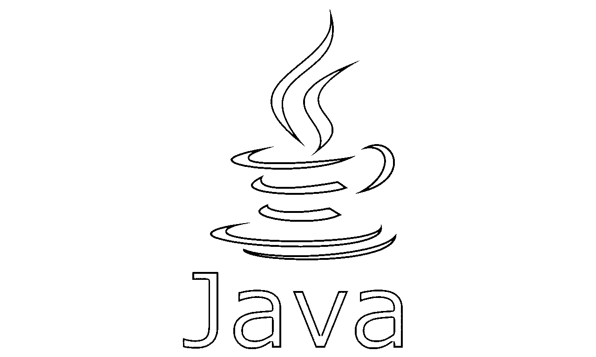
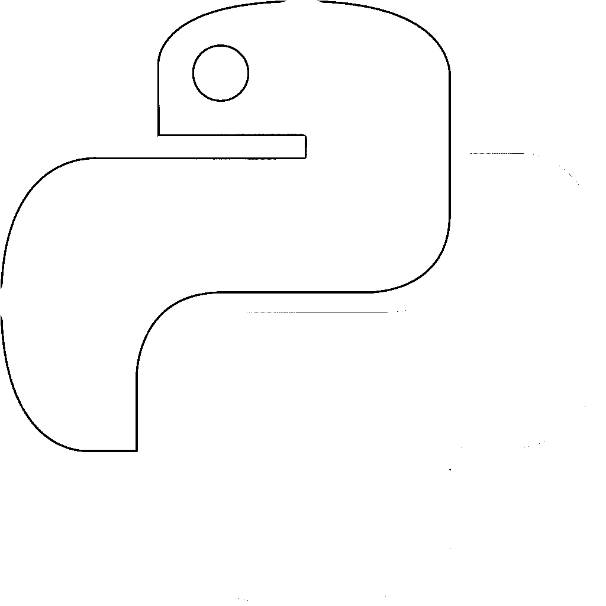
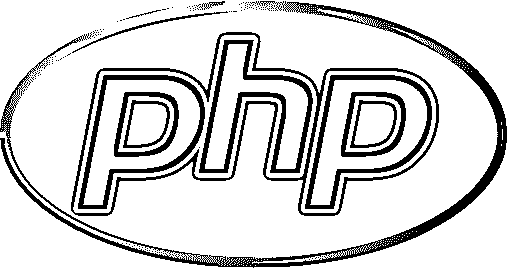
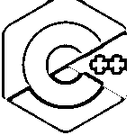
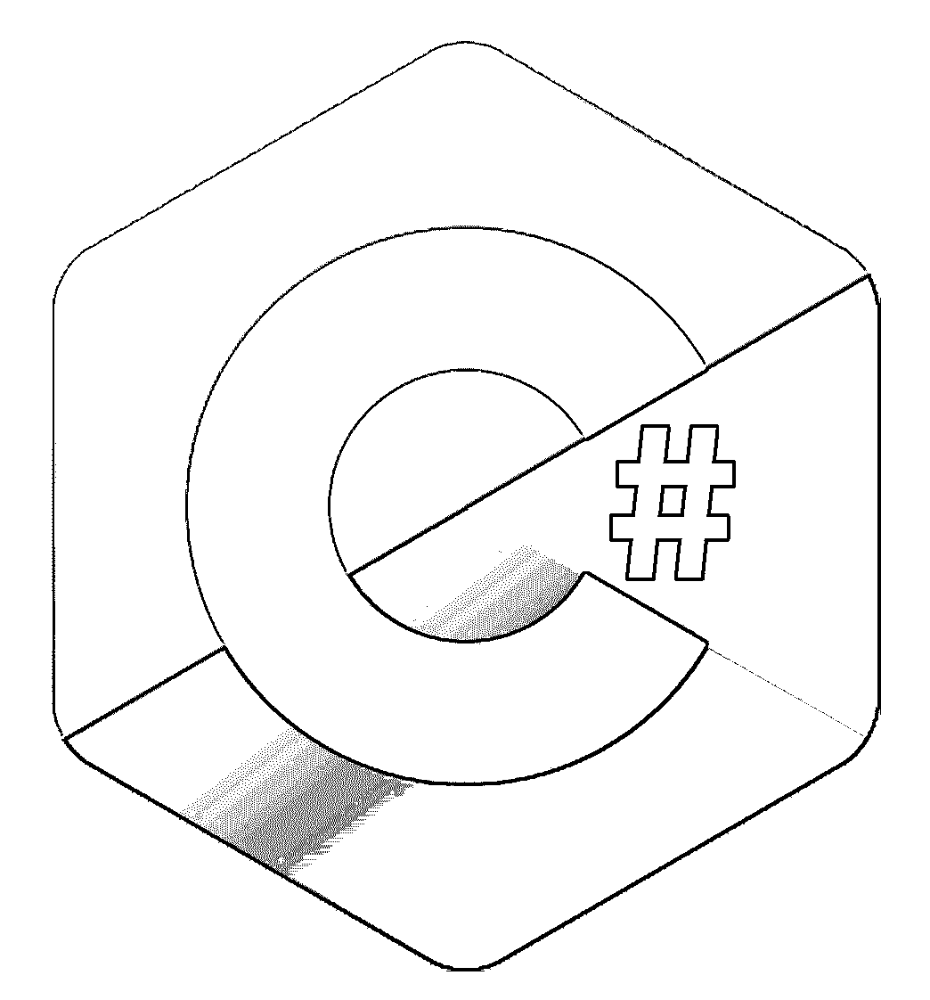
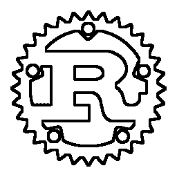
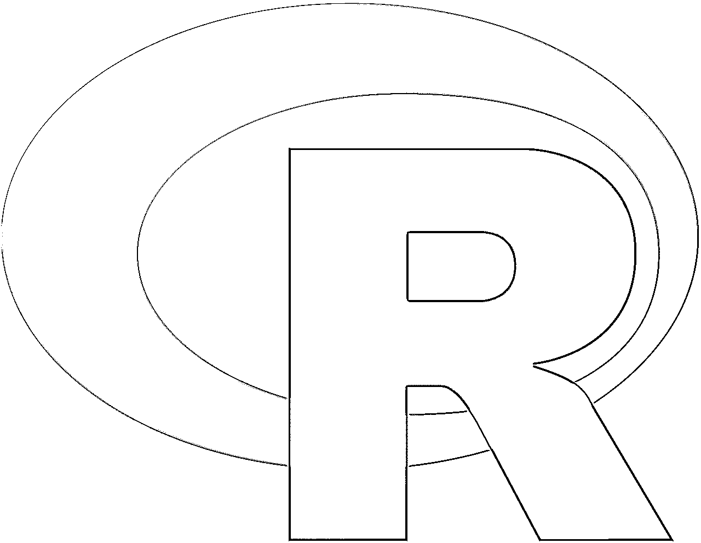

# 最佳编程语言

> 原文：<https://www.educba.com/best-programming-languages/>

## 最佳编程语言介绍

在当今世界，有数百种编程语言。如果你是这个开发领域的新手，那么首先你必须选择语言。好消息是，在你的软件开发之旅中，你将开始发现哪种编程语言最适合你、你的兴趣和你的职业目标。就像国际商务语言是英语，爱情语言是法语一样，不同用途的编程语言最适合。对于许多流行的应用程序，包括网页开发、**、**移动开发等等，我们将谈论最流行的编程语言。

### 十大编程语言

让我们来看看 2019 年的 10 大编程语言。

<small>网页开发、编程语言、软件测试&其他</small>

#### 1.Java Script 语言

我可以肯定地说，不使用 JavaScript，你不可能成为一名软件开发人员。JavaScript 是 6 年左右开发者之间的通用语言，看 2018 年 Stack Overflow 开发者调查。去年，大约 65%的人使用 JavaScript 语言。因为 [JavaScript](https://www.educba.com/what-is-javascript/) 是轻量级的，所以在前端开发中起着重要的作用。就像脸书和 Twitter 到 Gmail 和 YouTube 一样，大多数网站使用 JavaScript 来制作交互式网页，并为客户动态显示信息。其中最常见的框架有 Angular、Vue、React、jQuery 和 Ember。专业的 JavaScript 开发人员可能需要一些这个框架的经验。虽然 JavaScript 主要是浏览器上的前端语言，但是也可以通过 Node.js 系统在服务器端创建可伸缩的网络应用。Linux、Mac OS X、SunOS 和 Windows 都与 Node.js 兼容

#### 2.Java 语言(一种计算机语言，尤用于创建网站)

20 多年来，Java，一种通用语言，一直是计算机编程世界中的一个关键元素。在 java 中，一旦编写了代码，就可以在任何地方运行这些代码。理论上可以在任何设备上编写 Java 软件，编译成低级别的机器码，在任何 [JVM、](https://www.educba.com/what-is-jvm/)即 Java 虚拟机平台上运行。所以 Java 对跨平台的兼容性极强。对于开发 Android 应用程序，java 是最常用的开发语言。使用 Java 设计应用程序和系统的企业也偏爱这种语言，大约 90%的财富 500 强企业都使用这种语言。java 提供了如此多的灵活性，一直是初学者的最爱，有如此多的理由和各种各样的公司应用程序。

#### 3.大蟒

我一直把 python 放在第 3 位，在很多调查中它都位于第 5 位。这可能会让你大吃一惊。但肯定的是，我会让你相信。为什么？Python 是我列表中通用的用户友好编程语言之一。它是做什么的？Python 的语法很清楚。Python 还包括像 NumPy 和 SciPy 这样的包，它们广泛应用于科学、数学和工程领域。如果你在找后端开发职业，比如 Django——开源框架，它是用 python 写的，学起来很简单，但是很通用。Python 还支持多种平台和系统。我们也说 python 是面向对象编程驱动的。以 python 为职业很好，因为在美国，Python 开发人员的平均年薪是 114 383 美元。

#### 4.服务器端编程语言（Professional Hypertext Preprocessor 的缩写）

[PHP](https://www.educba.com/what-is-php/) 也是互联网开发者的强有力选择。这种服务器端语言脚本帮助了 83%的网站，是脸书、维基百科和雅虎等技术巨头的关键后端工具。就在我们说话的时候，PHP 是拥有像 [WordPress 和 Drupal](https://www.educba.com/wordpress-vs-drupal/) 这样的 CMS 的网站数量持续上升的背后，占活跃网站总数的 40%以上。所以如果你认为 Php 就是死亡，那就完全错了。如果你正在寻找一种具有动态能力和强大的数据库操作能力的编程语言，PHP 必须留在你开发下一个开源 web 项目的首选列表中，因为搜索显示 PHP 开发人员的平均年薪约为 104000 美元。

#### 5.红宝石

Ruby 是 web 开发通常使用的另一种脚本语言。特别是，它是 Ruby on Rails 流行的 web 应用程序[框架的基础。现在，大多数开发者都在使用 ruby 开发网页。Homebrew、Discourse、Metasploit Framework 等等都是 Ruby 常用的开源项目。因此，从今天开始，如果你想为大型开源项目做贡献，那么 Ruby 是你应该学习的语言。](https://www.educba.com/ruby-on-rails-language/)

#### 6.Perl 语言

Perl 是一种被广泛接受的编程语言，它为编程等不同的黑暗挫折提供了不同的工具。虽然这种语言有点令人费解，但它确实是一种强大的语言，你可以学习并为这一年重新注入活力。Perl 主要用于网站和 web 应用程序扩展、桌面和系统开发以及测试自动化，可用于测试数据库、互联网应用程序和网络设备等。

#### 7.C++

c 语言是一种老派的编程语言，至今仍然很流行。c 语言最初是在 20 世纪 70 年代实现的，尽管它的学习曲线很陡，但它在计算机编程中发挥了强大的作用。有几十种语言是从 C 派生出来的，或者受到 C 家族中语法、结构和范例的强烈影响。这些包括几种语言，包括 Java、Objective C 和 C #，如本文所述。因为它帮助你更接近计算机的内部工作方式，所以 C 仍然是构建高性能特定应用程序的常用选项。c 是 Linux 操作系统的基准，通常用于嵌入式系统编程。C++编程语言是 C 的最直接继承者之一。C++建立在 C 之上，C++提供了许多类似的好处，但 c++是一种面向对象的语言，这意味着它是创建更高级应用程序的更好选择。对于计算机图形、视频游戏和虚拟现实来说，C++尤其常见。

#### 8.C#

与 C++一样，C #是一种基于 C 的面向对象的通用语言。NET 框架。C #使用的语法[可与源自 C 的其他语言](https://www.educba.com/comparable-in-java-example/)相媲美，如 C++，所以如果你来自另一个 C 语言家族，学习起来非常简单。C #是使用 Unity 游戏引擎构建 2D 和 3D 视频游戏的语言，Unity 游戏引擎是当今市场上三分之一的主流游戏。

#### 9.锈

在列表中的其他语言中，Rust 有点像暴发户，但这并不意味着你不学习有价值的语言。Stack Overflow 2018 开发者调查确定，Rust 中连续第三年有 78%的开发者表示他们希望继续使用 Rust，这是开发人员中最受欢迎的编程语言。像 C 和 C++一样，Rust 主要面向低级系统编程，由 Mozilla 公司开发。Rust 的优势意味着它已经被其他大型科技公司内部使用，如 Dropbox 和 Coursera。

#### 10.英语字母表中第十八个字母

r 编程语言是最常用的数据分析和[机器学习编程语言之一。R 提供了一个出色的框架和集成的库来创建强大的机器学习算法。](https://www.educba.com/machine-learning-programming-languages/) [R 编程语言功能强大](https://www.educba.com/what-is-r-programming-language/)，同时也是一种灵活的语言。虽然 R 被认为是编程语言，但许多程序员称它为既包含语言又包含运行时环境的软件。

### 现在是选择语言的时候了。

当你决定学习哪种语言时，不要卷入浮华的潮流和流行的竞赛是很重要的。2019 年要学习的最成功的语言很可能就是 2017 年和 2018 年要学习的语言，这也将在未来几年持续下去。你在上面学习的编程语言对你的未来有很大的影响。如果你学会了其中的一种或多种语言，你不仅在今年，而且在未来的几年里都会处于良好的状态。当你开始你的编码之旅时，只有你能回答学习哪种语言最好的问题。根据你想要的软件类型和你的兴趣做出选择。

需要注意的是，学习编码有很多方法；这取决于你选择哪一个。像学习任何其他口语一样，学习编程语言将帮助你建立一个知识库，使学习下一门语言变得更简单。

### 结论

本文介绍了在 IT 开发生涯中需要学习和成长的 10 大编程语言。你可以决定你想学习哪种语言，尤其是你想从事哪种编程语言。希望对你有帮助。

### 推荐文章

这是最佳编程语言的指南。这里我们讨论了世界上最好的编程语言及其特性。您也可以看看以下文章——

1.  [C 编程中的模式](https://www.educba.com/patterns-in-c-programming/)
2.  [C 编程生涯](https://www.educba.com/career-in-c-programming/)
3.  [C 编程矩阵乘法](https://www.educba.com/c-programming-matrix-multiplication/)
4.  [Python 中的套接字编程](https://www.educba.com/socket-programming-in-python/)

