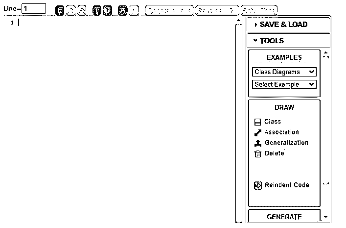
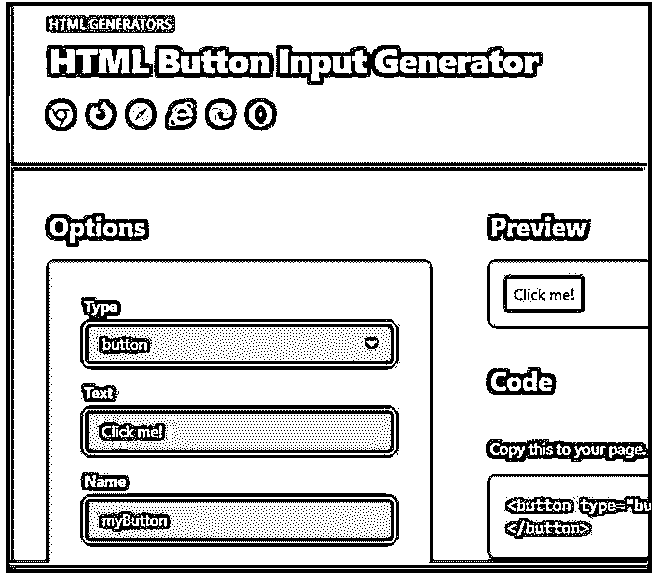

# 代码生成器工具

> 原文：<https://www.educba.com/code-generator-tools/>

## 代码生成器工具简介

以下文章概述了代码生成器工具。代码生成器是一种程序，它理解输入的含义，并对其应用适当的模板以产生预期的结果。XML、纯文本、Python 或 Java 代码都可以用作代码生成的输入。因此，这个输入文件应该由代码生成器处理，以确定要使用哪些模板。模型用于生成代码，代码是基于用户定义的元模型构建的。ReadyAPI 安装不包括代码创建工具。这些工具必须单独下载和安装。

这个代码创建工具对于那些经常编写相同代码的人来说会很方便。代码生成器确保设计和开发过程同步。我们可以使用 UML、BPMN 或我们的领域特定语言(DSL)构建定制的代码生成器，以生成各种语言的文件，包括 Java、C、C++、Ada、PHP、HTML/JavaScript 等等。根据您的技术决策和开发实践，考虑到我们的建模原则，生成器使用基于模板的方法来构建源代码。

<small>网页开发、编程语言、软件测试&其他</small>

### 为什么选择代码生成器工具？

*   这样我们可以节省时间和空间，代码可以重复使用多次，从而提高生产率。
*   代码生成从一个抽象的描述就是如何构造代码。这意味着描述，而不是代码，成为我们真理的来源。
*   它允许你一次瞄准许多平台(可移植性)，或者换句话说，完全相同的抽象描述可以用来构建各种工件。

代码覆盖率可以覆盖程序执行的几个要素:

*   程序代码行的分支(if，else，while)
*   真/假等。)谓词
*   数据界限和随机性中的误差

我们程序的条目将对我们代码的执行和覆盖产生重大影响。有时很难提供详尽的数据作为输入。

### 不同的代码生成器工具

这里有一个例子，说明如何使用工具来生成代码和数据，以使编码人员的生活更加轻松。

#### 1.模板引擎

模板引擎组是最著名的，也是使用最广泛的。模板引擎本质上是一个可以解析简单模板语言的小编译器。模板文件包含模板引擎可以理解的特定符号。它能做的最基本的事情是用精确的工具替换特殊语言，这些工具在运行时提供。很少有像 Jinja2 这样的例子，它是最广泛使用的 python 工具，具有强大的安全特性，并特别支持 HTML 页面。下一个例子是一只高性能的哈巴狗。

*   **Celerio:** Celerio 是一个面向数据的应用程序代码生成器。Great Celerio 采用所有关系数据库都使用的实体关系模型作为输入，而 Celerio 在运行时是不需要的。这些是现成的代码生成模板，它们被分成模板包。
*   Acceleo: Acceleo 是一个开源代码生成器，允许开发者使用模型驱动的方法创建服务。它包括从基于 EMF 的模型生成代码的工具，以及增量生成，它允许用户编写代码、修改代码和重新生成代码，而不会丢失先前的更改。
*   **COG:** 这个简单的生成工具是用 Python 语言编写的。它读取和写入相同的文件，因此源文件和目标文件之间没有区别。

这里给出了示例输出文件:

**代码:**

`enum val {
/* [[[cog
import cog, handyxml
for a in handyxml.xpath('doc.xml', '//property'):
cog.outl("Property%s," % a.name)
]]] */
docname,
docclass,
doc mark,
doc date,
// [[[end]]] };`

#### 2.设计时代码生成器工具

在这里，我们可以使用设计生成一个包含字段列表和适当方法的类，但是我们不能自动实现方法的功能。这取决于我们用来生成的应用程序的语言和类型。

*   **Razor Generator:** 它在运行时不偏好，用 Visual Studio 编写。它们更易于重用和共享。
*   **再生器:**这个生成器工具使用任何类型的文件作为输入，并且在一个文件中使用许多生成器。
*   **Code Smith 生成器:** CodeSmith Tools 包含 Code Smith 生成器。这是一个基于模板驱动的源代码生成器。它自动为任何语言生成代码。CodeSmith Generator 支持 C#、Java、VB、PHP、ASP.NET 和 SQL。CodeSmith 生成器使用架构资源管理器与数据库通信。令人惊讶的是，它给出的代码不容易出错。
*   Umple 是一个使用系统方法将 UML 模式与标准编程语言相结合的工具的例子。它的创建是为了使模型驱动的开发过程变得更容易，这在传统上需要使用专门的复杂工具。这是一种结合了 UML 特性的编程语言。Umple 是一个开源项目，可以应用于现实世界的工业系统。

看起来是这样的:

状态机的示例代码:

**代码:**

`class Window
{
status {
Open { glass -> Closing; }
Closing {
}
Closed { glass-> Opening; }
Opening {
}
partialOpen {glass -> Opening; }
}
}`

#### 3.Web 开发

*   HTML 生成器:它定义了格式良好的 HTML 元素，帮助前端项目创建网页。

**好处:**

*   节省时间，因为他们有一个自动化的解析器来编写代码。
*   在多个应用程序中，曾经创建的代码可以重用。
*   易于测试和质量。

**Note:** The use of modern code generation tools can aid in the development of code for today’s complicated application architecture. These generators offer high-quality output that is dependable and repeatable. Multiple outputs can be generated from a single application feature model using code generation tools, which abstract the code design.

### 结论

因此，代码生成器是进入更复杂方法的一个很好的入门步骤。正因为如此，提供简单的代码创建系统来降低新用户的门槛是非常重要的。有了正确的工具，我们的代码可以很快被翻译成低级语言，并且很少或没有错误。这篇文章展示了一些代码生成器的例子，大多数开发人员使用它来提高生产率。

### 推荐文章

这是代码生成器工具指南。这里我们分别讨论简介和不同的代码生成器工具。您也可以看看以下文章，了解更多信息–

1.  [XML 生成器](https://www.educba.com/xml-generator/)
2.  [性能测试工具](https://www.educba.com/performance-testing-tools/)
3.  [代码演练](https://www.educba.com/code-walkthrough/)
4.  [Python 伪代码](https://www.educba.com/python-pseudocode/)

