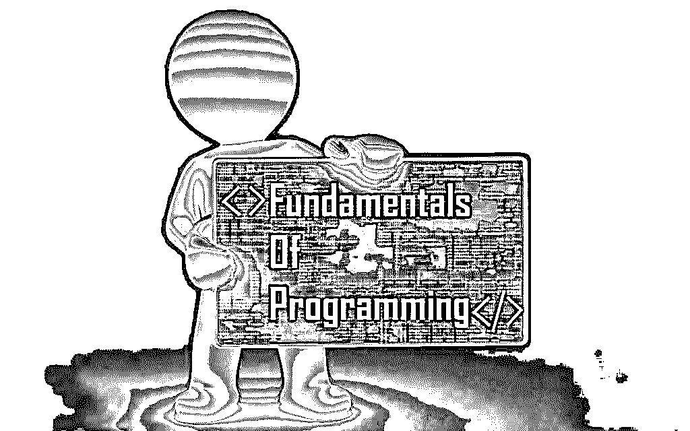

# 编程概念——新程序员的完美指南

> 原文：<https://www.educba.com/concepts-of-programming-languages/>

 

## 编程语言的概念

当我开始学习编程语言概念时，我不知道任何基础知识。刚知道 A+和网络+的基础。但是 C、 [Java](https://www.educba.com/bundle/pwyw-javascript-2016-bundle/ "JavaScript 2016 Bundle") 、 [Python](https://www.educba.com/software-development/courses/python-certification-course/ "Python Comprehensive Bundle Course") 对我来说完全是一个不同的世界。此外，几乎没有人帮助我，因为我是我的朋友中唯一一个来自 IT 背景的人。所以，我最终决定从最常见的编程语言概念开始学习。然后我开始了解 C 和 C++。我开始学习 C 语言，但自从导入模块后，我实际上已经神魂颠倒了，所有这些东西对我来说都是多余的。我学了一个月的 C；然后我觉得 C 有点难，于是开始学习 Bash。

尽管 bash 是一种脚本语言，而不是一种编程语言概念，但它还是很难理解。我被困在克朗工作和东西。终于走投无路，开始学习 Python。但是见鬼，不…这是最糟糕的。当我用 C 写代码的时候，我不得不写每一段代码。但是在 Python 中，有很多神奇的东西可以让我们真正理解正在发生的事情。是的，这个魔术和你想的不一样,“魔术”是 Python 中的官方词汇。Python 中的魔法是指你想做一件事，那件事发生了，但你不知道它是怎么发生的。是的，这也是 python 变得复杂的地方。

<small>网页开发、编程语言、软件测试&其他</small>

当我开始学习所有这些编程语言的概念时，我不能理解的最重要的事情是为什么我要导入任何特定的模块。比如说，用 C 写 hello world 程序的时候，我们一般会写‘include stdio . h’或者‘include conio . h’。所以，我的问题是，为什么只有这个。我甚至看到有些人甚至没有输入 conio 部分。同样，在 python 中，要做复杂的数学，我们导入 cmath，但是为什么开发人员还没有把 math 和 cmath 结合起来，缩短两次导入的整个过程呢？但后来我想，还是做一件事吧。让我们从编程语言概念的基础开始。

我决定跌到谷底，从那里重新开始。到目前为止，我可以用几乎任何概念的编程语言编写任何程序，比如 Java、C、C++、Haskell、Scala、Python、Ruby 等等。这些年来，我已经能够在编程概念方面打下坚实的基础。最主要的原因是因为我清除了所有编程语言概念的基础知识。你可能几乎听不到任何人谈论基本的基础知识，但它们是在编程概念中让你的概念正确的最重要的，这也是我想到写这篇博客的主要原因。因此，让我们从编程语言概念的基础和术语开始。

### 伪代码、数学和对编程语言概念的评论

如果你懂数学，那么大多数事情都会很容易。写程序和解数学题没多大区别。除此之外，在学习 Haskell 这样的[函数式语言时，数学是唯一可以成为学习编程语言概念的先决条件。大多数问题都可以通过简单的数学和伪代码来解决。数学和伪代码是相辅相成的。例如，无论何时你想解决一个特定的问题，只要用简单的代数和几何格式，以定理的形式写下来，并因此证明格式。现在用伪代码格式写下这些代码。当我说伪代码时，我的意思是以这样一种方式编写程序，当你编写一个实际的程序时，你只需要改变一些值和词汇，程序就会工作。例如，要计算从 1 到 20 的所有数字的和，可以用下面的方式编写伪代码](https://www.educba.com/what-is-haskell-programming-language/ "What is Haskell Programming Language?")

| 设 x = 1x = x+1 如果 x = 20，则停止并打印 x 否则继续并再次重复所有内容 |

现在，这段代码有点问题，但我们不是为了这个而来的。如你所见，首先，我把 x 的值赋给 1，然后我加上 1，2，3，直到它达到 20。如果 x 达到 20，程序将停止并打印输出；否则，它将继续重复同样的事情。所以，当你写这种伪代码的时候，把它转换成一个实际的程序变得非常容易。另外，确保你在所有你认为令人困惑的行旁边写下评论。写评论的主要原因是因为第一，它不会被执行，第二，你可以随时指出你做了什么，你在哪里做了什么，为什么做了什么。注释在 5-10 行代码中没有多大用处，但是当您有多个文件，每个文件大约有 40-50 行代码时，只需查看注释就可以很容易地找到错误所在或者为什么某个文件被导入。

### 关于编程语言概念的变量、常数和数据类型

变量是可以用来存储数据、字符串、数字或几乎任何东西的东西。这种数据的集合称为数组。如果我参考前面的例子，你可以看到我在开始的时候把值 1 赋给了 X；因此，它使 X 成为一个变量。这里 1 是一个整数，X 是赋值变量。类似地，我也可以将字符串输入到变量中。一个简单的例子是

| X = 'Hello world'echo $X |

以上是可以在 bash 中执行的编程语言的实际概念，bash 是一个很棒的 Linux 终端。X 被赋予字符串“hello world”的值，echo 打印 X 内部的任何内容。美元符号用于表示我们在这里调用 X 的值。

类似地，常数也是变量，但是常数不能改变，不像变量。在编程语言概念的第一个例子中，我将值 1 赋给 X；然后，我继续按升序增加它。但是对于一个常数来说，X 将永远是 1，这个值不能改变，直到编程语言的概念被退出。数据类型只是不同类型数据的分叉。比如实数，整数，浮点数甚至布尔和字符串。布尔指的是真和假，通常用 1 和 0 来表示。

### 关于程序设计语言概念的函数和过程

在这种编程语言的概念中，函数只是为大量代码赋值。它们通常是这样做的，这样人们就不必重复地写下整个代码，只需用一种简单的语法调用整个代码。函数只是一个封装的任务，包含多行要执行的指令。当编写大块代码时，函数通常是预先开发好的，并存储在文件夹内的单独文件中。以后，无论何时需要这段代码，无论需要多少次，只需调用已定义的文件名或函数名，文件中的整段代码就会被执行。

函数有自己的工作空间，这意味着函数中的所有变量只有在代码执行完成后才可用。一旦完成，变量就会变得不确定(除了垃圾收集的情况，我在这里没有提到，因为这是一个非常大的讨论主题)。此外，函数也可以嵌套在函数中。这意味着一个函数也可以调用任何其他函数，甚至包括它自己。但是不建议使用后一种方法，因为这将导致引导循环，除非以紧急方式执行。

另一方面，过程与函数几乎相似，只是函数总是返回值，而过程只是命令的执行。大多数情况下，当开始学习编程概念时，您可能会看到许多人互换使用函数和过程这两个术语。但如果你开始学习 Haskell 或 Scala 等编程语言的函数概念，情况就不一样了。在编写函数时要记住的一点是，要确保它们没有副作用。

### 程序设计语言概念的条件和循环

条件和循环是我在前面的例子中解释过的。他们以类似这样的方式行事:“如果下雨，我会被淋湿。”。否则我不会。是的，这听起来像一个愚蠢的例子，但这是最简单的了。条件语句相互依赖。通常，它们是相互联系的，并以“if，then，else 和 elif”的形式出现。甚至条件语句也可以嵌套。如今，条件中的条件非常常见，但是如果缩进和注释没有以适当的方式完成，程序将变得极其错误和难以理解。

另一方面，循环用于重复执行代码、函数和过程，直到返回期望的结果。如果你检查我的第一个例子，你会看到我已经陈述了一些事情来再次重复一切。因此，循环非常强大，它们使得编程语言的概念非常紧凑。但是过多使用循环会使程序变慢。它们应该只在必要的时候使用。循环以“for，While，Do-While 循环，[和 for-each 循环](https://www.educba.com/for-each-loop-in-java/)的形式进行。while、do-while 和 for 循环是最常用的循环。while、do-while 和 for 循环的伪代码如下所示

| While 循环:- |
| **当**条件为假时，{执行代码并检查条件是否为真}当条件为真时停止。 |

| do–While 循环:- |
| **Do** **{** 执行代码 **} while (** 检查语句是否为真，否则重复 **Do)** |

| For 循环:- |
| **for** ( a，b，c){执行代码} |
| 在上面的代码中，a 是首先执行一次的条件，b 是循环的条件，c 是循环将要停止时执行的代码。 |

### 程序设计语言概念的控制结构

编程概念中的控制结构只是条件、循环和其他代码集的组合。控制结构是一个代码块，它分析编程语言概念的整个结构，然后决定进一步做什么，如是否停止、重复或调用一个函数或执行另一个代码块。简而言之，更具体地说，编程语言概念中的控制结构只是一个决定程序流程的决策过程。一段完整的代码以下列块类型的方式执行:-

| **前置条件** **控制结构** **控制结构结束** **后置条件** |

### 面向对象编程和函数式编程

现在，这是开发者争论最多的话题之一。面向对象编程只处理“对象”。不要把这句话看得太重。面向对象编程或 OOP 主要处理包含字段、属性、过程和方法的数据。c 是一种面向对象的编程语言概念。Python 不是纯粹基于对象的。但是在一些书中，有些人倾向于说 Python 也可以以面向对象的方式工作。现在类似于面向对象编程，也有一些被称为函数式编程语言的概念。函数式语言更多的是基于数学。我记得的编程语言的一个纯函数概念是 Haskell。另一个是 Scala，但它不是全功能的，但它可以这样工作。另一方面，Haskell 不像编程语言的其他概念那样工作，它基于纯逻辑。Haskell 中的 bug 很少，因为 Haskell 中函数的副作用很少，至少没有，不像 Java、C、Python 或大多数其他语言。

 

总而言之，编程概念非常容易学习。人们只需要将适当的逻辑输入到一个问题中，然后[找到解决问题的多种方法](https://www.educba.com/how-to-solve-problems-with-technology/ "How to Solve Problems with Technology"),而不是仅仅用一种方法来解决问题。一旦你掌握了基础知识，[开发软件或者学习基于它们的框架将会是小菜一碟。](https://www.educba.com/free-web-page-designing-software/ "10 Free Web Designing Software")

### 推荐文章

这里是编程语言概念的指南；我们已经讨论了如果一个人有用多种方法解决问题的正确想法，编程概念是如何容易学习的。您也可以阅读以下文章，了解更多信息——

1.  [C++编程语言基础知识](https://www.educba.com/c-programming-language-basics/)
2.  [R 编程语言](https://www.educba.com/r-programming-language/)
3.  [R 编程职业](https://www.educba.com/careers-in-r-programming/)

