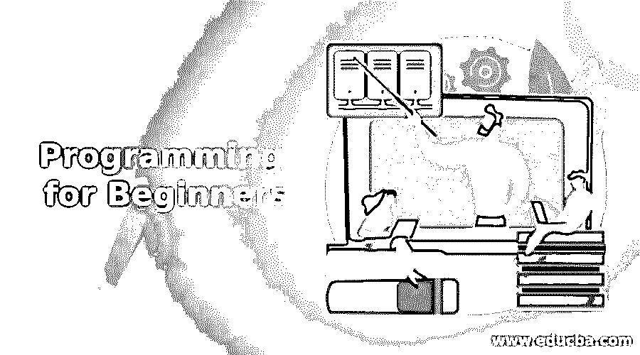

# 面向初学者的编程

> 原文：<https://www.educba.com/programming-for-beginners/>

## 初学者编程入门

对初学者来说，编程实际上是非常聪明和有用的东西。学习如何编码不仅让你有创造力，也为你的[职业](https://www.educba.com/career-success/ "How to Change your Career Successfully")拓展了新的选择范围。即使你已经有了一份好的[工作](https://www.educba.com/new-job-career/ "10 Things to Do When Starting a New Job")，并且不打算继续寻找，仍然为初学者编程在其他方面总是有用的。

无论你是一名程序员、黑客、艺术家还是一名普通的硬件工程师，面向初学者的编程将开拓广泛的思路，如果你学会如何将其自动化到日常生活中，将使你更聪明，生活更轻松。

<small>网页开发、编程语言、软件测试&其他</small>

但是，这里的问题是，对初学者来说编程看起来很复杂。对于一个一生中从未编写过代码的人来说，学习编码可能有点困惑，不知道从哪里开始。别担心，这就是我来这里的目的；让初学者的编程生活更加轻松。那么，我们开始吧，好吗？

### 编程中流行语言的类型

如果你来自编码之外的某个随机背景，他们可能从你的朋友或其他地方听说过关于编程语言的知识，比如 C、C++或 Java 等等。但是你不太可能听说过 Python、Ruby、Haskell 或 Perl。欢迎来到编程世界。

如果你是一个真正的程序员，你可能肯定听说过；但是如果你只是听说过编码，想要入门，那么很少有人知道它们。那么，让我给你一个语言列表，这些语言是编程软件世界中流行的语言:

1.  英语字母表中第三个字母
2.  C++
3.  C#
4.  Java 语言(一种计算机语言，尤用于创建网站)
5.  Java Script 语言
6.  大蟒
7.  红宝石
8.  Perl 语言
9.  斯卡拉
10.  服务器端编程语言（Professional Hypertext Preprocessor 的缩写）

除了以上这些，你随时可以通过学习 HTML，CSS 或者 XML 开始学习。但这些都不是编程语言；然而，为了让你更好地理解编程语言，这些标记语言有助于你掌握其中的窍门。

C、C++、C#和 Java 都是低级计算机语言。当我说低级时，我的意思是它们是最接近机器代码的编程语言。显然不如汇编语言(我绝不会推荐汇编语言作为入门语言)。我将在下一篇博客中解释高级和低级计算语言的区别。JavaScript、Perl、Ruby 和 Python 都是高级语言。

与低级语言相比，它们非常容易学习。PHP 也是一种类似于 Perl、Ruby 或 Python 的脚本语言，但它是一种服务器端脚本语言，多用于 web 开发。确保你不会把 Java 和 JavaScript 混为一谈。他们完全相反。

那么你可能会问，“为什么是相似的名字？”也许你应该把这个问题放一放，直到你读完我的下一篇博客。JavaScript 是一种高级的、动态的、无类型的、解释的编程语言。现在唯一被冷落的就是 [Scala](https://www.educba.com/scala-the-functional-approach/ "Scala: The Functional Approach") 。Scala 使用 JVM 进行编译，是一种函数式语言。如果你有 Java 方面的经验，建议你从这个开始。否则，在你学会 Java 之前不要扩展。

### 哦，这么多种语言！

有这么多编程语言要学。哪个可以最好入门？但是没有所谓的具体。

其他每个程序员都有自己的风格和方法，没有所谓的“最好的编程语言”。但是如果你仍然想要我的建议，那么我会建议你选择两种方式中的任何一种:

#### 1.艰难的道路

如果你想艰难地学习面向初学者的编程，我建议你开始学习 C，然后是 C++和 MySQL。MySQL 是一种面向数据库的编程语言。C 和 C++很容易上手，但是很难坚持下去。如果你从 C 语言开始，你也许可以学到足够的东西来编写简单的程序，但是要掌握数组、指针和其他重要特性的优点是很困难的。

C++实际上比 basic C 容易得多。到目前为止，C++已经发生了很大的变化。自学 C 语言可能会很麻烦，但是一旦你掌握了 C 语言的思想，那么学习其他语言将是小菜一碟，相信我。

然而，尽量不要一下子学会整个语言。制作像“hello world”这样的小测试程序，把基础的东西弄下来，然后探索更复杂的想法，比如结构、指针和动态内存。c 语言纯粹是面向对象的编程语言，所以几乎没有什么地方会出错。

c 是一种不错的语言，但是它非常依赖指针，指针本质上是对内存地址的引用。指针很复杂，对于初学者来说，在编程中很容易出错，导致很难跟踪崩溃和错误。这些种类的错误是学习编程软件和操作系统时大多数安全漏洞的来源。

如果你仍然停留在学习 C 语言上，那么确保你用一个[可视化调试器](https://www.educba.com/visual-basic-editor-vbe-debug-toggle/ "Visual Basic Editor (VBE) - Debug Toggle")(通常称为集成开发环境的 IDE)获得了良好的初学者编程环境。我用过最好的是 Windows 机器的 Visual C++(也适用于 C)。Mac 上的 XCode 也不错。

一个可视化的调试器将允许你一行一行的调试你的程序，这样你就可以看到程序在做什么，并且更容易的发现逻辑上的错误。它将允许您验证您对初学者编程正在做什么的假设。

#### 2.简单的方法

如果你还在读这篇博客，那么这意味着你可能已经谷歌了一下，可能又回来了，因为你觉得 C 语言是一种精神压力。欢迎回来！所以，作为开始，我想让你学习的最好也是最简单的编程语言是 Python。

如果你问我，我自己也开始学习 c 语言，但是问题是虽然我读了很多文章，但是没有人能正确地指导我。我现在是一名渗透安全专家。所以，当我几年前开始为初学者学习编程时，我对 python 一无所知。

如果并且只有在那个时候有人告诉我 python，我才会在 c 语言上投入这么多时间，但对我来说，我认为实际发生的事情是好的。因为我以后无论如何都要学习 C 语言。但并非所有人都是如此。是吗？

Python 在 c 语言面前是小菜一碟，因为 Python 是一种高级语言，非常容易阅读和编码。以下是用 python 编写的 Hello world 示例:

`*>>>print(“Hello world”)*`

下面是 C、C++和 Java 的例子:

**Hello World in C:**

`*#include <stdio.h>*
*int main()*
*{*
*  printf("Hello world\n");*
*  return 0;*
*}*`

**c++中的 Hello World:**

`*#include <iostream>*
*int main()*
*{*
*  std::cout << "Hello World!" << std::endl;*
*  return 0;*
*}*`

**你好，Java 世界:**

`*public class HelloWorld {*
*   public static void main(String[] args) {*
*      System.out.println("Hello, World");*
*   }*
*}*`

现在，我不认为我需要进一步简化它，它在 Python 中是如此简单。以防你是初学者，我在这里写的是在屏幕上打印一个简单的“Hello World”提示。

Ruby 也是如此。事实上，学习 Ruby 编程比 Python 更简单。下面是 Hello World 的 Ruby 代码:

`*>>>puts "Hello World!";*`

除了这些，Python 学习起来也是极其有趣的。编译它也非常容易。你可以简单地下载 py2exe 并开始转换你的 xyz.py 文件到 abc.exe。如果你认为这非常容易，我可以保证一旦你开始用 python 编程，就会变得更加容易。

### Java 在哪里？

除了以上所有这些，Java 是最实用的学习语言之一。Java 是第二流行的编程语言，它是斯坦福著名的(免费的)CS 编程入门课程中教授的语言。Java 实施了现代语言中使用的可靠的面向对象原则(OOP ),包括 C++、Perl、Python 和 PHP。一旦你学会了 Java，你就可以很容易地学习其他 OOP 语言。

Java 具有使用历史悠久的优势。有许多“样板”例子；它已经被教授了几十年，并且被广泛用于许多目的(包括 Android 应用程序开发)，所以它是一种非常实用的学习语言。您不会像使用 C 语言那样获得机器级别的控制，但您将能够访问/操作最重要的计算机部分，如任何相当复杂和现代的程序的文件系统、图形和声音——这些程序可以在任何操作系统上运行。

如果你特别想学习编码来建立你的职业生涯，下面是一些例子，告诉你应该为哪些角色开始学习哪种语言:

**服务器端开发—**Python、Ruby、PHP、Java 或. Net

**客户端编程—**HTML、CSS、JavaScript

**移动编程—**Objective-C 或 Java(适用于 Android)和 HTML/CSS/XML

**3D/动画-**C/c++， [OpenGL](https://www.educba.com/opengl-in-android/)

**高性能计算—**C/c++，Java

**网络安全–**Python/Ruby/汇编语言

如果你对初学者编程感兴趣，只是因为你想开发应用程序或其他东西，那么你可能应该从你认为容易的东西开始，而不是去听别人说什么，原因是每个人都会试图将他们的偏好应用到你身上。但只有你自己才能知道什么对你最好。

努夫说，我认为现在是你开始学习的时候了，而不仅仅是阅读文章，因为“思考浪费的时间；更多的是浪费时间”😀

第一张图片来源:pixabay.com

### 推荐文章

这是初学者的编程指南。在这里，我们通过给出 java、c++和 c 等语言的 hello world 示例，讨论了不同的编程语言。您也可以阅读以下文章，了解更多信息——

1.  [Java Web 服务和面试问题](https://www.educba.com/java-web-services-interview-questions-and-answers/)
2.  [R 编程职业](https://www.educba.com/careers-in-r-programming/)
3.  [编程与脚本的区别](https://www.educba.com/programming-vs-scripting/)

