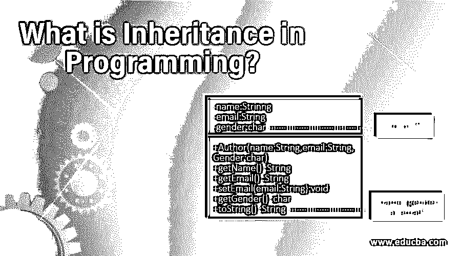
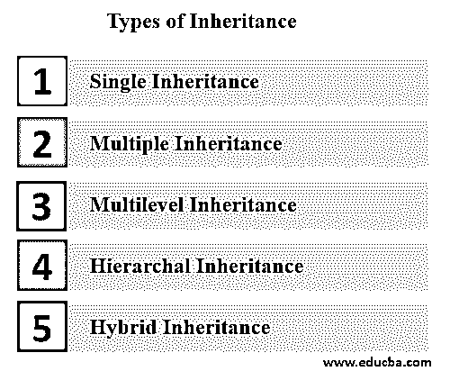

# 什么是编程中的继承？

> 原文：<https://www.educba.com/what-is-inheritance-in-programming/>

## 什么是编程中的继承？

继承是一个由单词**“继承”**组成的单词，意思是**“派生”**。因此，继承被定义为一个类从其他类派生属性和特征的趋势。它提供了额外的功能来从基类中提取特性，并将其隐含到其他派生类中。

在计算机编程中，继承是面向对象编程范例中的一个重要概念。它提供了一种在对象组合中建立关系和构建类层次的机制。继承意味着使用预先编写或先前创建的代码。需要记住的一点是，我们只是在使用代码，而不是更新或更改它。在一个类中定义的函数和方法可以用于操作该类的其他数据成员。

<small>网页开发、编程语言、软件测试&其他</small>

### 理解继承

为了理解继承，我们需要关注两种类型的类:子类和超类**。**

子类*、*也称派生类，是继承属性的类，超类也称基类；它是一个继承属性的类。在某些情况下，子类被称为子类，超类被称为父类。因此，到目前为止，很明显子类(即子类)继承了超类(即父类)的属性。

### 继承是如何让工作变得如此简单的？

在面向对象编程中，每当创建一个类时，都会指定数据成员和数据函数。数据成员是在同一个类中声明的变量。数据函数是在类中定义的方法或函数。这些函数通常用于操作数据成员。根据使用范围，这些数据函数和数据成员可以是公共的，也可以是私有的。

因此，[在继承](https://www.educba.com/inheritance-in-java/)的帮助下，我们不需要递归地创建和定义数据成员和函数。我们在一个类中编码一次，它们可以继承后续子类中数据成员和函数的所有属性。这个特性也有助于有效的动态编程。

#### 继承的类型:

1.  **单一继承:**一个派生类继承一个基类。
2.  **多重继承:**一个派生类继承多个基类。
3.  **多级继承:**一个派生类继承其他派生类。
4.  **层次继承:**多个派生类从一个基类继承。
5.  **混合遗传:**一种以上遗传类型的组合。

### 你能用遗产做什么？

如果一个团队正在开发一个大的程序或者一段代码，那么继承就像是一种祝福。我们不需要重复编写代码；如果类中存在层次结构或者类之间存在依赖关系，我们可以使用从基类到子类的继承代码。这将防止重复编写相同的代码。继承在动态编程中也起着重要的作用。一个代码可以用于许多领域，因此可以降低复杂性。如果有人在一个子类中做了更改，它不会影响超类或其他类。

### 继承的优势

下面列出了继承的一些优点:

1.  频繁使用一次编写的代码，即代码可重用性。
2.  一个超类可以用于一个层次结构中的多个子类。
3.  所有基类中不需要做任何更改；仅在父类中进行更改。
4.  [继承用于](https://www.educba.com/inheritance-in-python/)生成更多的显性对象。
5.  继承避免了重复和数据冗余。
6.  继承用于避免空间复杂度和时间复杂度。

### 为什么继承在编程中很重要？

由于代码的可重用性，继承在编程中非常重要。我们可以从程序中避免重复数据和冗余。我们举个例子:如果你和父母住在一起，那么父亲就是一个基类，你(小时候)就是派生类。所以我们可以从父类继承很多东西，比如姓氏、地址行、城市和州。此外，如果我们想更新地址或任何东西，我们将只改变基类的地址，所有的派生类将继承该基类的属性。

### 为什么要用继承？

首先，我们使用继承来使用代码的特定[部分，并根据我们的需要修改某些特性，这样做没有任何复杂性。继承为我们的代码提供了灵活性，可以从基类重用到所需的派生类。子类可以重写基类的属性，而无需在同一个类中反复重写代码。](https://www.educba.com/how-to-learn-to-code/)

### 为什么我们需要继承？

1.  要重用代码，只要有必要，就编写代码并进一步应用它。
2.  以避免程序中的重复和数据冗余。
3.  以降低空间和时间复杂度。
4.  分层编程范例更容易。
5.  相同名称的变量可以在代码范围内多次使用。
6.  创建主要的数据对象和函数。

### 谁是学习继承技术的合适受众？

1.  [计算机专业本科生](https://www.educba.com/career-in-computer-science/)。
2.  编程学生。
3.  中级程序员。
4.  信息技术毕业生。
5.  电子专业毕业生。
6.  从事或愿意从事分层编程的技术人员。

### 这项技术将如何帮助你的职业发展？

根据讨论，继承技术显然是面向对象编程的一个有影响力的部分，所以任何希望做更好的面向对象编程的人都应该具有继承技术方面的专业知识。此外，如果一个人对继承技术有丰富的知识，他可以在公司的代码开发部门提供稳定性，并且可以在团队中获得赏识或一个好职位。这也有助于一个组织获得更大的收入，也可以表现良好。

### 结论:编程中的继承

继承是面向对象编程的一个优点。用户可以在编写完代码后重用它，并且可以节省代码的空间和内存。开发人员的时间努力也可以通过继承减少[，并且它也为团队中工作的其他开发人员提供了对代码的更好理解。在继承的帮助下，超类的属性可以在子类中继承，并且可以使编码变得毫不费力。](https://www.educba.com/inheritance-in-php/)

### 推荐文章

这是关于什么是编程中的继承的指南？这里我们讨论了继承的定义、理解、类型、优点、继承在编程中的重要性以及继承的使用。您也可以浏览我们推荐的其他文章，了解更多信息——

1.  [c++中的单一继承](https://www.educba.com/single-inheritance-in-c-plus-plus/)
2.  [Python 中的单一继承](https://www.educba.com/single-inheritance-in-python/)
3.  [c++中的混合继承](https://www.educba.com/hybrid-inheritance-in-c-plus-plus/)
4.  [Java 中的混合继承](https://www.educba.com/hybrid-inheritance-in-java/)

