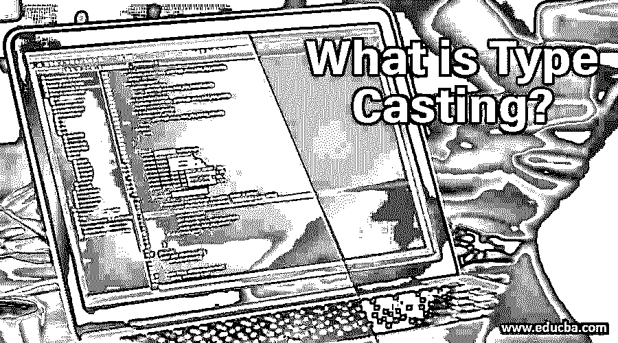

# 什么是类型转换？

> 原文：<https://www.educba.com/what-is-type-casting/>




## 类型转换概述

类型转换是将对象从一种数据类型更改为另一种数据类型的一种方式。它用于计算机编程，以确保函数正确处理变量。类型转换的一个例子是将整数转换成字符串。如果一个数字存储为字符串，另一个数字存储为整数，那么这可以用来比较两个数字。如果兼容，Java 必须自动执行称为自动类型转换的转换，如果不兼容，则必须进行专门的强制转换。

### 什么是类型转换？

类型转换可以定义为将任何运算结果的数据类型转换为另一种数据类型的过程。这是 C 语言保护不必要的内存消耗的关键选项之一。这是使变量以消耗有限内存的方式存储任何操作的值的方法。它的引入实际上是为了提高内存管理的效率。类型转换使得转换值的数据类型变得非常简单，但是我们必须确保我们要转换的值应该是正确的。例如，将字符转换成整数可能听起来很奇怪，但是将浮点值转换成整数是有意义的。

<small>网页开发、编程语言、软件测试&其他</small>

可以使用适当的语法引入类型转换，这种语法有特定的定义方式。有时[类型转换可能会自动发生](https://www.educba.com/type-conversion-in-java/)，而有时，我们需要这样做。我们将在下一节讨论转换模式。当[使用类型转换](https://www.educba.com/type-casting-in-python/)时，我们必须做几件事，比如正确的语法，需要转换的正确数据类型，等等。它有助于开发运行流畅的程序，因为它只消耗很少的内存，并且有助于程序的快速执行。

### 铅字铸造的类型

根据任何数据类型的值的转换方式，类型转换分为两种类型，如下所述:

#### 1.隐式转换

在这种类型转换模式中，一种数据类型的值可以自己转换成另一种数据类型，我们不需要提及任何东西。这一切都自行或自动发生。当必须存储转换值的变量的大小比必须转换的值大时，通常会发生这种情况。例如，当需要将整数值转换为浮点值时，会发生这种情况，因为整数的大小是 2 个字节，而浮点值可以容纳 4 个字节。

**举例:**

浮点 a = 7/6

#### 2.显式转换

在这种类型转换中，我们应该显式定义要转换任何值的数据类型。与隐式转换不同，必须在要转换的操作或值之前提到数据类型。当我们需要存储任何数据类型的值时，如果这个数据类型的值比将要存储它的变量占用更多的内存，就会用到它。例如，浮点变量占用 4 个字节，而整数占用 2 个字节的内存。为了将浮点值存储在整数变量中，我们需要在浮点值之前提到它，我们希望将它转换为整数。结果，浮点值小数点后的值将消失，小数点之前的值将存储在整数变量中。

**举例:**

Int a = (int) 7/6

### 通过示例了解类型转换

这里我们将通过一个简单的例子来理解类型转换在实际程序中是如何工作的。所以让我们开始吧！

**代码:**

```
#include<stdio.h>
#include<conio.h>
void main()
{
float i=3.54;
int p;
p = (int) i;
printf("Explicit value is %d",p);
getch();
}
```

**输出:**

Three

在上面的例子中，我们采用了一个存储值 3.54 的浮点变量。作为一个浮点变量，它消耗 4 个字节的内存。我们的目标是通过使用显式类型转换将浮点值存储到整数变量中。在上面的例子中，第 7 行将类型转换的概念引入到程序中。就在 I 变量之前编写的 int 关键字将 I 的浮点值转换为整数值，该整数值最终将丢失小数点后的所有值，并且仅保留小数点前的值。上述代码的结果将是 3，一个整数值，从浮点数据类型转换而来。

### 结论

类型转换可以被认为是一种功能，它允许我们转换任何值或变量的数据类型，以便它可以以消耗更少内存的方式存储。它在 C 语言中是可用的[，帮助我们使程序轻量级，这直接导致程序的快速执行。使用该功能可以完成多种数据类型转换。它可以完美地用在任何类型的程序中，不管它的大小和复杂性如何。](https://www.educba.com/career-in-c-programming/)

以保持内存管理为主要目标开发的程序必须使用这个选项，因为它是 C 语言中确保运行时类型转换的唯一特性。除了让程序执行得快一点，它还让程序看起来复杂，并帮助其他程序轻松理解正在发生的事情。使用类型转换不需要任何专业知识，只需要确保在转换时必须考虑数据类型。

### 推荐文章

这是一个什么是铸造类型的指南。这里我们讨论类型、理解和类型转换的例子以及代码。你也可以看看下面的文章来了解更多-

1.  [Java 中的泛型是什么？](https://www.educba.com/what-is-generics-in-java/)
2.  [Java 中的 For 循环](https://www.educba.com/for-loop-in-java/)
3.  [Java 中的阶乘](https://www.educba.com/factorial-in-java/)
4.  [Python 中的列表操作](https://www.educba.com/list-operations-in-python/)


