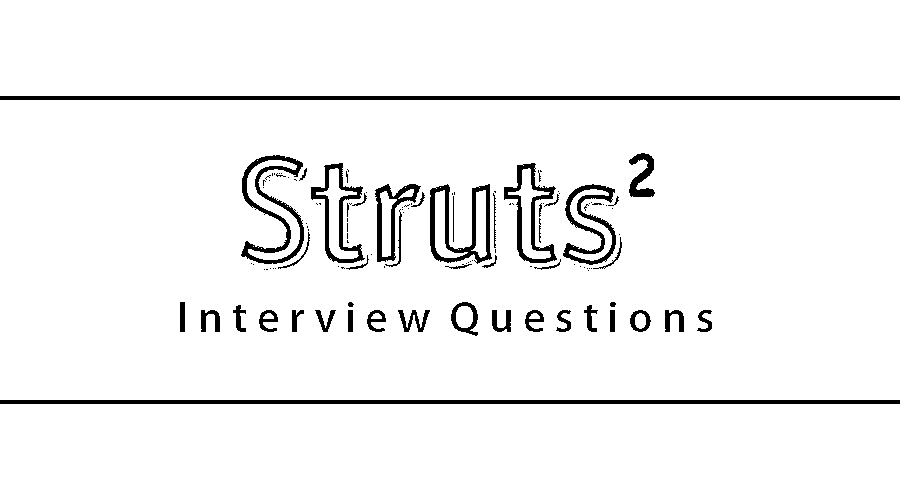

# Struts 2 面试问题

> 原文：<https://www.educba.com/struts-2-interview-questions/>

## Struts 2 面试问答介绍

Struts 2 是一个用于开发 Java 企业应用程序的 web 应用程序框架。Apache 软件基金会开发的。它最初发布于 2006 年。它是用 Java 写的。它支持跨平台。它基于 [MVC 架构](https://www.educba.com/mvc-interview-questions/)，被称为开发应用的软件设计模式。Struts 2 的特点是简化的可测试性、Ajax 支持、线程安全、模板支持等。

如果要找 Struts 2 相关的工作，需要准备 2022 年 Struts 2 面试问题。的确，每个面试都因不同的职位而不同。在这里，我们准备了重要的 Struts 2 面试问答，帮助你在面试中获得成功。

<small>网页开发、编程语言、软件测试&其他</small>

在这篇 2022 Struts 2 面试问题的文章中，我们将呈现 10 个最重要和最常用的 Struts 2 面试问题。这些问题将帮助学生围绕 Struts 2 建立他们的概念，并帮助他们解决面试问题。这些问题分为以下两部分:

### 第 1 部分–Struts 2 面试问题(基础)

第一部分涵盖了基本的 Struts 2 面试问题和答案。

#### Q1。基于 Struts 2 的应用程序的核心组件是什么？

**答:**
struts 2 中的 MVC 模式有动作、拦截器、值栈/ OGNL、结果/结果类型、视图技术等组件。

#### Q2。支柱 1 和支柱 2 的区别？

**答案:**
这是面试中问的基本 Strut 2 面试问题。在 Strut 1 中，action 类不是 POJO，需要继承抽象类。前端控制器是一个动作 servlet。它只有组件视图的 [JSP。在 strut 1 中，配置文件可以放在 WEB-INF 目录中。它在处理请求时使用请求处理器类的概念。在 Strut 1 中，动作和模型是分开的。](https://www.educba.com/jsp-interview-questions/)

在 Strut 2 中，action 类是 POJO，不需要继承任何类，也不需要实现任何接口。它有 JSP，自由市场等。，用于视图组件。在 strut 2 中，函数控制器是 Struts 准备和执行过滤器。在这种情况下，配置文件必须命名为 struts.xml，并放在 classes 目录中。它在处理请求时使用拦截器的概念。在 strut 2 中，动作和模型被组合在动作类中。

#### Q3。strut 2 中请求的生命周期是什么？

**答案:**
strutt 中一个请求的生命周期是:

*   用户向服务器发送请求，请求一些页面。
*   过滤器调度程序查看请求，然后确定适当的操作。
*   应用配置的拦截器功能，例如验证和文件上传等。
*   执行所选动作以执行所请求的操作。
*   之后，再次配置拦截器，如果需要的话，这些拦截器可以用来做任何后处理。
*   最后，视图准备好结果，并将结果返回给用户。

让我们转到下一个 Struts 2 面试问题。

#### Q4。拦截器和过滤器有什么不同？

**回答:**
拦截器基于 struts 2。它为所有符合前端控制器[条件的请求执行，前端控制器是 servlet 过滤器](https://www.educba.com/servlet-filter/)，并且可以被配置为执行额外的拦截器来执行特定的动作。拦截器中的方法可以通过 exclude 方法或 include 方法来配置是否执行。

过滤器基于 servlet 规范。根据请求和不可配置的方法调用对模式匹配执行。

#### Q5。struts 2 如何成为比 struts 1 更好的框架？

**回答:**
拦截器有助于实现 struts 2 更好的框架，如下所示:

*   它可以在桌面应用程序中的任何地方使用，只需对现有的 web 应用程序做很小的更改或不做任何更改。对于 struts，动作现在是 POJO，更容易进行单元测试，interceptor 帮助实现了这一点。
*   大多数琐碎的工作变得更容易完成。自动表单填充就是一个例子。
*   UI 更简单，并以主题和众所周知的 DOJO 框架的形式进行了验证。
*   有智能配置和默认设置。
*   它可以用于下一代的 RESTFUL 服务。
*   它是高度可插拔的，集成了 spring、hibernates 等其他技术。，安心。

### 第 2 部分–Struts 2 面试问题(高级)

现在让我们来看看高级 Struts 2 面试问题。

#### Q6。strut 2 提供的内置主题是什么？

**回答:**
有 3 个不同的内置主题:

1.  简单主题:这是一个内容很少的极简主题。这意味着文本字段标签呈现没有标签、验证、错误报告或任何其他格式或功能的 [HTML 标签。](https://www.educba.com/uses-of-html/)
2.  XHTML 主题:它是 struts 2 使用的默认主题，提供了简单主题提供的所有基本功能。它增加了其他几个特性，比如标准的两列表格布局，每个 HTML 的标签，验证和错误报告等等。
3.  CSS_xhtml 主题:这是一个主题，它提供了简单主题提供的所有基本功能，并添加了其他几个功能，如基于 Css 的标准两列布局，使用 HTML struts 标签的 div 标签，每个 HTML struts 标签的标签，并根据 Css 样式表放置。

#### Q7。Struts 2 验证框架是什么，它正在工作吗？

**答:**
在 Strut 2 中，一个验证框架帮助应用运行规则，在动作方法执行之前进行验证。action 类应该扩展 action support 类，以获得方法执行的验证。在 Struts 2 中，验证框架的工作方式类似于；当用户按下 submit 按钮时，它将自动调用验证方法来执行，如果任何条件语句为真，那么 strut 2 将调用它的 add-field-error 方法。如果发现任何错误，那么支柱 2 将不会继续执行方法。甚至该框架也将作为调用函数的结果返回输入。当验证失败并且 strut2 返回输入时，它将显示视图文件。它使用了 strut 2 标记，所以错误消息将被自动添加，这些错误消息是我们在 addField error 方法中添加的，它有两个参数，其中第一个是应用错误的表单字段名称，第二个是显示在表单字段上方的错误消息。

让我们转到下一个 Struts 2 面试问题。

#### Q8。解释 struts 2 中基于 XML 的验证？

**答:**
在 Struts 2 中，基于 XML 的验证提供了更多的验证选项，如电子邮件验证、整数范围验证、表单验证字段、表达式验证、正则表达式验证、必需验证、字符串长度验证和必需字符串验证等。在 Struts 2 中，XML 文件需要命名为“action class”-validation . XML

#### Q9。解释国际化？

**答案:**
这是 Struts 2 面试中问得最多的面试问题。它是计划和实现产品和服务的过程，以便它们可以很容易地适应特定的当地语言和文化，这被称为本地化，而实现[本地化的过程被称为国际化](https://www.educba.com/localization-vs-internationalization/)。

#### Q10。什么是价值堆栈？

**答:**
值栈是由若干个对象组成的集合，这些对象按照临时对象、模型对象、动作对象和命名对象的顺序来保存对象。

### 推荐文章

这是 Struts 2 面试问题和答案列表的指南，以便候选人可以轻松地解决这些 Struts 2 面试问题。在本帖中，我们研究了面试中经常被问到的 10 个 Struts 2 面试问题。您也可以阅读以下文章，了解更多信息——

1.  [Java 春季面试试题](https://www.educba.com/java-spring-interview-questions/)
2.  [棱角分明的 4 道面试题](https://www.educba.com/angular-4-interview-questions/)
3.  [Appium 面试问题](https://www.educba.com/appium-interview-questions/)
4.  [CodeIgniter 面试问题](https://www.educba.com/codeigniter-interview-questions/)

