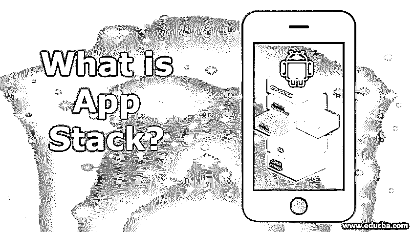

# 什么是 App Stack？

> 原文：<https://www.educba.com/what-is-app-stack/>

## 什么是 App Stack？

栈是一个软件社区，它们一起工作来实现一个共同的目标。典型的代码堆栈包含密切相关的软件，并帮助完成特定的任务。不应混淆程序堆栈和设备堆栈。一堆应用程序提供了帮助管理任务的工作流增强程序，而软件栈提供了基础设施而不是标准应用程序。另一方面，应用层提供了在软件堆栈中工作的框架，以提供与应用程序的最小交互。

### 应用程序堆栈的属性

*   所有用户喜欢的应用程序都可以在一个应用程序下看到，用户可以在应用程序之间无缝移动。
*   我们可以说，应用程序堆栈让智能手机变得更加智能
*   将应用程序堆栈安装到设备中，并登录或注册到应用程序中。
*   所有支持的应用程序将出现在我们的应用程序的启动屏幕上。
*   从列出的应用中选择用户需要的应用，并给出相应应用的登录详细信息。
*   重复这个过程，直到用户需要的所有应用都被添加到应用堆栈中。
*   一旦你使用了这个应用程序，它永远不会退出，因此你的数据会被安全地存储。
*   当用户需要的所有应用都在 App Stack 内部启动时，就不再需要外部的应用了。用户可以卸载应用程序。
*   每个应用程序在 App Stack 中都以自己的方式运行，因此功能不会受到影响。
*   它不仅仅是一个应用程序；它比所有其他应用程序都要聪明。
*   由于可以同时运行许多应用程序，因此可以使用此应用程序轻松执行 word、excel、演示文稿等办公流程。
*   我们可以链接堆栈中的应用程序，如果需要，可以将数据从一个应用程序导入到另一个应用程序。
*   此外，在链接所有应用程序后，它可以用于使软件为一个共同的目标而工作。
*   应用程序堆栈提供了一个环境，以便应用程序可以在需要时为一个共同的目标一起工作。
*   应用程序简化了工作流程，并管理应用堆栈中的任务。
*   应用程序是按顺序排列的，堆栈的工作原理是后进先出。当最后插入一个应用程序时，该应用程序首先在应用程序堆栈中被取出或评估。我们不能一次删除两个或更多的应用程序。每份申请都要经过评估，然后被单独取出。
*   当许多操作一起执行时，会形成一个队列来根据优先级函数选择应用程序。以高效的方式完成进程调度。

### 应用堆栈的 15 大用途

**1。**可以很好的跟踪所有的应用。用户可以留意是否有人在使用手机和应用程序。应用程序堆栈的日志帮助用户获取数据。

<small>网页开发、编程语言、软件测试&其他</small>

**2。**App 的所有功能信息都是通过 App Stack 知道的。

**3。**用户可以轻松地从一个应用程序切换到另一个应用程序。

**4。**回溯很容易做到，比如游戏，找路径，搜索其他应用等等。

**5。它有助于管理记忆。借助 App Stack 可以管理很多语言。内存是动态分配的。**

**6。**评估各种表达式，尤其是算术表达式和控制结构。

7 .**。**前缀和后缀符号易于识别和管理。

**8。**中缀很容易翻译或转换成后缀。

**9。**当用户想要搜索一个应用时，进行深度优先搜索(DFS)；此外，还会执行全栈搜索。

10。算法可以借助 App Stack 进行调度。

**11。**哈希表位于应用程序堆栈中，有助于快速查找数据。使用哈希表唯一地表示数据。

**12。在这个应用程序中，文字处理很容易完成。为此，使用了许多虚拟机。**

13。 IP 路由是另一种用途。当路由完成时，网络遵循特定的模式，网络之间的通信不会受到干扰。

**14。**由于许多应用程序同时工作，[用户登录页面](https://www.educba.com/login-page-in-php/)应该显示所有最重要的应用程序，计算机图形是另一个应用程序。这是在 2D 和 3D 电脑图形的帮助下完成的。

15。显示网络、通信、数据、组织数据、[社交网站](https://www.educba.com/what-is-social-networking/)数据流的图表在应用堆栈中显示并管理良好。

### 优势

*   应用程序可以很容易地从堆栈中添加和删除，这简化了应用程序的操作，从而简化了用户。
*   对堆栈的硬件要求更少，因此应用程序的成本也更低。
*   它可以跨平台工作。所有的应用程序都在应用程序堆栈中管理，它不会产生任何内存缺陷。
*   内存管理是一个福音，用户不需要做任何与内存相关的事情。应用程序堆栈的 CPU 自行管理它。
*   应用程序之间的切换很容易，开发人员在客户端和服务器应用程序之间切换也很容易。
*   实时演示可以在应用堆栈中轻松完成。
*   它节省了时间，因为所有的应用程序都存储在应用程序中，用户不需要担心同样的问题。
*   如果需要，用户可以与云协作，数据对用户来说是安全的。

### 结论

由于动态内存分配，内存空间应该得到充分利用，否则未使用的内存空间将成为开发人员的一个问题。此外，应用程序的灵活性较差。用户应该使用这个应用程序，这样就不会危及安全。

### 推荐文章

这是一个什么是应用堆栈的指南？.在这里，我们讨论了应用程序堆栈的不同属性及其巨大的优势和用途。您也可以浏览我们的相关文章，了解更多信息——

1.  [什么是全栈 Web 开发者？](https://www.educba.com/full-stack-web-developer/)
2.  [OpenStack 面试问题](https://www.educba.com/openstack-interview-question/)
3.  [数据结构中的堆栈](https://www.educba.com/stack-in-data-structure/)
4.  [堆栈 vs 队列](https://www.educba.com/stack-vs-queue/)

