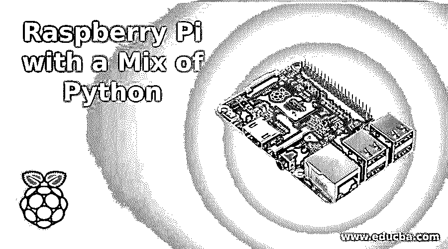
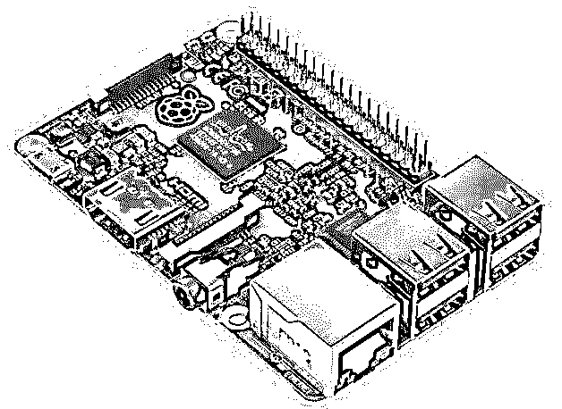
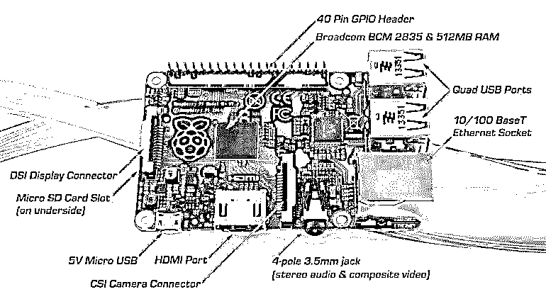
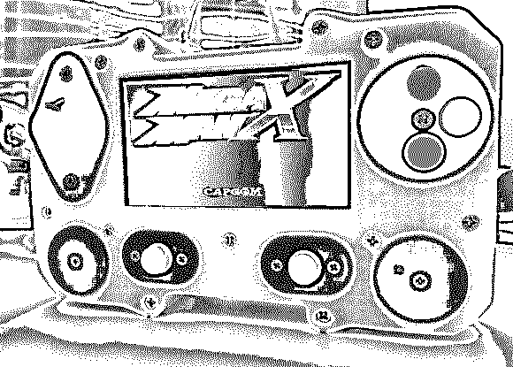

# 混合 Python 的树莓派

> 原文：<https://www.educba.com/raspberry-pi-with-a-mix-of-python/>

当你听到“树莓派”这个词时，它听起来就像某种水果，或者至少是某种随机编程语言的某个模块。但是不，我是来证明你是错的。因此，让我们看看这个圆周率到底是什么，以及我们最喜欢的 [python](https://www.educba.com/course/python-3-5/ "Python 3.5 Training") 是如何参与其中的。

## 什么是树莓派？

树莓 Pi 是一个信用卡大小的单板微型计算机。这是树莓派的样子:

<small>网页开发、编程语言、软件测试&其他</small>

 

树莓 Pi 基于 Broadcom BCM2835 芯片。最初的芯片是基于 ARM 的芯片，配有 700 MHz 处理器和 256 MB RAM 的 VideoCore IV GPU。但这是几年前的事了。后来，B and B+版本发布，这是 512 兆内存。而最新型号的 Raspberry PI 2 是 900 Mhz 四核 ARM Cortex-A7 处理器，1 GB 内存，4 个 USB 端口，40 个 GPIO 引脚，全 HDMI 端口，1 个以太网端口，组合式 3.5mm 音频插孔和复合视频，相机接口(CSI)，显示接口(DSI)，支持高达 64 GB 的 Micro SD 卡插槽，以及 VideoCore IV 3D 图形核心。听起来很有趣？那么让我告诉你更多的事情。

Raspberry Pi 实际上是一台口袋大小的计算机，几乎等于一副纸牌的大小，由于它有一个 ARM Cortex-A7 处理器，它可以运行一系列 ARM GNU/Linux 发行版，包括 Snappy Ubuntu Core，以及微软 Windows 10。

现在介绍部分讲完了，让我们看看这台微型计算机的实际应用。

 

### 真实世界的用法

以下是迄今为止我见过的一些最棒的项目。在我继续讲述 python 如何与 Raspberry 一起使用之前，让我们看一下这些项目(我将只提供项目名称。请在 github 或 Google 上搜索整个项目以获取更多信息):

#### 1.制作基于 Linux 的平板电脑:

是的，你没看错。你可以用你简单的拉斯皮做一个平板电脑。你只需要焊接一个简单的 10 英寸触摸屏、一个便携式 10000 毫安时充电器、一个摄像头模块、一个 Wi-Fi 适配器和一个红外传感器。你可能也想做一个箱子，我建议你用轻木做。原因是它坚固、重量轻且易于更换。有很多人已经造出了这台神奇的机器。一定要检查一下。

#### 2.网络劫持 Pi:

你看过著名的电视连续剧《机器人先生》吗？如果你没有，那么你一定要检查一下。这真是太神奇了。如果你是一个电脑极客，这个系列就是黑客行动主义者在现实生活中所做的事情的精确复制品。但我不是来推销任何系列的。所以，回到我们的话题，如果你看过这个系列，那么你就知道我在说什么。

另外，这确切的说是 Pi 安装了 ARM 版本的 [Kali Linux](https://www.educba.com/software-development/courses/linux-training-certification/ "Comprehensive Kali Linux Training") ，并且附带了一个适配器。效果非常好的是 TP-LINK wn722n。安装后，只需在 RaspPi 中安装一个 VNC，然后将其放在任何公司场所的任何隐蔽区域。嘣！!在家里使用您的系统连接到 VNC，现在您可以轻松破解 WPA/ WPA2 密码并进入网络。

网络工程师将很难找到 Pi，因为它非常紧凑，你甚至可以把它藏在电脑的 CPU 或显示器里。

#### 3.建造 Rasp-Pi 四轴飞行器；

这不是每个人都想做的。原因是拉斯皮需要一个 5V 的电池。如果你有四轴飞行器的背景，那么你可能知道我们需要让四轴飞行器尽可能的轻。因此，除非你是电子专家，否则你可能不会想这么做。但是想想看，如果你能用 RaspPi 创建一个四边形，你能做多少事情。

#### 4.便携式文件站 Pi:

等等。什么？??这是什么意思？这应该是便携式 Playstation 或 PSP。不，你没看错。在一点编码的帮助下，人们已经学会用圆周率制作一个便携式游戏机。上周我在 github 的某个地方读到了这篇文章。这是我认为你应该检查一下。

 

#### 5.圆周率无线电:

圆周率收音机不仅仅是你日常使用的收音机。你可以在几个小时内制作出自己的收音机，并开始试验它能转换到的频率。这实际上非常酷，除了如果你进入错误的频率，像政府的频率，那么它实际上可能会给你带来麻烦。

现在，我亲爱的朋友们，我想你们一定对拉斯皮的能力有所了解；几乎所有你的普通手机或电脑能做的事情。

现在，让我们后退一步，看看 python 与所有这些有什么关系。

### Python 的混合

当您购买整个 RaspPi 套件时，它附带一个 8gb 的 Class 10sd 卡。这张卡预装了一个名为 NOOBS 的操作系统。NOOBS 是基于 Debian 的，它已经包含了 Python 2 和 3。但是由于某种原因，如果您发现您缺少 python 的任何特定版本，那么您可以通过在命令行中键入以下命令来简单地安装它:

***> > > sudo apt-get 安装 python***

但是在构建 python 之前，您需要确保设置了一些东西。为了让 python 的 HTTPS/SSL 功能正常工作，我们需要 libssl-dev。tk-dev 也是 Tk GUI 开发所必需的，libsqlite3-dev 将添加 sqlite3，嵌入式 SQL 数据库，支持。因此，让我们在开始使用 python 之前配置并安装所有这些:

`***>>>**sudo apt-get update***`

`***>>>sudo apt-get upgrade -y***`

`***>>>sudo apt-get install build-essential libncursesw5-dev libgdbm-dev libc6-dev***`

`***>>>sudo apt-get install zlib1g-dev libsqlite3-dev tk-dev***`

`***>>>sudo apt-get install libssl-dev openssl***`

可选地，您可以通过更新符号链接来覆盖包含在[中的 Python 3](https://www.educba.com/python-3-cheat-sheet/) 版本(我的发行版中的 3.2.3)。
T3】

***>>>sudo ln-SF/usr/local/bin/python 3.4/usr/local/bin/python 3*T3】**

python 的替代方案是 ipython。IPython 是一个交互式的 [Python shell](https://www.educba.com/bash-shell-programming-with-python/ "Bash Shell Programming with Python") ，具有语法高亮、自动完成、漂亮打印、内置文档等功能。默认情况下，不会安装 IPython。您可以通过键入以下命令简单地安装它:

***> > > sudo apt-get 安装 ipython #或 ipython3 如果你想***

然后在终端中运行 ipython，您就可以开始了。您还可以使用以下命令为 RaspPi 安装 python 库( T0 ):

`***>>>sudo* *apt-get update***`

`***>>>sudo apt-get install python-picamera***`

这是安装应用程序、库和模块的首选方法。这意味着你安装的模块可以很容易地通过常用的 *sudo apt-get update* 和 *sudo apt-get upgrade* 命令保持最新。

但这些只是图书馆，存在于拉斯扁档案馆。为了安装那里没有的其他档案，您可以使用 PIP 来安装它们。只需键入以下命令来安装您想要安装的库:

***> > > sudo apt-get 安装 python-pip***

***> > > sudo pip 安装 simplejson***

并且为了安装 pi 伞库和 GPIO 软件，你可以使用如下:

***> > > sudo apt-get 安装 python3-rpi.gpio***

***> > > sudo pip 安装 pibrella*T3】# #安装 pibrellaT5】**

***为 python 2***

***> > > sudo pip3.2 安装 pibrella*T3】# #安装 pibrellaT5】**

***为 python 3***

在 Raspberry Pi 上使用 Python 打开了通过 Pi 的 GPIO 引脚连接到现实世界的机会。这可以通过 RPi GPIO 库来完成。它预装在最近的 Raspbian 图像上。

要控制 GPIO 引脚，您需要 Python 中的 root 访问权限。所以，你需要运行 *sudo python，ipython，* *sudo idle &* 。

在您的 Python 脚本中(或在 REPL 中)，导入 GPIO 模块，将电路板模式设置为您喜欢的模式，设置您想要使用的引脚并打开它们:

***> > >导入 RPI。GPIO as GPIO*T3】**

****#**这样做，可以参考 RPI。GPIO 只是贯穿脚本其余部分的 GPIO。****

 *RPi.GPIO 中的 Raspberry Pi 上的 IO 引脚有两种编号方式。第一种是使用板编号系统。这是指覆盆子 Pi 板的 P1 接头上的管脚编号。使用这种编号系统的好处是，无论 RPi 的主板版本如何，您的硬件都将一直工作。您不需要重新连接连接器或更改代码。

第二个编号系统是 BCM 号码。这是一种较低级别的工作方式，指的是 Broadcom SOC 上的渠道编号。你必须始终使用 RPi 板上哪个通道号对应哪个引脚的图表。您的脚本可能会在 Raspberry Pi 板的两次修订之间中断。

***>>>gpio . set mode(gpio . BCM)# #将板卡模式设置为博通***

如果您不知道自己在做什么，为了安全起见，只需键入以下内容:

***>>>mode = gpio . getmode()***

这将检测已经设置了哪个管脚编号系统(例如，由另一个 Python 模块设置)

***>>>GPIO . setup(17，GPIO。出)**# #设置引脚 17***

***>>>GPIO . setup(18，GPIO。出)**# #设置引脚 18***

***>>>gpio . output(17，1)**# #开启 17 号引脚***

***>>>gpio . output(18，1)**# #开启 18 号引脚***

对于那些不知道 GPIO 是什么的人来说，它是一个控制 Raspberry Pi GPIO 通道的模块。这个包提供了一个类来控制 Raspberry Pi 上的 GPIO。

请注意，该模块不适用于实时或对时间要求严格的应用。这是因为您无法预测 Python 何时会忙于垃圾收集。它也运行在 Linux 内核下，这不适合实时应用程序——它是一个多任务操作系统，另一个进程可能会优先于 CPU，导致你的程序抖动。

如果你追求真正的实时性能和可预测性，你应该考虑给自己买一台 Arduino。请注意，当前版本尚不支持 RPi 上的 SPI、I2C、硬件 PWM 或串行功能。虽然硬件 PWM 尚不可用，但软件 PWM 可用于所有通道。

所以，我认为这将是你开始的时候；如果你对 Raspberry Pi 或 Python 有更多的疑问，你可以随时参考 GPIO 或 Raspberry Pi 文档来获得更多的细节。

你可以用树莓派做很多事情。单凭这个博客无法定义使用过它的人所创造的奇迹。请确保您至少尝试了一下，如果您成功了，请谦虚地在 github 上分享您的源代码。毕竟“分享就是关爱。”

### 推荐文章

这里有一些文章可以帮助你更详细地了解混合使用 Python 的 Raspberry Pi，所以只要浏览一下链接就可以了。

1.  [Linux vs Ubuntu](https://www.educba.com/linux-vs-ubuntu/)
2.  用于 Web 开发的 Python 和 Django
3.  [使用 Python 的好处和局限性](https://www.educba.com/benefits-and-limitations-of-using-python/)
4.  [卡莉 Linux vs Ubuntu](https://www.educba.com/kali-linux-vs-ubuntu/)

*