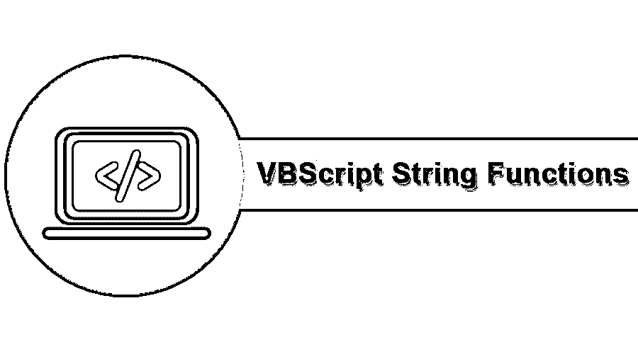

# VBScript 字符串函数

> 原文：<https://www.educba.com/vbscript-string-functions/>

## VBScript 字符串函数

VBScript 是一种脚本语言，主要由 Microsoft 开发，以 Visual Basic 为模型。windows 系统管理员拥有生成功能强大的工具的特权，这些工具通过子例程、错误处理和许多其他不同的编程结构来处理和管理计算机。因此，用户对计算环境的某些方面有很大的控制权。

VBScript 还使用组件对象模型，该模型可用于访问环境元素。例如，FileSystemObject (FSO)可用于创建、更新、读取和删除文件。这种脚本语言默认安装在几乎所有基于桌面的操作系统中。它必须在主机环境中执行。

<small>网页开发、编程语言、软件测试&其他</small>

语言功能包含 VBScript 建模所基于的 Visual Basic 语言。因此，这可以通过使用类似的结构和类别来检查，例如控制结构、过程、常数、用户交互、变量、日期和时间函数、数组处理、数学函数、错误处理、正则表达式、对象、字符串操作等。像其他语言一样，这个 VBScript 有许多字符串函数，用于播放和处理字符串，字符串是由数字、字母或任何其他特殊字符组成的字符序列。

当一个变量用双引号括起来时，我们说它是字符串类型的。这些类型的函数本身是预定义的函数，旨在通过以非常有效的方式利用字符串来与开发人员合作。字符串是 visual basic 语言中使用的不同数据类型之一。下面是作为字符串函数的一部分讨论的一些函数。

### VBScript 字符串函数的示例

字符串函数很容易使用。这里我们将借助实例讨论如何在 VBScript 中使用字符串函数。

**1。InStr:** 这个函数用于返回任何给定子串的第一次出现。字符串内的搜索从左向右进行。

举个例子，

`<!DOCTYPE html>
<html>
<body>

</body>
</html>` 

**输出:**
线 1: 6
线 2: 0

**2。InstrRev:** 顾名思义，这个函数更像 InStr 函数，不同之处在于搜索是从右向左进行的。它还用于查找指定字符串中的第一个匹配项

举个例子，

`<!DOCTYPE html>
<html>
<body>

</body>
</html>`

**输出:**

第 1: 6 行
第 2: 6 行

**3。LCase:**VBScript 中的这个字符串函数用来返回指定字符串的小写。

举个例子，

`<!DOCTYPE html>
<html>
<body>

</body>
</html>`

**输出:**

第 1 行:vbscript

**4。UCase:** 该函数用于返回指定字符串的大写字母。

举个例子，

`<!DOCTYPE html>
<html>
<body>

</body>
</html>`

**输出:**

第 1 行:VBSCRIPT

**5。Left:** 这个函数用于从字符串的左侧返回指定数量的字符。

举个例子，

`<!DOCTYPE html>
<html>
<body>

</body>
</html>`

**输出:**

第一行:Mi

**6。Right:** 这个函数用于从字符串的右边返回特定数量的字符。

举个例子，

`<!DOCTYPE html>
<html>
<body>

</body>
</html>`

**输出:**

第 1 行:pt

**7。mid:**VBScript 中的这个字符串函数用于从给定的字符串中返回指定数量的字符。

举个例子，

`<!DOCTYPE html>
<html>
<body>

</body>
</html>`

**输出:**

第 1 行:微软 VBScript

**8。LTrim:** 这个函数用于在删除了字符串左边的所有空格之后返回字符串文本。

举个例子，

`<!DOCTYPE html>
<html>
<body>

</body>
</html>`

**输出:**

Ltrim 之后:Microsoft VBScript

**9。Rtrim:** 这个函数用来修剪给定字符串右边的所有空格，返回一个没有空格的字符串。

举个例子，

`<!DOCTYPE html>
<html>
<body>

</body>
</html>`

**输出:**

Ltrim 之后:Microsoft VBScript

10。Len: 这个函数用来计算给定字符串的长度。

举个例子，

`<!DOCTYPE html>
<html>
<body>

</body>
</html>`

**输出:**

第 1 行:这是 MS VBScript 编程

**12。Space:** 这个 VBScript 字符串函数用于用特定数量的空格填充指定字符串中的空格。

举个例子，

`<!DOCTYPE html>
<html>
<body>

</body>
</html>`

**输出:**

Microsoft VBScript

### 结论

有许多 VBScript 字符串函数，在本文中，我们讨论了一些主要使用的函数。继续，开始使用这些功能，并探索可以做些什么。

### 推荐文章

这是 VBScript 字符串函数的指南。这里我们借助实例讨论如何在 VBScript 编程中使用 string 函数。您也可以浏览我们推荐的其他文章，了解更多信息——

1.  [JavaScript vs VBScript](https://www.educba.com/javascript-vs-vbscript/)
2.  [VBScript 命令](https://www.educba.com/vbscript-commands/)
3.  [JavaScript 和 JScript](https://www.educba.com/javascript-vs-jscript/)
4.  [Java 中的字符串函数](https://www.educba.com/string-functions-in-java/)

