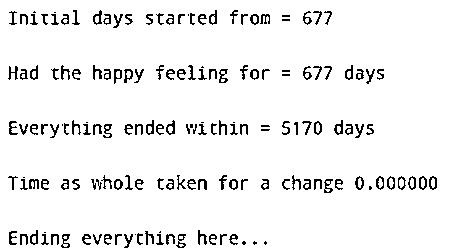
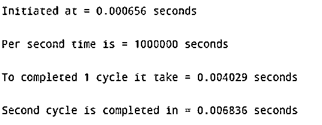
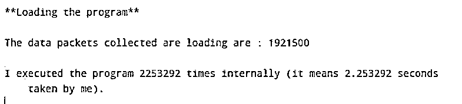

# clock()函数

> 原文：<https://www.educba.com/clock-function/>

## clock()函数介绍

时钟函数用于确定执行一个函数或一组代码的处理时间。为了使用 C 中的时钟函数，我们必须使用头文件<time.h>。这个头文件需要包含在程序中。函数返回一个类型为 clock_t 的值，该值必须除以 clock_per_sec 值，才能计算出以秒为单位的处理时间。它需要在程序的最开始甚至结束时被调用，这两个值的差就是处理器在程序上花费的实际时间。</time.h>

**clock()函数的语法**

<small>网页开发、编程语言、软件测试&其他</small>

在 C 语言的头文件中，它被称为:

`#include<time.h>`

而在 C++语言中，它被称为:

`#include<ctime>`

下面是 C 和 C++编码语言中使用的语法:

`clock_t T(void)`

### 时钟()功能的工作原理

*   时钟函数的主要用途是返回处理器从程序开始到程序结束所经过的时间。
*   时间由函数以时钟刻度表示。
*   为了用秒来表示时间，我们必须用 clock 函数接收的值除以 clocks_per_sec。
*   如果在计算经过的时间时出现错误，或者时间不可用或无法表示，那么时钟函数返回的值将是-1。
*   要使用 C 中的函数，必须在程序中使用 time.h 头文件。
*   此外，该函数可以在 C 语言的 ANSI/ISO 9899-1990 版本中使用。

### clock()函数示例

在下面的例子中，return 函数返回自程序执行以来经过的时钟周期数。执行失败时，函数返回-1 值。

#### 示例#1

在下面的例子中，我们使用 C time 返回代码执行以来经过的时钟周期数，这些值通过除以一个宏 CLOCKS_PER_SEC 转换为秒。这在头文件的<time.h>中定义。</time.h>

**代码:**

`#include <time.h>
#include <stdio.h>
int main () {
clock_t beggning, thanos_snap, whole;
int A;
beggning = clock();
printf("Initial days started from = %ld \n \n", beggning);
printf("Had the happy feeling for = %ld days \n \n", beggning);
for(A=1; A< 2000000; A++) {
}
thanos_snap = clock();
printf("Everything ended within = %ld days \n \n", thanos_snap);
whole = (double)(thanos_snap - beggning) / CLOCKS_PER_SEC;
printf("Time as whole taken for a change %f \n \n", whole );
printf("Ending everything here...\n");
return(0);
}`

**输出:**

#### 实施例 2

这个例子解释了我们如何计算执行不同代码集所花费的时间。当一个人必须执行一个非常大的代码时，这是非常重要的，时间对于执行是非常重要的。在本例中，我们采用了不同的变量进行计算，它们是 EDUCBA、A、ADD、B、M，都是整数类型。此外，为了计算时间，创建了四个变量，它们是 C1、C2、C3 和 C4。

现在，首先，我们将 C1 变量声明为一个函数。在这里，我们也显示了当定时器被设置时，C1 变量除以每秒钟数，得到以秒为单位的时间。在代码的第二阶段，我们创建了一个循环，该循环一直运行到变量小于变量 M，B 在每个循环中递增 1。现在，C2 变量被声明为计算完成一个循环所需时间的函数。同样，时间是以秒计算的。然后，另一个变量被声明为函数，即 C4；现在，这个变量计算完成第二个循环的一个周期所用的时间。

**代码:**

`#include<stdio.h>
#include<time.h>
void main()
{
double EDUCBA, A = 2.9;
int ADD;
int B, M = 2000000;
clock_t C1, C2, C3, C4;
C1 =clock();
printf ( "Initiated at = %lf seconds \n \n", (double)C1/ (double)CLOCKS_PER_SEC);
for ( B=0 ; B<M; B++)
ADD +=1;
C2 =clock();
printf("Per second time is = %d seconds \n \n", CLOCKS_PER_SEC);
printf("To completed 1 cycle it take = %lf seconds \n \n", (double)(C2 - C1) /(double) CLOCKS_PER_SEC );
C3 =clock();
for ( B=0 ; B<M; B++)
EDUCBA += A;
C4 =clock();
printf("Second cycle is completed in = %lf seconds \n \n",(double)(C4 -C3)/(double)CLOCKS_PER_SEC );
}`

**输出:**

#### 实施例 3

在这个例子中，我们计算程序运行的次数和运行程序所用的时间，次数是我们首先指定的。

**代码:**

`#include <stdio.h>
#include <time.h>
#include <math.h>
int EDUCBA (int A) {
int M,N;
int repeat=A-1;
for (M=2
; M<=A
; M++) for (N=sqrt(M)
;N>1
;N--) if (M%N==0) {repeat++
; break;}
return repeat;
}
int main ()
{
clock_t T;
int X;
T = clock();
printf ("**Loading the program**\n \n");
X = EDUCBA (1000000);
printf ("The data packets collected are loading are : %d\n \n",X);
T = clock() - T;
printf ("I executed the program %d times internally (it means %f seconds taken by me). \n", T ,((float) T)/CLOCKS_PER_SEC);
return 0;
}`

**输出:**

### 结论

在上述文章的基础上，我们理解了 C 语言中时钟函数的概念。如果我们想计算处理器执行一个程序所花费的时间，时钟函数是非常重要的。这篇文章将有助于在他们的程序中充分利用时钟功能。

### 推荐文章

这是一个 clock()函数的指南。为了更好地理解，我们在这里讨论介绍、工作和例子。您也可以看看以下文章，了解更多信息–

1.  [Lua 睡眠](https://www.educba.com/lua-sleep/)
2.  [C 编程矩阵乘法](https://www.educba.com/c-programming-matrix-multiplication/)
3.  [C 语言中的指针算法](https://www.educba.com/pointer-arithmetic-in-c/)
4.  [离子成分](https://www.educba.com/ionic-components/)

