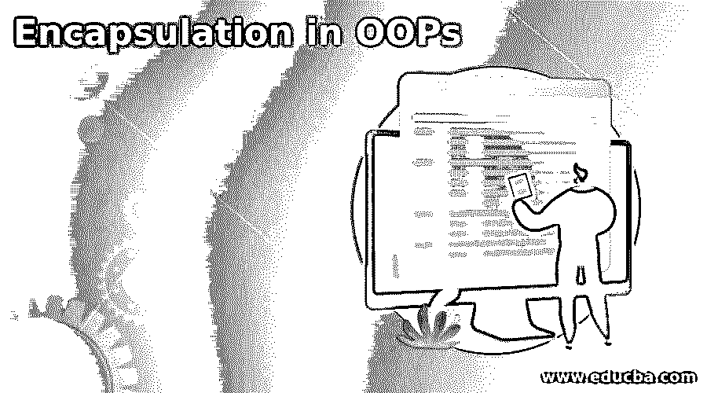
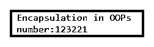
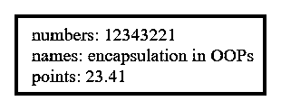
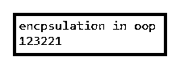
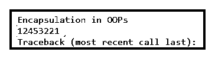

# OOPs 中的封装

> 原文：<https://www.educba.com/encapsulation-in-oops/>

## OOPs 中封装的介绍

*   封装是面向对象编程语言操作数据的基本部分。
*   它有助于将代码和数据组合在一个单元中，并保护编码数据。
*   隐藏编码数据和对象行为是 OOP 语言中的一个重要功能。
*   为了安全起见，隐藏重要的方法、变量和编码过程是面向对象编程语言的一个基本概念。
*   它也是一种包装或隐藏变量、方法和对象的机制。
*   面向对象编程语言包含了部分对数据安全和隐私的使用方法。
*   包装数据和操作方法在一个容器中，并根据用户的要求显示。

**语法:**

*   它需要一个变量的私有访问修饰符。
*   编程语言可以使用方法访问私有变量或对象。
*   getter 和 setter 方法用于访问和显示数据。

以下语法属于私有变量。

<small>网页开发、编程语言、软件测试&其他</small>

`private data_type variable_name;`

**举例:**私有 int 数；

*   getter 方法的语法。

`public data_type getMethodName(){
return variable_name;
}`

**举例:**

`public int getNumbers(){
return numbers;
}`

*   setter 方法的语法。

`public void setMethodName(){
return variable_name;
}`

**举例:**

`public void setNumbers (int newNumbers){
numbers = newNumbers;
}`

*   访问变量数据的语法如下。

`Object.setMethod("data");`

**举例:**

`object_name.setNumbers(123221);`

*   从封装方法中检索到的数据如下。

`Object.getMethod()`

**举例:**

`object_name.getNumbers()`

### 封装在 OOPs 中是如何工作的？

*   它适用于所有面向对象的编程语言。
*   可以用 C，C#，PHP，java，python 语言。
*   在这里，您使用 Java 编程语言。
*   在 java 文件中创建一个类。

`Public class Encapsulationoop{
Write code here…
}`

*   为封装创建一个私有变量。

`private int numbers;`

*   对相应的变量使用 getter 和 setter 方法。

`public int getNumbers(){
return numbers;
}
public void setNumbers (int newNumbers){
numbers = newNumbers;
}`

*   在 java 类中创建 main 方法。

`public static void main(String []args){
Write code here…
}`

*   在 main 方法中创建类的对象。

`Encapsulationoop encap = new Encapsulationoop();`

*   访问私人数据。

`encap.setNumbers(123221);`

*   使用打印功能检索封装的数据。

`System.out.println(encap.getNumbers());`

*   组合封装工序的步骤。

`Public class Encapsulationoop{
private int numbers;
public int getNumbers(){
return numbers;
}
public void setNumbers (int newNumbers){
numbers = newNumbers;
}
public static void main(String []args){
Encapsulationoop encap = new Encapsulationoop();
encap.setNumbers(123221);
System.out.println(encap.getNumbers());
}}`

### 例子

下面举几个例子

#### 示例#1

下面是基本示例和输出。

**代码:**

`public class Encapsulationoop{
private int numbers;
public int getNumbers(){
return numbers;
}
public void setNumbers (int newNumbers){
numbers = newNumbers;
}
public static void main (String [] args){
Encapsulationoop encap = new Encapsulationoop();
System.out.println("Encapsulation in OOPs");
encap.setNumbers (123221);
System.out.println ("number:" +encap.getNumbers());
}}`

**输出:**

#### 实施例 2

下面是 Java 示例和输出。

**代码:**

`public class Encapsulationoop{
private int numbers;
private String names;
private double points;
public int getNumbers(){
return numbers;
}
public void setNumbers (int newNumbers){
numbers = newNumbers;
}
public String getNames(){
return names;
}
public void setNames (String newNames){
names = newNames;
}
public double getPoints(){
return points;
}
public void setPoints (double newPoints){
points = newPoints;
}
public static void main (String []args){
Encapsulationoop encap = new Encapsulationoop();
encap.setNumbers (123221);
System.out.println ("number:" +encap.getNumbers());
encap.setNames ( "encapsualtion in OOPs");
System.out.println ("string:" +encap.getNames ());
encap.setPoints (23.12);
System.out.println ("float:" +encap.getPoints());
}}`

**描述**

*   上面的例子展示了 java 编程语言中的封装。
*   getter 和 setter 方法用于保护数据和变量。
*   get 和 set 关键字有助于访问和检索对象、变量和方法。

**输出**

#### 实施例 3

下面是 PHP 示例和输出。

**代码:**

`<!DOCTYPE>
<html>
<body>
<?php
class Encapsulationoop {
private $numbers;
private $names;
private $points;
public function getNumbers() {
return $this -> numbers;
}
public function setNumbers($numbers) {
$this->numbers = $numbers;
echo("numbers: ".$numbers);
echo(" ");
}
public function getNames() {
return $this -> names;
}
public function setNames($names) {
$this -> names = $names;
echo("names: ".$names);
echo(" ");
}
public function getPoints() {
return $this -> points;
}
public function setPoints($points) {
$this -> points = $points;
echo("points: ".$points);
echo(" ");
}
}
$ecap = new Encapsulationoop();
$ecap -> setNumbers(12343221);
$ecap -> setNames("encapsulation in OOPs");
$ecap -> setPoints(23.41);
?>
</body>
</html>`

**描述**

*   上面的例子展示了 PHP 编程语言。
*   getter 和 setter 方法用于保护数据和变量。
*   get 和 set 关键字有助于访问和检索对象、变量和方法。
*   PHP 不需要为变量指定特定的数据类型。

**输出:**

#### 实施例 4

下面是 C++示例和输出。

**代码:**

`#include <iostream>
using namespace std;
class Encapsulationoop
{
private:
int numbers;
int marks;
public:
void set(int number)
{
numbers = number;
}
int get()
{
return numbers;
}
};
int main()
{
Encapsulationoop ecap;
ecap.set(123221);
cout << "encpsulation in oop \n";
cout << ecap.get();
return 0;
}`

**描述**

*   上面的例子展示了 C++编程语言中的封装。
*   getter 和 setter 方法用于保护数据和变量。
*   get 和 set 关键字有助于访问和检索对象、变量和方法。

**输出:**

#### 实施例 5

python 中的封装示例和输出如下。

**代码:**

`class Encap:
def __init__(self):
self._first = 12453221
class Dev(Encap):
def __init__(self):
Encap.__init__(self)
print(" Encapsulation in OOPs ")
print(self._first)
encap1 = Dev()
encap2 = Encap()
print(encap2.first)`

**输出:**

**描述**

*   上面的例子展示了 python 编程语言中的封装。
*   基类和派生类有助于保护对象、变量和方法。
*   “_first”变量有助于保护和访问程序中的数据。

### 结论

*   为了安全起见，它是一个隐藏数据、方法和变量的函数。
*   封装的结构是将不同的方法、对象和变量包装在一个包装单元中。
*   它有助于保护数据免受不必要的用户，并显示所需的数据。
*   它为每个用户创建了一个受保护的、安全的、用户友好的 web 应用程序。

### 推荐文章

这是 OOPs 中封装的指南。在这里，我们讨论封装如何在 OOPs 和示例中工作，以及代码和输出。您也可以阅读以下文章，了解更多信息——

1.  [在哎呀中覆盖](https://www.educba.com/overriding-in-oops/)
2.  [哎呀 Java 面试问题](https://www.educba.com/oops-java-interview-questions/)
3.  [Java 中的封装](https://www.educba.com/encapsulation-in-java/)
4.  [c++中的封装](https://www.educba.com/encapsulation-in-c-plus-plus/)

