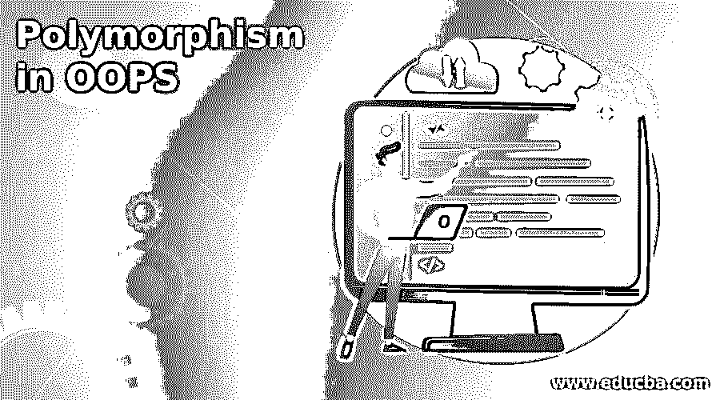
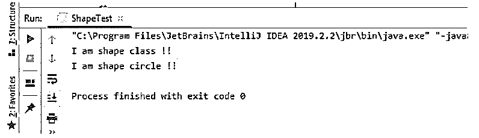

# OOPS 中的多态性

> 原文：<https://www.educba.com/polymorphism-in-oops/>

## OOPS 中的多态性介绍

多态性是面向对象编程语言 OOPS 的最重要的概念之一。通过使用多态性，我们可以拥有不同或多种形式的方法、变量或对象。此外，通过使用多态性，我们可以根据类的需要给同一个方法不同的实现。

这个概念给我们带来了可伸缩性，增加了代码的可读性，通过使用这个概念，我们可以在父类中拥有自己的相同方法的实现。一般来说，这可以在继承的帮助下实现，这意味着类应该属于同一个层次树。在这里，我们将看到更多关于编程世界中多态性的实现，以及我们如何使用类的对象来访问。

<small>网页开发、编程语言、软件测试&其他</small>

### OOPS 中多态性的语法

正如我们已经知道的，多态是 OOPS 中的一个概念，它可以用来提供一个方法的多种形式。

在这里，我们将看到在 Java 语言中实现这一点的语法。

`public class classs_name{
public void method_name(){
// logic goes here ..
}
}
public classs_name extends other_class{
@Override
public void method_name(){
// logic goes here ..
}
}`

这样，我们就可以在 OOPS 中实现多态性；从上面的语法中我们可以看到，我们正在努力实现多态性，其中我们为一个特定的方法提供了多个实现。

**举例:**

`public class Parent{
public void method_name(){
// logic goes here ..
}
}
public childDemo extends Parent{
@Override
public void method_name(){
// logic goes here ..
}
}`

### 如何在 OOPS 中执行多态性？

它非常重要，因为它为方法、对象和变量提供了多种形式。通过使用它，我们还可以增加代码的可读性；很容易开发和理解。在 OOPS 中，我们可以通过两种方式来实现它，它们通常被归类为编译时多态性和运行时多态性。在像 Java 这样的面向对象编程语言中，我们有方法重载和方法覆盖来实现它。

#### 1.编译时多态性

在 OOPS 中，我们可以借助方法重载实现编译时多态性；在这种情况下，java 通过检查方法签名来识别调用哪个方法。在方法重载中，我们应该有相同的方法名，但是有不同数量的参数和它们的返回类型，其中任何一个都可以实现。简而言之，当对象被绑定到它的功能时，编译时比这种形式被称为编译时。这里我们将看到在 Java 中实现这一点的语法。

**语法:**

`public class Demo {
public static int subtract(int x, int y)
{
// logic goes here .//
}
// Second addition function
public static int subtract(int x, int y, int z)
{
// logic goes here .//
}
}`

在上面的语法中，我们试图通过使用方法重载来实现编译时；如果你能看到，我们有两个同名的方法，它们的签名是不同的。因此，每当我们通过使用这些方法的对象来调用这些方法时，编译器就会通过检查它们的方法签名来识别这些方法，而这种识别只会在编译时进行。因此，这被称为编译时间。请记住，参数的数量应该不同，或者参数的数据类型应该不同，以正确实现这一点。

#### 2.运行时多态性

在 OOPS 中，我们可以通过使用方法覆盖来实现运行时多态性，这意味着它应该在两个类有某种关系(主要是继承)时实现。为了实现这一点，我们使用了一个名为“Override”的关键字；该方法应该用此注释进行注释。运行时多态性也称为动态多态性，因为要调用的方法是在运行时而不是在编译时确定的。然而，因为这两个方法将具有相同的签名，并且可以使用任何类对象来调用，所以编译时编译器不知道这一点；这只能在运行时识别。

**语法:**

`public class Demo{
public void getm(){
// logic goes here .//
}
}
public class DemoEx extends Demo{
@Override
public void getm(){
// logic goes here .//
}
}`

正如你在上面的语法中看到的，我们试图通过使用方法覆盖来实现运行时。在这种情况下，我们应该在具有相同签名的类和中具有相同的方法，但是我们已经为每个类提供了不同的实现，我们覆盖了这一点。这样，我们在 OOPS 中实现了运行时。此外，在调用方法时，我们可以通过使用父对象或子对象对此进行分类；这完全取决于我们如何写我们的逻辑。

### OOPS 中多态性的例子

OOPS 中显示多态性的简单示例。

**代码:**

**形状类别:**

`public class ShapeDemo {
public void getShape(){
System.out.println("I am shape class !!");
}
}` 
**圈类:**

`public class CircleShape extends ShapeDemo{
@Override
public void getShape() {
System.out.println("I am shape circle !!");
}
}`

**测试类别:**

`public class ShapeTest {
public static void main(String[] args) {
ShapeDemo shapeDemo = new ShapeDemo();
CircleShape circleShape = new CircleShape();
shapeDemo.getShape();
circleShape.getShape();
}
}`

**输出:**

### 结论

多态性在 OOPS 中非常重要，它帮助我们提供了变量、对象和方法的多种形式，增加了代码的可重用性和可读性；同样，我们可以对同一个方法有不同的实现。它也很容易理解和实现。

### 推荐文章

这是 OOPS 中的多态性指南。这里我们讨论一下入门，OOPS 中如何执行多态性？还有例子。您也可以看看以下文章，了解更多信息–

1.  [在哎呀中覆盖](https://www.educba.com/overriding-in-oops/)
2.  [C 语言中的编程错误](https://www.educba.com/programming-errors-in-c/)
3.  [Lua 编程](https://www.educba.com/lua-programming/)
4.  [哈斯克尔编程](https://www.educba.com/haskell-programming/)

