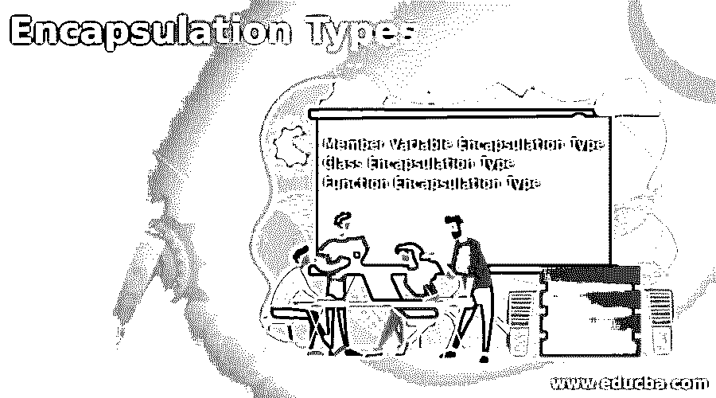

# 封装类型

> 原文：<https://www.educba.com/encapsulation-types/>

## 

  封装简介

封装是面向对象编程语言的一个主要概念，它强调使数据安全和抽象。封装对象有助于仅用某些重要数据而不是不相关的数据进行数据输入。封装通过只向最终用户提供所需的细节来保护数据。有三种类型的封装，即成员变量封装、函数封装和类封装，当涉及到任何拥有封装的特定应用程序的实现时，每种封装对于类的成员变量、函数、API 都有其自己的意义。

### 封装类型列表

基本上，有三种类型的封装对整个过程的成功起着至关重要的作用，具体如下:

*   成员变量封装类型
*   类封装类型
*   功能封装类型

#### 1.成员变量封装类型

*   成员变量封装类型主要处理类的成员或变量。
*   这些变量大多与类对象相关联，类对象包括成员和变量。
*   在处理面向对象的范例时，这些数据变量和成员必须在任何个人类中声明。
*   它使对象以一种操作可以发生的方式运行，并且随着数据值的检索而发生变化，这也可以由 setters 和 getters 构成。
*   由于这种类型的封装与数据成员和变量一起出现，因此这种封装类型被称为数据参与者封装。
*   就成员和变量而言，不一定只使用这种封装，还可以使用封装的函数和部分。

**举例:**

<small>网页开发、编程语言、软件测试&其他</small>

此示例演示了成员类型封装，其中考虑了学生编号，然后操作变量以成功执行成员变量封装，如下面的输出所示。

**代码:**

`class Encapsue_Member_Demo
{
private int roll_no;
public int getStdnt_roll_no()
{
return roll_no;
}
public void setStdnt_roll_no(int n_val){
roll_no = n_val;
}
}
public class Encap_Test{
public static void main (String args [])
{
Encapsue_Member_Demo obj_ref = new Encapsue_Member_Demo();
obj_ref.setStdnt_roll_no (202100);
System.out.println ("roll_no: " + obj_ref.getStdnt_roll_no ());
}
}`

**输出:**

#### 2.类封装类型

*   顾名思义，类封装类型是类的一部分，它利用各种复合 API(应用程序编程接口)来帮助按照需求进行内部实现。
*   同样，应用程序的主要逻辑将由界面本身来保存。
*   这种类不构成任何类型的外部 API 的一部分，也不构成任何类型的公共图形用户界面。
*   类和接口中的数据都保留在类本身中，从而使其对类本身中的成员或变量可用。对于在 API 的类或前提之外可用的用户，它是不可用的。
*   这些存在于类中的完整 API 也存在于前提中，并且能够轻松地修改和定制存在于 API 或类中的参数，但是在类封装类型内。
*   不知何故，它是隐藏的，并保持抽象，因为它对外部世界不可用，从而使它完全在一个位置内，具有每个细节，这些细节仅在实施者而不是最终用户之前可用，最终用户将只是获得实际的感觉而不是完全的改变，并且不被关注。

**举例:**

这个程序演示了类的封装类型，其中 Encapse_Function_Demo 包含所有的主方法，在类的主体中有一个新的类，但是由于私有和公共访问，这种情况再次发生。

**代码:**

`class Encapsue_Function_Demo
{
private int roll_no;
private int getStdnt_roll_no()
{
return roll_no;
}
private void setStdnt_roll_no(int n_val){
roll_no = n_val;
}
}
class StudentInfo{
public String student_name;
void setstudent_name(float n_val);
};
public class Encap_Test{
public static void main (String args [])
{
Encapsue_Function_Demo obj_ref = new Encapsue_Function_Demo();
obj_ref.setStdnt_roll_no (202100);
System.out.println ("roll_no: " + obj_ref.getStdnt_roll_no ());
}
}`

#### 3.功能封装类型

*   作为函数封装类型的一部分出现的函数 API 必须只显示特定函数的细节和引用，而且只能在函数内部显示。所有定义的成员变量或逻辑都可以修改和更改，但不应该在函数之外访问，这就是使用函数封装类型的好处。
*   尽管应用于该功能的分类并不复杂，并且拥有与界面相关的大部分功能更改，最终客户可能需要这些更改来了解功能更改或错误修复，因此可以转发和分发那些没有实际实现的微小细节，以便发布更改。
*   由此，可以理解的是，只有公共特征可以被公开，并且最终用户可以访问，而不是整个实现或进一步需要的细节。
*   封装的主要宗旨是隐藏实现，并使相关信息可用，因此数据的保密性也是可以预期的。如果出现了信息泄露，那么封装的概念就根本没有得到满足，而是受到了阻碍或者没有正确实现。

**举例:**

这个程序演示了 Encapsue_Function_Demo，其中试图访问函数 API 及其关联的成员变量和接口，但是由于它遵循函数封装类型，因此在这种情况下，成员变量被定义为私有的，以保持输出中所示的机密性。

**代码:**

`class Encapsue_Function_Demo
{
private int roll_no;
private int getStdnt_roll_no()
{
return roll_no;
}
private void setStdnt_roll_no(int n_val){
roll_no = n_val;
}
}
public class Encap_Test{
public static void main (String args [])
{
Encapsue_Function_Demo obj_ref = new Encapsue_Function_Demo();
obj_ref.setStdnt_roll_no (202100);
System.out.println ("roll_no: " + obj_ref.getStdnt_roll_no ());
}
}`

**输出:**

### 结论–封装类型

封装类型在任何面向对象的编程语言中都起着重要的作用，它有助于为数据提供一定程度的保密性。这使得主成员变量和成员函数能够在任何实现需要时相应地操作数据。当最终用户查看和检查时，封装提供了很大的灵活性。

### 推荐文章

这是封装类型的指南。为了更好地理解，我们在这里讨论封装类型的介绍和列表。您也可以看看以下文章，了解更多信息–

1.  [JavaScript 封装](https://www.educba.com/encapsulation-in-javascript/)
2.  [PHP 中的封装](https://www.educba.com/encapsulation-in-php/)
3.  [c++中的封装](https://www.educba.com/encapsulation-in-c-plus-plus/)
4.  [Java 中的封装](https://www.educba.com/encapsulation-in-java/)

