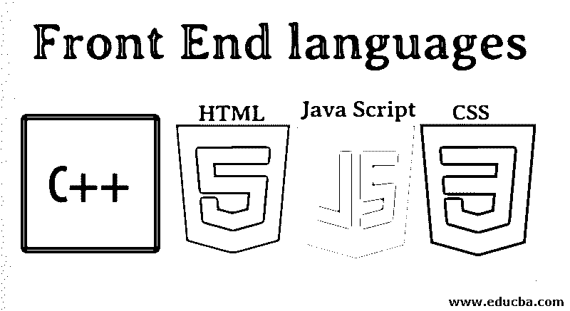

# 前端语言

> 原文：<https://www.educba.com/front-end-languages/>

## 什么是前端语言？

前端是您可以立即看到并与之交流以获得系统后端容量的网站，这意味着用户可以看到并体验一切。多年来，网页设计师的角色已经发生了巨大的变化，但其核心功能仍然保持不变。Frontend 处理你在网站上看到的所有口哨声和铃声，包括彩色照片、导航菜单、浮华按钮等。前端也称为“客户端”，因为这个动作发生在客户端，在这个例子中就是用户。web 开发人员不处理代码。实际上，它涵盖了重新设计和建立网站的所有方面，这些网站在视觉上很有吸引力，也很人性化。前端开发人员的角色是为用户创建一个结合了各种工具的环境，包括 JavaScript、超文本标记语言和 CSS。现在我们将继续讨论前端语言

### 不同类型的前端语言

以下是不同类型的前端语言，如下所示:

<small>网页开发、编程语言、软件测试&其他</small>

#### 1.HTML 语言

超文本标记语言，我们通常称之为 HTML。HTML 用于在万维网上创建数字记录。每个页面上都提供了许多其他网站的链接。你在互联网上浏览的每个网页都是以一种或另一种 HTML 格式发布的。HTML 代码确保图像和文本的格式正确，以便您的 internet 浏览器可以显示它们以供查找；如果没有 HTML，浏览器将无法将文本显示为项目或加载图像。HTML 还提供了一个基本的页面结构，其中叠加了[级联样式表](https://www.educba.com/what-is-css/)来修改它们的外观。网站是通常用 HTML 编写并通过网络浏览器翻译的文档。通过输入 URL，您可以识别网页。静态或动态类型的网页可以是。我们可以使用 HTML 生成静态网页。我们将看到 HTML 中的属性，如文档、标签、按钮、列表等。

所有 HTML 文档必须以文档类型声明开头:

`<!DOCTYPE html>`

HTML 文档从开始，以结束。我们想在网站上显示的部分在 HTML 文档中声明在和之间。在 HTML 中，标题是用

# 到

###### 标签定义的。其中

# 代表最大航向，

###### 代表最小航向。

`<h1>This is heading with h1 </h1>
<h2>This is heading with h2 </h2>
<h6>This is heading with h6</h6>`

HTML 链接是用

**例子**

`<ahref="[https://www.educba.com](https://www.educba.com/)">This is a link to educba website</a>`

在 HTML 中，图像是用标签定义的。

编辑图像的属性如下

*   源文件(src)
*   替代文本(alt)
*   宽度
*   高度

**例子**

``

你可以看到这个 Html 代码的小例子

**例子**

`<html>
<head>
<title>Hello Friends </title>
</head>
<body>
<h2>Educba Blog</h2>

 HTML First Page

</body>
</html>`

#### 2.Java 脚本语言

JavaScript 是一种编程语言。它是轻量级的，最常被用作互联网页面的一部分，其实现使客户端脚本能够与动态网站通信并创建动态网站。JavaScript 最初被命名为 LiveScript，但可能是由于 Java 创造的热情，Netscape 将其名称改为 JavaScript。JavaScript 第一次出现是在 1995 年，在 Netscape 2.0 中以 LiveScript 的名字出现。超文本传输协议，简称 HTTP，旨在通过网络传输 HTML 文本以供查看，正如它被称为的那样。然而，它对于 HTML 是完全静态的，并且不提供实现逻辑的能力。如果[电脑运行 JavaScript](https://www.educba.com/what-javascript-can-do/) ，浏览器是分开的。JavaScript 沙盒被 Chrome 和 Edge 等浏览器用作附加的安全措施。JavaScript 无法读写硬盘或其他与电脑相连的存储设备。

你可以看看这个 JavaScript 代码的小例子。

**例子**

`<!DOCTYPE html>
<html>
<body>
<h2>Hello EDUCBA</h2>

EDUCBA Can Make your Future Bright.

<button type="button" onclick='document.getElementById("demo").innerHTML = "Hello Server!"'>Click Me!</button>
</body>
</html>`

#### 3.C++语言

C++是最好的前端编程语言之一。C++是由比雅尼·斯特劳斯特鲁普开发的。这种语言也因 C 的扩展而闻名，即 [C++语言](https://www.educba.com/what-is-c-plus-plus/)的下一个版本。C++用于许多目的，如游戏开发、应用程序开发、操作系统、动画等。这种语言很容易学。C++的这一特性使其在市场上广受欢迎。C++是所有语言的基础语言。C++语言有一套丰富的库。

**例子**

`Program to display “Hello World”
#include <iostream>
Using namespace std;
Int main()
{
Cout<<”Hello,World!”;
Return 0;
}`

**以菱形打印星形图案的示例**

`#include<iostream>
using namespace std;
int main()
{
int n, s, i, j;
cout << "Enter number of rows: ";
cin >> n;
for(i = 0; i <= n; i++)
{
for(s = n; s > i; s--)
cout << " ";
for(j=0; j<i; j++)
cout << "* ";
cout << "\n";
}
for(i = 1; i < n; i++)
{
for(s = 0; s < i; s++)
cout << " ";
for(j = n; j > i; j--)
cout << "* ";
// ending line after each row
cout << "\n";
}
return 0;
}`

#### 4.CSS 语言

CSS 代表级联样式表。使用 CSS 可以控制颜色、列大小和颜色设计、段落间距、字体样式、背景图像或颜色、布局设计和不同设备的显示变化、屏幕大小或其他效果。CSS 很容易了解和理解，但它控制着 HTML 文档的表示。CSS 通常与 [HTML 或 XHTML](https://www.educba.com/html-vs-xhtml/) 标记语言成对出现。如果你使用 CSS，你不需要每次都写 HTML 标签特征。只需编写一个 CSS 标签规则，并将其用于标签的所有事件。通过更少的代码，下载时间更快。对于多种设备类型，样式表允许内容优化。手持设备(如 PDA、手机或印刷品)的各种网站版本可以用同一个 HTML 文档呈现。

你可以看到这个 CSS 代码的小例子

**例子**

`<!DOCTYPE html>
<html>
<head>

</head>
<body>
<h1 class="center">EDUCBA </h1>

Hello Are you there?

</body>
</html>`

您可以使用

**语法如下。**

`<!DOCTYPE html>
<html>
<head>

</head>
<body>
<h1>Educba</h1>

Welcome to EDUCBA

</body>
</html>`

### 结论

在本文中，我们已经看到了不同类型的前端语言及其语法和示例，这将有助于您更好地理解并更方便地浏览这些主题。

### 推荐文章

这是前端语言的指南。这里我们讨论了什么是前端语言？不同类型的前端语言以及示例代码。您也可以浏览我们推荐的其他文章，了解更多信息——

1.  [前端开发者面试问题](https://www.educba.com/front-end-developer-interview-questions/)
2.  [什么是 CSS？](https://www.educba.com/what-is-css/)
3.  [什么是 HTML](https://www.educba.com/what-is-html/)
4.  [什么是前端开发者？](https://www.educba.com/what-is-front-end-developer/)

