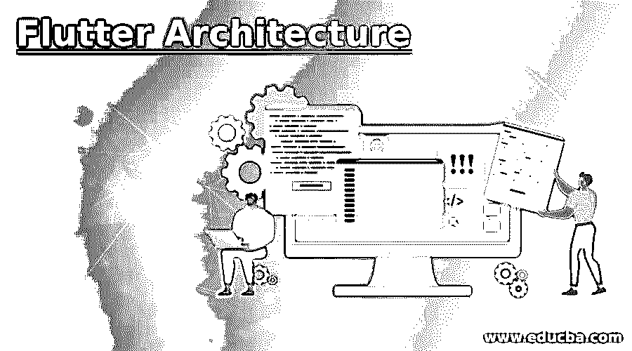
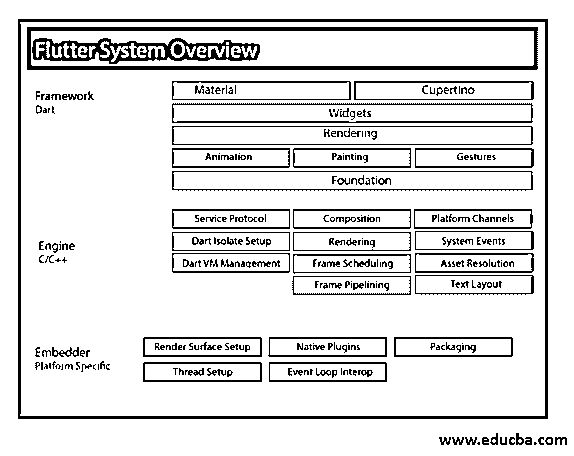

# 颤振建筑

> 原文：<https://www.educba.com/flutter-architecture/>

## 颤振体系结构介绍

一个 SDK 应用程序，使用单一代码库为 android、web、iPhone 操作系统、桌面等构建高性能、高保真的应用程序。叫做颤动。flutter 的架构由四个组件组成，即 flutter engine、foundation library、widgets、设计专用 widgets，其中 Flutter engine 是一个运行时，可移植到基于 C++编程语言的高质量移动应用程序中，基础库中提供了编写 Flutter 应用程序所需的软件包。flutter 中的用户界面组件是微件，设计专用微件是基于特定设计语言(即材料设计和 Cupertino 风格)的两组微件。

### 颤振建筑

颤振的结构由四个部分组成。

<small>网页开发、编程语言、软件测试&其他</small>

#### 1.颤振发动机

它是一个可移植的高质量移动应用程序的运行时。它基于 C++编程语言。flutter 的应用程序是使用 flutter 核心库开发的，这些核心库包括图形和动画、网络输入输出和文件、插件架构、可访问性支持和 dart 运行时。低级图形可以使用开源的 Google 图形库 Skia 来渲染。

#### 2.基础图书馆

用于开发 flutter 应用程序的构建块使用了包，它们包含在基础库中。Dart 是用来编写这些库的语言。

#### 3.小工具

flutter 框架的重要概念是 widget。应用程序的界面和视图受用户界面组件(即小部件)的控制和影响。用户界面的一部分的不可变表示的描述由包括形状、文本、图形、动画等的窗口小部件提供。包含在该用户界面中。react 和 widgets 的组件是相似的。任何应用程序都是 flutter 架构中的一个小部件，由许多子部件组成。使用这个特性可以创建复杂的用户界面。

#### 4.设计特定的部件

它有两种类型的小部件，遵循某些设计语言的规则。设计特定的小部件是 android 应用程序的材料设计，iPhone 操作系统应用程序的 Cupertino 风格。

#### 5.手势

手势是 it 中用于交互的小部件，如如何响应和如何倾听，这是通过使用手势检测器来完成的。子部件的点击、拖动和缩放的交互包括在手势检测器中，该手势检测器是一个不可见的部件。通过使用手势检测器，其他交互功能可以包含在小部件中。

#### 6.状态管理

flutter 小部件的状态由一个特殊的小部件维护，即有状态小部件。每当有内部变化时，有状态小部件会自动重新呈现。计算旧窗口小部件用户界面和新窗口小部件界面之间的距离，以优化重新呈现，并且仅呈现那些改变的必要内容。

#### 7.层

颤振体系结构的核心概念是层，这些层根据复杂性分为几个类别，并以自上而下的方式进行排列。应用程序的用户界面是最顶层，这一层是 android 平台和 iPhone 操作系统平台特有的。所有的 flutter 小部件都出现在第二个最顶层。所有东西都通过下一层呈现给应用程序，这一层称为呈现层。

所有这些层之后是手势，这些手势是 flutter 架构中用于交互的小部件，例如如何响应和如何倾听，这是通过使用手势检测器、基础库来完成的，基础库是开发 flutter 应用程序的构建模块，使用包，它们包含在特定于平台的基础库、引擎和代码中。

下图说明了颤振应用的发展:

### 我们为什么要使用颤振架构？

*   开发应用程序和创建动画的过程速度非常快。
*   flutter 架构的亮点是用户界面应用。
*   它是 iPhone 操作系统和 Android 的原生应用程序。
*   如果每次都按下保存按钮，那么在 flutter 架构中的重新加载是热的。
*   基于颤振体系结构的应用程序性能很高。
*   使用 dart 可以在单个平台上支持多种语言。
*   基于 flutter 架构的应用程序具有很高的生产率。
*   布局和后端都是用一种语言编写的。
*   flutter 架构由可定制的小部件组成。

### 为什么说颤振建筑是独一无二的？

*   ARM 二进制代码可以用 flutter 架构编译。
*   flutter 架构不依赖于 OEM 小部件。
*   颤振建筑中不需要桥梁。
*   在 flutter 架构中没有标记语言，只有 dart。

### Flutter 架构支持的动画列表

*   它支持补间。
*   它支持英雄。
*   它支持银。
*   它支持转换。
*   它支持淡入窗口小部件。
*   它支持动画生成器。
*   它支持动画不透明度。
*   它支持基于物理的动画。

### 优点和缺点

下面给出了颤振结构的优点和缺点:

#### 优势

以下是优点:

*   用户界面编码可以通过使用现成的可定制的小部件快速完成。
*   学习曲线是温和的，使用 flutter 架构的用户群体每天都在增长。
*   java 程序员通过使用简单而有效的语言 dart 成为目标。
*   flutter 架构支持的编译类型有 AOT 和 JIT。
*   XML 文件不是必需的。
*   JavaScript 桥接对于提供更好的性能不是必需的。
*   使用热重装功能可以提供即时更新。
*   它提供了可移植性、国际化和可访问性。
*   它提供了高性能。

#### 不足之处

以下是缺点:

*   flutter 架构不支持第三方库。
*   文件的大小很大。
*   iPhone 操作系统存在问题。
*   Dart 编程语言对于编程初学者来说不容易理解，因此找人来执行这项工作成为一项困难的任务。

### 推荐文章

这是一个颤振建筑指南。在这里，我们讨论为什么我们使用 flutter 架构，为什么它是独一无二的，以及支持的动画列表，优点和缺点。您也可以看看以下文章，了解更多信息–

1.  [颤振应用](https://www.educba.com/flutter-applications/)
2.  [什么是颤振？](https://www.educba.com/what-is-flutter/)
3.  [反应原生架构](https://www.educba.com/react-native-architecture/)
4.  [MVC 架构](https://www.educba.com/mvc-architecture/)

