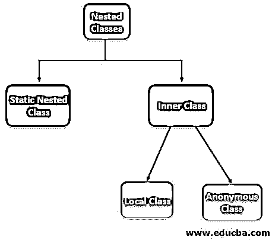

# 内部类

> 原文：<https://www.educba.com/inner-class/>

## 内部类的定义

存在于另一个类或块中并被视为其成员之一的类称为内部类。它也被称为嵌套类，可以很容易地访问所有外部类/块成员。这有助于在块中声明用户定义的数据类型，以实现特殊类型的关系，并有助于编写更具可读性和可维护性的代码。它可以分为两个不同的类别

1.  **静态嵌套类:**如果嵌套类声明为静态。
2.  **内部类:**非静态嵌套类称为内部类。

<small>网页开发、编程语言、软件测试&其他</small>

### 为什么我们需要内阶层？

在下列情况下，需要在应用程序中使用内部类

*   **局部类:**如果一个类只被另一个类使用，那么最好把这个单独使用的类作为局部内部类。这样嵌入一个类和它的助手类会产生一个更好的流线型的包。
*   **优化代码:**这样的代码排列使得我们的代码更加优化，内存使用更加高效。
*   可读和可维护的代码:这种将类放在离使用它的地方更近的地方的类的排列方式使得代码易于阅读，并且看起来易于维护。

### 编程语言中的内部类是如何工作的？

让我们逐一了解以上每一项:-

#### 1.静态嵌套

这种类型的静态类在另一个类中声明，并被视为其成员之一。因为它是静态的，所以可以很容易地被其他静态成员调用，而不需要初始化外部类。由于是静态的，它不能访问外部类的其他非静态实例成员。

**语法:**

`class Outer{
public static class Inner{
}
}`

#### 2.局部方法

这个类类型是在一个方法中声明的，并被视为类似于它的局部方法和变量。因为它是一个局部成员，所以不能在方法外部访问。要使用它，需要在方法本身内部创建它的实例。

**注意:**在 JDk 1.7 之前，外部类的实例变量在被声明为 final 之前是不可访问的。在 JDK 1.8 中，这个缺陷被克服了。

**语法:**

`class Outer{
public int method1(){
//task to be performed
public class Inner{
//variables and methods of inner class
}
}
}`

#### 3.匿名的

这种类型的类是在没有名称的情况下声明的。当需要重写类或接口的方法时，就使用这样的类。在这种情况下，类的声明和实例化需要同时实现。

**语法:**

`AnonymousInner an_inner = new AnonymousInner() {
public void my_method() {
........
........
}
};`

#### 4.内部类

这种类型的类是通过在另一个类中声明一个类来实现的，其中内部类可以访问所有实例变量和外部类的方法。由于这里的内部类与一个实例相关联，因此决不能被定义为静态成员。

**语法:**

`class Outer{
class Inner{
}
}`

### 内部类的例子

下面是下面给出的例子:

#### 示例# 1–静态嵌套

**代码:**

`package Try;
public class Office {
static class Admin {
public void my_method() {
System.out.println("Admin name is Sarthak");
}
}
public static void main(String args[]) {
Office.Admin nested = new Office.Admin();
nested.my_method();
}
}`

**输出:**

#### 示例 2–局部方法

**代码:**

`package Try;
public class Office {
void my_Method() {
final int  numOfDesk = 23;
class Inner {
public void print() {
System.out.println("Number of desk in Office =  "+ numOfDesk);
}
}
Inner inner = new Inner();
inner.print();
}
public static void main(String args[]) {
Office outer = new Office();
outer.my_Method();
}
}`

**输出:**

#### 示例 3–匿名

**代码:**

`package Try;
abstract class MyInner {
public abstract void myMethod();
}
public class Office {
public static void main(String args[]) {
MyInner my_inner = new MyInner() {
public void myMethod() {
System.*out*.println(“Implementing myMethod named abstract method");
}
};
my_inner.myMethod();
}
}`

**输出:**

#### 示例# 4–内部类

**代码:**

`package Try;
class Company {
class MyCEO {
public void show() {
System.out.println("CEO of this institute is Mr. Rakesh Kumar");
}
}
}
public class Office {
public static void main(String[] args) {
Company.MyCEO in = new Company().new MyCEO();
in.show();
}
}`

**输出:**

### 优势

*   **可维护代码:**将一次性使用类放在另一个类中，增强代码的可读性和可维护性；因此，我们的应用程序变得更易于维护。
*   **增强封装:**封装是面向对象编程语言的特性之一，其中相关的变量和方法被封装在一个名为类的块中，并使用该类的实例来引用。它被实现为外部类的一部分，并被视为该类的一个成员，从而增强了我们代码中的封装，从而使它更有效和可维护。
*   **改进优化:**在自己的应用程序中使用这个可以帮助编译器轻松编译类，从而增强代码的优化。此外，编译器对内存和 CPU 的使用也减少了，因为新类使用的内存减少了。

### 结论

内部或嵌套类是一种将代码中只在一个地方使用的类放得更近的方法。这增强了代码的封装和优化，并使我们的代码更具可读性和可维护性，因为其他类更容易访问这些成员。

### 推荐文章

这是一本关于内在阶级的指南。在这里，我们还讨论了内部类在编程语言中是如何工作的？以及不同的示例及其代码实现。您也可以看看以下文章，了解更多信息–

1.  [Java 中的内部类](https://www.educba.com/inner-class-in-java/)
2.  [Java 中的匿名内部类](https://www.educba.com/anonymous-inner-class-in-java/)
3.  [Java 中的匿名类](https://www.educba.com/anonymous-class-in-java/)
4.  [SQL 内部连接](https://www.educba.com/sql-inner-join/)

