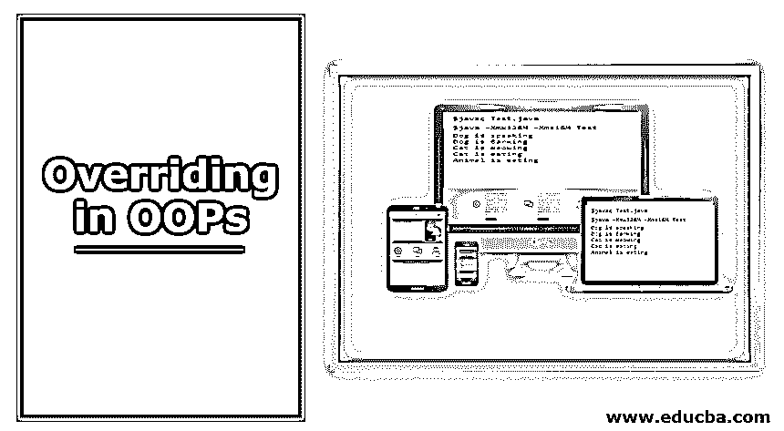
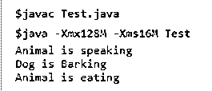
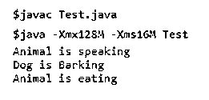
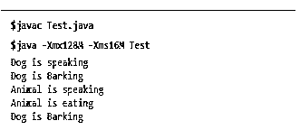
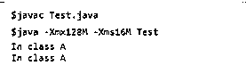
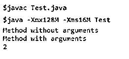

# 在 OOPs 中覆盖

> 原文：<https://www.educba.com/overriding-in-oops/>

## OOPs 中的覆盖介绍

在 oops 中实现继承概念时，所有父类函数都被它的所有派生类使用。如果一个派生类需要父类中声明的函数的特定实现，但使用相同的名称、相同的签名和相同的返回类型，则使用了一个覆盖特性。重写允许子类重新定义已经在其父类或超类中定义的函数。这样，通过在调用方法时指定类的对象，可以使用这两种定义。例如，假设父类和子类中都有一个 sum 函数，在调用该函数时，我们使用子类的对象，然后将调用子类中的方法，相反，如果使用父类对象，则调用父类中的方法。子类中的这个方法据说覆盖了超类中的方法。

### 需要方法重写

以下是解释的方法。

<small>网页开发、编程语言、软件测试&其他</small>

*   运行时多态性方法覆盖有助于在面向对象的编程语言(如 c++、java、c#等)中实现运行时多态性。
*   多态性意味着有多种形式，即一个签名和多个定义。在面向对象语言中，当派生类和父类具有相同的函数名和签名时，编译器一次性解析出它需要调用的定义。[运行时多态性](https://www.educba.com/runtime-polymorphism-in-java/)是指将一个方法定义绑定到一个在程序运行时调用的方法上。它允许实现多态性的“一个签名多个定义”方面。该特性使用动态方法调度，具有强大的面向对象设计理念，带来代码重用和健壮性。这个方法允许我们在不知道派生类的对象类型的情况下对它的任何派生类进行方法调用。
*   使用这个特性，可以对从超类继承的泛型函数实现一个专门的定义。

### 它在 OOPs 中是如何工作的？

下面的解释说明了它的工作原理:

*   哎呀，帮助我们[实现运行时多态性](https://www.educba.com/what-is-polymorphism/)，同时将一个类的特性继承到另一个类中。让我们看看在 OOPs 中重写的工作原理。后来，假设我们有一个超类动物，它有两个功能:说话和吃饭。有两个子类，cat 和 dog，扩展了超类名 animal。
*   这两个子类使用相同的函数，speak 和 eat，但改变了实现，但保持方法的签名相同。现在在我们的 main 方法中，如果你选择引用变量来调用这些函数，那么只有在运行时，才会决定需要调用哪个函数。例如，如果对象持有子类猫或狗的差异，则相应类的函数将被调用；如果对象持有父类的引用，那么动物类的函数将被调用。
*   这里我们应该看到，函数的调用不依赖于引用变量的类型。编译器在运行时决定这一点；只有它有助于实现运行时多态性。它还有助于在父类中实现方法的通用定义的方法的专用定义。

**代码:**

`class Animal{
//Overridden method
public void eat()
{
System.out.println("Animal is eating");
}
public void speak()
{
System.out.println("Animal is speaking");
}
}
class Cat extends Animal{
//Overriding method
public void eat()
{
System.out.println("Cat is eating");
}
public void speak()
{
System.out.println("Cat is meowing");
}
}
class Dog extends Animal{
//Overriding method
public void eat()
{
System.out.println("Dog is Barking");
}
public void speak()
{
System.out.println("Dog is speaking");
}
}
public class Test{
public static void main(String[] args){
Animal an=new Dog();
Animal an1 = new Cat();
Animal an2 = new Animal();
an.speak();
an.eat();
an1.speak();
an1.eat();
an2.eat();
}
}`

**输出:**

**Note: **A reference variable of child type cannot be used to hold a reference to the parent type.

### 重写方法的规则

以下是需要牢记的规则:

#### 规则一

父类的函数中声明的参数列表应该与子类中重写方法的定义中提到的参数列表相匹配。

**例如:**

父类中的方法

`public int test1(int a);`

子类中的一个方法——public string test1()；//这里不支持方法重写，因为返回类型和参数不同，但不会出现编译时错误。此方法将被视为子类的新方法。

#### 规则二

子类中存在的方法的返回类型必须与被重写的方法的返回类型相同或为其子类型。

**例如:**

父类中的方法

`public Object test1(int a);`

子类中的方法

`public String test1();`

**不正确**

父类中的方法

`public String test1(int a);`

子类中的方法

`public Object  test1();`

#### 规则三

父类的方法中存在的访问说明符必须与在子类中重写它的方法同等严格或更严格。

**不正确**

父类中的方法

`public int test1(int a);`

子类中的方法

`private  int  test1() ;  // more restrictive than public one`

#### 规则四

只能重写访问说明符为 public、protected 或 default 的实例方法。这是因为只有这个实例方法可以被它的子类继承，因此被称为被覆盖。如果父类中指定的实例方法是更具限制性的示例公共方法，那么它将不会在其子类中被继承，如果任何人在子类中定义了相同的方法，则该场景不会被视为方法重写，因为公共方法不能被继承，这不能被重写。

**例如:**

父类中的方法

`public int test1(int a); //can be inherited and overridden`

子类中的方法

`private  int  test1();`

**不正确**

父类中的方法

`private int test1(int a); //can not be inherited and overridden`

子类中的方法

`private int test1();//not overriding method of the parent class`

它被视为子类的一个新的私有方法

#### 规则五

可以使用 [super 关键字](https://www.educba.com/super-keyword-in-java/)来调用父类被其子类覆盖的函数。

`class Animal{
//Overridden method
public void eat()
{
System.out.println("Animal is eating");
}
public void speak()
{
System.out.println("Animal is speaking");
}
}
class Dog extends Animal{
//Overriding method
public void eat()
{
System.out.println("Dog is Barking");
}
public void speak()
{
super.speak(); // Here super keyword is used to call the speak function of the super class.i.e.Animal
}
}
public class Test{
public static void main(String[] args){
Animal an=new Dog();
Animal an2 = new Animal();
an.speak();
an.eat();
an2.eat();
}
}`

**输出:**

#### 规则六

它的子类不能覆盖一个类的构造函数，因为两个类的构造函数不能相同。

#### 规则 7

**异常处理**

*   如果父类方法不抛出异常，那么子类中的重写方法只允许抛出未检查的异常。如果[覆盖方法](https://www.educba.com/overriding-in-python/)显示一个检查过的异常，那么编译器将显示一个错误。
*   如果被覆盖的父类方法抛出异常，子类中的串联覆盖方法必须通过异常层次结构中相同级别或其子类型的异常，或者根本没有异常。

#### 规则八

在[多级继承](https://www.educba.com/multilevel-inheritance-in-c-plus-plus/)中方法覆盖也是可能的。

**代码:**

`class Creature {
//Overriding method
public void eat()
{
System.out.println("Creature  is eating");
}
public void speak()
{
System.out.println("Creature is speaking");
}
}
class Animal extends Creature{
//Overridden method
public void eat()
{
System.out.println("Animal is eating");
}
public void speak()
{
System.out.println("Animal is speaking");
}
}
class Dog extends Animal{
//Overriding method
public void eat()
{
System.out.println("Dog is Barking");
}
public void speak()
{
System.out.println("Dog is speaking");
}
}
public class Test{public static void main(String[] args){
Creature an=new Dog();
Animal an1 = new Animal();
Animal an2 = new Dog();
an.speak();
an.eat();
an1.speak();
an1.eat();
an2.eat();
}
}`

**输出:**

#### 规则九

**覆盖 Java 中的方法规则**

*   同步方法很容易被非同步方法覆盖，反之亦然。
*   抽象类或接口中存在的抽象方法[将被覆盖，以便为声明的方法提供特定的实现；否则，它将显示一个编译时错误。](https://www.educba.com/abstract-classes-in-javascript/)
*   定义一个与父类中的静态方法 present 同名的静态方法称为方法隐藏，而不是方法覆盖，因为它不实现运行时多态性。
*   不能重写最终方法。

#### 规则 10

**c++中的方法覆盖**

c++中的方法重写是通过将方法声明为虚拟的来实现的。在 c++中，[虚拟关键字用于](https://www.educba.com/virtual-keyword-in-c-sharp/)实现运行时多态性。而在 Java 中，默认情况下所有的函数都是虚拟的。

#### 规则 11

它不同于[方法重载](https://www.educba.com/method-overloading-in-c-sharp/)，因为它是一个运行时多态性的过程，而重载和方法是编译时多态性的一个例子。在方法重写中，必须保持方法的签名相同。当我们在方法返回类型或参数列表中做任何改变时，编译器会将其视为[方法重载](https://www.educba.com/method-overloading-in-java/)。

| **方法覆盖** | **方法重载** |
| `class A{
public void test(){
System.out.println("In class A");
}
}
class B extends A{
public void test(){
System.out.println("In class A");
}}public class Test{
public static void main(String[] args){
A a=new B();
a.test();
A b =new A();
b.test();
}}` | `class A{
public void test(){
System.out.println("Method without arguments");
}
public void test(int x){
System.out.println("Method with arguments");
System.out.println(x);
}}public class Test{
public static void main(String[] args){
A a=new A();
a.test();
a.test(2);
}
}` |

**输出:**

| 

 | 

 |

### 什么时候用？

让我们讨论一下如何使用它。

*   OOPs 提供了一个极好的继承特性，在超类和子类之间形成一个很大的层次结构，就是从较小的专门化到较大的专门化。
*   我们是否可以使用超类来提供一个框架，可以在它的所有子类中继承，并且子类中我们可以定义那些方法的不同功能。这是通过重写特性来实现的，其中可以向继承的方法 init 子类提供专门的功能。
*   它还通过提供变量集合和需要在其所有子类中实现的方法，帮助为多个类提供一个框架。

### 结论

糟糕，当概念被有效地使用时，它们使代码健壮并易于重用。这个特性增强了继承的使用，为父类的泛型方法在其子类中提供了特定的实现。这使用运行时多态性概念来触发方法的正确定义。动态方法调度只在运行时完成，它检查对象持有的调用方法的类的引用。该特性由各种规则引导，不适用于静态方法。我们可以在任何面向对象的语言中实现这一点，并使我们的程序更快更健壮。

### 推荐文章

这是在 OOPs 中重写的指南。在这里，我们讨论基本概念，重写在 OOPs 中是如何工作的，何时使用它，以及关于代码和输出的 11 条规则。您也可以浏览我们的其他相关文章，了解更多信息——

1.  [在 PHP 中覆盖](https://www.educba.com/overriding-in-php/)
2.  [在 JavaScript 中覆盖](https://www.educba.com/overriding-in-javascript/)
3.  [c#中的方法覆盖](https://www.educba.com/method-overriding-in-c/)
4.  [在 Java 中覆盖](https://www.educba.com/overriding-in-java/)

