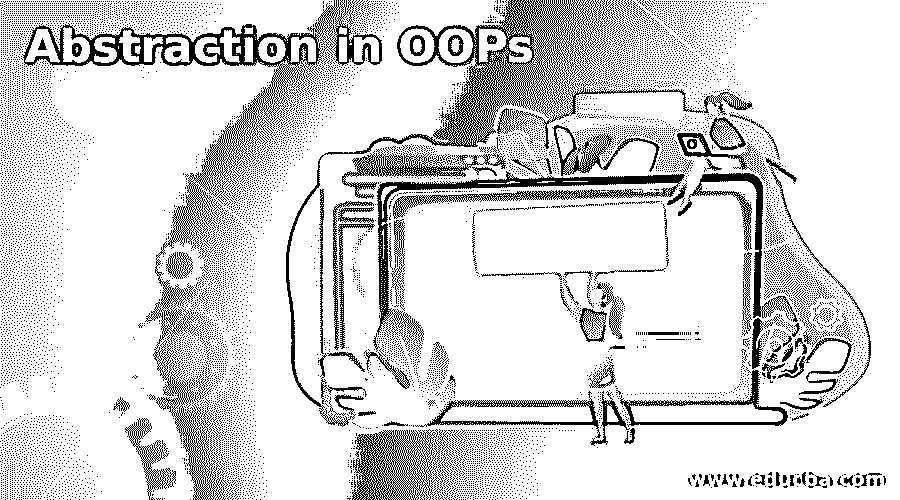
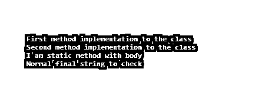

# 哎呀中的抽象

> 原文：<https://www.educba.com/abstraction-in-oops/>

## OOPs 中的抽象介绍

抽象是 OOPs 最重要的概念之一；它有助于向用户隐藏复杂性，并有助于只向用户显示重要的服务。我们有 Java 编程语言，它利用了抽象，能够对用户隐藏复杂的代码；我们只应该提供对用户有用的服务；在现实世界中，我们有许多解释可以定义面向对象编程语言中抽象的用法。让我们举一个例子，自动柜员机功能，电话，银行功能提供给用户，等等。我们不知道它们如何工作的内部实现，但是我们只应该使用它们提供的服务来避免所有的复杂性。在接下来的部分中，我们将继续它的内部工作，以及我们如何实现它以使应用程序更有效。

**语法**

<small>网页开发、编程语言、软件测试&其他</small>

正如我们所知，它是面向对象编程语言的一个概念，让我们来看看我们可以用来在程序中实现抽象的语法，见下文；

1)我们可以通过抽象类实现抽象:语法如下:

`abstract class Your_class_name{
// your logic goes here
}`

2)我们可以使用接口来实现 abstartcion:语法如下:

`interface name_of_interfcae{
// your logic goes here
}`

如你所见，我们可以通过使用抽象类和接口来实现 Java 中的抽象；在下一节中，我们将看到对这两者的更详细的解释，以便初学者更详细地理解这个概念。

### OOPs 中的抽象是如何工作的？

从上一节我们已经知道了为什么我们使用抽象，让我们看看它是如何在内部实现的。在现实世界的场景中，我们有很多在内部利用抽象的例子。它帮助我们向用户隐藏复杂的细节，并且帮助我们只向用户显示重要的部分。因为如果我们向他们展示实现，那么他们将什么也不懂。它基本上只为用户提供了实现的重要部分。在本节中，我们将举一个例子来理解它的内部实现；让我们开始吧；

1)假设我们去 ATM 机取钱；一开始，我们只知道它是如何工作的。在内部，它处理很多事情，就像它使用服务器、数据库和更多的东西来处理你的数据。它为我们提供了如此多的功能，帮助我们在更短的时间内执行所需的操作。我想提取一些钱，所以我会这样做，因为用户会选择提取选项并提取我想要的钱。但在内部，我们不知道它是如何工作的，所以它对用户是隐藏的，以保持简单，并为他们提供他们想要的必要服务。

2)此外，我们还有一个关于手机如何工作的问题，在接到电话时，我们只是接听电话。但是在内部，我们不知道它是如何工作的；他们还隐藏了用户的内部复杂性，只向用户提供电话接听服务。我们有如此多的选择，我们可以看到代码的复杂性，他们的工作对用户是隐藏的。

我们可以通过使用抽象类和接口来实现抽象；下面让我们仔细看看他们两个。'

**1)抽象类:**如果我们谈论抽象类，它用于提供抽象，但部分是因为它也包含抽象方法和非抽象方法。这意味着所有的东西都不会对用户隐藏。为了给抽象类提供实现，我们必须创建一个普通的类，在这个类中我们可以给抽象类提供实现，并给抽象方法提供我们自己的实现。下面参见参考代码，以便更好地理解。

**例如:**

`abstract class DemoAbs{
abstract void show(); // abstract method
public void getm(){
// normal method ..//
}
}`

**2)接口:**我们也可以使用一个接口，帮助我们提供 OOPs 100%中的抽象；因为接口内部定义的方法总是抽象的，所以我们使用“implements”关键字在 java 中实现接口。让我们仔细看看代码参考界面，见下文；

**例如:**

`Interface DemoInt{
void getm();
void getb(); // by default abstract
}`

这样，我们就可以在 OOPs 中实现抽象；根据我们的要求，它们有各自的优势。

### OOPs 中的抽象示例

下面是一个理解 OOPs 中抽象的简单例子:

**举例:**

a)抽象类别代码；

**例如:**

`package com.practise.tets;
public abstract class AbstractClassexmaple {
public static final String strTest = "Normal final string to check";
String msg = "";
AbstractClassexmaple(String msg){
this.msg = msg;
}
abstract void m1();
abstract void m3();
public static void m2(){
System.out.println("I am static method with body");
}
private void privateMethodCheck() {
System.out.println("i am priate method from abstract class !!");
}
}`

b)提供方法实现的类:

**例如:**

`public class AbstarctImpl extends  AbstractClassexmaple{
AbstarctImpl(String msg) {
super(msg);
}
@Override
void m1() {
System.out.println("First method implementation to the class");
}
@Override
void m3() {
System.out.println("Second method implementation to the class");
}
}`

c)启动类测试类以检查它是否工作；

**例如:**

`import java.lang.reflect.InvocationTargetException;
import java.lang.reflect.Method;
public class AbstractClassTest {
public static void main(String[] args) throws NoSuchMethodException, InvocationTargetException, IllegalAccessException {
AbstarctImpl abstarct =  new AbstarctImpl("testing constructr");
abstarct.m1();
abstarct.m3();
AbstarctImpl.m2();
System.out.println(AbstractClassexmaple.strTest);
}
}`

d)运行 main 类，查看上面代码的输出(见下文)；

**输出:**

### 结论

正如我们所看到的，抽象被用来向用户隐藏内部的复杂性，只向用户显示有用的部分。此外，我们可以为我们拥有的方法提供我们自己的实现，这意味着使代码可读和稳定的特定实现。

### 推荐文章

这是 OOPs 中的一个指南抽象。在这里，我们讨论内部工作，以及我们如何实现这一点，使应用程序更有效。您也可以阅读以下文章，了解更多信息——

1.  [Java 中的抽象](https://www.educba.com/abstraction-in-java/)
2.  [c++中的抽象](https://www.educba.com/abstraction-in-c-plus-plus/)
3.  [c++中的抽象类](https://www.educba.com/abstract-class-in-c-plus-plus/)
4.  [JavaScript 的抽象类](https://www.educba.com/abstract-classes-in-javascript/)

