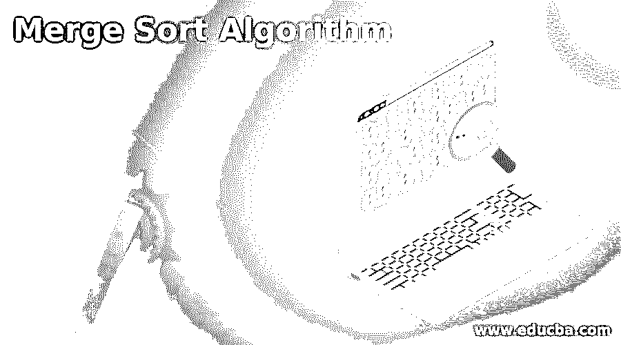
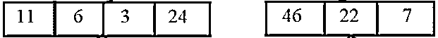
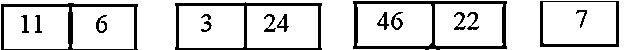
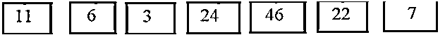
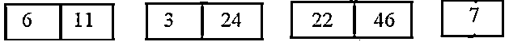
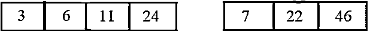
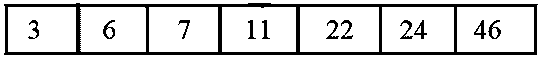
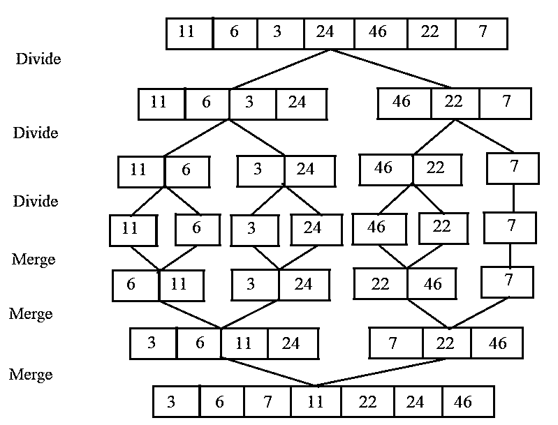
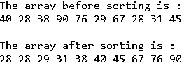

# 合并排序算法

> 原文：<https://www.educba.com/merge-sort-algorithm/>

## 合并排序算法简介

合并排序是一种分治算法，其原理是将一个列表分解成许多子列表，直到每个子列表只有一个元素，然后将这些子列表合并成一个排序列表。最佳情况、一般情况、最坏情况运行时间复杂度为*O(n log(n))*time；合并排序算法的特征如下

1.  将未排序的列表细分为 N 个子列表，每个子列表包含一个元素。
2.  组合两个独立列表的相邻对，生成一个包含两个元素的列表。N 现在将被转换成 N/2 个两种大小的列表。
3.  重复这个过程，直到你有一个单一的排序列表。

### 合并排序算法的工作原理

让我们举一个例子来理解合并排序算法的工作原理

<small>网页开发、编程语言、软件测试&其他</small>

给定的数组是[ 11，6，3，24，46，22，7 ]，在这种方法中一个数组被细分成若干个子数组。每个子阵列分别求解。

*   合并排序迭代地将整个数组分成两个相等的部分，直到达到单个值。7 个元素的数组被分成两个数组，如下所示

*   这对元素在原始数组中出现的顺序没有影响。现在再一次，把这两个数组分成两半。

*   再次分割这些数组，直到我们得到一个不能再分割的值。

*   接下来，比较每个列表中的元素，然后以排序的方式将它们合并到另一个列表中。例如，在第一个列表中，比较 11 和 6，并颠倒顺序。接下来，比较 3 和 24；它们的顺序正确。接下来，再次比较 46 和 22，将 22 放在 46 上。接下来，保持 7 不变。

*   接下来，在合并阶段的下一次迭代中比较两个数据值的列表，然后将它们按照排序顺序合并到一个找到的数据值列表中。

*   最终合并后，列表将如下所示。

最终答案是通过组合子阵列形成的，如下图所示

合并排序算法的伪代码–

`procedure merge_Sort( var array )
if ( length of a == 1 ) return array
var a1 as array = array[0] ... array[n/2] var a2 as array = array[n/2+1] ... array[n] a1 = mergesort( a1 )
a2 = mergesort( a2 )
return merge( a1, a2 )
end procedure
procedure merge( var a1 as array, var a2 as array )
var a3 as array
while ( a1 and a2 are not empty )
if ( a1[0] > a2[0] )
add a2[0] to the end of a3
remove a2[0] from a2
else
add a1[0] to the end of a3
remove a1[0] from a1
end if
end while
while ( a has elements )
add a[0] to the end of c
remove a[0] from a
end while
while ( a2 is not empty )
add a2[0] to the end of a3
remove a2[0] from a2
end while
return a3
end procedure`

merge_Sort()方法将数组分成两个子数组，并递归调用自身和 merge()方法。

merge()方法将组合数组的两个子数组，其中一个包含从 start 到 mid 的起始和结束位置，另一个包含从 mid+1 到结尾的位置。接下来，组合两个数组的起始元素。然后比较这两部分的元素，较小的值保存在备份数组中。最后，如果数组的一部分到达末尾，数组另一部分的所有元素将按照它们存在的顺序添加到辅助数组中。

### 合并排序算法示例

Java 中的合并排序算法示例，展示了该算法的工作原理

#### 示例#1

**代码:**

`// The program can be tested in Eclipse IDE, JAVA 11
package jex;
import java.util.*;
public class mergeSortClass
{
public static void merge(int arr[], int beg, int mid, int end)
{
int l = mid - beg + 1;
int r = end - mid;
int a1[] = new int [l];
int a2[] = new int [r];
for (int i = 0; i < l; ++i)
a1[i] = arr[beg + i];
for (int j = 0; j < r; ++j)
a2[j] = arr[mid + 1+ j];
int i = 0, j = 0, k = beg;
while ( i<l && j<r )
{
if (a1[i] <= a2[j])  {
arr[k] = a1[i];
i++;
}
else
{
arr[k] = a2[j];
j++;
}  k++;
}
while ( i < l )
{
arr[k] = a1[i];
i++;
k++;
}
while ( j < r )
{
arr[k] = a2[j];
j++;
k++;
}
}
public static void mergeSort(int arr[], int beg, int end)
{
if ( beg < end )
{
int mid = ( beg + end ) / 2;
mergeSort( arr, beg, mid );
mergeSort( arr , mid+1, end );
merge( arr, beg, mid, end );
}
}
public static void main(String args[])
{
int array[] = { 40, 28, 38, 90, 76, 29, 67, 28, 31, 45 };
System.out.println( "The array before sorting is :" );
for(int i = 0; i < array.length; i++)
{
System.out.print(array[i]+ " ");
}
mergeSort( array, 0, array.length-1);
System.out.println( "\n\nThe array after sorting is :" );
for(int i =0; i < array.length; i++)
{
System.out.print(array[i]+ " ");
}
}
}`

**输出:**

与上面的程序一样，创建了 mergeSortClass 类，它包含 merge()和 mergesort()方法。merge()方法合并数组的两个数组，其中一个数组的开始和结束位置分别从 start 到 mid，另一个数组的位置从 mid+1 到结尾。接下来，比较两个数组的对应元素，并将较小的元素分配给临时数组。当 anyone 数组结束时，另一个数组的所有元素将按照它们出现的顺序存储到临时数组中。mergeSort()方法将数组分成两个分支并递归调用自身，同时也调用 merge()方法。在 main 函数中，数字数组是，并在调用 mergeSort()方法之前和之后打印该数组，正如我们在上面的输出中所看到的。

### 结论

合并排序是一种分治算法，它将一个列表分成几个子列表，直到每个子列表只包含一个元素，然后将子列表合并成一个排序列表。最好情况、一般情况和最坏情况的运行时间复杂度都是 O(n log(n)。

### 推荐文章

这是一个合并排序算法的指南。在这里，我们还将讨论合并排序算法的介绍和工作原理，以及示例和代码实现。您也可以看看以下文章，了解更多信息–

1.  [冒泡排序算法](https://www.educba.com/bubble-sort-algorithm/)
2.  [Python 中的排序算法](https://www.educba.com/sorting-algorithms-in-python/)
3.  [C 语言中的 DFS 算法](https://www.educba.com/dfs-algorithm-in-c/)
4.  [Java 中的归并排序算法](https://www.educba.com/merge-sorting-algorithms-in-java/)

