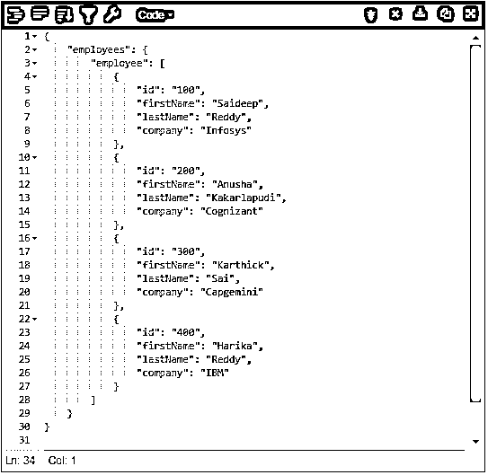
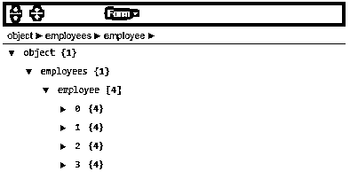
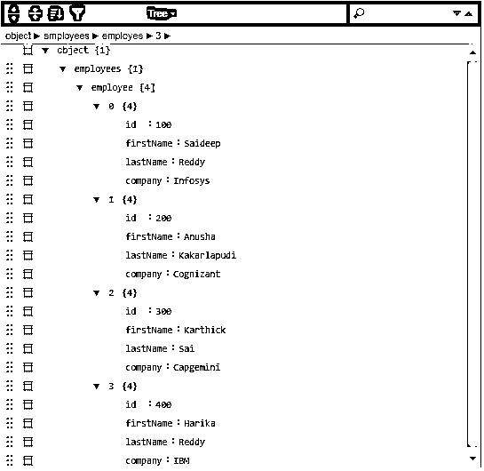
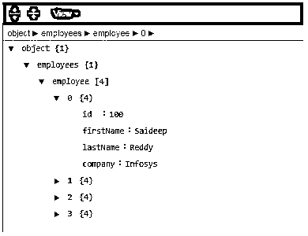
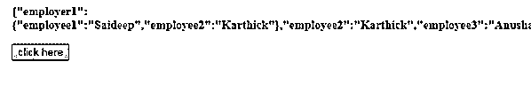
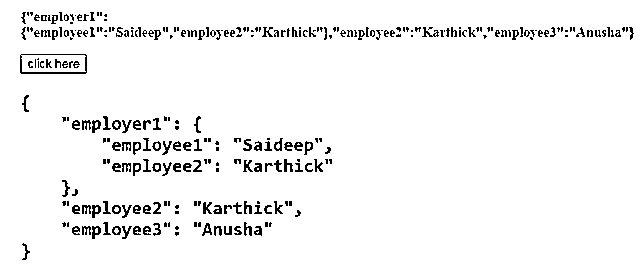
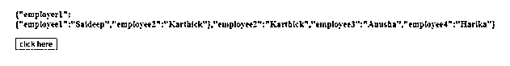
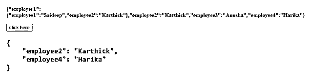
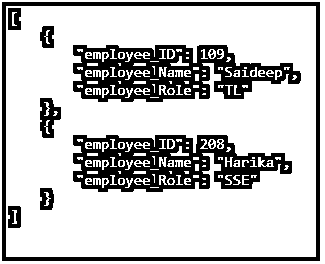

# JSON 漂亮

> 原文：<https://www.educba.com/json-pretty/>


## JSON Pretty 简介

“JSON Pretty ”,它已经广泛应用于软件行业。JSON Pretty，也称为' JSON Pretty Print '，有助于美化 JSON 数据并打印出来。“漂亮”美化 JSON 内容，“打印”打印美化后的 JSON 内容。今天，让我们看看 Pretty print 是如何工作的，它的语法，并用 Pretty Print 应用程序举例说明 Pretty。相反，我们也有许多漂亮的 JavaScript 打印库，帮助将 JSON 转换成任何结构化或可读的格式。

PrettyPrint 是一个帮助将各种格式转换成文本文件或任何可读格式的应用程序。格式约定可用于调整定位、间距、颜色对比、形状和大小以及许多其他修改，以便用户能够查看和理解内容。这些编程语言的漂亮打印机也被称为美化器。

<small>网页开发、编程语言、软件测试&其他</small>

**语法:**

`<pre> element tag is to prettify the JSON object`

就语法而言，输入数据以 JSON 格式提供，如下所示。

`{“sample”: {
“sample1”: [
{
“var”: “value1”,
“name”:”name_Value1”
},
{
“var”:”value2”,
“name”:”name_Value2”
},
{
“var”:”value3”,
“name”:”name_Value3”
}
] }
}`

### JSON Pretty 的例子

让我们考虑一些使用漂亮打印工具的例子，

#### 示例#1

这里我们将用空格美化 JSON 数据，4 个制表符

**代码:**

`{
"employees": {
"employee": [
{
"id": "100",
"firstName": "Saideep",
"lastName": "Reddy",
"company":"Infosys"
},
{
"id": "200",
"firstName": "Anusha",
"lastName": "Kakarlapudi",
"company":"Cognizant"
},
{
"id": "300",
"firstName": "Karthick",
"lastName": "Sai",
"company":"Capgemini"
},
{
"id": "400",
"firstName": "Harika",
"lastName": "Reddy",
"company":"IBM"
}
] }
}`

**输出:**




#### 实施例 2

对于上面的例子，我们将以表单格式显示内容，




#### 实施例 3

对于上面提到的同一个例子，我们将以树格式输出 JSON 输入。




#### 实施例 4

对于上面提到的同一个例子，我们将以视图格式输出 JSON 输入，




#### 实施例 5

我们将缩小/压缩输入 JSON，如下所示


#### 实施例 6

在这个例子中，我们给出了一个对象，并试图将它打印得漂亮，即易于阅读。通过使用

```
元素，我们可以使 JSON 数据变得漂亮，
```

**代码:**

`<!DOCTYPE html>
<html>
<head>
<body>
</head>
<p id="SAMPLE_UP" style=
"font-size: 15px; font-weight: bold; color: blue">
</p>
<button onclick="sample_Run();">
click here
</button>
<pre id="SAMPLE_DOWN" style=
"color:green; font-size: 20px; font-weight: bold;">
</pre>
<script>
var sample_up = document.getElementById("SAMPLE_UP");
var sample_down = document.getElementById("SAMPLE_DOWN");
var obj = {
"employer1": {
"employee1": "Saideep",
"employee2": "Karthick"
},
"employee2": "Karthick",
"employee3": "Anusha"
};
sample_up.innerHTML = JSON.stringify(obj);
function sample_Run() {
sample_down.innerHTML = JSON.stringify(obj, undefined, 4);
}
</script>
</body>
</html>`

**输出:**

我们已经声明了一个 JSON 对象并将它存储到一个变量中，正如我们之前在 JSON.stringify()上读到的，使用这个方法将 JS 对象转换成字符串。这里我们使用的空间大小为 4，JSON.stringify(obj，replacer，space)将 JS 对象转换为 Pretty 格式的字符串。




**点击按钮**后




#### 实施例 7

**代码:**

`<!DOCTYPE html>
<html>
<head>
<body>
</head>
<p id="SAMPLE_UP" style=
"font-size: 15px; font-weight: bold; color: blue">
</p>
<button onclick="sample_Run();">
click here
</button>
<pre id="SAMPLE_DOWN" style=
"color:green; font-size: 20px; font-weight: bold;">
</pre>
<script>
var sample_up = document.getElementById("SAMPLE_UP");
var sample_down = document.getElementById("SAMPLE_DOWN");
var obj = {
"employer1": {
"employee1": "Saideep",
"employee2": "Karthick"
},
"employee2": "Karthick",
"employee3": "Anusha" ,
"employee4": "Harika",
};
sample_up.innerHTML = JSON.stringify(obj);
function sample_Run() {
sample_down.innerHTML = JSON.stringify(obj,
['employee2', 'employee4'], 4);
}
</script>
</body>
</html>`

**输出:**

这里我们指定打印对象的对象属性。




**点击按钮**后




我们也可以用 Python 来打印漂亮的图片，

*   Json 模块转储()可用于美化 JSON 数据。
*   dumps()方法从 JSON 对象返回 JSON 字符串
*   这里我们将使用 indent 参数来定义字符串输出的缩进级别。

#### 实施例 8

**代码:**

`import json
json_data = '[{"employee_ID":109,"employee_Name":"Saideep","employee_Role":"TL"},' \
'{"employee_ID":208,"employee_Name":"Harika","employee_Role":"SSE"}]'
json_object = json.loads(json_data
json_str = json.dumps(json_object, indent=4)
print(json_str)`

**输出:**




json.loads()用于从 json 字符串创建对象。

Json.dumps()方法接受对象并返回 Json 字符串；indent 参数用于指定输出字符串的缩进。

让我们好好总结一下这篇文章。我们已经看到了 Pretty 是什么，以及它在 Javascript 和 Python 中是如何工作的。对于 Javascript，它使用

```
标记，在 Python 中，它使用 loads()和 dumps()方法。我们还直接看到了 Pretty Print 应用程序，它接收 JSON 输入，并通过几个例子进行相应的修饰。它还用 JS 和 Python 举例说明了 Pretty。Pretty 可以美化 JSON 输出的大小、颜色、缩进、格式如树、简单文本、视图或编码形式。
```

### 推荐文章

这是一个 JSON Pretty 的指南。这里我们讨论 JSON Pretty 在 Javascript 中是如何工作的，并通过例子来更好地理解。您也可以阅读以下文章，了解更多信息——

1.  [SQL 中的 JSON](https://www.educba.com/json-in-sql/)
2.  [Java 中的 JSON](https://www.educba.com/json-in-java/)
3.  [Python 中的 JSON](https://www.educba.com/json-in-python/)
4.  [JSON 是什么？](https://www.educba.com/what-is-json/)


