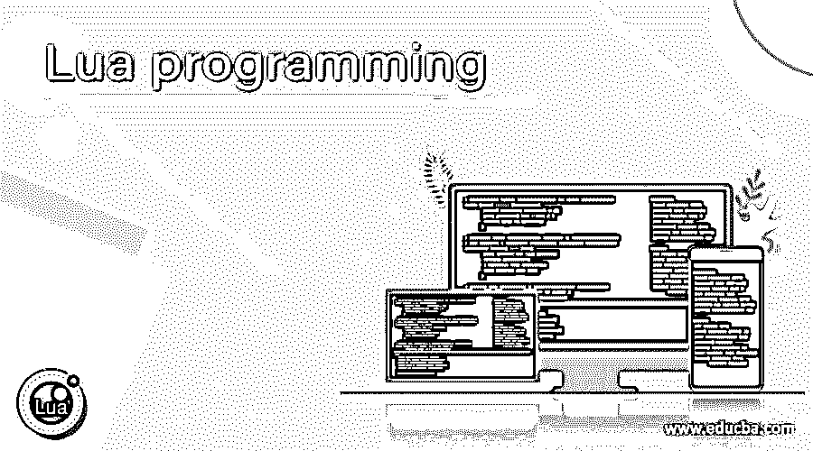

# Lua 编程

> 原文：<https://www.educba.com/lua-programming/>

## Lua 编程介绍

Lua 是一种高级、高效、多范例、轻量级、可移植、易于嵌入的脚本语言。Lua 是一种开源编程语言，构建在 C 编程语言之上。Lua 支持过程化编程、函数式编程、面向对象编程、数据驱动编程和数据描述。它在从大型服务器系统到小型移动应用程序的多种平台上都有价值。

Lua 编程语言主要被设计成容易嵌入到其他应用程序中。它结合了简单的过程语法和强大的数据描述结构。Lua 编程语言是通过解释基于寄存器的虚拟机的字节码来交叉运行的，编译后的字节码是用 ANSI C 编写的，它有简单的 C API，可以嵌入到应用程序中。它还具有带增量垃圾收集的自动内存管理，这使它成为配置、快速原型和脚本的理想选择。

<small>网页开发、编程语言、软件测试&其他</small>

### 为什么我们需要 Lua 编程？

*   **Lua 是一种快速语言-**Lua 提供了良好的性能。Lua 声称“和 Lua 一样快”,这是其他脚本语言的愿望。由于 Lua 良好的性能，大型应用程序都是用它编写的。几个基准测试表明它是最快的语言，在现实生活中也是如此。LuaJIT，它是 Lua 的独立实现，使用实时编译器提供更高的性能。
*   Lua 是一种可移植的语言-Lua 是一种可移植的语言，它有一个标准的 C 编译器。它可以在所有我们听说过的机器上运行，包括 Unix(各种版本)和 Windows，windows CE，嵌入式微处理器(如 Rabbit 和 ARM，用于像 Lego MindStorms 这样的应用程序)，移动设备(运行 Android，Symbian，iOS，BREW，Windows Phone)，IBM 大型机等等。它是用 ANSI C ∩ ANSI C++编写的，避免了标准的黑暗角落。
*   **Lua 是一种嵌入式语言—**Lua 是一种嵌入式语言，可以很容易地嵌入到应用程序中。Lua 提供了用其他语言编写的库，这使得用 Lua 进行扩展变得很容易。Lua 提供了简单的 API，这些 API 是简单的类型和低级操作，它允许与用其他语言编写的代码紧密集成。Lua 嵌入 C/C++、Java、Perl、Ruby、Fortran、C#、Ada 等。
*   **Lua 是小型语言—**Lua 5 . 4 . 2 有源代码和文档，解压缩时需要 1.3M，压缩时需要 346K。源代码只有不到 20K 行的 C 代码。它提供了删除库的简单方法。
*   **Lua 是一种简单但功能强大的语言—**Lua 从根本上设计为提供实现特性的元机制，而不是直接在语言中提供大量特性。它的完整手册只有 100 页。它提供了机制，而不是政策。
*   **Lua 是自由语言—**Lua 编程语言软件是自由开源的软件，只需要下载使用即可。它是在 MIT 许可(一个非常自由的许可)下发布的。它可以用于任何目的，作为商业目的，也是绝对免费的。

### Lua 编程是如何工作的？

Lua 编程提供了两种模式交互模式编程和默认模式编程。交互模式编程允许一个接一个地输入指令，并立即得到结果。例如，我们可以使用以下语句打印一条消息

打印(“你好”)

一旦我们按下 enter，我们将得到一个 Hello 输出。

下一种模式，默认模式编程允许将指令分组到一个文件中，并执行该文件，直到脚本完成。例如，我们可以在默认模式下使用以下语句打印消息–

msg = '你好'

print("消息是"，msg)

保存文件的方式。一旦我们执行了这个文件，我们将得到一个输出“消息是你好”。

### Lua 编程的优点和缺点

以下是下面提到的优点和缺点

#### 优势

1.  它是轻量级的，有一个实时编译器。
2.  Lua 语言完全用 C 语言编写，易于操作。
3.  它是一种快速的语言，具有快速的响应时间。
4.  它有能力非常容易地记录一切。
5.  它是一种可移植的语言。
6.  它是免费的。

#### 不足之处

1.  Lua 的所有代码都不容易获得，其中一些需要手工编码。
2.  它有一个非常小的用户群体，除了 Perl 和 Python 语言之外，还相对不为人知。
3.  它很少用于独立的编程语言，通常它被用作单个程序的嵌入式脚本语言。

### Lua 编程职业

Lua 是一种小型编程语言，它应用于从大型应用到小型应用，从大型服务器系统到小型移动应用。它在许多视频游戏开发中使用，并且主要被程序员用作脚本语言。

Lua 的一些职业选择是

*   初级程序员/软件工程师/编码员/技术人员/计算机用户-职业生涯从初级程序员或软件工程师开始，持续 3-4 年。职责主要是编码，参与代码评审，调试和技术文档。
*   **机械设计师/高级机械设计师/电脑/手机游戏程序员—**机械设计师，你需要在那里构建、实现以玩家为中心的功能，如武器射击、移动、武器机械、穿越等。

### Lua 编程的使用

Lua 编程用于许多不同用途的应用，如可访问性、业务逻辑、汽车、教育、命令行增强器、数据库管理、飞行模拟器、文件管理器、游戏引擎、系谱、游戏、家庭自动化、图形、硬件(嵌入式)、图像处理、ide、互联网、杂项、机器对机器、恶意软件、操作系统和窗口管理器、多媒体、模式识别、物理模拟器、包管理器、项目管理、富文本编辑器、纯文本编辑器、机器人技术、收件箱、实用程序、排版等等。

### 结论

Lua 是一种高级、高效、多范例、轻量级、可移植、易于嵌入的脚本语言。也是一种开源语言，可以很容易地下载、安装和使用。上面我们也讨论了它的优点、缺点、前景和应用。

### 推荐文章

这是 Lua 编程指南。这里我们讨论 Lua 编程是如何工作的，以及 Lua 的优缺点。您也可以看看以下文章，了解更多信息–

1.  [最佳编程语言](https://www.educba.com/best-programming-languages/)
2.  [后端编程语言](https://www.educba.com/back-end-programming-languages/)
3.  [c++中的套接字编程](https://www.educba.com/socket-programming-in-c-plus-plus/)
4.  [网络编程语言](https://www.educba.com/web-programming-languages/)

