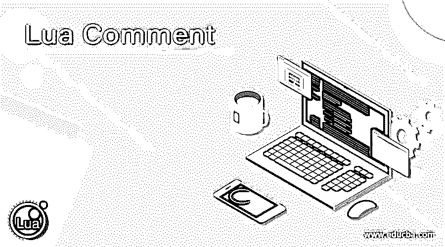

# Lua 注释

> 原文：<https://www.educba.com/lua-comment/>

## Lua 注释的定义

Lua 注释是对源代码信息有用的函数，并且不在 Lua 解释器中执行。Lua 注释是用于忽略 Lua IDE 中不需要的编程和主要源代码信息的操作符。Lua 注释有助于理解主要源代码，并提供关于不执行代码的解释或信息。Lua 注释是一个运算符，用于在文本编辑器中提供有关代码的可读信息，但不从 Lua 编译器和 Lua 解释器中执行。Lua 注释是一小段文本或信息，用于帮助人们理解关键代码或代码逻辑，并防止 Lua 软件执行。

**语法:**

<small>网页开发、编程语言、软件测试&其他</small>

*   Lua 单行注释语法如下。

`-- The Lua comment writes here…`

**描述:**

*   双连字符(–)符号对于文本编辑器中的单行注释非常有用。
*   该连字符一直工作到该行的最后一个字符或标点符号。

Lua 多行注释语法如下。

`--[[ write not required code or multiple line information here… ]]`

**描述:**

*   带有双方括号符号的双连字符用于文本编辑器中的多行注释。
*   注释文本或多行写在括号内。
*   临时代码或注释可以写在 Lua 的多行注释中。

Lua 单行和多行注释语法的组合如下。

`--[[
-- The local variable print here…
local variable = 44
print (variable)
]]`

**描述:**

*   单行注释语法在多行注释语法中使用。
*   单行注释是多行注释、批注和临时代码的简短文本。

### 注释在 Lua 中是如何工作的？

*   **第一步:**

Lua 文本编辑器、Lua 编译器和 Lua 解释器根据操作系统和软件版本安装在您的计算机中。

**或**

如果您没有软件，那么您可以使用 Lua 在线 ide 进行编码，并开始 Lua 编程。

*   **第二步:**

Lua 文件使用。lua 扩展并写了一个源代码。

文件名:Luacomment.lua

*   **第三步:**

如果用户需要单行注释，那么就写 Lua 单行注释语法。

`-- The Lua comment writes here…`

如果用户需要多行注释，那么就写 Lua 多行注释语法。

`--[[ write not required code or multiple line information here… ]]`

编写 Lua 注释的演示示例。

`Filename:luacomment.Lua
--show the local variable of Lua language.
print ("This is Lua comment demo...")
--[[local variable = 903
print (variable)
]]`

### 例子

让我们讨论 Lua 注释的例子。

#### 示例 1: Lua 单行注释示例和输出

**代码:**

`-- function prints a minimum number of the given two numbers.
function minimum(fnumber, snumber)
-- use if loop for condition statement.
if (fnumber < snumber) then
--return the number as per condition statement.
return fnumber;
else
return snumber;
end
--end the function method...
end
--print the minimum number here...
print ("the minimum number is", minimum(13, 17))`

**描述:**

*   双连字符在许多地方被用来描述代码。
*   如果想在编码中显示单行或小文本，那么使用单行语法。
*   上面的例子显示了五个 Lua 注释来创建可读的代码。
*   这种带有语句行的双连字符不会在 Lua 编译器和 Lua 解释器中执行。

**输出:**

#### 示例 2: Lua 多行注释示例和输出

**代码:**

`--[[ function prints a minimum number of the given two numbers. ]] function minimum(fnumber, snumber)
--[[if (fnumber < snumber) then
return fnumber;
else
return snumber;
end
]] if (fnumber < snumber) then
final = fnumber;
else
final = snumber;
end
return final
end
--[[print the minimum number here...
print ("the minimum number is", minimum(13, 17))
]] print ("the minimum number is", minimum(49, 17))`

**描述:**

*   带有双方括号符号的双连字符在许多地方用于描述代码或避免代码执行。
*   如果代码的描述或替换想要显示在主源代码中，那么使用多行语法。
*   上面的例子显示了三个 Lua 注释来创建可读和可理解的代码。
*   第一个“if”循环不执行，但第二个“if”循环在源代码中执行。
*   由于 Lua 注释，第一个 print 语句在源代码中不起作用。
*   这种多行注释语法不影响 Lua 编译器和 Lua 解释器中的源代码。

**输出:**

#### 示例 3:单行和多行 Lua 注释示例和输出的组合

**代码:**

`--[[ function prints a minimum number of the given two numbers. ]] function minimum(fnumber, snumber)
-- use if loop for condition statement.
if (fnumber < snumber) then
--return the number as per condition statement.
return fnumber;
else
return snumber;
end
--[[
-- use if loop for condition statement.
if (fnumber < snumber) then
--return the number as per condition statement.
final = fnumber;
else
final = snumber;
end
return final]] end
--[[
print the minimum number here...
print ("the minimum number is", minimum(13, 17))
]] print ("the minimum number is", minimum(49, 39))`

**描述:**

*   在第二个“if”循环源代码中使用的单行 Lua 注释。
*   第二个循环代码是第一个“if”循环源代码的替换代码。
*   代码的信息用双连字符写在 Lua 注释源代码里面。
*   您可以查看示例及其输出，了解 Lua 的注释是如何工作的。

**输出:**

#### 示例 4:基本的 Lua 注释示例和输出

**代码:**

`--show the local variable of the Lua language.
print ("This is Lua comment demo...")
--[[local variable = 903
print (variable)
]]`

**输出:**

### 结论

Lua 注释帮助用户理解复杂的源代码和算法的工作流程。Lua 注释创建了不需要任何执行的可读的、有吸引力的、简单的代码。Lua 注释为开发人员创建了有吸引力的、优雅的源代码。

### 推荐文章

这是一个 Lua 注释的指南。这里我们讨论定义，注释如何在 Lua 中工作，以及代码实现的例子。您也可以看看以下文章，了解更多信息–

1.  [XML 注释](https://www.educba.com/xml-comments/)
2.  [Perl 注释](https://www.educba.com/perl-comments/)
3.  [红宝石评论](https://www.educba.com/ruby-comments/)
4.  [PHP 中的注释](https://www.educba.com/comments-in-php/)

