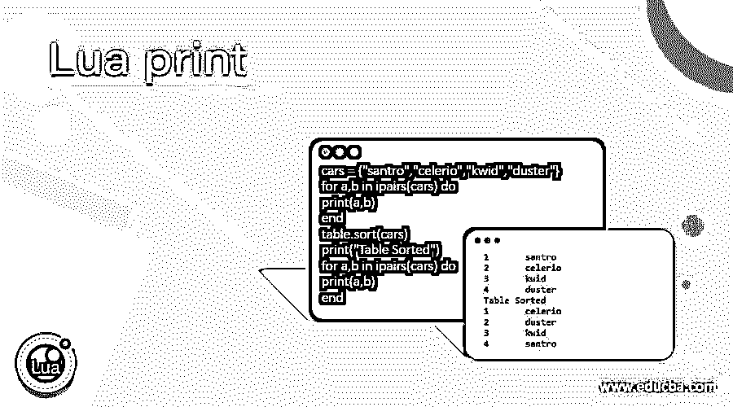
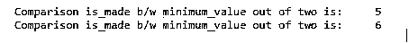
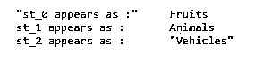
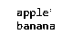
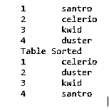

# 月球印刷公司

> 原文：<https://www.educba.com/lua-print/>

## Lua 打印的定义

Lua 编程语言中的 Lua print 是一个内置函数，用于在控制台中打印所需的语句。Lua print 有很多优点，特别是在开发和实现方面，因为程序员经常需要这个 print 函数来调试或打印确认所需的消息。使用 Lua print 的方法有很多，比如将传递的参数输出到控制台，将语句打印成两行，等等。

**语法:**

<small>网页开发、编程语言、软件测试&其他</small>

Lua 打印的语法流程如下:

`Optional_function_scope fnction_name (arg1, arg2, arg3…arg_n);
Function_body
Return_type`

*   Optional_function_scope:表示函数或变量的作用域，如 local 或 global。
*   函数体:函数体是函数的内容。
*   Return_type:返回类型是需要返回的值。

### Lua 中的打印功能是如何工作的？

*   Lua 是一种编程语言，用于借助 Lua print 等内置函数编写和确认程序员。
*   调用 Lua print 函数有助于为开发和实现提供一个更好的视图，因为它有助于使整个编码变得有趣和易于采用。
*   Lua print 函数非常容易使用和操作，在输入一个输入之后，它会在控制台中给出输出，用于打印所需的结果。
*   Lua 中的函数是最好使用的特性，因为它包含许多内置函数，用于使用和操作一些括号和算术运算。我们只需要调用函数，就这样。
*   一旦函数被调用，函数中的所有代码开始执行，并输出必要的输入到函数和代码中。
*   如果与 print 函数相同的函数没有任何值来打印消息或表明消息是否为空，那么在这种情况下，记住函数需要最少的最小值才能正常工作，并且必须通过在括号中提供逗号分隔的列表，以任何方式在括号中提供这些值，这一点非常重要。
*   大括号中提供的值被函数用来完成其工作，这些值被称为参数，在 Lua 编程语言的打印函数中也起着非常关键的作用。
*   并不强制要求任何函数都接受任何参数，这取决于函数通常只根据要求接受某些类型的参数的要求。
*   假设有一个场景，函数想要打印句子，那么在这种情况下，它将主要考虑字符串数据类型作为参数。字符串数据类型主要由字符和字母组成，构成任何句子。
*   在 Lua 中实现和执行编码并不复杂，但这取决于在基本开发和实现中遇到打印函数时需要记住的一些基本东西。
*   基本的工作是，无论何时调用函数，它都将字符串、数组或任何数据结构作为输入显示为输出。
*   Lua print 中值得注意的一点是，print 函数会自动在试图打印的内容的末尾添加一个新行，所以如果 print 函数被调用两次，那么分隔两个 print 语句的换行符会自动出现，没有任何其他特殊字符。

### 例子

让我们讨论 Lua 打印的例子。

#### 示例#1

这个程序演示了在查找和比较输出中显示的打印函数中的最小值时调用的打印函数。

**代码:**

`function min(a_0, b_1)
if (a_0 < b_1) then
rsltnt_vl = a_0;
else
rsltnt_vl = b_1;
end
return rsltnt_vl;
end
print("Comparison is_made b/w minimum_value out of two is: ",min(5,12))
print("Comparison is_made b/w minimum_value out of two is: ",min(6,18))`

**输出:**

#### 实施例 2

此程序演示了带有一些值的字符串，并调用 print 函数来打印带有输出中所示值的字符串。

**代码:**

`st_0 = "Fruits"
print("\"st_0 appears as :\"",st_0)
st_1 = 'Animals'
print("st_1 appears as :",st_1)
st_2 = [["Vehicles"]] print("st_2 appears as :",st_2)`

**输出:**

#### 实施例 3

这个程序演示了一个带有 Lua print 函数的数组的工作原理，它打印了数组中的值，如输出所示。

**代码:**

`arr_0 = {}
for j_vl=5,8 do
arr_0[j_vl] = {}
for l=9,11 do
arr_0[j_vl][l] = j_vl*l
end
end
for j_vl=5,8 do
for l=9,11 do
print(arr_0[j_vl][l])
end
end`

**输出:**

#### 实施例 4

这个程序演示了打印平均变量，并对函数中的参数进行操作，如输出所示。

**代码:**

`function avg_0(...)
rslt_vl = 0
local arg_1 = {...}
for j,k in ipairs(arg_1) do
rslt_vl = rslt_vl + k
end
return rslt_vl/#arg_1
end
print("The avg_val is",avg_0(8,6,3,4,5,2))`

**输出:**

#### 实施例 5

这个程序演示了用于遍历所需数组的有状态迭代器，然后调用 Lua print 函数进行确认，如输出所示。

**代码:**

`ar_3 = {"apple", "banana"}
function elmnt_itrt (collection)
local indx = 0
local count = #collection
return function ()
indx = indx + 1
if indx <= count
then
return collection[indx] end
end
end
for elmnt in elmnt_itrt(ar_3)
do
print(elmnt)
end`

**输出:**

#### 实施例 6

这个程序演示了排序表，它将在输出中显示的数组中打印排序后的汽车。

**代码:**

`cars = {"santro","celerio","kwid","duster"}
for a,b in ipairs(cars) do
print(a,b)
end
table.sort(cars)
print("Table Sorted")
for a,b in ipairs(cars) do
print(a,b)
end`

**输出:**

### 结论

Lua 是一种编程语言，非常容易采用和理解，而且非常灵活。它有助于使 Lua 打印使用等内置功能变得非常关键。由于它的通用性和易用性，程序员对使用和采用这种编程语言来开发和实现各种项目很感兴趣。

### 推荐文章

这是 Lua 打印指南。这里我们讨论 Lua 中打印函数的定义、语法、参数以及如何工作，并给出代码实现的例子。您也可以看看以下文章，了解更多信息–

1.  [Perl 打印哈希](https://www.educba.com/perl-print-hash/)
2.  [C 语言中的 fprintf(](https://www.educba.com/fprintf-in-c/)
3.  [PHP 中的 print _ r()](https://www.educba.com/print_r-in-php/)
4.  [什么是打印机？](https://www.educba.com/what-is-printer/)

