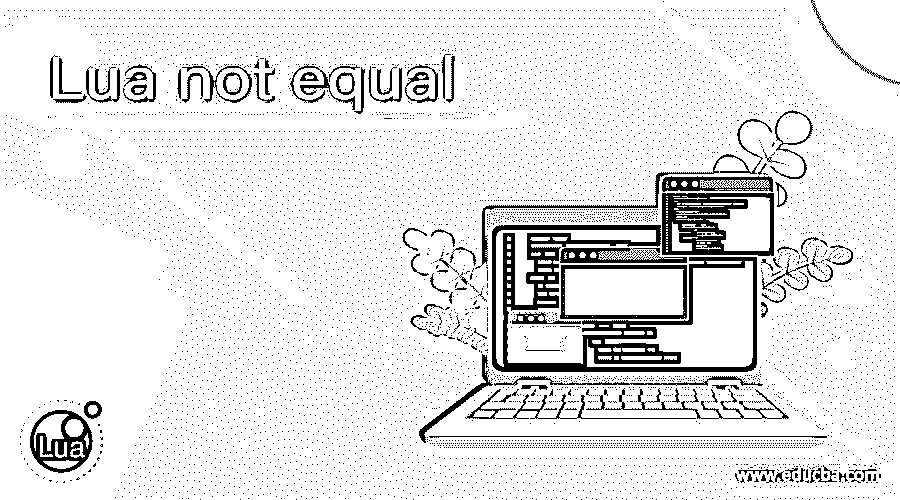
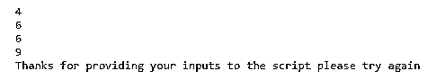
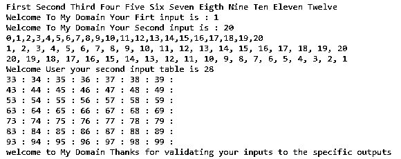
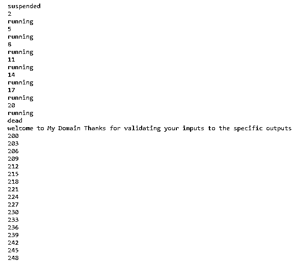
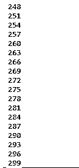

# Lua 不相等

> 原文：<https://www.educba.com/lua-not-equal/>

## Lua 不相等简介

在 Lua 脚本中,“不等于”被定义为运算符之一，有助于验证前端和后端的用户输入条件,“~=”是运算符符号，用于检查用户输入条件，即两个操作数的值是否满足用户要求，并将它们进行比较，以便在一些条件循环语句的帮助下执行应用工作流的下一步。该运算符任务在脚本中自动和手动执行，这些运算符仅返回布尔条件，如 true 或 false。

**语法:**

<small>网页开发、编程语言、软件测试&其他</small>

基本上，Lua 脚本有默认的关键字、变量和方法，用于在系统和基于 web 的应用程序中执行操作。同样，not equal 是一个关系操作符，用于检查前端和后端的用户输入数据，以便进行验证。通过使用一些条件语句，它将适用于程序员的角度。

`variable name1 =input values
variable name2 =input values
conditional statements(if,do,for,while etc) (variable name1 ~= variable name2)
then// keyword
-----some script code logics it depends upon the user requirements---`

在上面的代码中，是在脚本中使用和验证不等于(~=)运算符的语法之一。我们可以使用其他关系操作符，这取决于程序员的想法和基于项目的要求。

### Lua 中的不等号运算符是如何工作的？

一般来说，Lua 脚本基于脚本上使用的一些类型的操作符，它需要项目和应用程序来进行身份验证和非身份验证。与此类似，not equal(~=)是一种关系运算符，它只返回一组布尔语句，如 true 和 false。如果两个操作数(用户输入)满足用户条件，则返回 true，否则将返回 false 语句。这些类型的运算符用于测试质量和数量项目，主要取决于等式的否定，即似乎与等式条件相反。所以我们可以把它用于其他任何类型的值的关系运算符，这将是两个部分的比较。假设如果两个操作数值是不同的数据类型，Lua 脚本也认为它是一组不同的值，否则它根据它们的数据类型比较这些值。基本上,“nil”是脚本中用于比较或等同于自身的值。使用这个操作符，我们可以比较其他类型，比如脚本使用的表和函数，它可以是默认函数，也可以是用户定义的函数。借助于它们的实例，操作者被起诉并将其应用于另一种类型的变量。

#### 示例#1

**代码:**

`vars = {}
first = 3
second = 3
for x=2,first do
for y=2,second do
vars[x*second +y] = x*y
end
end
for x=2,first do
for y=2,second do
print(vars[x*second +y])
end
end
local p = "Second"
if p ~= "Second" then
print("welcome to My Domain Thanks for validating your inputs to the specific outputs")
else
print("Thanks for providing your inputs to the script please try again")
end`

**样本输出:**

在上面的例子中，我们使用了不等于(~=)运算符来验证输入。在这里，我们使用 for 循环来迭代这些值，通过使用表达式“vars[x*second +y]”，它可以计算这些值并在用户输出控制台上打印出来。

#### 实施例 2

**代码:**

`demo = {"First", "Second", "Third", "Four", "Five",
"Six", "Seven", "Eigth", "Nine", "Ten", "Eleven",
"Twelve"}
for p, q in pairs(demo) do
io.write(q, " ")
end
print()
x = {}
for j = 1, 20 do
x[j] = j
end
io.write("Welcome To My Domain Your Firt input is : ", x[1], "\n")
io.write("Welcome To My Domain Your Second input is : ", #x, "\n")
table.insert(x, 1, 0)
print(table.concat(x, ","))
table.remove(x, 1)
print(table.concat(x, ", "))
table.sort(x, function(l,m) return l>m end)
print(table.concat(x, ", "))
y = {}
for j = 1, 15 do
y[j] = {}
for k = 0, 9 do
y[j][k] = tostring(j) .. tostring(k)
end
end
io.write("Welcome User your second input table is ", y[2][8], "\n")
for j = 3, 9 do
for k = 3, 9 do
io.write(y[j][k], " : ")
end
print()
end
if demo ~= "Second" then
print("welcome to My Domain Thanks for validating your inputs to the specific outputs")
else
print("Thanks for providing your inputs to the script please try again")
end`

**样本输出:**

在第二个示例中，我们可以创建以行和列格式存储数据的表。通过使用表包的默认方法，我们可以排序和删除表数据。通过使用不等运算符，我们可以验证脚本上的用户输入。该循环将仅针对给定的数据限制(1 到 15、1 到 20 等)执行。我们还可以反转输入数字，将输出打印为 3 到 9，因为最后一个 for 循环将迭代起始值为 3、结束值为 9 的值。

**例 3**

**代码:**

`vars = coroutine.create(function()
for j= 2, 20, 3 do
print(j)
print(coroutine.status(vars))
if i == 5 then coroutine.yield() end
end end)
print(coroutine.status(vars))
coroutine.resume(vars)
print(coroutine.status(vars))
vars1 = coroutine.create(function()
for k = 200, 300, 3 do
print(k)
end end)
if k ~= 201 then
print("welcome to My Domain Thanks for validating your inputs to the specific outputs")
else
print("Thanks for providing your inputs to the script please try again")
end
coroutine.resume(vars1)
coroutine.resume(vars)`

**样本输出:**

在最后一个例子中，我们使用协程作为 Lua 脚本的默认方法。它使用一些活动，比如处理非对称调用，并且当我们需要使用 yield 方法时，它用于暂停活动。该过程将继续，直到协程包的执行过程完成。

### 结论

Lua 用户将使用一些轻量级的应用程序，如游戏开发者，其他基于网络的应用程序，图像处理技术。这些应用程序在本质上对用户更有吸引力和用户友好，因此当我们创建应用程序时，我们可以根据用户需求使用一些操作符、关键字和函数来创建应用程序。

### 推荐文章

这是一个 Lua 不相等的指南。这里我们讨论 Lua 中不等于运算符的定义、语法和工作原理。和代码实现示例。您也可以看看以下文章，了解更多信息–

1.  [Laravel 验证数组](https://www.educba.com/laravel-validate-array/)
2.  [PHP 将 XML 放入数组](https://www.educba.com/php-xml-into-array/)
3.  [Perl 数组长度](https://www.educba.com/perl-array-length/)
4.  [JavaScript 循环数组](https://www.educba.com/javascript-loop-array/)

