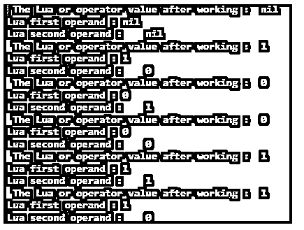
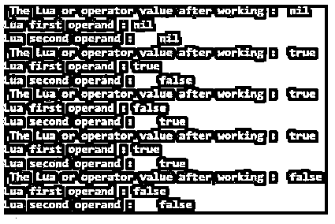
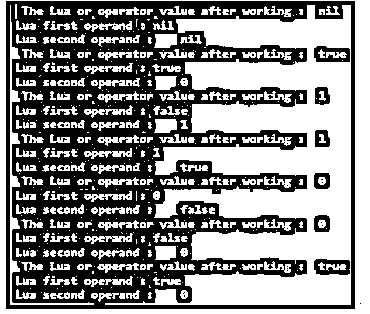
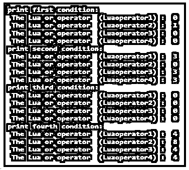

# Lua 或

> 原文：<https://www.educba.com/lua-or/>

## Lua 或简介

Lua or 运算符是连接两个以上条件并声明真实表达式的逻辑运算符。逻辑功能是在源代码中声明两个或两个以上操作数的布尔值。它是一个符号，在多个 Lua 代码表达式中显示布尔值 true 或一个值。当至少有一个操作数为真或非零时，它显示真布尔值。代码显示两个以上的表达式不为零，或者至少有一个表达式不为零，则输出为 true，称为 Lua 或运算符。这是一种逻辑条件，即使一个操作数为真，也显示真输出，否则当所有操作数为零时，显示假。

**语法:**

<small>网页开发、编程语言、软件测试&其他</small>

下面给出了语法:

`first_variable or second_variable`

`first_variable or second_variable;`

**说明:**

*   Lua 源代码中使用了" or "表达式的语法。
*   它在语句末尾使用分号或不使用分号都有效。
*   第一个变量或第二个变量为真，则返回真。
*   两个变量都为真或非零，则返回真。
*   两个变量都为假或零，则返回假。

### or 运算符在 Lua 中是如何工作的？

下面给出了 or 运算符的工作方式:

**第一步:** Lua 编程 IDE 环境设置。

Lua 文本编辑器、Lua 编译器和 Lua 解释器根据操作系统和软件版本安装在您的计算机中。

**或**

如果您没有该软件，您可以使用 Lua Online IDEs 进行编码并开始 Lua 编程。

**第二步:**创建 Lua 文件。

Lua 文件使用。lua 扩展并写了一个源代码。

**档名:Luacomment.lua**

**第三步:**在源代码中使用操作符语法。

我们可以创建一个有两个参数的函数。

`function luaOr(luaor1 , luaor2)
end`

对变量使用运算符语法。

`Luaoperator = luaor1 or luaor2`

返回运算符的输出源代码。

`luaOr(1, 0)`

结合操作员演示示例理解工作程序。

**档名:Luacomment.lua**

`function luaOr(luaor1 , luaor2)
Luaoperator = luaor1 or luaor2
print("Lua or operator value:", Luaoperator)
end
luaOr(1, 0)`

### Lua 或的示例

下面是提到的例子:

#### 示例#1

有零个或一个条件的例子和输出。

**代码:**

`function luaOr(luaor1 , luaor2)
Luaoperator = luaor1 or luaor2
print(" The Lua or operator value after working :", Luaoperator)
print("Lua first operand :", luaor1)
print("Lua second operand :", luaor2)
end
luaOr( )
luaOr( 1, 0 )
luaOr( 0, 1 )
luaOr( 0, 0 )
luaOr( 1, 1 )
luaOr(1, 0)`

**输出:**

**说明:**

*   有四种情况输出显示。
*   它使用零(0)或非零(1)条件。

#### 实施例 2

带有真或假条件的例子和输出。

**代码:**

`function luaOr(luaor1 , luaor2)
Luaoperator = luaor1 or luaor2
print(" The Lua or operator value after working :", Luaoperator)
print("Lua first operand :", luaor1)
print("Lua second operand :", luaor2)
end
luaOr( )
luaOr( true, false )
luaOr( false, true )
luaOr( true, true )
luaOr( false, false )`

**输出:**

**说明:**

*   有四个布尔条件输出显示。
*   它使用假(0)或真(1)条件。

#### 实施例 3

条件示例和输出的组合。

**代码:**

`function luaOr(luaor1 , luaor2)
Luaoperator = luaor1 or luaor2
print(" The Lua or operator value after working :", Luaoperator)
print("Lua first operand :", luaor1)
print("Lua second operand :", luaor2)
end
luaOr( )
luaOr( true, 0 )
luaOr( false, 1 )
luaOr( 1, true )
luaOr( 0, false )
luaOr( false, 0 )
luaOr( true, 0 )`

**输出:**

**说明:**

*   它结合了源代码中的数字或单词布尔条件。
*   如果第一个操作数是数字格式，则输出显示为 0 或 1 格式。
*   如果第一个操作数是 word 格式，则输出以 true 或 false 格式显示。

#### 实施例 4

用两个以上的操作数举例并输出。

**代码:**

`function luaOr(luaor1 , luaor2, luaor3, luaor4 )
Luaoperator1 = luaor1 or luaor2
Luaoperator2 = luaor3 or luaor4
Luaoperator3 = luaor1 or luaor4 or luaor2
Luaoperator4 = luaor1 or luaor2 or luaor3 or luaor4
print(" The Lua or operator  (Luaoperator1) :", Luaoperator1)
print(" The Lua or operator  (Luaoperator2) :", Luaoperator2)
print(" The Lua or operator  (Luaoperator3) :", Luaoperator3)
print(" The Lua or operator  (Luaoperator4) :", Luaoperator4)
end
print( "print first condition:" )
luaOr( 0, 4, 1, 2 )
print( "print second condition:" )
luaOr( 3, 1, 0, 2 )
print( "print third condition:" )
luaOr( 0, 0, 0, 1 )
print( "print fourth condition:" )
luaOr( 4, 1, 8, 1 )`

**输出:**

**说明:**

*   我们可以在输出中看到根据 or 条件打印不同的值。
*   它在显示窗口中显示第一个操作数值作为输出。
*   操作数的大值或低值之间没有排序。

#### 实施例 5

与其他逻辑运算符示例和输出。

**代码:**

`function luaOr(luaor1 , luaor2)
Luaoperator = not (luaor1 or luaor2 )
print(" The Lua or operator value after working :", Luaoperator)
Luaoperator1 =  (luaor1 or luaor2 )
print(" The Lua or operator value after working :", Luaoperator1)
Luaoperator2 = (luaor1 or luaor2 )  and luaor2
print(" The Lua or operator value after working :", Luaoperator2)
end
luaOr( 1, 0 )
luaOr( 0, 0 )
luaOr( 1, 1 )`

**输出:**

### 结论

运算符对于显示布尔值的概率很有用。运算符有助于轻松声明操作数的值。它使源代码变得简单、易读和有序。

### 推荐文章

这是 Lua 或的指南。这里我们讨论一下入门，or 运算符是如何工作的？并分别举例说明。您也可以看看以下文章，了解更多信息–

1.  [# C 中的 else](https://www.educba.com/hash-else-in-c/)
2.  [网络编程语言](https://www.educba.com/web-programming-languages/)
3.  [C 语言中的编程错误](https://www.educba.com/programming-errors-in-c/)
4.  [最佳编程语言](https://www.educba.com/best-programming-languages/)

