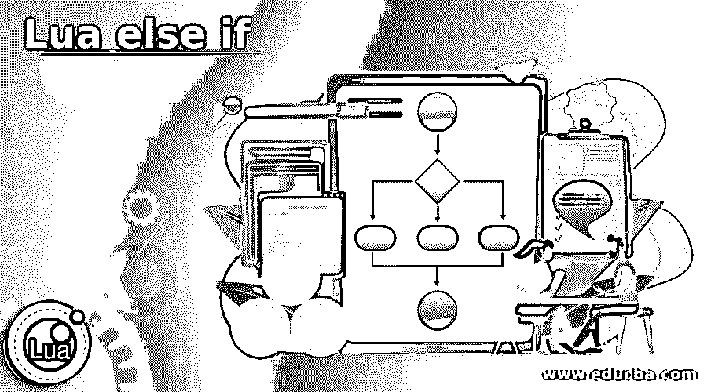
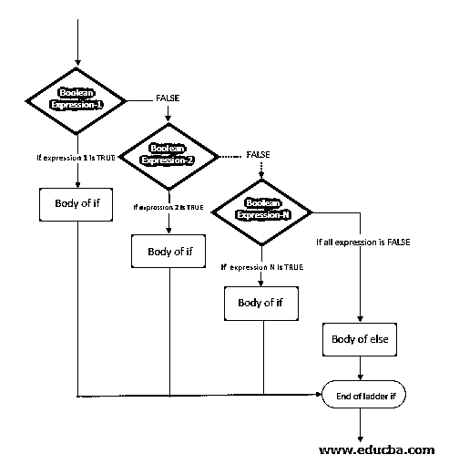

# Lua else if

> 原文：<https://www.educba.com/lua-else-if/>

## Lua else if 简介

每当有必要使用单个 if 语句测试几个条件时，我们将在 Lua 编程语言中在以 else 语句结尾的 if 语句之后使用 else if 语句，并且 else if 语句是可选的，在所有 else if 语句中，第一个 else if 语句的成功消除了测试其他 else if 语句和 if 的需要..否则如果..在 Lua 编程语言中，else 语句以关键字 end 结尾，在一个以 else 和 end 关键字结尾的 if 语句中可以有任意数量的 else if 语句。

**Lua 中定义 else if 语句的语法:**

<small>网页开发、编程语言、软件测试&其他</small>

`if(boolean_expression 1)
then
block of code to be executed when Boolean_expression 1 is evaluated to True
elseif(boolean_expression 2)
block of code to be executed when Boolean_expression 2 is evaluated to True
elseif(boolean_expression 3)
block of code to be executed when Boolean_expression 3 is evaluated to True
.
.
.
else
block of code to be executed when none of the above conditions is evaluated to True
end`

在哪里，

布尔表达式 1、布尔表达式 2、布尔表达式 3 是被评估为真或假的条件。

### 流程图

演示 Lua 中 else if 语句的流程图如下:

### 在 Lua 中使用 else if 语句

*   每当有必要使用单个 if 语句测试几个条件时，我们就要在 Lua 编程语言中，在以 else 语句结尾的 if 语句之后使用 else if 语句。
*   在所有 else if 语句中，第一个 else if 语句的成功消除了测试其他 else if 语句的需要。
*   else if 语句可选的用法是 Lua 编程语言。
*   如果..否则如果..在 Lua 编程语言中，else 语句以关键字 end 结尾。
*   在以 else 和 end 关键字结尾的单个 if 语句中，可以有任意数量的 else if 语句。

### Lua else if 示例

以下是 Lua else if 的示例:

#### 示例#1

Lua 程序演示了 else if 语句来检查一个数字是负、正还是零，并在屏幕上显示相应的消息作为输出。

**代码:**

`--[storing a numerical value in a variable called value--] value = 100
--[writing if condition statement to check the condition if the given value is greater than 0--] if( value > 0 )
then
--[ the below statement is displayed as the output on the screen if the condition evaluates   to True --] print("The given value is positive" )
--[writing else if condition statement to check the next condition if the given value is lesser than 0--] elseif(a < 0)
then
print("The given value is negative" )
else
--[ the below statement is displayed as the output on the screen if all the above conditions evaluates to False --] print("The given value is zero")
end`

**输出:**

在上面的程序中，我们将一个数值存储在一个名为 value 的变量中。然后我们编写 if 条件语句，检查给定值是否大于 0 的条件。如果条件评估为真，则屏幕上将显示一条声明给定值大于零的语句作为输出。然后，如果给定值小于 0，我们将编写 else if 条件语句来检查下一个条件。然后，如果条件评估为真，则屏幕上将显示一条声明给定值小于零的语句作为输出。然后，如果上述两个条件评估为假，则屏幕上将显示一条声明给定值等于零的语句作为输出。

#### 实施例 2

Lua 程序，演示 else if 语句，检查给定的字符串是否与字符串值匹配，并在屏幕上显示相应的消息作为输出。

**代码:**

`--[storing a string value in a variable called value--] value = "EDUCBA"
--[writing if condition statement to check the condition if the given value is same as the string--] if( value == "EDUCBA" )
then
--[ the below statement is displayed as the output on the screen if the condition evaluates   to True --] print("The given value is matching" )
--[writing else if condition statement to check the next condition if the given value does not match the above string--] elseif(value == "Learning")
then
print("The given value is not matching" )
else
--[ the below statement is displayed as the output on the screen if all the above conditions evaluates to False --] print("The given value does not match anything")
end`

**输出:**

在上面的程序中，我们将一个字符串值存储在一个名为 value 的变量中。然后，我们编写 if condition 语句来检查给定值是否与字符串匹配。然后，如果条件评估为真，则在屏幕上显示一条声明，说明给定值匹配，作为输出。然后，如果给定值与上述字符串不匹配，我们将编写 else if condition 语句来检查下一个条件。然后，如果条件评估为真，则屏幕上将显示一条声明给定值不匹配的语句作为输出。然后，如果上述两个条件的计算结果为假，则屏幕上将显示一条语句，说明给定值不匹配任何内容。

### 推荐文章

这是一个 Lua else if 的指南。这里我们分别讨论了 else if 语句在 lua 中的介绍、工作原理和例子。您也可以看看以下文章，了解更多信息–

1.  [# C 中的 else](https://www.educba.com/hash-else-in-c/)
2.  [网络编程语言](https://www.educba.com/web-programming-languages/)
3.  [C 语言中的编程错误](https://www.educba.com/programming-errors-in-c/)
4.  [最佳编程语言](https://www.educba.com/best-programming-languages/)

