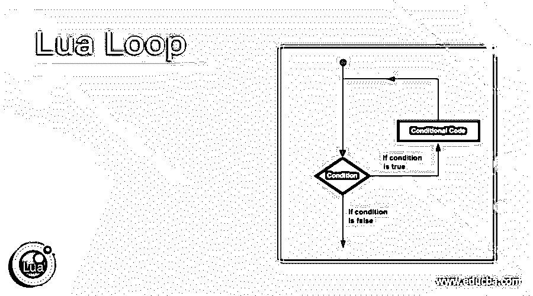
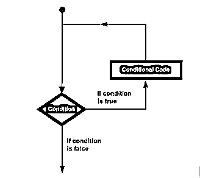
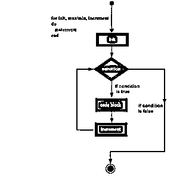
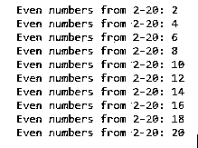
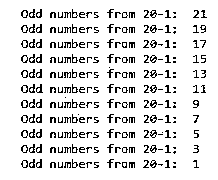
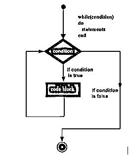
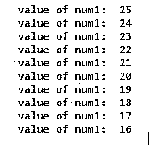
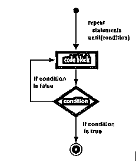
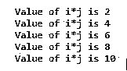

# 环月

> 原文：<https://www.educba.com/lua-loop/>

## Lua 循环介绍

Lua 循环是允许用户多次执行特定语句或一组语句的语句。所有的编程语言都提供了允许复杂执行路径的控制结构。因此，Lua 循环有各种循环语句，如 while loop、for loop、repeats…until loop、嵌套循环、无限循环，它们有自己的循环要求和使用方式。在这里，我们将学习更多在 Lua 程序中编写或执行循环的方法。用户可以按顺序执行特定次数的代码块，即首先执行函数中的第一条语句，然后执行第二条语句，依此类推。

大多数编程语言中循环语句的一般形式如下所示，

<small>网页开发、编程语言、软件测试&其他</small>

循环语句，如果返回 true 将再次执行条件代码，如果返回 false 将从循环语句中出来，或者根据条件中断语句或无限传递。

### Lua 编程中的循环类型

**for 循环**:多次执行一系列语句的控制语句。

**语法**:

`for init, min/max value, increment/ decrement
do
statement(s)
end`

**Lua 中 for 循环流程图**

*   在 for 循环中，init 步骤首先执行，而且只执行一次。这个初始化步骤允许用户声明和初始化循环控制变量。
*   在第二步中，我们得到了循环继续执行的最小值/最大值。在内部，在初始值和最小/最大值之间创建条件检查。
*   然后执行循环体，然后循环流跳回到增量/减量语句，该语句更新循环控制变量。
*   再次执行循环体。如果条件返回 true，则执行循环并重复该过程。
*   条件返回 false 后，for 循环终止。

### 例子

让我们讨论 Lua 循环的例子。

#### 示例 Lua 中的 for 循环语句

`for student = 2,20,2
do
print('Even numbers from 2-20:', student);
end`

**输出:**

因此，循环的条件是初始值为 2，最小/最大值为 20，递增/递减值为 2，即每次循环运行时，初始值都会增加 2。如果希望减少初始值，将提供一个负数作为递减值。

#### 示例 Lua 中的 for 循环语句

`for student = 21,1,-2
do
print('Odd numbers from 20-1:', student);
end`

**输出:**

这里，我们按降序打印奇数，因此在 for 循环条件中给出一个负整数。

**while 循环**:只要给定的条件为真，这个 while 循环语句就重复执行目标语句

**语法:**

`while(condition)
do
Statement(s)
end`

【while 循环流程图:

*   这里，语句可以是单个语句，也可以是多个语句。
*   While 循环仅在条件为真时执行。
*   条件可以采用任何表达式，如果非零值，则为 true
*   如果条件为假，则程序控制转到循环后的下一行。

#### 示例 Lua 中的 while 循环

`num1 = 25
while( num1 > 15 )
do
print("value of num1:", num1)
num1 = num1-1
end`

**输出:**

这里，while 循环将一直运行，直到满足条件，即 num1 应大于 15。

**repeat…until 循环:**与 for 和 while 循环不同，repeat…until 循环会在 Lua 编程中检查循环底部的条件。

它类似于 while 循环，只是 do 不同；因为 do-while 循环至少执行一次。

**语法**:重复

`statement(s)
until(condition)`

**重复…直到循环流程图:**

*   在这里，我们可以看到条件语句出现在循环的末尾，因此循环语句在条件得到测试之前执行一次。
*   如果条件失败，语句流跳回到 do…并再次执行循环语句。
*   重复这个过程，直到条件为真。

#### 例子#4:重复…直到 Lua 编程中的循环

`global_id = 12
repeat
print("value of global id:", global_id)
global_id = global_id + 3
until( global_id > 21 )`

**输出:**

这里，将 global_id 作为第一个值，然后执行条件，直到它为真。

**嵌套循环:**嵌套循环使用多个嵌套在另一个循环中的循环。

**语法:**考虑一个 **for 循环被嵌套。**

`for init, min/max value, increment/decrement
do
for init, min/max value, increment/decrement
do
statement(s)
end
statement(s)
end`

考虑到**嵌套的 while 循环**

`While(condition)
do
while(condition)
do
statement(s)
end
statement(s)
end`

考虑**嵌套重复…直到循环**

`Repeat
Statement(s)
Repeat
Statement(s)
Until(condition)
Until(condition)`

#### 例子 Lua 中的嵌套循环

`j = 5
for i = 1,5 do
for j = 2,5,4 do
print("Value of i*j is",i*j)
end
end`

**输出:**

所以这里我们研究了嵌套的 for 循环。

### 结论

至此，我们将结束“Lua 循环”这一主题。我们已经看到了什么是 Lua 循环，以及 Lua 编程中存在的各种类型的循环。我们已经讨论了每种循环的流结构和语法，还实现了上面的几个例子。混合循环或者我们也可以称之为嵌套循环在日常编程中将会非常有用。我们还有一个无限循环，它将产生无止境的输出。

### 推荐文章

这是一个 Lua 循环的指南。这里我们讨论 Lua 编程中循环的介绍、语法、参数和类型，以及代码实现的例子。您也可以看看以下文章，了解更多信息–

1.  [快速循环](https://www.educba.com/swift-loop/)
2.  [循环的打字稿](https://www.educba.com/typescript-for-loop/)
3.  [Swift For Loop](https://www.educba.com/swift-for-loop/)
4.  [JavaScript 循环数组](https://www.educba.com/javascript-loop-array/)

