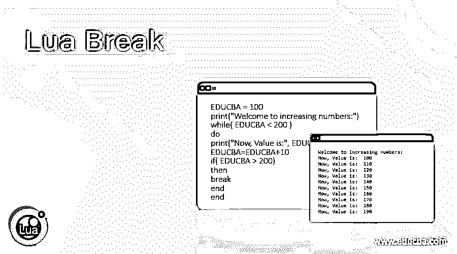
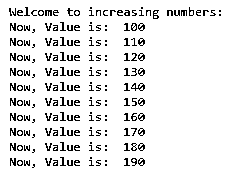
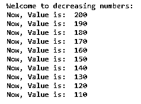
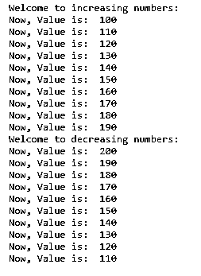
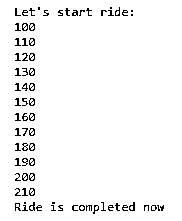
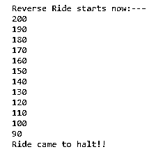
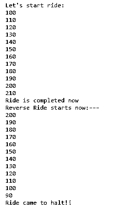
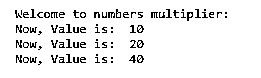
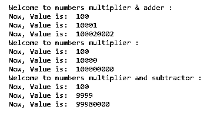

# 月亮破了

> 原文：<https://www.educba.com/lua-break/>

## Lua Break 简介

Break 是研究循环时的重要语句之一。在 Lua 中，break 语句使我们能够走出代码的内部块。Break 语句用于结束循环。break 语句中断包含 break 语句的 for、while 或 repeat 循环。在中断循环之后，代码在 break 语句和中断的循环之后运行。这篇文章将帮助读者理解 break 的概念以及它是如何在循环中使用的。下面的文章解释了多个例子。这些示例执行不同的功能，并在其中使用 break 语句。

**Lua 中的 Break 语句，语法:**

<small>网页开发、编程语言、软件测试&其他</small>

**语法 1:**

`………………
while( EDUCBA < 200 )
do
print("Now, Value is:", EDUCBA)
EDUCBA=EDUCBA+10
if( EDUCBA > 200)
then
break
end
………………`

**语法 2:**

`…………
while 10 do
print (EDUCBA)
if EDUCBA < 100 then break end
EDUCBA = EDUCBA - 10
end
……………`

### 如何在 Lua 中使用 break 语句？

举例说明 Lua 中 break 语句的工作原理:

Lua 是一种多范式、高级和轻量级的编程语言。它基本上是为应用程序的嵌入式使用而设计的。它是跨平台的，因为编译代码的解释器是 ANSI 代码。Lua 有 C API 可以把它嵌入到应用程序中。基本上，Lua 具有足够灵活和简单的元特性，可以在需要时进行扩展，因为它没有针对特定编程范式的特性，这使得基本语言更加轻便。

在下面描述的例子中，一个循环在每次迭代后打印数字的增加、减少、相乘或它们的组合，当值不符合应用的条件时，break 语句开始工作，编译器跳出循环。

#### 示例#1

**代码:**

`EDUCBA = 100
print("Welcome to increasing numbers:")
while( EDUCBA < 200 )
do
print("Now, Value is:", EDUCBA)
EDUCBA=EDUCBA+10
if( EDUCBA > 200)
then
break
end
end`

**输出:**

#### 实施例 2

**代码:**

`EDUCBA = 200
print("Welcome to decreasing numbers:")
while( EDUCBA > 100 )
do
print("Now, Value is:", EDUCBA)
EDUCBA=EDUCBA-10
if( EDUCBA < 100)
then
break
end
end`

**输出:**

#### 实施例 3

**代码:**

`EDUCBA1 = 100
print("Welcome to increasing numbers:")
while( EDUCBA1 < 200 )
do
print("Now, Value is:", EDUCBA1)
EDUCBA1=EDUCBA1+10
if( EDUCBA1 > 200)
then
break
end
end
EDUCBA2 = 200
print("Welcome to decreasing numbers:")
while( EDUCBA2 > 100 )
do
print("Now, Value is:", EDUCBA2)
EDUCBA2=EDUCBA2-10
if( EDUCBA2 < 100)
then
break
end
end`

**输出:**

#### 实施例 4

**代码:**

`EDUCBA=100
print ("Let's start ride:")
while 10 do
print (EDUCBA)
if EDUCBA > 200 then break end
EDUCBA = EDUCBA + 10
end
print ("Ride is completed now")`

**输出:**

#### 实施例 5

**代码:**

`EDUCBA=200
print ("Reverse Ride starts now:---")
while 10 do
print (EDUCBA)
if EDUCBA < 100 then break end
EDUCBA = EDUCBA - 10
end
print ("Ride came to halt!!")`

**输出:**

#### 实施例 6

**代码:**

`EDUCBA=100
print ("Let's start ride:")
while 10 do
print (EDUCBA)
if EDUCBA > 200 then break end
EDUCBA = EDUCBA + 10
end
print ("Ride is completed now")
EDUCBA=200
print ("Reverse Ride starts now:---")
while 10 do
print (EDUCBA)
if EDUCBA < 100 then break end
EDUCBA = EDUCBA - 10
end
print ("Ride came to halt!!")`

**输出:**

#### 实施例 7

**代码:**

`EDUCBA = 10
print("Welcome to numbers multiplier:")
while( EDUCBA < 50 )
do
print("Now, Value is:", EDUCBA)
EDUCBA=EDUCBA*2
if( EDUCBA > 40)
then
break
end
end`

**输出:**

#### 实施例 8

**代码:**

`EDUCBA = 100
print("Welcome to numbers multiplier & adder :")
while( EDUCBA < 500000000 )
do
print("Now, Value is:", EDUCBA)
EDUCBA=EDUCBA*EDUCBA+1
if( EDUCBA > 400000000)
then
break
end
end
EDUCBA = 100
print("Welcome to numbers multiplier :")
while( EDUCBA < 50000000000 )
do
print("Now, Value is:", EDUCBA)
EDUCBA=EDUCBA*EDUCBA
if( EDUCBA > 40000000000)
then
break
end
end
EDUCBA = 100
print("Welcome to numbers multiplier and subtractor :")
while( EDUCBA < 50000000000 )
do
print("Now, Value is:", EDUCBA)
EDUCBA=EDUCBA*EDUCBA-1
if( EDUCBA > 4000000000000)
then
break
end
end`

**输出:**

### 结论

在上述文章的基础上，我们理解了 Lua 及其 break 语句的概念。break 语句是循环的重要组成部分，文章中解释的例子有助于理解它的重要性和在程序中的实现。

### 推荐文章

这是一个 Lua Break 的指南。在这里，我们讨论了 Lua 中 break 语句的介绍、语法和使用方法。和代码实现的例子。您也可以看看以下文章，了解更多信息–

1.  [CSS 分页](https://www.educba.com/css-page-break/)
2.  [CSS 换行](https://www.educba.com/css-line-break/)
3.  [PHP 中断](https://www.educba.com/break-in-php/)
4.  [PowerShell 中断](https://www.educba.com/powershell-break/)

