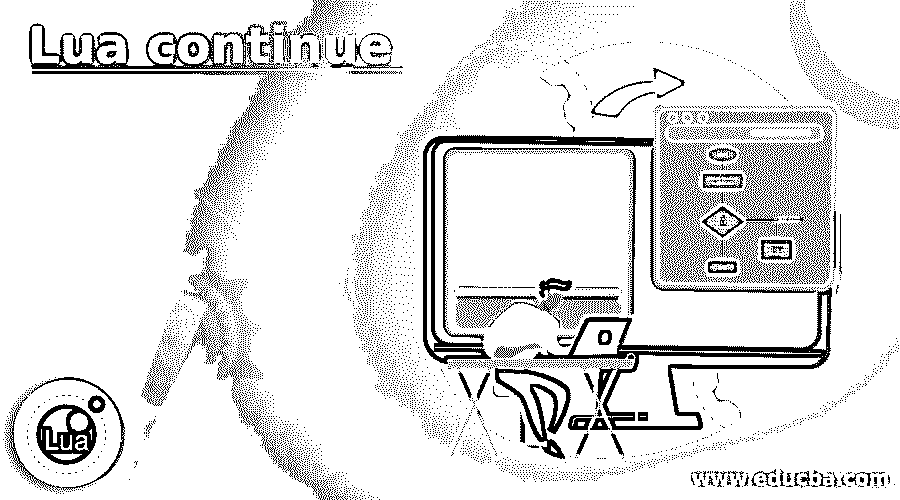
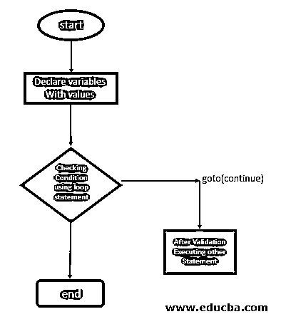
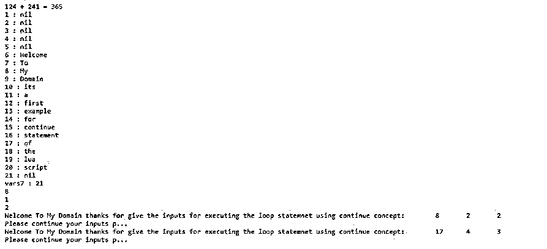
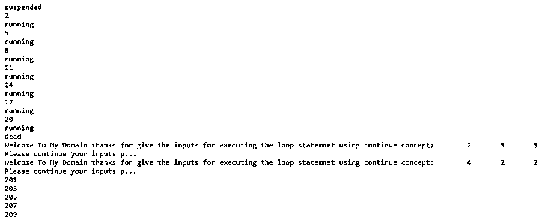
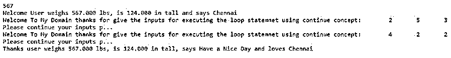

# 月亮继续

> 原文：<https://www.educba.com/lua-continue/>

## Lua 简介继续

Lua continue 是其中一个语句，主要用于以进一步的方式或步骤执行循环条件，以继续该条件，它可以是任何验证或认证用户输入，它只不过是一个关键字继续存在，它有一些限制，在语义上对所有变量进行认证， 关键字和默认函数，因此它们属于检查用户输入的验证范围，并被强制执行给 lua 编译器，因此主要的解决方法是将可能导致 continue for 等条件语句的循环条件反转为其余的循环体语句。

**语法:**

<small>网页开发、编程语言、软件测试&其他</small>

在 lua 脚本中，我们有 n 个循环，使用条件语句来实现应用程序，这取决于用户端的要求。就像 lua 没有" continue "关键字，而我们有 break end，语句永远不会结束，他们仍然有一些工具等待脚本执行。

`Loops(for, while ) do repeat //do and repeat are keywords
Conditional statements(if) variables for to checking the conditions then //then is the keyword
do break end  // it simulates to continue
goto skip_to_next
--some lua scripts depends upon the requirement----`

以上代码是基本的循环语句，用于评估和迭代脚本上的输入值。

### 流程图

流程图是文件的图示，用于使项目细节易于理解。这里是 Lua 的“continue”关键字，用于类似的循环条件和其他内置函数。

### Lua 中 continue 语句如何工作？

*   continue 关键字没有 lua 脚本，而不是我们使用的 do break end 语句，用于继续将在脚本上执行下一级的语句。为什么我们不使用 continue 关键字，因为它是一个轻量级的设计，而不是 continue。我们使用 goto 语句和关键字 for 来继续脚本。
*   当我们使用 goto 语句时，仍然可以使用支持它的关键字，并且主要考虑它可以适用于科学应用程序，因此它是一个意大利面条代码，它几乎不关注以下内容，即在脚本要求中使用的所有区域查找和替换单词。在其他方面，像循环控制将被用作 perl 和 python 代码等其他语言的 break 和 continue 关键字。
*   在脚本中循环条件完成之前，它不会重复，因为每当我们执行 while loop 这样的循环语句时，它总是在条件满足时首先执行，否则它会终止循环。但是当我们使用 do while 语句时，循环首先在脚本上执行一次，然后评估条件，如果条件为真，则执行循环，否则终止循环并继续下一步。

### Lua 的例子还在继续

下面给出的是 Lua continue 的例子:

#### 示例#1

**代码:**

`function demo(vars1, vars2)
return vars1 + vars2
end
print(string.format("124 + 241 = %d", demo(124,241)))
function demo1(vars3)
vars4 = {}
local i = 6
for str in string.gmatch(vars3, "[^%s]+") do
vars4[i] = str
i = i + 1
end
return vars4, i
end
vars5, vars6 = demo1("Welcome To My Domain its a first example for continue statement of the lua script")
for j = 1, vars6 do
print(string.format("%d : %s", j, vars5[j]))
end
function demo2(...)
local vars7 = 0
for k, v in pairs{...} do
vars7 = vars7 + v
end
return vars7
end
io.write("vars7 : ", demo2(1,2,3,4,5,6), "\n")
vars8 = function(x) return x * 2 end
print(vars8(4))
function demo3()
local i = 0
return function()
i = i + 1
return i
end
end
vars9 = demo3()
print(vars9())
print(vars9())
for p=2,20 do
for q=2,20 do
for r=2,20 do
if r^1 + q^3 == p^4 then
print('Welcome To My Domain thanks for give the inputs for executing the loop statemnet using continue concept:', r, q, p)
print('Please continue your inputs p...')
goto continue
end
end end ::continue:: end`

**输出:**

在上面的例子中，我们使用函数和循环来根据需求评估用户输入值。我们可以在脚本中以字符串和数字的形式传递输入。我们还使用 for 循环来迭代值，并通过 goto continue 语句继续迭代。

#### 实施例 2

**代码:**

`vars = coroutine.create(function()
for i = 2, 20, 3 do
print(i)
print(coroutine.status(vars))
if i == 7 then coroutine.yield() end
end end)
print(coroutine.status(vars))
coroutine.resume(vars)
print(coroutine.status(vars))
vars1 = coroutine.create(function()
for i = 201, 210, 2 do
print(i)
end end)
for a=1,5 do
for b=1,5 do
for c=1,5 do
if a^1 + b^2 == c^3 then
print('Welcome To My Domain thanks for give the inputs for executing the loop statemnet using continue concept:', a, b, c)
print('Please continue your inputs p...')
goto continue
end
end end ::continue:: end
coroutine.resume(vars1)
coroutine.resume(vars)`

**输出:**

在上面的例子中，我们使用协程概念来继续用户进程，直到它结束。在 for 循环的帮助下，重复任务过程，直到满足要求的条件。

#### 实施例 3

**代码:**

`Example = {height = 1, weight = 1, name = "Welcome To My Domain", city = "Tiruppur"}
function Example:new (height, weight, name, city)
setmetatable({}, Example)
self.height = height
self.weight = weight
self.name = name
self.city = city
return self
end
function Example:toString()
vars = string.format("%s weighs %.3f lbs, is %.3f in tall and says %s", self.name, self.weight, self.height, self.city)
return vars
end
vars1 = Example:new(124, 567, "Welcome User", "Chennai")
print(vars1.weight)
print(vars1:toString())
Example1 = Example:new()
function Example1:new (height, weight, name, city, Country)
setmetatable({}, Example1)
self.height = height
self.weight = weight
self.name = name
self.city = city
self.Country = Country
return self
end
function Example1:toString()
vars2 = string.format("%s weighs %.3f lbs, is %.3f in tall, says %s and loves %s", self.name, self.weight, self.height, self.city, self.Country)
return vars2
end
for x=1,6 do
for y=1,6 do
for z=1,6 do
if x^1 + y^2 == z^3 then
print('Welcome To My Domain thanks for give the inputs for executing the loop statemnet using continue concept:', x, y, z)
print('Please continue your inputs p...')
goto continue
end
end end ::continue:: end
vars3 = Example1:new(124, 567, "Thanks user", "Have a Nice Day", "Chennai")
print(vars3:toString())`

**输出:**

在最后一个例子中，我们使用了 lua 脚本的基本功能，即我们可以计算物体的高度和重量。它将像前面的例子一样迭代输入值，并继续下去，直到循环退出输入条件。

### 结论

在 Lua 脚本中，我们使用基本的条件语句和循环来检查和验证用户输入。与 continue 类似，continue 也是在后续步骤中执行脚本概念之一，它是评估和存在循环语句的另一种方式。在 goto continue 的帮助下，脚本将继续执行它们的任务。

### 推荐文章

这是 Lua continue 的一个指南。这里我们讨论一下简介，continue 语句在 lua 中是如何工作的？和示例。您也可以看看以下文章，了解更多信息–

1.  [# C 中的 else](https://www.educba.com/hash-else-in-c/)
2.  [网络编程语言](https://www.educba.com/web-programming-languages/)
3.  [C 语言中的编程错误](https://www.educba.com/programming-errors-in-c/)
4.  [最佳编程语言](https://www.educba.com/best-programming-languages/)

