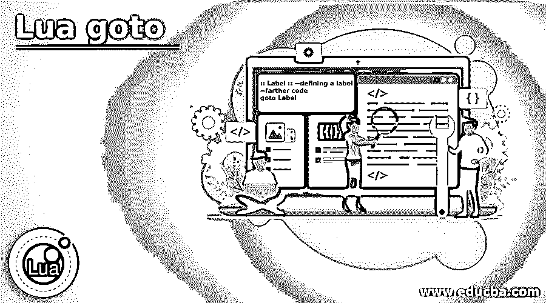
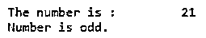
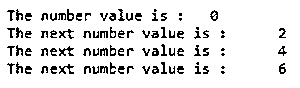
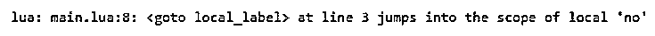

# 后藤月

> 原文：<https://www.educba.com/lua-goto/>

## Lua goto 简介

Lua goto 语句用于跳转到指定的标签。goto 语句是跳转语句，它将程序的控制权转移给特定的标签。Lua 5.2.0-beta-rc1 [6] [1]增加了 Lua goto 语句，Lua 5.2.0-beta-rc2 [7]进一步完善了它。这个 goto 语句是一个限制性的形式，因为第一个限制是如果我们已经定义了一个标签在整个块中是可见的。第二个限制是如果 goto 没有进入局部变量的范围，它可以将控制转移到任何可见的标签，第三个限制是 goto 不能将控制转移到块之外的块。

**Lua goto 的语法:**

<small>网页开发、编程语言、软件测试&其他</small>

标签首次定义的 lua goto 语法，并使用 goto 语句定位到该标签:

`:: Label :: --defining a label
--farther code
goto Label`

lua goto 的语法，其中 goto 语句首先用于跳转到标签，其定义如下:

`goto Label
--farther code
:: Label :: --defining a label`

**参数:**

*   **Label:** 这不是一个可选的，指定的标签，它是一个用户定义的标识符，指示目标语句并指定 goto 语句在代码中要跳转的位置或行号。

### Lua 程序设计中 goto 结构的使用

*   lua 编程中使用的 goto 结构，用于将执行控制转移到程序中的特定位置。
*   在 lua 中，标签是通过前缀和后缀 by :: as ::label::，并可由 goto 语句用作“goto label”来创建的，因此无论何时使用该语句(在标签定义之前或之后)，执行控制都会跳转到该标签，并开始执行以下语句。

### Lua goto 的示例

下面是提到的例子:

#### 示例#1

lua 编程中 goto 结构的示例，显示 goto 语句的用法。

**代码:**

`-- create a variable and initialize by some value
num = 21
print("The number is : ", num)
-- checking whether the number is even or odd
if (num % 2 == 0) then
-- if num even, then jump to the label even
goto even
else
-- if num odd, then jump to the label odd
goto odd
end
-- define even label
::even::
print("Number is even.")
-- define odd label
::odd::
print("Number is odd.")`

**输出:**

在上面的 lua 程序中，创建 num 变量是为了将数字存储为 21，接下来在代码中，num 变量使用 if 语句检查它是偶数还是奇数。如果 num 是偶数，则执行控制跳转到偶数块，否则对于奇数，控制跳转到使用 goto 语句执行的奇数块。因为在程序中 num 是奇数，所以它控制跳转到奇数块并打印“数字是奇数”正如我们在输出中看到的。

#### 实施例 2

lua 编程中用于模拟重做和继续使用的 goto 结构示例。

**代码:**

`-- create a variable and initialize by some value
no = 0
print("The number value is : ", no)
-- checking whether the number is less than 6
while no < 6 do
-- create label for the redo
::redo::
no = no + 1
if no%2 == 1 then
-- if i is odd, then jump to the label continue
goto continue
else
print("The next number value is :", no)
-- jump to the label redo
goto redo
end
-- create label for the continue
::continue::
end`

**输出:**

在上面的 lua 程序中，创建了 no 变量来将数字存储为 0，接下来在代码中，在 while 循环中 no 值递增 1。在 while 循环中，使用了两个标签 redo 和 continue，redo 用于重复运行循环，并在每次打印 no 后跳转到该循环，而 continue 标签用于在 no 为奇数时继续循环(因为 continue 跳过循环中的以下语句)。因此程序通过实现重做和继续功能来打印偶数。

#### 实施例 3

lua 编程中 goto 结构的例子，演示 goto 不能跳转到局部变量的范围。

**代码:**

`do
-- to jump to the local_label block
goto local_label
local no = 1
print("The number is : ", no)
-- within the scope of the local variable, so can not jump
::local_label::
no = no + 1
-- The scope of the local variable ends, so you can jump.
::ok::
end`

**输出:**

在上面的 lua 程序中，goto 语句试图跳转到在 local 范围内创建的 local_label，因此 local_label 在那里是不可见的，这样就会在 local no 的范围内抛出错误“<goto local_label="">”。在代码的更远处，还创建了另一个标签“ok ”,代替 local_label。如果我们使用 ok 标签，则控件将跳转到 ok，而不会出现任何错误，因为 ok 标签是在 local 范围之外定义的。</goto>

### 结论

Lua goto 语句是 Lua 编程中的内置语句，用于跳转到指定的标签。在 lua 中，goto 语句更受限制。

### 推荐文章

这是 Lua goto 的指南。这里我们分别讨论 lua 编程中 goto 结构的介绍、工作原理和实例。您也可以看看以下文章，了解更多信息–

1.  [最佳编程语言](https://www.educba.com/best-programming-languages/)
2.  [# C 中的 else](https://www.educba.com/hash-else-in-c/)
3.  [网络编程语言](https://www.educba.com/web-programming-languages/)
4.  [C 语言中的编程错误](https://www.educba.com/programming-errors-in-c/)

