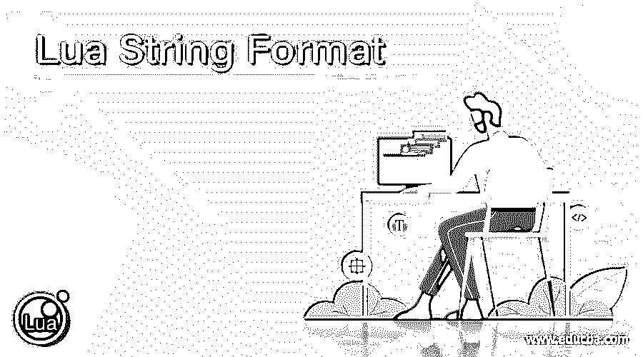
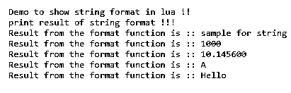

# Lua 字符串格式

> 原文：<https://www.educba.com/lua-string-format/>

## Lua 字符串格式的定义

字符串格式与 C 中的格式相同，Lua 中的格式用于格式化特定的变量。这种格式给出了特定格式的值。通过在 Lua 中使用字符串格式，我们可以格式化我们的字符串消息，这很容易理解。字符串格式的工作方式与 c 语言相同。为了使用格式字符串，我们使用一个简单的“%”百分比符号来表示和打印不同类型的变量。为了在 Lua 中表示不同的类型，我们有不同的符号可以用来正确地打印变量的值。在下一节中，我们将更详细地讨论 Lua 中的格式字符串，以便更好地理解和实现。

**语法:**

<small>网页开发、编程语言、软件测试&其他</small>

正如所讨论的，字符串格式用于格式化字符串，通过使用它，我们可以以更加用户友好的方式显示字符串消息，让我们看看它的语法，以便更好地理解，见下文；

`string.format()`

正如你在上面几行语法中看到的，我们使用的是 string.format()方法，它非常容易使用和处理。在其中，我们可以传递参数来创建字符串消息。让我们通过练习语法来让初学者更好地理解它，见下文；

**如:**

`string.format("%s", variable_name)`

正如你在上面的代码行中看到的，你可以传递变量名来打印值。在下一节中，我们将为初学者更多地讨论 Lua 中 string.format()方法的内部工作方式。

### 如何在 Lua 中格式化字符串？

正如我们已经讨论过的，格式字符串是 Lua 中的一个函数，它用来格式化字符串，这就是为什么它在 Lua 中被称为格式字符串。为了格式化字符串，我们有“%”符号，它必须用在不同的操作符之前。为了表示不同的类型，我们有几个符号来显示变量的值。让我们看看 Lua 中字符串格式的不同符号，见下文；

**1)表示字符串:**表示字符串格式函数中的任何字符串，我们可以使用带百分号的‘s’。“s”后面应该跟“%”符号。我们可以在字符串格式中显示多个变量。让我们看看它的语法，以便更好地理解(见下文);

**例如:**

`string.format("%s", Your_variable)`

正如你在上面的语法行中所看到的，我们使用了“%s”符号来表示字符串的格式。后跟变量名。

**2)表示浮点:**表示字符串格式函数中的任何浮点，我们可以使用带百分比符号的‘f’。这个“f”后面应该跟“%”符号。我们可以在字符串格式中显示多个变量。让我们看看它的语法，以便更好地理解(见下文);

例如:

`string.format("%f", Your_variable)`

正如你在上面的语法行中所看到的，我们使用了' %f '符号来表示字符串的格式。后跟变量名。

**3)表示小数:**要表示字符串格式函数中的任何小数，我们可以将“d”与百分比符号一起使用。这个“d”后面应该跟“%”符号。我们可以在字符串格式中显示多个变量。让我们看看它的语法，以便更好地理解(见下文);

例如:

`string.format("%d", Your_variable)`

正如你在上面的语法行中所看到的，我们用“%d”符号来表示字符串的格式。后跟变量名。

**4)表示十六进制:**要表示字符串格式函数中的任何十六进制，我们可以使用带百分号的‘x’。这个“x”后面应该跟“%”符号。我们可以在字符串格式中显示多个变量。让我们看看它的语法，以便更好地理解(见下文);

例如:

`string.format("%x", Your_variable)`

正如你在上面的语法行中所看到的，我们使用了' %x '符号来表示字符串的格式。后跟变量名。

**5)表示八进制:**要表示字符串格式函数中的任何八进制，我们可以在百分号中使用“o”。这个“o”后面应该跟“%”符号。我们可以在字符串格式中显示多个变量。让我们看看它的语法，以便更好地理解(见下文);

例如:

`string.format("%o", Your_variable)`

正如你在上面的语法行中看到的，我们使用了' %f '符号来表示字符串的格式。后跟变量名。

**6)表示字符:**要表示字符串格式函数中的任何字符，我们可以使用带百分号的“c”。这个“c”后面应该跟“%”符号。我们可以在字符串格式中显示多个变量。让我们看看它的语法，以便更好地理解(见下文);

例如:

`string.format("%c", Your_variable)`

正如你在上面的语法行中所看到的，我们使用了' %f '符号来表示字符串的格式。后跟变量名。

这样我们就可以在 lua 语言的字符串格式函数中显示 Lua 中不同的变量类型。但是我们在使用它的时候需要记住一些要点；

1)为了表示字符串中不同的数据类型，我们为它们定义了不同的符号。如果我们不使用一个合适的符号，那么它会给我们一个错误。

2)在每个符号之前，我们必须使用“%”符号来告诉编译器可能有一个值需要打印。

3)我们可以在同一个函数中有不同的类型。

### 例子

在这个例子中，我们试图展示 Lua 中字符串格式的所有可用符号的用法。我们试图通过在 Lua 中使用字符串格式来显示整数、字符串、字符、浮点等等。这是一个示例，供初学者理解其实现并开始使用。

**代码:**

`print("Demo to show string format in lua !!")
a1 = "sample for string"
a2 = 1000
a3 = 10.1456
a4 = 'A'
a5 = "Hello"
print("print result of string format !!! ")
print(string.format("Result from the format function is :: %s", a1))
print(string.format("Result from the format function is :: %d", a2))
print(string.format("Result from the format function is :: %f", a3))
print(string.format("Result from the format function is :: %s", a4))
print(string.format("Result from the format function is :: %s", a5))`

**输出:**

### 结论

通过使用字符串格式，我们可以修改我们的字符串信息，用户可以更加稳定。我们可以在里面表示我们的值，它们给出并格式化这些值为一个更精确的值。字符串格式非常容易使用和处理，也是 Lua 的内置函数。我们不需要为此使用任何外部库。

### 推荐文章

这是一个 Lua 字符串格式的指南。这里我们讨论定义，如何在 Lua 中格式化字符串，以及代码实现的例子。您也可以看看以下文章，了解更多信息–

1.  [C#字符串格式()](https://www.educba.com/c-sharp-string-format/)
2.  [JavaScript 字符串格式](https://www.educba.com/javascript-string-format/)
3.  [Python 中的字符串格式](https://www.educba.com/string-formatting-in-python/)
4.  [PHP 对象到字符串](https://www.educba.com/php-object-to-string/)

