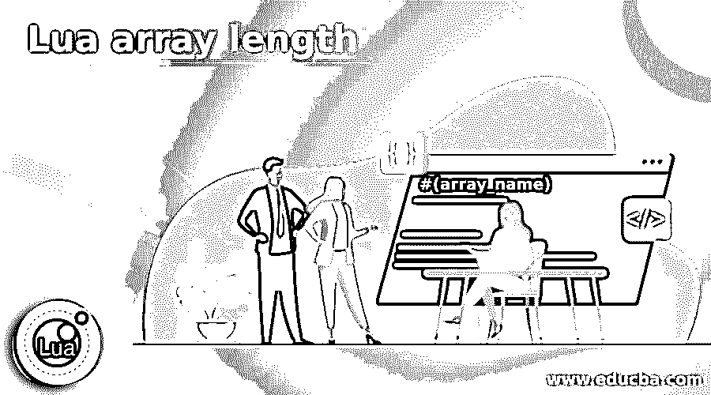
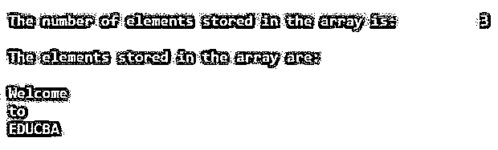
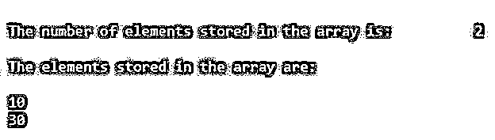
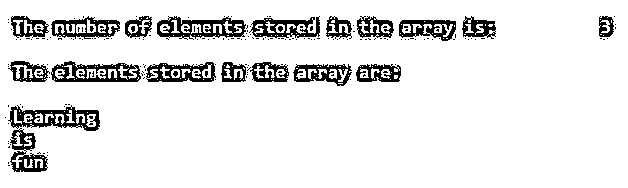

# Lua 数组长度

> 原文：<https://www.educba.com/lua-array-length/>

## Lua 数组长度介绍

每当需要按顺序排列对象时，我们就使用 Lua 中称为 array 的数据结构，数组的实现可以通过使用整数创建表的索引来完成，数组的长度或大小是存储在数组中的元素的数量，数组的长度或大小是不固定的， 它可以根据我们的要求而改变，为了能够确定给定数组的长度，我们使用了名为#的运算符以及数组名，它返回数组的大小。 表的索引通常从 1 开始，但是根据我们的要求，也可以从 0 或小于 0 开始创建索引。

**在 Lua 中确定数组长度的语法:**

<small>网页开发、编程语言、软件测试&其他</small>

`#(array_name)`

在哪里，

*   array_name 是要计算其长度的数组的名称。
*   #是返回数组长度的运算符。

### Lua 数组长度示例

下面给出了 Lua 数组长度的例子:

#### 示例#1

Lua 程序创建一个由元素组成的数组，并使用#运算符来确定数组的长度，并在 for 循环中使用数组的长度来显示数组的元素。

**代码:**

`--defining an array called newarray
newarray = {"Welcome", "to", "EDUCBA"}
--determining the length of the array using # operator and displaying it as the output on the screen
arraylength = #(newarray)
print("The number of elements stored in the array is:\t", arraylength)
--displaying the elements stored in the array using for loop and length of the array
print("\nThe elements stored in the array are:\n")
for a = 1, arraylength do
print (newarray[a])
end`

**输出:**

**说明:**

*   在上面的程序中，我们创建了一个名为 newarray 的数组，并将元素存储在数组中。然后，我们使用# operator 确定数组的长度，并将其存储在一个名为 arraylength 的变量中。
*   然后我们在屏幕上显示数组的长度作为输出。然后我们利用 for 循环和数组的长度在屏幕上显示数组的元素作为输出。输出显示在上面的快照中。

#### 实施例 2

Lua 程序创建一个由元素组成的数组，并使用#运算符来确定数组的长度，并在 for 循环中使用数组的长度来显示数组的元素。

**代码:**

`--defining an array called newarray
newarray = { 10, 30}
--determining the length of the array using # operator and displaying it as the output on the screen
arraylength = #(newarray)
print("The number of elements stored in the array is:\t", arraylength)
--displaying the elements stored in the array using for loop and length of the array
print("\nThe elements stored in the array are:\n")
for a = 1, arraylength do
print (newarray[a])
end`

**输出:**

**说明:**

*   在上面的程序中，我们创建了一个名为 newarray 的数组，并将元素存储在数组中。然后，我们使用# operator 确定数组的长度，并将其存储在一个名为 arraylength 的变量中。
*   然后我们在屏幕上显示数组的长度作为输出。然后我们利用 for 循环和数组的长度在屏幕上显示数组的元素作为输出。输出显示在上面的快照中。

#### 实施例 3

Lua 程序创建一个由元素组成的数组，并使用#运算符来确定数组的长度，并在 for 循环中使用数组的长度来显示数组的元素。

**代码:**

`--defining an array called newarray
newarray = {"Learning", "is", "fun"}
--determining the length of the array using # operator and displaying it as the output on the screen
arraylength = #(newarray)
print("The number of elements stored in the array is:\t", arraylength)
--displaying the elements stored in the array using for loop and length of the array
print("\nThe elements stored in the array are:\n")
for a = 1, arraylength do
print (newarray[a])
end`

**输出:**

**说明:**

*   在上面的程序中，我们创建了一个名为 newarray 的数组，并将元素存储在数组中。然后，我们使用# operator 确定数组的长度，并将其存储在一个名为 arraylength 的变量中。
*   然后我们在屏幕上显示数组的长度作为输出。然后我们利用 for 循环和数组的长度在屏幕上显示数组的元素作为输出。输出显示在上面的快照中。

### 推荐文章

这是一个 Lua 数组长度的指南。这里我们讨论 Lua 数组长度的介绍和例子，以便更好的理解。您也可以看看以下文章，了解更多信息–

1.  [# C 中的 else](https://www.educba.com/hash-else-in-c/)
2.  [网络编程语言](https://www.educba.com/web-programming-languages/)
3.  [C 语言中的编程错误](https://www.educba.com/programming-errors-in-c/)
4.  [最佳编程语言](https://www.educba.com/best-programming-languages/)

