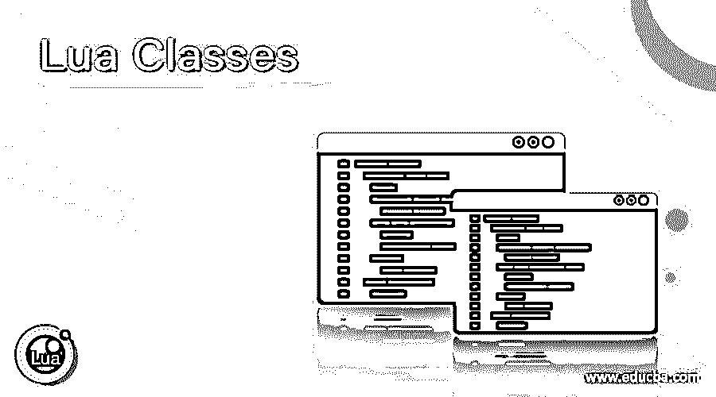

# 月班

> 原文：<https://www.educba.com/lua-classes/>

## Lua 类介绍

用于对象创建的可扩展模板为行为和状态或成员变量的实现提供初始值，在 Lua 中被称为类，并且为自己占用单独的存储位置的类的实例被称为类的对象，并且 Lua 中的类提供继承和封装属性，其中继承是一个类继承另一个类的函数和变量的概念，而封装是当我们在类内部将数据和函数组合在一起并且从类外部访问数据时被称为数据抽象。

****Lua 中定义类的语法如下:****

 **<small>网页开发、编程语言、软件测试&其他</small>**  **`class_name = {member variables}
function class_name:new(member variables)
function_definition
end
function class_name:method_name()
method_definition
end`

其中 class_name 是类的名称，成员变量是传递给类的参数，function 是定义派生类的函数的关键字，new 是创建派生类的关键字，

method_name 是类中定义的方法的名称。

### Lua 类是如何工作的？

Lua 中的类工作如下:

*   用于对象创建的可扩展模板为行为和状态或成员变量的实现提供初始值，在 Lua 中被称为类。
*   成员变量的初始值由类为行为的实现提供。
*   为自己占用单独内存位置的类实例称为该类的对象。
*   Lua 中的类提供了继承和封装等特性。
*   继承是一个概念，其中一个类继承另一个类的函数和变量。
*   继承了另一个类的函数和变量的类称为派生类。
*   继承了另一个类的函数和变量的类称为元类。
*   封装是指我们在一个类中把数据和函数结合在一起，从类外部访问数据称为数据抽象。

### 例子

让我们讨论 Lua 类的例子。

#### 示例#1

Lua 程序，用于演示类并创建由成员变量和方法组成的派生类，我们使用它们来计算圆的面积并将结果显示为屏幕上的输出:

**–通过传递成员变量 area 和 radius 来计算圆的面积，从而定义一个元类**

`Circle = {area = 0, radius = 0}`

**—定义圆的派生类并计算圆的面积**

`function Circle:new (obj,radius)
obj = obj or {}
setmetatable(obj, self)
self.__index = self
self.radius = radius or 0
self.area = radius*radius;
return obj
end`

**—定义派生类的方法来计算圆的面积，并在屏幕上显示为输出**

`function Circle:displayArea ()
print("The area of the circle is ",self.area)
end`

**–创建一个 Circle 类的对象，将值传递给成员变量，然后显示结果**

`result = Circle:new(nil,3)
result:displayArea()`

上述程序的输出如下面的快照所示:

在上面的程序中，我们定义了一个元类，它接受成员变量或状态变量来计算圆的面积。然后，我们使用关键字 new 定义派生类，该关键字实际上包含计算圆面积的公式。然后我们定义了一个派生类的方法来打印计算出的圆的面积，作为屏幕上的输出。然后，我们通过使用一个新的关键字来访问类的成员变量和方法来定义类的对象，以在屏幕上显示圆的计算面积作为输出。输出显示在上面的快照中。

#### 实施例 2

Lua 程序，用于演示类并创建由成员变量和方法组成的派生类，我们使用它们来计算圆的面积并将结果显示为屏幕上的输出:

**–通过传递成员变量 area 和 side 来定义 mets 类，以计算正方形的面积**

`square = {area = 0, side = 0}`

**—定义正方形的派生类，计算正方形的面积**

`function square:new (obj,side)
obj = obj or {}
setmetatable(obj, self)
self.__index = self
self.side = side or 0
self.area = side*side;
return obj
end`

**—定义派生类的方法来计算正方形的面积，并在屏幕上显示为输出**

`function square:displayArea ()
print("The area of the square is",self.area)
end`

**–创建一个 square 类的对象，将值传递给成员变量，然后显示结果**

`result = square:new(nil,4)
result:displayArea()`

上述程序的输出如下面的快照所示:

在上面的程序中，我们定义了一个元类，它接受成员变量或状态变量来计算正方形的面积。然后，我们使用关键字 new 定义派生类，该关键字实际上包含计算正方形面积的公式。然后，我们定义了一个派生类的方法，将计算出的正方形面积打印出来，作为屏幕上的输出。然后，我们通过使用一个新的关键字来访问类的成员变量和方法来定义类的对象，以在屏幕上显示计算出的正方形面积作为输出。输出显示在上面的快照中。

### 结论

在本文中，我们通过定义、语法、类的工作以及 Lua 中的类所提供的属性，学习了 Lua 中的类的概念，并给出了相应的编程示例和输出来演示它们。

### 推荐文章

这是 Lua 类的指南。这里我们分别讨论 Lua 类的定义、工作原理、代码实现的例子。您也可以看看以下文章，了解更多信息–

1.  [Matlab 类](https://www.educba.com/matlab-class/)
2.  [共享类](https://www.educba.com/share-classes/)
3.  [Java 矢量类](https://www.educba.com/java-vector-class/)
4.  [Java URL 类](https://www.educba.com/java-url-class/)

**