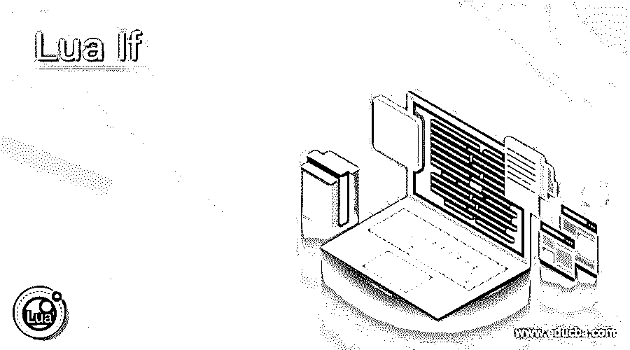
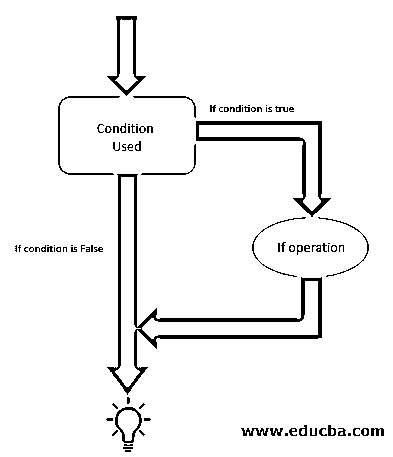
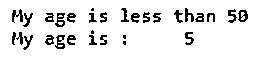
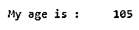
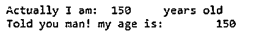
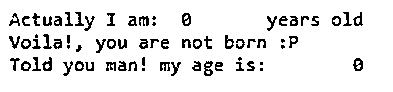
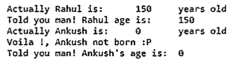
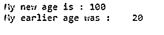
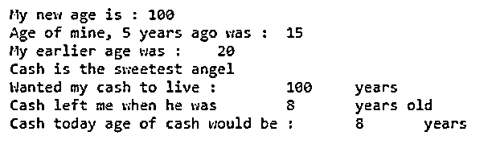

# If 卫星

> 原文：<https://www.educba.com/lua-if/>

## Lua If 简介

这个世界充满了如果和但是，这就是为什么它不会出现在编程世界中。Lua 也有一个 if 语句用于编程条件。Lua 中的 If 语句就像其他编程语言一样，包括 C，C++，Python。If 语句在编程时非常重要，因为它利用了创建条件的选项，在该条件下，编码器可以分别为真和假结果导出两个输出。在本文中，如果用实例详细解释该语句。文中解释了 if 的语法，并通过流程图解释了 if 语句的整个过程。

**语法:**

<small>网页开发、编程语言、软件测试&其他</small>

`if( Rahul< 50 )
then
print("Rahul age is less than 50" )
end`

### If 语句工作流程图

下面的流程图描述了 if 语句的过程。在流程图中，我们可以看到 if 程序中的第一件事就是条件。在条件部分，必须写 if 语句。if 语句可以包含逻辑和算术运算符。在这里，一旦程序运行，它检查第一个决策块。现在，如果 if 语句为真，那么程序将完成 if 操作，并输出为真条件指定的结果。如果 if 语句不为真，那么程序将跳过 if 操作，直接移出 if 块，并移至它后面的其他代码块。

### 举例说明 If 语句在 Lua 中的用法

下面是一些例子:

#### 示例#1

**代码:**

`Age = 5;
if( Age< 50 )
then
print("My age is less than 50" )
end
print("My age is :", Age)`

**输出:**

**代码:**

`Age = 105;
if( Age< 50 )
then
print("My age is less than 50" )
end
print("My age is :", Age)`

**输出:**

#### 实施例 2

**代码:**

`Rahul = 105;
if( Rahul< 50 )
then
print("Rahul age is less than 50" )
end
print("Rahul age is :", Rahul)
Ankush = 15;
if( Ankush< 50 )
then
print("Ankush age is less than 50" )
end
print("Ankush age is :", Ankush)
if (Rahul > Ankush)
then
print("Rahul is elder than Ankush" )
end`

**输出:**

#### 实施例 3

**代码:**

`Age = 150
print("Actually I am: ", Age, "years old" )
if( Age == 60 )
then
print("Voila!, your age is 60" )
if( Age == 5 )
then
print("Voila!, your age is 5" )
if( Age == 0 )
then
print("Voila!, you are not born :P" )
end
end
end
print("Told you man! my age is: ", Age )`

**输出:**

**代码:**

`Age = 0
print("Actually I am: ", Age, "years old" )
if( Age == 60 )
then
print("Voila!, your age is 60" )
end
if( Age == 5 )
then
print("Voila!, your age is 5" )
end
if( Age == 0 )
then
print("Voila!, you are not born :P" )
end
print("Told you man! my age is: ", Age )`

**输出:**

#### 实施例 4

**代码:**

`RahulAge = 150
print("Actually Rahul is: ", RahulAge, "years old" )
if( RahulAge == 60 )
then
print("Voila !, Rahul age is 60" )
end
if( RahulAge == 5 )
then
print("Voila !, Rahul age is 5" )
end
if( RahulAge == 0 )
then
print("Voila !, Rahul is not born :P" )
end
print("Told you man! Rahul age is: ", RahulAge )
AnkushAge = 0
print("Actually Ankush is: ", AnkushAge, "years old" )
if( AnkushAge == 60 )
then
print("Voila !, Ankush age is 60" )
end
if( AnkushAge == 5 )
then
print("Voila !, Ankush age is 5" )
end
if( AnkushAge == 0 )` `then
print("Voila !, Ankush not born :P" )
end
print("Told you man! Ankush's age is: ", AnkushAge )`

**输出:**

#### 实施例 5

**代码:**

`Age = 20;
if( Age< 100 )
then
Agenew = 20*5
print("My new age is :", Agenew )
end
print("My earlier age was :", Age)`

**输出:**

#### 实施例 6

**代码:**

`Age = 20;
if( Age< 100 )
then
Agenew = 20*5
print("My new age is :", Agenew )
end
if( Age == 20 )
then
Agenew = 20-5
print("Age of mine, 5 years ago was :", Agenew )
end
print("My earlier age was :", Age)
CashAge = 8;
LeftAge = 8;
print("Cash is the sweetest angel")
if( CashAge< 100 )
then
Agenew = 20*5
print("Wanted my cash to live :", Agenew, "years")
end
if( LeftAge == 8 )
then
LeftAge1 = 20 - 12
print("Cash left me when he was", LeftAge1, "years old" )
end
print("Cash today age of cash would be :", CashAge, "years")`

**输出:**

### 推荐文章

这是一个 Lua If 的指南。在这里，我们还将讨论简介和 if 语句流程图，以及不同的示例和代码实现。您也可以看看以下文章，了解更多信息–

1.  [C++类和对象](https://www.educba.com/c-plus-plus-class-and-object/)
2.  [Python 系统模块](https://www.educba.com/python-sys-module/)
3.  [C++子串](https://www.educba.com/c-plus-plus-substring/)
4.  [Python mkdir](https://www.educba.com/python-mkdir/)

